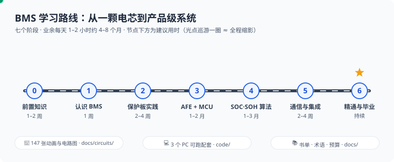

# BMS-Z

一套**从入门到产品级**的电池管理系统（BMS）自学路线。中文，免费，带着动画把「为什么要这样保护」讲到能自己动手。

⚠️ **锂电池实验有真实火灾风险。** 碰真电池前先备护目镜与防火垫；安全纪律与器材见 [预算清单](docs/budget.md) 与 [阶段 2](docs/stages/stage-2-保护板实践.md)。本仓库是学习材料，不构成安全认证依据；阈值为示例值，设计以电芯/芯片 datasheet 与强制标准为准。

🧭 [能力地图](docs/stages/bloom-map.md) · 🍼 [新手起步](#从这里开始零基础) · 🎯 [按目标选路线](docs/stages/按目标选路线.md) · 🗺️ [全图导航](docs/bms-resources.md) · 📋 [参数速查](docs/参数速查卡.md) · 🔌 [电路动画](docs/circuits/README.md) · 💻 [配套代码](#配套代码pc-即可运行ci-守护) · ❓ [常见问题](#常见问题faq) · 🤝 [参与共建](#参与共建)

⚡ [共学](docs/共学/README.md) · 📣 [最近更新](docs/更新动态.md) · 🖼️ [作品墙](docs/作品墙.md) · 🏁 [擂台](docs/擂台.md) · 🧰 [工具箱](docs/工具箱.md) · 🤖 [AI 陪练](docs/AI陪练卡.md) · 📚 [基石阅读](docs/基石阅读.md)

## 从这里开始（零基础）

1. **按能力选一层**：[能力地图](docs/stages/bloom-map.md) — 记忆到创造六层，每层一句目标和一个入口。零基础直接点理解层的第一节，不必先读完下面的七阶段表  
2. **前两周怎么走**：[docs/stages/getting-started.md](docs/stages/getting-started.md) — 先选层或目标，再走第 0 天小实验 + 14 天中文路径  
3. **已经有具体目标**（做保护板 / 读商用 BMS / 只做算法 / 逆向协议 / 自研智能 BMS / 冲产品级）：[按目标选路线](docs/stages/按目标选路线.md) — 六条捷径，每条标了布鲁姆层  
4. **打开教程**：[阶段 0 前置知识](docs/stages/stage-0-前置知识.md) — 先懂电池，再谈管理（§0.1 必读）  
5. **买东西前看**：[docs/budget.md](docs/budget.md) ｜ **生词**：[docs/glossary.md](docs/glossary.md)  
6. **全图导航**（别一上来当任务刷）：[docs/bms-resources.md](docs/bms-resources.md)；学过后回查公式、示例阈值与排障：[参数速查卡](docs/参数速查卡.md)

不会英文没关系：主线教程与推荐中文视频足够走完入门；英文资料在总纲里均标为可选。

## 最近更新

准备记入 **1.2.0**（2026-10-06）。标签还没打。读者能直接用上的变化：

- 动画目录是 **147** 张。简介里如果还写着 38 张，以这里和 [动画索引](docs/circuits/README.md#一百四十七张动画与电路图) 为准。
- 教程有了统一的篇首、口诀和「练完你会怎样」。Plett 十四章有了中文导读。
- 只有电脑也能练：[共学快闪](docs/共学/README.md) 三期五天，[仿真擂台](docs/擂台.md) 第 1 期正在进行。

大白话分批写在 [更新动态](docs/更新动态.md)。原句在 [CHANGELOG](CHANGELOG.md)。

## 阶段教程

| 阶段 | 你会学到 | 本章动画 | 建议用时 |
|---|---|---:|---|
| [阶段 0 前置知识](docs/stages/stage-0-前置知识.md) | 电池化学、电路基础、嵌入式 | 13 | 1–2 周 |
| [阶段 1 认识 BMS](docs/stages/stage-1-认识BMS.md) | 功能模块、五大保护、均衡 | 10 | 1 周 |
| [阶段 2 保护板实践](docs/stages/stage-2-保护板实践.md) | DW01、S-8254A、保护实测 | 13 | 2–4 周 |
| [阶段 3 AFE+MCU 智能 BMS](docs/stages/stage-3-AFE-MCU智能BMS.md) | BQ769x2、LTC6811、固件架构、PCB | 8 | 1–2 个月 |
| [阶段 4 SOC/SOH 算法](docs/stages/stage-4-SOC-SOH算法.md) | 安时积分、OCV、EKF、双卡尔曼、SOP | 25 | 1–3 个月 |
| [阶段 5 通信与集成](docs/stages/stage-5-通信与集成.md) | UART、Modbus、CAN、BLE、协议逆向 | 11 | 2–4 周 |
| [阶段 6 精通与毕业项目](docs/stages/stage-6-精通与毕业项目.md) | 高压架构、功能安全、量产、毕业项目 | 28 | 持续 |

「本章动画」是这一篇正文里嵌进去的 SVG 张数，七篇合计 108。仓库里一共 147 张，其余在电路详解和专题里，总表见 [动画索引](docs/circuits/README.md#一百四十七张动画与电路图)。

## 快速入口

- [电路详解五篇](docs/circuits/README.md#五篇详解) — 功率、采样、均衡计量、系统安全、电路板
- [动画索引](docs/circuits/README.md#一百四十七张动画与电路图) — 147 张，按阶段各表一行
- [配套代码](code/README.md) — PC 上就能跑的三份参考实现
- [预算清单](docs/budget.md) — 分档买，入门档够用
- [术语表](docs/glossary.md)
- [参与共建](CONTRIBUTING.md) · [任务板](docs/共建任务板.md)
- [参数速查卡](docs/参数速查卡.md) · [导读索引](docs/导读索引.md) · [用 Obsidian 打开](docs/obsidian.md)
- [共学快闪](docs/共学/README.md) · [擂台](docs/擂台.md) · [工具箱](docs/工具箱.md) · [AI 陪练卡](docs/AI陪练卡.md) · [基石阅读](docs/基石阅读.md)
- [更新动态](docs/更新动态.md) · [作品墙](docs/作品墙.md)

## 项目一览

| 项目 | 数量 |
|---|---|
| 阶段教程 | 7 |
| 电路详解 | 5 |
| SMIL 动画与电路图 | 147 |
| 可在 PC 上跑的代码包 | 3（`soc` / `protocol` / `firmware`） |
| 学习路径门户 | [BMS学习路径.html](BMS学习路径.html)（[在线版](https://zhuguang-zfg.github.io/BMS-Z/)） |

## 配套代码（PC 即可运行，CI 守护）

[code/](code/README.md) — 可 PC 化动手任务的参考实现（不是全部硬件任务都有代码）：

- `code/soc/` — Thevenin 电池模型 + 三种 SOC 估算器对比（Python）
- `code/protocol/` — CRC 校验 + UART 帧状态机解析器（Python）
- `code/firmware/` — BMS 主状态机骨架：保护去抖/故障快照/均衡/休眠（C99）

## 常见问题（FAQ）

**Q1 完全零基础、英文也不好，能学吗？** 能。主线教程与推荐视频全是中文，英文资料在[总纲](docs/bms-resources.md)里均标为可选；照[前两周路径](docs/stages/getting-started.md)走即可。

**Q2 要不要先买一堆器材？** 不用急着买：第 0 天的小实验用家里现成的东西；真要下单前看[预算清单](docs/budget.md)（分档，入门档即够用）。

**Q3 没有电池、不敢碰真电池，能动手吗？** 能。[配套代码](code/README.md)三个项目全部在 PC 上跑（SOC 仿真、协议解析、固件状态机）；真电池实验务必先读[阶段 2](docs/stages/stage-2-保护板实践.md) 的安全纪律。

**Q4 动画打不开或不动？** 教程内嵌的动画在 GitHub 网页端与 Obsidian 阅读视图直接播放；[收录页](docs/circuits/README.md)里是链接，点击后由浏览器打开即播。每张动画在正文都有独立文字描述，不看动画不影响理解。

**Q5 走完整个路线要多久？** 各阶段建议用时见[上表](#阶段教程)：业余每天 1–2 小时，到毕业项目约 4–8 个月。

**Q6 发现错误、想补充内容？** 提 Issue（[选一个模板](https://github.com/zhuguang-ZFG/BMS-Z/issues/new/choose)：纠错、建议、读者贡献、共学打卡、晒作品），或读 [CONTRIBUTING.md](CONTRIBUTING.md) 直接提 PR。

**Q7 做实物时，保护板和智能 BMS 怎么选？** 看串数与通信需求：≤4 串、只要保护不要数据 → 硬件保护板就够（[阶段 2](docs/stages/stage-2-保护板实践.md)）；要 SOC 显示、均衡控制、上位机通信 → AFE+MCU 智能 BMS（[阶段 3](docs/stages/stage-3-AFE-MCU智能BMS.md)）。两者的分工对照见[阶段 1 §1.6](docs/stages/stage-1-认识BMS.md#16-bms-的三种形态-理解)。

**Q8 学到一半卡住或中断了怎么办？** 回[前两周路径](docs/stages/getting-started.md)开头的「你属于哪一类」重新定位；动画看不懂先读正文（每张动画都有独立文字描述）。只有电脑时可以改走 [共学快闪](docs/共学/README.md)。卡超过一周，带着卡点到 [Issue](https://github.com/zhuguang-ZFG/BMS-Z/issues/new/choose) 提问。Discussions 开启之后，同一类问题可以发到「求助问答」；分类模板已经放在仓库里，开启之前不要去一个还打不开的讨论页。

## 参与共建

- **不知道从哪下手**：[共建任务板](docs/共建任务板.md)。维护者待办只剩 T2（月度外链复查）。T1、T8、T11、T13 和两处照片洞（HIL 同框、功能安全见证）是「欢迎读者贡献」，不再算维护者待办。T3 术语漏补、T6 价位复核本轮已写入正文，不再认领；T4 十四章已齐，不算待认领。照片洞不另开任务号。
- **内容纠错**：[纠错模板](https://github.com/zhuguang-ZFG/BMS-Z/issues/new/choose)——注明文件+小节、原文、应为、依据
- **内容建议**：同上入口选「内容建议」——想看的主题、资料或呈现方式
- **直接提 PR**：先读 [CONTRIBUTING.md](CONTRIBUTING.md)（风格约定 / 外链纪律 / 本地门禁）；错别字、死链这类小改动直接提即可
- **晒作品**：[作品墙](docs/作品墙.md) 现在是空的。用「晒作品」模板，必须是你自己的，并署名、附截图或仿真输出

## 许可

- **文档**（docs/、README）：[CC BY-SA 4.0](LICENSE)
- **代码**（`code/` 与 `challenges/`）：[MIT](LICENSE)

## 维护

外链由 [lychee 月度巡检](.github/workflows/links.yml)（反爬站点按 `.lychee.toml` 配置豁免）；代码测试、ruff 静态检查与文档相对链接/SVG 计数随 PR 运行。发现错误欢迎提 Issue。

版本基线见 [Releases](https://github.com/zhuguang-ZFG/BMS-Z/releases)；变更记录见 [CHANGELOG.md](CHANGELOG.md)。

被巡检整站排除的 16 个域名、为什么排除、以及 CI 只抓错误不做格式化的理由，写在 [维护说明](docs/维护说明.md)。月度复查仍按那一页人手点开。

## 共建者

名单以 [贡献者图](https://github.com/zhuguang-ZFG/BMS-Z/graphs/contributors) 为准，这里不预写还没出现的人。

- [zhuguang-ZFG](https://github.com/zhuguang-ZFG)

2026-10-06 查询贡献者接口，图上是这个账号。有的提交说明里另有 Co-authored-by 行，那一行不在这里改写成另一位作者。图上以后多了谁，就补一行。
