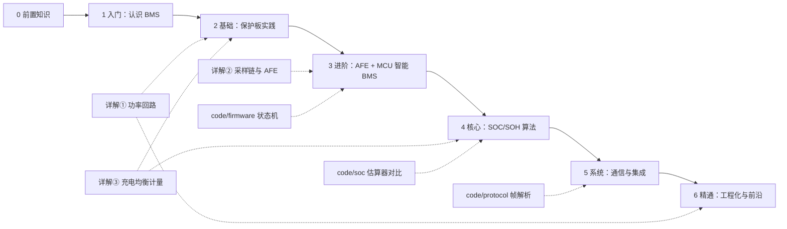

# BMS 学习路线：从入门到精通

> 收录日期：2026-10-03。资料按学习阶段组织，每个阶段给出：学习目标 → 核心概念 → 推荐资料 → 实践任务。
> 周期为建议值，可根据基础增减。国外资料标题均已附中译。
>
> 🚪 **零基础不要从本页外链海开始** → 先读 [前两周怎么走](stages/getting-started.md)，再进 [阶段 0 教程](stages/stage-0-前置知识.md)。  
> 🔤 生词查 [术语表](glossary.md) ｜ 🛒 买东西前看 [器材与预算清单](budget.md) ｜ 💻 参考代码在 [code/](../code/README.md) ｜ 📚 [书单与免费资料](../BMS书籍清单.md) ｜ 🎬 [学习路径视频页](../BMS学习路径.html)

实线是主线顺序；虚线是支撑材料——电路详解、可运行代码分别在对应阶段切入（详解①还服务阶段 6 高压预充，详解③同时服务阶段 2 与 4）。

---

## 阶段 0：前置知识（1–2 周）

> **配套教程**：[stages/stage-0-前置知识.md](stages/stage-0-前置知识.md) ｜ **零基础路径**：[stages/getting-started.md](stages/getting-started.md)  
> §0.1 电池化学必读；§0.2/0.3 可后补（见教程文首对照表）。

**目标**：先懂「为什么必须有 BMS」；电路与嵌入式在阶段 2/3 前补齐即可。

**核心概念**：锂电池化学（过充/过放/温度/CC-CV/SOC）；其后补：ADC、MOS、隔离、GPIO/I2C/SPI/UART。

**推荐资料**（中文优先；英文可选）：

- ✅ [瑞萨白皮书中文编译导读](renesas-bms-tutorial-中文导读.md) — 扫盲首选  
- ✅ 教程正文 §0.1（本仓库）  
- 可选英文：[Battery University BU-409](https://batteryuniversity.com/article/bu-409-charging-lithium-ion)、[BU-808](https://batteryuniversity.com/article/bu-808-how-to-prolong-lithium-based-batteries/)、[瑞萨原文 PDF](https://www.renesas.com/en/document/whp/battery-management-system-tutorial)

**验收（进阶段 1）**：能解释为什么不能过充/过放、为什么低温慎充、什么是 CC-CV、为何 4.2V ≠ 充满。

---

## 阶段 1：入门——认识 BMS（1 周）

> **本阶段配套教程（逐节讲解，必读）**：[docs/stages/stage-1-认识BMS.md](stages/stage-1-认识BMS.md)

**目标**：说清 BMS 是什么、解决什么问题、由哪些功能模块组成。

**核心概念**：过充/过放/过流/短路/温度五大保护；单体电压均衡；SOC/SOH/SOP 三大状态量；保护板 vs 智能 BMS 的区别。

**推荐资料**：

- [NXP《电池管理系统》应用页](https://www.nxp.com.cn/applications/BATTERY-MANAGEMENT-SYSTEM) — 功能安全视角的架构图（中文）
- [英飞凌《非堆叠式 BMS 方案》](https://www.infineon.cn/application/non-stackable-bms-solutions) — 保护级设计视角（中文）
- [知乎：BMS 学习路线讨论](https://www.zhihu.com/question/439467314)、[知乎：如何自学 BMS](https://www.zhihu.com/question/22491005)
- ✅ [B 站：BMS 项目实战视频课](https://www.bilibili.com/video/BV1pv4y1T7Xi/) — 中文视频入门
- 可选英文：🎬 [GreatScott!《BMS || DIY or Buy》](https://www.youtube.com/watch?v=rT-1gvkFj60) — 动画讲透保护板与均衡

**验收**：能画出 BMS 的功能框图（采样 → 保护 → 均衡 → 估算 → 通信），说明每一块的输入输出。

---

## 阶段 2：基础实践——保护板（2–4 周）

> **本阶段配套教程（逐节讲解，必读）**：[docs/stages/stage-2-保护板实践.md](stages/stage-2-保护板实践.md)

**目标**：看懂并亲手调通一块多串保护板，掌握保护电路的硬件细节。

**核心概念**：保护 IC（DW01 / S-8254A / 中颖 SH367309）与 MOS 管协同架构；ID/NTC 检测；MOS 选型（VDS、RDS(on)、Qg）；静态功耗。

**推荐资料**：

- [CSDN：《S-8254A 多串锂电池硬件保护方案深度解析》](https://bbs.csdn.net/weixin_29169899/article/details/100241878) — 保护机制 + MOS 选型法则
- [21ic：《基于中颖 SH367309 的 1-17 串 BMS 保护板设计全解析》](https://bbs.21ic.com/icview-3531958-1-1.html) — 完整实战，含静态功耗/采样精度实测
- [EET-China：《锂电池保护板的 ID、NTC 设计》](https://www.eet-china.com/mp/a179929.html)
- [21ic BMS 标签页](https://www.21ic.com/tags/bms)、[EEWORLD《BMS 全方位解析》](https://bbs.eeworld.com.cn/thread-1309359-1-1.html) — 遇到具体问题时的检索入口
- 🎬 B 站保护板视频课：[《锂电池保护板原理》系列](https://www.bilibili.com/video/BV1F7411t7Xq/)、[DW01 工作原理](https://www.bilibili.com/video/BV1fMWBesE6M/)、[开源 BMS 保护板硬件原理篇](https://www.bilibili.com/video/BV1CB4y1d7Fx/) — 对着原理图逐器件讲

**实践任务**：

1. 拆解一块成品保护板（如 3S 三元锂保护板），反推电路。
2. 调试 [立创开源 BQ76920 5S BMS 工程](https://oshwhub.com/kaijun/mps-energy-station)，实测过充/过放保护阈值与静态功耗。

**验收**：能独立说明一块保护板上每个关键器件的作用，并实测验证保护动作。

---

## 阶段 3：进阶——AFE + MCU 的智能 BMS（1–2 个月）

> **本阶段配套教程（逐节讲解，必读）**：[docs/stages/stage-3-AFE-MCU智能BMS.md](stages/stage-3-AFE-MCU智能BMS.md)

**目标**：设计并实现一块"采样 + 均衡 + 保护 + 通信"的完整智能 BMS。这是从硬件爱好者到 BMS 工程师的分水岭。

**核心概念**：AFE（模拟前端）架构与寄存器；电压/电流/温度采样链路；被动/主动均衡电路；高边/低边 MOS 驱动；菊花链与电气隔离；EMC 设计。

**AFE 选型**：

- **TI BQ769x0 / BQ769x2**（≤16S，中文资料与开源生态最全，入门首选）
- **ADI LTC6811 / LTC6813**（车规高压，isoSPI 菊花链，EV 级）
- **瑞萨 ISL94202 / ISL94203**（平衡之选）

**推荐资料（按精读顺序）**：

1. [vamoirid/LTC6811+STM32 BMS 工程](https://github.com/vamoirid/Battery-Management-System-LTC6811-STM32)（55★）— 结构最清晰的入门工程：LTC6811 从板 + STM32F4
2. [LibreSolar BMS 固件](https://github.com/LibreSolar/bms-firmware)（262★）+ [bms-c1 硬件](https://github.com/LibreSolar/bms-c1)（262★）— Zephyr 固件，同时支持 bq769x0/bq769x2/ISL94202，可直接烧录学习
3. [foxBMS 官方文档](https://foxbms.org/) — Fraunhofer 工业级平台，文档本身就是 BMS 架构教材；源码 [foxBMS/foxbms-2](https://github.com/foxBMS/foxbms-2)（479★）
4. [BotoX 小米滑板车 M365 兼容固件](https://github.com/BotoX/xiaomi-m365-compatible-bms)（219★）— 量产级固件（ATmega328P + BQ769x0），看真实产品怎么写
5. [TI《储能系统 BMS 方案》](https://www.ti.com.cn/solution/zh-cn/ess-battery-management-system-bms)（中文）+ [TI E2E 电源管理论坛](https://e2e.ti.com/support/power-management-group/power-management/f/power-management-forum) — 参考设计 + 实战答疑
6. [EEVblog《自建 BMS 的学习路径》](https://www.eevblog.com/forum/beginners/learning-path-for-buiding-my-own-bms/)（Learning Path for building my own BMS）、[EEVblog《BMS 设计求评帖》](https://www.eevblog.com/forum/projects/seeking-constructive-criticism-on-bms-design/) — 设计评审类长帖
- 🎬 [B 站《1 小时讲透 BMS 设计：从系统原理到项目实战》](https://www.bilibili.com/video/BV1NwnRzAEb3/) — 汽车电子工程师视角的 BMS 概论

**实践任务**：

1. 抄一块 8–16S BMS 原理图（以 LibreSolar bms-c1 为蓝本），完成 PCB 设计。
2. 烧录 LibreSolar 固件跑通电压/温度采集与被动均衡；有余力则自写 bq769x2 驱动。

**验收**：自研板能稳定采集全部串电压（误差 <10mV）、实现被动均衡，并通过所有保护项实测。

---

## 阶段 4：核心——SOC / SOH / SOP 估算算法（1–3 个月）

> **本阶段配套教程（逐节讲解，必读）**：[docs/stages/stage-4-SOC-SOH算法.md](stages/stage-4-SOC-SOH算法.md)

**目标**：实现可用的 SOC 估算（误差 <5%），理解 SOH 与 SOP。这是 BMS 的软件核心。

**核心概念**：安时积分（库仑计）；OCV-SOC 曲线与静置修正；等效电路模型（Thevenin / 二阶 RC）；卡尔曼滤波 EKF/UKF；容量与内阻衰退模型。

**推荐资料（按顺序）**：

1. **Coursera 专项课《电池管理系统算法》**（Algorithms for Battery Management Systems，Gregory Plett，科罗拉多大学博尔德分校）— 该领域最系统的公开课程：[专项课主页](https://www.coursera.org/specializations/algorithms-for-battery-management-systems)
   - [《电池管理系统导论》](https://www.coursera.org/learn/battery-management-systems)（Introduction to Battery Management Systems）
   - [《电池荷电状态（SOC）估计》](https://www.coursera.org/learn/battery-state-of-charge)（重点）
   - [《电池包均衡与功率估计》](https://www.coursera.org/learn/battery-pack-balancing-power-estimation)
2. **Plett 三部曲**（Artech House，[作者主页](http://mocha-java.uccs.edu/)）：《卷一：电池建模》(Battery Modeling)、《卷二：等效电路方法》(Equivalent-Circuit Methods)、《卷三：基于物理的方法》(Physics-Based Methods)
   - ✅ UCCS 官方讲义本地副本（books/uccs-ece5710、books/uccs-ece5720，含勘误表）＋ [ECE5710 Notes02 中文导读](ece5710-notes02-中文导读.md)（等效电路模型，非官方编译）＋ [ECE5720 Notes03 中文导读](ece5720-notes03-中文导读.md)（SOC 估计 KF/EKF/SPKF，非官方编译）
3. [AlterWL《卡尔曼滤波 SOC 估算》](https://github.com/AlterWL/Battery_SOC_Estimation)（437★）— MATLAB 实现，上手最快
4. [ks-santosh/MiniBMS](https://github.com/ks-santosh/MiniBMS)（60★）— Simulink 完整模型（SOC + 故障检测 + 状态机），仿真入门
5. [raghuramshankar《锂电池 EKF SOC 估算》](https://github.com/raghuramshankar/soc-estimation-of-li-ion-batteries) — 含 OCV-SOC 建模 + 公开数据集使用说明
6. [matlab-simulink-energy-lab](https://github.com/mohammadrezwankhan/matlab-simulink-energy-lab)（317★）— SOC EKF、热管理、储能电站控制的可复现参考模型
7. 中文教材：谭晓军《电动汽车动力电池管理系统设计》、熊瑞《动力电池管理系统核心算法》（[知乎书籍推荐](https://www.zhihu.com/question/352224059)）
8. 🎬 视频补充：[跟着戴海峰老师学 BMS（B 站）](https://www.bilibili.com/video/BV1BB4y1o7xC/)（同济戴海峰，SOC/SOH/SOP 状态估计专题）、[Plett ECE5720 官方讲义 + 课堂录像](http://mocha-java.uccs.edu/ECE5720/index.html)（英文，UCCS 课程主页；与 Coursera 专项课同为 Plett 主讲、主题相近，但非同一课程）、[YouTube《BMS Tutorial》系列](https://www.youtube.com/playlist?list=PLiVhHtxu_4JK8mI8kFn7KjYr3dD1Ra3pE)（SOC/均衡讲解，英文）

**实践任务**：

1. 用 [Battery Archive 公开电池数据](https://www.batteryarchive.org/)在 MATLAB/Simulink 复现 EKF SOC 估算。
2. 把安时积分 + OCV 修正的简化 SOC 算法移植到阶段 3 的 MCU 上运行。

**验收**：能讲清 EKF 的状态方程与观测方程；自实现的 SOC 在恒流放电工况下误差 <5%。

---

## 阶段 5：系统——通信与集成（2–4 周）

> **本阶段配套教程（逐节讲解，必读）**：[docs/stages/stage-5-通信与集成.md](stages/stage-5-通信与集成.md)

**目标**：让 BMS 接入真实系统——上位机、储能逆变器、整车 CAN。

**核心概念**：UART / RS485-Modbus / CAN / SMBus / BLE 帧协议；隔离与电平匹配；CRC 校验；商用 BMS 私有协议逆向。

**推荐资料**：

- [《BMS 通信架构综述》（batterydesign.net）](https://www.batterydesign.net/battery-management-system/hardware/bms-communication-architectures/)
- [《BMS 通信：CAN 与 RS485 对比》](https://liniotech.com/blog/battery-bms-communication-can-vs-rs485-explained/)、[《BMS 通信协议类型与网关集成》](https://www.come-star.com/blog/bms-communication-protocols/)
- **协议实战文档（syssi 系列，即各品牌协议的事实文档）**：
  - [esphome-jk-bms](https://github.com/syssi/esphome-jk-bms)（1026★，JK 极空 BMS 的 UART/BLE 协议）
  - [esphome-jbd-bms](https://github.com/syssi/esphome-jbd-bms)（258★，小象 BMS）
  - [esphome-seplos-bms](https://github.com/syssi/esphome-seplos-bms)（119★，RS485/Modbus）
  - [esphome-pace-bms](https://github.com/syssi/esphome-pace-bms)（92★）
- [fl4p/batmon-ha](https://github.com/fl4p/batmon-ha)（522★）— JK/JBD/Daly/ANT 蓝牙 BMS 集成到 Home Assistant
- [dexterbg/Twizy-Virtual-BMS](https://github.com/dexterbg/Twizy-Virtual-BMS)（94★）— 雷诺 Twizy 车规 CAN 协议仿真
- 社区实战帖：[DIY Solar Forum 二手锂电池板块](https://diysolarforum.com/forums/second-life-lithium-batteries.24/)、[ST 社区《BMS 的 MCU 间通信协议》讨论](https://community.st.com/others-hardware-and-software-57/communication-protocols-between-microcontrollers-for-a-bms-151918)
- 🎬 [Off-Grid Garage《JiKong 300A BMS 深度评测》](https://www.youtube.com/watch?v=BUxt_BQe9wk)（英文）— 商用 BMS 拆测标杆频道，配合协议逆向一起看

**实践任务**：用 ESP32 通过 UART 或 BLE 读取一块商用 BMS（如 JK 或小象）的数据，解析帧格式并上传 Home Assistant。

**验收**：能独立逆向一段未知 BMS 协议（帧头/长度/数据域/CRC），并写出解析器。

---

## 阶段 6：精通——工程化与前沿（持续）

> **本阶段配套教程（逐节讲解，必读）**：[docs/stages/stage-6-精通与毕业项目.md](stages/stage-6-精通与毕业项目.md)

**目标**：达到产品级水准——硬件、算法、功能安全、量产工程四条线全部打通，能独立完成可发布的 BMS 产品。

### 6.1 硬件精通

**核心概念**：高压电池簇架构（BMU 主控 / CMU 从板 / BDU 配电盒）；绝缘检测（电桥法 IMD）；预充回路与主继电器驱动时序；热失控监测与熔断保护；采样链路 EMC 设计。

- [ENNOID-BMS](https://github.com/EnnoidMe/ENNOID-BMS)（330★）— LTC68xx 菊花链、400V 电池包、接触器控制的完整参考
- [ADI ADBMS6815 产品页](https://www.analog.com/en/products/adbms6815.html) — 12 串监控芯片，WFS 型号具备 ASIL D 能力，看车规 AFE 的安全机制怎么设计
- [TI E2E 论坛](https://e2e.ti.com/support/power-management-group/power-management/f/power-management-forum) — 高压/绝缘/EMC 实战问题检索

### 6.2 算法精通

**核心概念**：OCV 滞回与温度补偿；SOC-容量联合估计（双卡尔曼/双 EKF）；SOP 峰值功率预测（电压/电流/SOC/温度多约束）；均衡策略从被动（电阻耗散）到主动（电感 / 开关电容 / 反激）的拓扑取舍。

- [MPS《主动均衡：工作原理与优势》](https://www.monolithicpower.com/en/learning/resources/active-balancing-how-it-works-and-its-advantages)（Active Balancing: How It Works and Its Advantages）
- [Alparrrr/ACTIVE_BALANCE_BMS](https://github.com/Alparrrr/ACTIVE_BALANCE_BMS) — 16S 电感式主动均衡开源项目
- [ActiBMS 讨论帖（OpenEnergyMonitor）](https://community.openenergymonitor.org/t/actibms-discussion-about-the-diy-active-balancer-bms/12445)、[DIY Solar Forum《哪些 BMS 用电感均衡》](https://diysolarforum.com/threads/what-bms-uses-inductive-balancing.39149/)
- 均衡拓扑综述：[《基于电感的主动均衡拓扑》（MDPI Batteries 2025）](https://www.mdpi.com/2313-0105/11/2/77)
- 阶段 4 的 Plett 课程与书继续深挖（联合估计与功率预测章节）

### 6.3 功能安全与标准

**核心概念**：HARA 危害分析；ASIL 定级与分解；BMS 安全目标（防过充通常 ASIL C/D）；冗余保护（硬件保护 IC + 软件双通道）；FMEA 失效模式分析。

**必读资料**：

- [《BMS 功能安全》（batterydesign.net）](https://www.batterydesign.net/battery-management-system/functional-safety/) — ASIL 体系入门
- [《车用 BMS 功能安全设计方法论》（MDPI Energies 2021）](https://www.mdpi.com/1996-1073/14/21/6942) — ISO 26262 应用于 BMS 的完整方法论（含 SPFM/LFM 指标）
- [英飞凌知识库《ASIL 分解》](https://community.infineon.com/t5/Knowledge-Base-Articles/ASIL-decomposition-ISO-26262/ta-p/852405)（ASIL Decomposition）
- [《BMS 功能安全：HARA、FMEA、ASIL/SIL 辨析》](https://sunlithenergy.com/bms-functional-safety-hara-fmea/) — 车规 ASIL 与储能 IEC 61508/SIL 的区别

**标准清单**（按适用领域选读）：

- 车规：**ISO 26262 / GB/T 34590**（道路车辆功能安全）；[GB/T 38661-2020《电动汽车用电池管理系统技术条件》](https://openstd.samr.gov.cn/bzgk/std/newGbInfo?hcno=DB3ACC49AC4A146FAA311BB468ACA290)（国标全文公开）；GB/T 39086-2020《电动汽车用电池管理系统功能安全要求及试验方法》
- 储能/消费：IEC 62660（电芯）、UL 2580 / UL 1973、UN 38.3（运输）
- 远程监控：GB/T 32960（电动汽车远程服务与管理系统）

### 6.4 量产工程

**核心概念**：出厂标定（电流零漂、电压增益）；EOL 下线测试；HIL 硬件在环（电芯模拟器 + 故障注入）；诊断协议 UDS（DTC 故障码）；bootloader 与 OTA 升级（断电保护、固件回滚）；参数存储与寿命日志。

- [EEVblog《锂电池电芯模拟器/仿真器用于 BMS 测试》](https://www.eevblog.com/forum/projects/lithium-battery-cell-simulatoremulator-for-bms-testing/) — 用电阻分压链自做电芯模拟器验证采样精度（±2mV）的实操帖
- [ADI EngineerZone《锂离子电芯模拟器电路设计》](https://ez.analog.com/power/battery-management-system/f/qa/584951/li-ion-cell-simulator-circuit-design) — 24 通道模拟器设计讨论
- 此领域公开资料稀少，主要靠实践：复刻 foxBMS 的工程结构（含单元测试与文档体系），并研究 [BotoX 小米 M365 固件](https://github.com/BotoX/xiaomi-m365-compatible-bms)这类量产固件如何处理参数管理与故障策略

### 6.5 前沿方向

- **无线 BMS**：[ADI wBMS](https://www.analog.com/en/products/adbms6815.html)（ADBMS6815 监控 + ADRF8800 无线节点，省去菊花链线束）
- **电化学建模**：[PyBaMM](https://github.com/pybamm-team/PyBaMM)（1673★，Python 物理电池建模事实标准）+ [liionpack](https://github.com/pybamm-team/liionpack)（120★，电池包级仿真）
- **数据驱动 / 云 BMS**：[battery-rul-estimation](https://github.com/MichaelBosello/battery-rul-estimation)（198★，LSTM 寿命预测）、[lfp_soc_ml](https://github.com/alexdatadesign/lfp_soc_ml)（39★，磷酸铁锂 SOC 机器学习）、数据集 [TBSI-Sunwoda](https://github.com/terencetaothucb/TBSI-Sunwoda-Battery-Dataset)（63★）、[awesome-battery-data 清单](https://github.com/pauljgasper/awesome-battery-data)
- **开源电池项目聚合站**：[OpenBatt](https://openbatt.dev/)
- **逆向工程能力**：[FW-Dyson-BMS](https://github.com/tinfever/FW-Dyson-BMS)（934★，戴森吸尘器 BMS 固件重写）、[笔记本 BQ20Z70 BMS 逆向](https://github.com/omarKmekkawy/Reverse_Engineering_BQ20z70_Laptop_BMS)（132★，SBS/SMBus）
- **储能系统级**：[diyBMSv4](https://github.com/stuartpittaway/diyBMSv4)（1136★）+ [Second Life Storage 社区](https://secondlifestorage.com/index.php)
- **完整开源项目参考**：[Green-bms/SmartBMS](https://github.com/Green-bms/SmartBMS)（751★，[知乎中文解读](https://zhuanlan.zhihu.com/p/669013095)）、[LibreSolar 系列](https://github.com/LibreSolar/bms-15s80-sc)

**实践任务（毕业项目）**：完成一个完整开源 BMS 项目（原理图 + PCB + 固件 + SOC 算法 + 通信协议 + 文档），发布到 GitHub 或立创开源硬件平台，发到 EEVblog / EEWORLD 接受社区评审。

---

## 精通自检清单

> 全部能打勾 = 真正精通。按领域自测，短板回到对应阶段补课。

### 硬件

- [ ] 能画出 AFE 采样链路（RC 滤波 → MUX → ADC → 基准），列出全部误差来源，把系统误差预算控制在 ±5mV 以内
- [ ] 能说明采样线断线（open-wire）时 AFE 的读数表现与检测方法
- [ ] 能完成被动均衡电阻/MOS 选型，计算均衡电流、功耗与温升
- [ ] 能设计高边/低边保护 MOS 驱动并说明取舍（成本、损耗、驱动复杂度）——见 [阶段 3 §3.5](stages/stage-3-AFE-MCU智能BMS.md)
- [ ] 能设计预充回路，计算预充电阻、预充时间与继电器动作时序
- [ ] 能解释电桥法绝缘检测原理与误差来源
- [ ] 能说明多簇并联时的环流风险与合闸前检查项——见 [阶段 6 §6.1.5](stages/stage-6-精通与毕业项目.md)
- [ ] 能划清 BMS 与 TMS 的职责边界——见 [阶段 6 §6.1.6](stages/stage-6-精通与毕业项目.md)
- [ ] 能指出一块 BMS 原理图中最容易 EMC 失效的三处并给出对策

### 固件

- [ ] 能写出完整 BMS 状态机（初始化 / 待机 / 充电 / 放电 / 均衡 / 故障 / 休眠）及全部迁移条件
- [ ] 能实现故障分级（提示 / 限功率 / 断开）+ 去抖 + 自恢复 + 锁存策略
- [ ] 能设计低功耗休眠唤醒，并处理休眠期间库仑计量的断续问题
- [ ] 能实现 bootloader + OTA，处理升级断电与固件回滚

### 算法

- [ ] 能手推 Thevenin 模型下 EKF 估计 SOC 的预测/更新五步方程
- [ ] 能解释 OCV 滞回现象，以及 LFP 平台区 SOC 估计的难点与对策
- [ ] 能实现 SOC-容量双卡尔曼联合估计，并说明可观测性条件
- [ ] 能计算多约束（电压 / 电流 / SOC / 温度）下的 SOP 峰值功率
- [ ] 能说明 SOH 的容量与内阻两种口径及各自在线估计思路

### 系统与安全

- [ ] 能做一次简化 HARA，给出 BMS 至少三条安全目标及对应 ASIL 等级
- [ ] 能解释为什么量产 BMS 需要硬件保护 IC 与软件保护双通道冗余
- [ ] 能逆向一段未知 BMS 的 UART/CAN 协议并写出解析器
- [ ] 能默写 GB/T 27930 握手四段骨架并说明超时停充——见 [阶段 5 §5.4.1](stages/stage-5-通信与集成.md)
- [ ] 能设计一套 HIL 测试方案：电芯模拟器 + 故障注入 + 边界工况
- [ ] 能列出 GB/T 38661、GB/T 39086 中对自己产品适用的关键条款

---

## 常见坑与经验

**硬件**

- 采样线束顺序接错或带电插拔 → 烧 AFE 输入；上电顺序：先接电芯，后插排线
- 均衡电阻功率按单体最高电压 × 均衡电流选型并留 2 倍余量，注意 PCB 热设计
- 休眠功耗超标多因：AFE 未进 shutdown、分压电阻常通、稳压器静态电流过大
- 保护 MOS 需考虑雪崩耐量与反向放电路径；充放电 MOS 常需背靠背串联
- RS485/CAN 在电池包上必须做隔离，共模瞬态是通信口损坏首因

**算法**

- 纯安时积分必漂移：必须有满充/静置 OCV 校准点
- LFP 平台区 OCV 斜率极小，纯电压法估 SOC 基本失效 → 上滤波 + 容量联合估计
- OCV-SOC 曲线随温度、老化漂移，量产需分温度点多张表
- SOC=100% 校准点应取 CV 阶段截止电流判据，而非电压达到上限的瞬间

**协议**

- RS485 忘加终端/偏置电阻 → 长距离丢包
- UART 电平 3.3V/5V 不匹配、地未共 → 乱码
- BLE 长帧需协商 MTU 并处理分包重组
- CRC 多项式/初始值/输出异或任一不对全错——用 syssi 仓库的已知帧做基准比对

**工程**

- 出厂不标定电流零漂 → SOC 出厂即偏几个百分点
- 无故障日志（DTC 快照）→ 现场问题无法复盘
- OTA 无回滚机制 → 一次断电变砖
- 参数存 Flash 无磨损均衡与掉电保护 → 参数区写穿

---

## 快速检索：按问题找资料

| 遇到问题 | 去哪里 |
|---|---|
| 芯片选型 / BQ 寄存器配置 | [TI E2E 论坛](https://e2e.ti.com/support/power-management-group/power-management/f/power-management-forum) + TI 方案页 |
| 保护板硬件细节 | [21ic BMS 板块](https://www.21ic.com/tags/bms)、CSDN S-8254A 解析 |
| 硬件设计求评审 | [EEVblog 论坛](https://www.eevblog.com/forum/)、EEWORLD |
| 储能系统实战 | [Second Life Storage](https://secondlifestorage.com/)、[DIY Solar Forum](https://diysolarforum.com/) |
| 算法公式推导 | Plett 课程与书、AlterWL 仓库 |
| 协议帧格式 | syssi 系列仓库 README / 源码 |
| 电池化学疑问 | [Battery University](https://batteryuniversity.com/) |
| 功能安全 / 标准查询 | [batterydesign.net《BMS 功能安全》](https://www.batterydesign.net/battery-management-system/functional-safety/) + [GB/T 38661 国标全文](https://openstd.samr.gov.cn/bzgk/std/newGbInfo?hcno=DB3ACC49AC4A146FAA311BB468ACA290) |
| 主动均衡方案 | [MPS《主动均衡》](https://www.monolithicpower.com/en/learning/resources/active-balancing-how-it-works-and-its-advantages) + [ACTIVE_BALANCE_BMS](https://github.com/Alparrrr/ACTIVE_BALANCE_BMS) |
