# 电路详解 ①：功率回路——MOS、保护与预充

> 配套教程：阶段 2（保护板）、阶段 6（预充/高压）。
> 本系列用水路比喻：**电压 = 水压（水位差），电流 = 水流，电阻 = 细管子，电容 = 蓄水池，MOS = 闸门，二极管 = 单向阀**。

---

## 本页目录

按层走先看 [能力地图](../stages/bloom-map.md)。标题末尾的 `[记忆]` … `[创造]` 是布鲁姆层级。

- [电路详解 ①：功率回路——MOS、保护与预充](01-功率回路-MOS保护与预充.md#电路详解-①功率回路mos保护与预充)
- [1. MOSFET：BMS 里最重要的一个器件 [理解]](01-功率回路-MOS保护与预充.md#1-mosfetbms-里最重要的一个器件-理解)
  - [1.1 它就是个电控闸门 [理解]](01-功率回路-MOS保护与预充.md#11-它就是个电控闸门-理解)
  - [1.2 为什么必须两颗"背靠背" [理解]](01-功率回路-MOS保护与预充.md#12-为什么必须两颗背靠背-理解)
  - [1.3 选型三参数（数据手册第一页） [评价]](01-功率回路-MOS保护与预充.md#13-选型三参数数据手册第一页-评价)
  - [1.4 高边还是低边：开关挂在回路哪一头 [评价]](01-功率回路-MOS保护与预充.md#14-高边还是低边开关挂在回路哪一头-评价)
- [2. DW01：一颗芯片里的完整保护大脑 [理解]](01-功率回路-MOS保护与预充.md#2-dw01一颗芯片里的完整保护大脑-理解)
  - [2.1 内部有什么 [理解]](01-功率回路-MOS保护与预充.md#21-内部有什么-理解)
  - [2.2 输出真值表（看懂这张表就看懂了 DW01） [理解]](01-功率回路-MOS保护与预充.md#22-输出真值表看懂这张表就看懂了-dw01-理解)
  - [2.3 同口与分口 [理解]](01-功率回路-MOS保护与预充.md#23-同口与分口-理解)
- [3. 预充回路：合闸前的"先灌满蓄水池" [应用]](01-功率回路-MOS保护与预充.md#3-预充回路合闸前的先灌满蓄水池-应用)
  - [3.1 问题：电容上电瞬间 = 短路 [理解]](01-功率回路-MOS保护与预充.md#31-问题电容上电瞬间--短路-理解)
  - [3.2 解法与计算 [应用]](01-功率回路-MOS保护与预充.md#32-解法与计算-应用)
- [4. 自测 [理解]](01-功率回路-MOS保护与预充.md#4-自测-理解)

## 1. MOSFET：BMS 里最重要的一个器件 [理解]

> **先读/后读**：§1.1、§1.2 是 [理解]；§1.3、§1.4 是 [评价]（怎么选、挂哪一头）。

> **原理**　MOS 是电压控制的开关。体二极管让单颗永远有一个方向关不死，所以保护回路用两颗背靠背，再按耐压、导通电阻和栅电荷选型。
> **证据**　栅极电压决定通断，体二极管决定为什么要两颗。入口 [瑞萨中文导读](../renesas-bms-tutorial-中文导读.md)。
> **延伸阅读**　[详解①](../circuits/01-功率回路-MOS保护与预充.md)

### 1.1 它就是个电控闸门 [理解]

- **栅极 G**＝闸门的把手：加电压（VGS > 阈值）闸门开，撤掉就关。栅极本身**几乎不耗电流**（是电容性的）——所以 MOS 特别适合做开关。
- **漏极 D / 源极 S**＝水道的两端。导通后电流两个方向都能走（这与三极管不同）。
- **体二极管**＝闸门旁边并联的一个**单向阀**：制造 MOS 时衬底与漏极天然形成的 PN 结，甩不掉。它决定了"单颗 MOS 永远有一个方向关不死"——这正是 BMS 保护开关要两颗的原因。

> **原理**　栅极加到阈值以上就导通，栅极几乎不吃电流。衬底上的体二极管甩不掉，单颗 MOS 总有一个方向关不死。
> **证据**　栅极决定通断，体二极管决定为什么一颗管关不断。入口 [瑞萨《BMS 教程》中文导读](../renesas-bms-tutorial-中文导读.md)。
> **延伸阅读**　[华之美 DW01A 数据手册](https://hmsemi.com/downfile/DW01A.PDF)

### 1.2 为什么必须两颗"背靠背" [理解]

> **先读/后读**：三幕动画和口诀是 [理解]。文末共漏 / 共源是 [评价]：阻断能力一样，差在驱动怎么做。



> **口诀**　一颗 MOS 的体二极管还通着。两颗背靠背才关得住两个方向。

动画里三幕说清了全部道理（**M1 靠电池 B- 一侧，M2 靠对外 P- 一侧**）：

1. **放电**：两颗都导通，放电电流（P- → B-）畅通无阻；
2. **禁止充电**：关断 M2——开关断开，它的体二极管方向又正好顶着充电电流（B- → P-）→ 双重阻断；
3. **反例**：只装一颗时，总有一个方向的电流能从它的体二极管"漏"过去——保护形同虚设。

**口诀**：M1 防放电、M2 防充电；两颗的二极管方向相反，两个方向才都能关死。

> 怎么记才不反？**看二极管方向**：M1 的体二极管顺着充电电流（B- → P-），所以它关不死充电、只能防放电；M2 的体二极管顺着放电电流（P- → B-），所以它只能防充电。放电电流方向最容易记反——低边回路上它是**流进** B- 的（P- → B-）；"电流从电池正极流出"说的是正极那一头，与这里无关。

> 工程注：实际板子两种接法——**共漏**（两漏极相连）：两源极电位不同，栅极须分别驱动（DW01 的 OD/OC 即如此）；8205A 共漏封装便宜，保护板主流。**共源**（两源极相连）：两栅可共用一路驱动，但共同源极悬浮，驱动需浮地参考。无论哪种接法，**每个栅极都必须按各自的 VGS/源极参考来设计**——是否需要浮地或电荷泵，以具体保护 IC 的应用电路为准，别把拓扑口诀当驱动电路结论。两种接法体二极管均反向对顶，双向阻断能力相同。

> **原理**　两颗 MOS 的体二极管方向相反：一颗挡住充电，一颗挡住放电。只留一颗时，另一个方向会从二极管漏过去。
> **证据**　体二极管让单颗 MOS 总有一个方向关不死。机制见本节动画；保护 IC 怎么接两颗栅，见 [DW01A 手册](https://hmsemi.com/downfile/DW01A.PDF)。
> **延伸阅读**　[瑞萨《BMS 教程》中文导读](../renesas-bms-tutorial-中文导读.md)

### 1.3 选型三参数（数据手册第一页） [评价]

> **先读/后读**：三个符号先记住（记忆）。留多少裕量、发热怎么摊，是 [评价]。

| 参数 | 水路比喻 | 选型要点 |
|---|---|---|
| $V_{DS}$ 耐压 | 闸门能扛多大水压 | > 整包最高电压 × 1.5 裕量 |
| $R_{DS(on)}$ | 全开时闸门的缝隙阻力 | 决定发热 $P=I^2R$；大电流板多颗并联分摊 |
| $Q_g$ 栅电荷 | 把闸门推开要费的力气 | 影响驱动速度与驱动器功耗 |

另外两个坑：

- **VGS 限值 ±20V**：栅氧层很薄，多串电池组里驱动回路稍有不慎就击穿——保护 IC 内部已处理，自己设计驱动时必查；
- **雪崩（EAS）**：关断瞬间感性负载（继电器线圈、线束电感）会产生高压尖峰"砸"在 MOS 上，像水锤砸阀门。看手册的单次雪崩能量额定，必要时加 TVS/续流。

> **原理**　耐压要高于整包最高电压并留裕量，导通电阻决定发热，栅电荷决定驱动够不够快。栅极耐压和关断尖峰也要单独查。
> **证据**　MOS 先看电压、导通电阻和栅极电荷，再看封装能不能散热。保护 IC 对照 [华之美 DW01A 数据手册](https://hmsemi.com/downfile/DW01A.PDF)。
> **延伸阅读**　[瑞萨《BMS 教程》中文导读](../renesas-bms-tutorial-中文导读.md)

### 1.4 高边还是低边：开关挂在回路哪一头 [评价]

背靠背解决的是"双向能不能关死"；**高边/低边**解决的是"这组开关串在 B+ 还是 B−"。

```
低边：  B+ ── 负载 ── [MOS×2] ── B−     ← 源极近地，驱动简单
高边：  B+ ── [MOS×2] ── 负载 ── B−     ← 源极随负载浮动，要浮地驱动
```

- **低边**：MCU/驱动器相对系统地推栅极即可；保护板与小功率板主流。代价：断 B− 后负载端对地仍可能带残压；电池正极对地短路时，故障电流不经过低边开关。
- **高边**：断正极，负载侧失电更干净，对地短路时开关仍在路径上。代价：每个栅极必须以**各自源极**为参考——电荷泵、自举电容或专用高边驱动 IC；成本、布局、EMI 都上去一档。
- **选型口诀**（与 [阶段 3 §3.5](../stages/stage-3-AFE-MCU智能BMS.md) 一致）：能低边就低边；规范或系统要求"断正极"再上高边。别把"高边更安全"当成无条件真理——驱动做砸的高边比规规矩矩的低边更危险。

> **原理**　背靠背解决的是"双向能不能关死"；**高边/低边**解决的是"这组开关串在 B+ 还是 B−"。
> **证据**　开关放在正极还是负极，决定驱动和失效模式。对照 [瑞萨原文 PDF](https://www.renesas.com/en/document/whp/battery-management-system-tutorial)（英文，可选）里的切断 FET 讨论，以及 [中文导读](../renesas-bms-tutorial-中文导读.md)。
> **延伸阅读**　[详解①](../circuits/01-功率回路-MOS保护与预充.md)

## 2. DW01：一颗芯片里的完整保护大脑 [理解]

> **先读/后读**：芯片里有什么是 [理解]。引脚阈值的官方表以 datasheet 为准，直链待补，见节末。

> **原理**　DW01 把过充、过放和过流三次比较做进一颗芯片，延时确认后分别关断充电或放电 MOS。阈值以具体料号的 datasheet 为准。
> **证据**　[华之美 DW01A 数据手册](https://hmsemi.com/downfile/DW01A.PDF)（过充典型 4.30V±50mV，过充延时典型约 80–200 ms）。原厂英文稿：[Fortune DW01A-DS-11](http://www.ic-fortune.com/upload/Download/DW01A-DS-11_EN.pdf)。正文表里的「1s 级」是数量级口令，不是这两份手册的标称。
> **延伸阅读**　[B 站：DW01 工作原理](https://www.bilibili.com/video/BV1fMWBesE6M/)

### 2.1 内部有什么 [理解]

DW01 内部就四样东西：

1. **基准源**：一把精确的"尺子"；
2. **三个电压比较器**：分别盯过充（VDD 太高）、过放（VDD 太低）、过流（CS 压差）；
3. **内部延时发生器**：比较器响了不立刻动作，先数一段延时——防误触发（延时由芯片内部产生，**TD 引脚只是出厂测试时缩短延时用的测试脚**，不需要外接元件）；
4. **输出逻辑**：驱动 OD（放电 MOS 栅）、OC（充电 MOS 栅）两个引脚。

> **原理**　芯片里是电压电流比较器、延时和两路栅极驱动。超限后 OC 或 OD 拉低，对应的那颗 MOS 关掉。
> **证据**　DW01 内部就是比较器加延时。阈值与延时以 [华之美 DW01A 数据手册](https://hmsemi.com/downfile/DW01A.PDF) 为准。
> **延伸阅读**　[ABLIC S-8254A 中文手册](https://www.ablic.com/cn/doc/datasheet/battery_protection/S8254A_C.pdf)

### 2.2 输出真值表（看懂这张表就看懂了 DW01） [理解]

> **先读/后读**：表本身可以当 [记忆] 背。每一行为什么留一条恢复通路，是 [理解]，紧跟在表后面。

| 状态 | OD（放电门） | OC（充电门） | 结果 |
|---|---|---|---|
| 正常 | 高 | 高 | 充放随意 |
| 过放保护 | **低** | 高 | 只许充不许放 |
| 过充保护 | 高 | **低** | 只许放不许充 |
| 放电过流/短路 | **低** | 高 | 断负载，等恢复 |


> **口诀**　电压越线，比较器拉栅，MOS 断开。软件可以不在这条路上。

动画演示了过充保护全过程：电压爬过 4.30V 阈值 →（内部延时确认不是毛刺）→ OC 拉低 → 充电 MOS 断开；电压回落到恢复值 → 自动重新允许充电。**阈值 + 延时 + 恢复条件**三要素缺一不可。

> **原理**　动画演示了过充保护全过程：电压爬过 4.30V 阈值 →（内部延时确认不是毛刺）→ OC 拉低 → 充电 MOS 断开；电压回落到恢复值 → 自动重新允许充电。**阈值 + 延时 + 恢复条件**三要素缺一不可。
> **证据**　[华之美 DW01A 数据手册](https://hmsemi.com/downfile/DW01A.PDF)（过充典型 4.30V±50mV，过充延时典型约 80–200 ms）。原厂英文稿：[Fortune DW01A-DS-11](http://www.ic-fortune.com/upload/Download/DW01A-DS-11_EN.pdf)。正文表里的「1s 级」是数量级口令，不是这两份手册的标称。
> **延伸阅读**　[B 站：DW01 工作原理](https://www.bilibili.com/video/BV1fMWBesE6M/)

### 2.3 同口与分口 [理解]

- **同口**：充放电共用 P- 端，一组背靠背 MOS——便宜，大多数小保护板；
- **分口**：充电 MOS（C-）与放电 MOS（D-）分开——可以只断充电保留放电（或反之），UPS、太阳能路灯常用。

> **原理**　同口共用 P− 和一组背靠背 MOS，便宜但充放电只能一起断。分口把充电和放电开关拆开，才能只断一边。
> **证据**　同口共用充放回路，分口把充电和放电 MOS 分开。多串延时电容见 [ABLIC S-8254A 中文手册](https://www.ablic.com/cn/doc/datasheet/battery_protection/S8254A_C.pdf)。
> **延伸阅读**　[华之美 DW01A 数据手册](https://hmsemi.com/downfile/DW01A.PDF)

## 3. 预充回路：合闸前的"先灌满蓄水池" [应用]

> **先读/后读**：§3.1 为什么会打火是 [理解]；§3.2 电阻和时间是 [应用]。

> **原理**　逆变器母线电容放空时相当于短路。预充电阻先把电容灌到接近电池电压，主接触器再无火花合上。
> **证据**　放空的母线电容相当于短路。时序动画在本节；整包参考 [ENNOID-BMS](https://github.com/EnnoidMe/ENNOID-BMS)（英文，可选）。
> **延伸阅读**　[阶段 6 §6.1.2](../stages/stage-6-精通与毕业项目.md)

### 3.1 问题：电容上电瞬间 = 短路 [理解]

逆变器/电机控制器输入端有个大电容（母线电容，几百 μF 到几 mF）。它**完全放电时相当于短路**：400V 电池直接合主继电器，瞬间电流只受回路毫欧级电阻限制，可达数千安——继电器触点直接烧蚀粘连。

> **原理**　逆变器/电机控制器输入端有个大电容（母线电容，几百 μF 到几 mF）。它**完全放电时相当于短路**：400V 电池直接合主继电器，瞬间电流只受回路毫欧级电阻限制，可达数千安——继电器触点直接烧蚀粘连。
> **证据**　放空的母线电容相当于短路，冲击电流只受线路电阻限制。时序参考 [ENNOID-BMS](https://github.com/EnnoidMe/ENNOID-BMS)（英文，可选）。400V 与数千安是数量级示例。
> **延伸阅读**　[阶段 6 §6.1.2](../stages/stage-6-精通与毕业项目.md)

### 3.2 解法与计算 [应用]



> **动态**　初始态：主闸打开，母线电容是空的。扰动：合上预充继电器，电流只能走预充电阻。中间态：电容电压按时间常数往上爬，冲击能量变成电阻上的热。保护态：爬到接近包压再合主闸；超时上不来就停在故障，不合主闸。
> **口诀**　先小电流灌满母线电容，再合主闸。

七个回路的四拍索引在 [电路动态分析](README.md#电路动态分析)。

1. 先合**预充继电器 K2**：电流被迫经过预充电阻 R，电容平缓充电；
2. 母线电压升到电池电压的 90–95%（历时约 $t \approx 3RC$）；
3. 合**主继电器 K1**，断 K2——此时 K1 两端几乎没有压差，无火花闭合。

预充电阻选型：

- 阻值：按目标预充时间 $R \approx t/(3C)$，常见几十到几百欧；
- 功率：单次冲击能量 $E = \frac{1}{2}CU^2$ 全部变成电阻上的热——按**脉冲额定**选型（线绕电阻/水泥电阻），不是按连续功率；
- **预充失败判据**：超时母线电压上不来 → 外部短路或接触器后端故障，**禁止合 K1**——这是量产 BMS 的必备诊断。

> **原理**　先合预充接触器，电流只走电阻，电容电压按时间常数上升。压差足够小再合主接触器，然后断开预充。电阻上的热是 $E = \frac{1}{2}CU^2$ 这一次脉冲，不是平均功率。
> **证据**　可核验演示：本节 SVG（浏览器打开即播），正文有不看动画也能读的说明。预充电阻把冲击电流限制住，合主闸前先看电压是否爬到位。参考 [ENNOID-BMS](https://github.com/EnnoidMe/ENNOID-BMS)（英文，可选）。数字是示例。
> **延伸阅读**　线绕电阻、密封接触器，以及和主接触器同框的预充电阻，在 [详解④ §1.3](04-系统安全与量产.md#13-主动放电碰撞后的-5-秒钟-理解)。计算过程的文字版在 [阶段 6 §6.1.2](../stages/stage-6-精通与毕业项目.md#612-预充回路合闸的艺术-应用)。

## 4. 自测 [理解]

> **先读/后读**：第 6 题（高边驱动）偏 [评价]；其余是 [理解]。

1. 单颗 MOS 为什么关不断双向电流？背靠背两颗的接法与口诀？
2. $Q_g$ 大的 MOS 有什么实际影响？
3. DW01 触发过放保护后，OD/OC 分别是什么电平？这样设计是为了什么？
4. 为什么保护要有延时？延时是外接电容设定的吗？（DW01 与 S-8254A 分别回答）
5. 预充电阻按什么选功率？预充失败说明什么？
6. 高边驱动为什么不能"相对系统地直接推栅极"？低边的主要安全代价是什么？

<details>
<summary><b>参考答案（先自己想完再展开）</b></summary>

1. 因为衬底与漏极天然形成的 **体二极管** 并联在 D-S 之间，关断沟道后电流仍能从体二极管的正向方向流过——所以单颗 MOS 永远有一个方向关不死。两颗背靠背让两个体二极管**反向对顶**，两个方向都能阻断。口诀：**M1 防放电、M2 防充电**（M1 靠电池 B- 一侧、M2 靠对外 P- 一侧）。两种接法：**共漏**（两漏极相连，两源极电位不同，两个栅极必须分别驱动——DW01 的 OD/OC 正是如此；8205A 这类共漏双 MOS 封装便宜，保护板主流）；**共源**（两源极相连，两栅可共用一路驱动，但共同源极悬浮在回路中间，驱动需浮地参考）。两种接法的双向阻断能力相同，差别在驱动方式。
2. $Q_g$ 是把栅极电容充到导通电压所需的电荷量。它大意味着：①**开关变慢**——驱动电流有限时转换时间约 $t \approx Q_g / I_{drive}$，MOS 在线性区停留更久、开关损耗增大；②**驱动器功耗增大**——每次开关都要搬运这份电荷，$P \approx Q_g \times V_{GS} \times f$；③**保护响应变慢**——μs 级短路关断需要迅速抽走栅极电荷，$Q_g$ 大会拖慢关断，对保护时序不利；④多颗并联时总 $Q_g$ 叠加，驱动能力要求成倍提高。BMS 功率回路开关频率低，所以 $R_{DS(on)}$ 通常比 $Q_g$ 更关键，但"关断够快"这一项不能忽视。
3. **OD 拉低（放电 MOS 关断）、OC 保持高（充电 MOS 仍导通）**，结果是"只许充不许放"。这样设计是为了给电池留一条**恢复通路**：如果两个方向都关断，电池就彻底与外界隔绝，插上充电器也充不进电，这块电池再也救不回来。保留充电方向导通，用户插上充电器电压回升就能解除过放保护。对称地，过充保护时是 OC 拉低、OD 保持高（只许放不许充），同样留一条通过放电退出保护的路。
4. 要延时是为了**躲开正常工况的瞬态**：电机启动、负载突变造成的毫秒级电压跌落与电流尖峰都是正常现象，无延时会误触发到不可用。延时来源两家不同：**DW01** 的各类保护延时由芯片**内部**延时发生器产生，**不需要外接任何定时元件**——它的 TD 引脚只是出厂测试时用来缩短延时、快速验证保护功能的测试脚；**S-8254A** 则有两个**外置延时电容**引脚：CDT 管过放与过流 1（两者固定 10:1），CCT 管过充，延时与电容值成正比；更快的过流 2 与短路延时由内部固定。这两者别记混。
5. 按**单次冲击能量的脉冲额定**选，不是按连续功率。母线电容储能 $E = \frac{1}{2}CU^2$ 在几百毫秒内几乎全部变成电阻上的热，所以要选线绕/水泥电阻并查其单次脉冲能量额定与重复动作间隔要求。阻值则按目标预充时间取 $R \approx t/(3C)$，常见几十到几百欧。预充失败（超时母线电压上不来）说明电流没有在给电容充电、而是流向了别处：**外部短路、接触器后端故障、绝缘失效或母线异常**。此时必须报故障并**禁止合主继电器 K1**——这是量产 BMS 的必备诊断。
6. 高边 MOS 的源极挂在负载上端，电位会随开关与负载状态浮动；VGS 必须是**栅极相对源极**的电压，相对系统地推一个固定电压无法保证正确的 VGS（可能欠驱、过驱甚至栅氧击穿）。需要电荷泵/自举/高边驱动 IC 把驱动参考"钉"在源极上。低边的主要安全代价：断的是负极，负载端对地仍可能经漏电或分布电容带电；且电池正极对地短路时，故障电流往往**不经过**低边开关，低边关断救不了这场短路。

</details>

---

**下一篇**：[电路详解 ②：采样链与 AFE 芯片](02-采样链与AFE芯片.md) ｜ 返回 [电路详解目录](README.md)

> **原理**　这些题考的是上面几节的机制。先盖住折叠答案，用自己的话讲完再展开。
> **证据**　这些题考的是本篇前面几节的机制。对照 [瑞萨《BMS 教程》中文导读](../renesas-bms-tutorial-中文导读.md)。
> **延伸阅读**　[华之美 DW01A 数据手册](https://hmsemi.com/downfile/DW01A.PDF)
