# 电路详解 ②：采样链与 AFE 芯片

> 配套教程：阶段 3（AFE + MCU）。
> 本篇回答一个问题：**BMS 怎么用一颗 ADC 逐串扫描，把 16 串电池电压都测准到 ±5mV（0.12%）？**

---

## 本页目录

按层走先看 [能力地图](../stages/bloom-map.md)。标题末尾的 `[记忆]` … `[创造]` 是布鲁姆层级。

- [电路详解 ②：采样链与 AFE 芯片](02-采样链与AFE芯片.md#电路详解-②采样链与-afe-芯片)
- [1. 采样链全景与误差预算 [分析]](02-采样链与AFE芯片.md#1-采样链全景与误差预算-分析)
- [2. MUX 巡逻式测量：一颗 ADC 测 16 串 [理解]](02-采样链与AFE芯片.md#2-mux-巡逻式测量一颗-adc-测-16-串-理解)
- [3. 输入 RC：小电阻里的大学问 [分析]](02-采样链与AFE芯片.md#3-输入-rc小电阻里的大学问-分析)
- [4. 开线检测：采样线断了会发生什么 [分析]](02-采样链与AFE芯片.md#4-开线检测采样线断了会发生什么-分析)
- [5. BQ769x0/x2 内部巡游（以手册功能框图为地图） [分析]](02-采样链与AFE芯片.md#5-bq769x0x2-内部巡游以手册功能框图为地图-分析)
- [6. 温度采样：NTC——越热阻值越小 [理解]](02-采样链与AFE芯片.md#6-温度采样ntc越热阻值越小-理解)
- [7. 高压菊花链与 isoSPI：变压器"隔电不隔信号" [理解]](02-采样链与AFE芯片.md#7-高压菊花链与-isospi变压器隔电不隔信号-理解)
- [8. 电流采样：安时积分精度的天花板 [分析]](02-采样链与AFE芯片.md#8-电流采样安时积分精度的天花板-分析)
- [9. 自测 [分析]](02-采样链与AFE芯片.md#9-自测-分析)

## 1. 采样链全景与误差预算 [分析]

```
电芯 → RC 滤波 → 多路选择器 MUX → ADC（+基准源） → 数字接口（I2C/SPI） → MCU
```

每个环节都往结果里"掺沙子"：

| 环节 | 误差来源 | 量级/对策 |
|---|---|---|
| RC 滤波 | AFE 输入漏电流流过 R 产生压降 | R 必按手册推荐值，漏电流×R 直接进误差 |
| MUX | 导通电阻、电荷注入 | 高阻 ADC 输入下可忽略；切换后要等稳定再转换 |
| ADC | 失调、增益误差、INL | AFE 内部出厂校准 + 产品出厂标定 |
| 基准源 | 初始误差 + **温漂** | 误差预算的第一项；温度每变 10°C 都要重新核算 |
| 布局 | 采样线拾取干扰、地弹 | 开尔文走线、远离功率回路 |

±5mV 在 4.2V 上是 0.12%——任何一环"凑合"都会超标。这就是为什么 AFE 是一颗专门的芯片，而不是 MCU 自带 ADC 凑合。



**不看动画版**：把上表量化成瀑布——基准温漂 +2.0mV、ADC 失调/增益 +1.5、RC 漏电 +0.8、MUX 电荷注入 +0.3、布局拾取 +0.9，未标定累计 5.5mV 已超 ±5mV 预算线。出厂标定把系统性项（基准初始、失调、增益）用系数修掉，剩余随机与温漂项约 1.8mV 回到预算内——标定不是锦上添花，是预算闭环的最后一环。

> **原理**　基准、分压、滤波、ADC 和温漂各自贡献误差。出厂标定只能修掉系统性增益和失调，随机项和温漂还在预算里。
> **证据**　可核验演示：本节嵌入的 SVG 动画（浏览器打开即播），正文有不看动画也能读的说明。外部文献从 [总纲](../bms-resources.md) 对应阶段的推荐资料进入。
> **延伸阅读**　[术语表](../glossary.md) · [总纲](../bms-resources.md)

## 2. MUX 巡逻式测量：一颗 ADC 测 16 串 [理解]



AFE 内部没有 16 颗 ADC（太贵），而是**一颗 ADC + 一个多路选择器**：像哨兵巡逻，轮流把每一串接到同一个 ADC 上。

这个架构带来两个重要性质：

- **串间一致性极好**：所有串用同一颗 ADC、同一个基准测量——即使绝对值有点偏差，**串与串之间的相对差**（均衡和保护真正关心的）依然很准；
- **各串不是严格同一时刻测的**：扫完一圈要固定时间（手册给出）。电流剧烈波动时，先扫的串和后扫的串对应不同瞬间——高速工况下要在算法里留意。

> **原理**　AFE 内部没有 16 颗 ADC（太贵），而是**一颗 ADC + 一个多路选择器**：像哨兵巡逻，轮流把每一串接到同一个 ADC 上。
> **证据**　可核验演示：本节嵌入的 SVG 动画（浏览器打开即播），正文有不看动画也能读的说明。外部文献从 [总纲](../bms-resources.md) 对应阶段的推荐资料进入。
> **延伸阅读**　[术语表](../glossary.md) · [总纲](../bms-resources.md)

## 3. 输入 RC：小电阻里的大学问 [分析]

每串采样输入前的 RC 是手册"钦定"的，自己改会出事：

- **R 改大**：AFE 采样时从引脚抽取的漏电流在 R 上产生压降 → 该串读数系统性偏低，且漏电流随温度变，误差也跟着变；
- **C 改大**：均衡开关动作后，电压要等 RC 时间常数才能稳定 → 采样值滞后，均衡期间测不准；
- **C 改小**：抗混叠与抗 ESD 能力下降。

**结论：第一版照抄手册典型应用电路，一个元件都不要改。**

> **原理**　采样输入的电阻和电容按手册取值。改电阻会改变热插拔电流和均衡电流，改电容会改变滤波和抗静电能力。
> **证据**　资料入口：[总纲](../bms-resources.md) 对应阶段已经核对过的推荐资料。
> **延伸阅读**　[术语表](../glossary.md) · [总纲](../bms-resources.md)

## 4. 开线检测：采样线断了会发生什么 [分析]

采样排线振动、插接件氧化——断线是 BMS 现场最常见的硬件故障之一。断线后：

1. 该通道的输入被片内/片外的滤波电容"记忆"在旧值附近；
2. MUX 扫描邻近通道时，残余电荷把断线通道的读数**往邻近串拉偏**——读数不是 0、也不是真实值，而是一个"似是而非"的值；
3. 所以 AFE 内置**开线检测功能**（内部电流源拉一下看电压动不动），固件必须定期执行——否则断线那串等于失去保护。


**不看动画版**：中间采样线断开后引脚悬空，AFE 内部的弱检测电流把悬空引脚推向异常电平，两次读数对比即可识别断线并置故障位。注意断线的 0V 与真过放的 0V 无法直接区分——所以断线检测是独立诊断：**先信线，再信数**（详解④ §3.4 有量产视角的展开）。

> **原理**　采样线断开后引脚悬空，读数可以是 0V 或满量程，和真过放分不清。固件必须定期做开线检测，通过之前不要信这串电压。
> **证据**　可核验演示：本节嵌入的 SVG 动画（浏览器打开即播），正文有不看动画也能读的说明。外部文献从 [总纲](../bms-resources.md) 对应阶段的推荐资料进入。
> **延伸阅读**　[术语表](../glossary.md) · [总纲](../bms-resources.md)

## 5. BQ769x0/x2 内部巡游（以手册功能框图为地图） [分析]

- **输入 MUX + ADC**：上两节已讲；
- **库仑计（CC）**：独立的高速 ADC 通道测检流电阻，直接输出电流积分值——硬件帮你把安时积分做了；
- **保护子系统**：OV/UV/SCD/OCD/OT/UT 各有独立比较器 + 可配阈值/延时寄存器，触发后**不经过 MCU**直接动作——这是"硬件保护兜底"的实体；
- **均衡开关**：每串一个内部开关，外接均衡电阻；MCU 写位选串放电，注意手册的占空比/热限制；
- **LDO（REGOUT）**：从电池组取电稳压给 MCU——省一颗电源芯片，但带载能力有限；
- **通信**：I2C（x0）或 I2C/SPI/HDQ（x2），**CRC 校验强烈建议开**——电池包是强干扰环境。
> 注：以上是 BQ769x0/x2 家族的通用画像；具体型号的功能集与寄存器细节（保护阈值是固定档位还是数字可配、通信接口种类、均衡开关数量）差异不小，一律以对应型号 datasheet 为准。

> **原理**　一颗 ADC 经多路开关轮流测各串，数字侧再做均衡、保护和带 CRC 的通信。强干扰环境下 CRC 不要关。
> **证据**　资料入口：[总纲](../bms-resources.md) 对应阶段已经核对过的推荐资料。
> **延伸阅读**　[术语表](../glossary.md) · [总纲](../bms-resources.md)

## 6. 温度采样：NTC——越热阻值越小 [理解]

电压、电流之外，第三条采样链是温度（低温禁充、高温降额都靠它）。主角是 **NTC 热敏电阻**：



- **接法**：固定电阻上拉 VCC、NTC 在下臂接地（BQ769x0 的 TS 脚正是这个结构）。中点电压 $V_{\text{中点}} = VCC \times \dfrac{R_{NTC}}{R + R_{NTC}}$——温度升 → NTC 阻值降 → **中点电压降**（方向别记反）；
- **换算**：阻值 ↔ 温度用 B 值方程或直接查表（量产按批次给表）；
- **布点**：贴电芯本体测电芯温度（保护用），贴 MOS/均衡电阻旁测板温（热保护用）——两个都要，策略不同；
- 多串系统每块从板布 2–4 路 NTC 是常态，极端温度往往出现在"中间被夹着的那几串"。

> **原理**　NTC 越热阻值越小，和固定电阻分压后送给 ADC。温度点要贴到最热和最冷的电芯附近，不能只测板边一颗。
> **证据**　可核验演示：本节嵌入的 SVG 动画（浏览器打开即播），正文有不看动画也能读的说明。外部文献从 [总纲](../bms-resources.md) 对应阶段的推荐资料进入。
> **延伸阅读**　[瑞萨《BMS 教程》中文导读](../renesas-bms-tutorial-中文导读.md)（可选扫盲）

## 7. 高压菊花链与 isoSPI：变压器"隔电不隔信号" [理解]

超过 16 串，单颗 AFE 不够了，而且相邻从板的"地"相差几十到几百伏——普通 SPI 直接连接等于拿 MCU 去摸高压。

先看隔离为什么这么要命——两块板的"地"隔着 300V：



直连 = 把 300V 电位差直接灌进芯片（左图冒烟现场）；加了隔离器，信号包跳过缝隙、电位差被挡在墙外（右图）。磁耦/容耦/光耦/变压器都是这个思想，isoSPI 把它做成了标准：



解法（LTC6811 的方案）：

- 多颗 AFE 串成**菊花链**：每颗芯片接收数据、重新生成、转发给下一颗——信号像接力棒传下去，天然抵抗长链路上的衰减；
- 级间用 **isoSPI**：把 SPI 信号调制后通过**变压器**耦合。变压器只传交变信号不传直流电位——数据穿墙而过，几百伏的共模电压被挡在墙外；
- 主控 BMU 在链的一端，就能轮询整链上百串。

> 对比：BQ 系多颗级联通常各配隔离通信接口；LTC 的 isoSPI 把隔离做进了协议层，两根双绞线 + 两个变压器就是全部。

> **原理**　超过 16 串，单颗 AFE 不够了，而且相邻从板的"地"相差几十到几百伏——普通 SPI 直接连接等于拿 MCU 去摸高压。
> **证据**　可核验演示：本节嵌入的 SVG 动画（浏览器打开即播），正文有不看动画也能读的说明。外部文献从 [总纲](../bms-resources.md) 对应阶段的推荐资料进入。
> **延伸阅读**　[术语表](../glossary.md) · [总纲](../bms-resources.md)

## 8. 电流采样：安时积分精度的天花板 [分析]

| 方案 | 原理 | 适合 |
|---|---|---|
| 低边分流 | B- 与地之间串毫欧电阻 | 低成本小系统；注意地弹与无法检对地短路 |
| 高边分流 | B+ 侧串电阻 + 高共模放大 | 地干净的系统 |
| 霍尔/磁通门 | 磁场感应，天然隔离 | 大电流储能/车用；零漂需出厂标定 |

分流器接法必须**开尔文（四线）**：电流走一对端子，电压采样单独一对端子——否则引线上的毫欧压降全算进电流里。

> **原理**　分流器接法必须**开尔文（四线）**：电流走一对端子，电压采样单独一对端子——否则引线上的毫欧压降全算进电流里。
> **证据**　资料入口：[总纲](../bms-resources.md) 对应阶段已经核对过的推荐资料。
> **延伸阅读**　[ECE5720 Notes03 中文导读](../ece5720-notes03-中文导读.md)（可选，原文英文）

## 9. 自测 [分析]

> **先读/后读**：这些题考采样链上的误差从哪来、断线时读数为什么会撒谎，主层是 [分析]。

1. 为什么说 MUX 架构"串间一致性好"？这对哪个 BMS 功能特别重要？
2. 把 AFE 输入 R 从 100Ω 改成 1kΩ 会发生什么？
3. NTC 在下臂的分压电路里，温度升高时中点电压往哪边走？
4. 开线后该串读数为什么不是 0？怎么可靠检出？
5. 保护子系统"不经过 MCU"为什么重要？
6. isoSPI 的变压器解决了什么问题？菊花链上相邻板的"地"能差多少？
7. 分流器为什么要四线开尔文接法？

<details>
<summary><b>参考答案（先自己想完再展开）</b></summary>

1. 因为所有串共用**同一颗 ADC、同一个基准源**：基准的初始误差与温漂、ADC 的失调与增益误差对各串是**共同的系统性偏差**，在求"串与串之差"时大部分被抵消。对**均衡**与**保护**特别重要——它们判断的正是相对关系（谁最高、谁最低、压差多大）。代价是各串不在同一瞬间采样，电流剧烈波动时首尾串对应不同时刻。
2. AFE 采样时从该引脚抽取的漏电流流过这个 10 倍大的电阻，产生 **10 倍大的压降**，直接叠加进测量值 → 该串读数**系统性偏低**。更糟的是漏电流随温度变化（通常温度升高漏电流增大），于是这个误差不是固定偏置而是会**随温度漂移**，无法用一次出厂标定消掉。举例：若漏电流在 1μA 量级，100Ω 上只有 0.1mV，1kΩ 上就是 1mV——相对 ±5mV 的总预算已经吃掉五分之一。结论：照抄手册推荐值。
3. **往下走（中点电压降低）**。NTC 是负温度系数：温度升 → $R_{NTC}$ 减小。中点电压 $V_{\text{中点}} = VCC \times \dfrac{R_{NTC}}{R + R_{NTC}}$，这个分式随 $R_{NTC}$ 单调递增，所以 $R_{NTC}$ 减小 → 中点电压降。记法：热了 NTC "变成一根导线"，把中点往地上拽。
4. 断线后该通道的输入引脚并没有悬空到 0V，而是挂着片内/片外的滤波电容——电容把断线前的电压"记忆"在旧值附近；而且 MUX 扫描邻近通道时的电荷注入/残余电荷还会把它往邻近串的电压拉偏。结果读数是一个**似是而非、看起来正常**的值，这比读 0 更危险（读 0 至少会立刻触发欠压告警）。可靠检出靠 AFE 内置的**开线检测**：用内部电流源往该通道注入/拉出一个小电流，正常连着电芯（低阻源）时电压几乎不动，断线（高阻点）时电压被明显拉动——据此判定。固件必须周期执行。
5. 因为它构成一条**不依赖软件存活的独立保护通道**。MCU 可能死机、固件可能跑飞、时钟可能失效，看门狗复位也需要时间；而 AFE 内部的 OV/UV/SCD/OCD/OT/UT 各有独立比较器，触发后直接驱动保护输出关闸。两点价值：①**冗余**——任何单点软件失效下电池仍受保护，这是量产（尤其车规）的门票；②**速度**——短路保护要求 μs 级动作，而软件的"周期采样 → 判定 → 去抖 → 输出"路径是毫秒级，根本赶不上。
6. 变压器解决的是**跨大共模电位差传输信号**：它只耦合交变信号、不传导直流电位，所以 SPI 数据能穿过去，而两侧之间的直流电位差被挡在外面（同时也隔断了地环流）。相邻从板"地"的差值取决于每块板管几串：按每块 12–18 串、单体 3.6V 估算，相邻板相差约 **40–65V**；而链路两端（整包首尾）累积的共模差可达整包电压，几百伏量级（本文以 300V 为例）。
7. 分流器本体只有毫欧级电阻，而它的焊盘、引线、过孔、焊点也在毫欧量级。若电压采样与大电流通路共用同一对端子，这些引线上的压降会被一起测进去 → 电流读数**系统性偏大**，而且随焊接工艺、温度、老化漂移。开尔文（四线）把两件事分开：大电流走一对**功率端子**，电压采样走另一对从电阻本体引出的**信号端子**，采样回路几乎不流电流（无压降），测到的就是电阻本体的真实压降。SOC 安时积分的精度天花板就在这里。

</details>

---

**上一篇**：[电路详解 ①：功率回路](01-功率回路-MOS保护与预充.md) ｜ **下一篇**：[电路详解 ③：充电、均衡与计量](03-充电均衡与计量.md) ｜ 返回 [目录](README.md)

> **原理**　这些题考的是上面几节的机制。先盖住折叠答案，用自己的话讲完再展开。
> **证据**　资料入口：[总纲](../bms-resources.md) 对应阶段已经核对过的推荐资料。
> **延伸阅读**　[术语表](../glossary.md) · [总纲](../bms-resources.md)
