# 电路详解 ③：充电、均衡与计量

> 配套教程：阶段 2（保护板实测）、阶段 4（SOC 算法）。
> 本篇把三个"过程"讲透：电怎么充进去的、不均衡怎么修平的、剩多少电怎么算出来的。

---

## 本页目录

按层走先看 [能力地图](../stages/bloom-map.md)。标题末尾的 `[记忆]` … `[创造]` 是布鲁姆层级。

- [电路详解 ③：充电、均衡与计量](03-充电均衡与计量.md#电路详解-③充电均衡与计量)
- [1. CC-CV：为什么不能一路大电流充到底 [理解]](03-充电均衡与计量.md#1-cc-cv为什么不能一路大电流充到底-理解)
- [2. 被动均衡：电路、热与调度 [分析]](03-充电均衡与计量.md#2-被动均衡电路热与调度-分析)
- [3. 主动均衡：把水桶换成搬运工 [评价]](03-充电均衡与计量.md#3-主动均衡把水桶换成搬运工-评价)
  - [3.1 同一模型下的拓扑对比 [评价]](03-充电均衡与计量.md#31-同一模型下的拓扑对比-评价)
- [4. 库仑计：剩多少电是怎么算出来的 [分析]](03-充电均衡与计量.md#4-库仑计剩多少电是怎么算出来的-分析)
- [5. 自测 [分析]](03-充电均衡与计量.md#5-自测-分析)

## 1. CC-CV：为什么不能一路大电流充到底 [理解]


> **口诀**　4.2 V 只是转入恒压。电流收到截止才算满。

**看动画时盯住哪里**

- 电压先爬后走平：平的那段是 4.2 V。
- 电流在电压走平之后才往下落，一直落到 0.05C。
- 底栏示意：2 Ah 的电芯，恒流大约灌进 1.6 Ah，恒压再灌进约 0.3 Ah。电流从 2 A 收到 0.1 A。

**短自测**

1. 电压刚碰到 4.2 V，示意里还有多少安时在恒压段？
2. 0.05C 对 2 Ah 是多少安？
3. 1.6 Ah 和 0.3 Ah 是充电记录吗？

<b>参考答案（先自己想完再展开）</b>

1. 大约 0.3 Ah。所以刚到 4.2 V 还不能把 SOC 标成 100%。
2. 0.1 A。2 Ah × 0.05。
3. 不是。是为了把「恒流灌进去的」和「恒压再收的」拆开的示意。

**练完你会怎样**：你看见电压到了 4.2 V，会接着问电流收到没有。

把电池想象成"水位 + 一根有阻力的进水管"：

- **恒流 CC 段**：开大水龙头（恒定电流），水位（电压）快速上升。这时电池内部的化学反应跟得上，效率高；
- **接近满充**：如果继续大水流，"水"会在电池内部来不及渗透（极化）——端电压虚高，负极表面开始**析锂**（阶段 0 讲过的永久损伤）；
- **恒压 CV 段**：把水压顶住 4.2V 不再加，让电池自己"吸"。随着电池越来越满，吸力（电流）自然衰减——像快装满的水桶，水只能慢慢渗进去；
- **截止**：电流衰到 0.05–0.1C，判定真正充满。

**所以"电压到 4.2V"≠ 充满**：那只是进入 CV 段的开始。满充的唯一可靠判据是 **CV 段电流衰减到截止值**——它也是 BMS 做 SOC=100% 校准的正确时机（见本篇第 4 节）。

> **原理**　快满时电池吸收不了那么大的电流，继续恒流只会把端电压顶高、在负极析锂。恒压段等电流降到截止值，才是充满。
> **证据**　快满时继续恒流会把端电压顶高并析锂，过程见 [BU-409](https://batteryuniversity.com/article/bu-409-charging-lithium-ion)（英文，可选）。
> **延伸阅读**　[瑞萨《BMS 教程》中文导读](../renesas-bms-tutorial-中文导读.md)（可选扫盲）

## 2. 被动均衡：电路、热与调度 [分析]


> **动态**　初始态：各串水位不齐，均衡开关断开。扰动：最高那一串的开关闭合。中间态：电流从这节经电阻流走，水位下降，电阻发热。稳态：这节被拉低，多出来的电变成热，留在电阻上。
> **口诀**　高的那节把水放进电阻，变成热。

电路简单到只有两样东西：**每串一个开关 + 一颗电阻**。电压高的串闭合开关，经电阻放电，能量变成热。

工程上真正要算的三笔账：

1. **均衡电流**：$I_{bal} = U_{cell} / R$。4.2V、100Ω → 42mA。想快就要电阻小、电流大；
2. **电阻功率**：$P = U^2 / R$。按最高单体电压选型再留 2 倍余量，并核算 PCB 散热——均衡电阻是全板最热的元件之一；
3. **调度策略**：只在**充电末端**（电压平台高端）开均衡，效果才看得出来；多串同时偏高时**分时轮询**（AFE 内部开关有热限制），别全开。

直觉总结：被动均衡是"把高个子的水舀掉"——简单便宜，但能量白白变热，均衡电流又小（50–200mA），只适合中小容量电池组。


**不看动画版**：左边示例是 4.2 V、100 Ω，电流 42 mA，功率约 0.18 W。两倍余量则电阻连续额定至少 0.35 W。热阻取 200 °C/W 只表示小封装悬空的数量级，温升大约 35 °C；铺铜以后以电阻手册为准。八串一起开，板上大约 1.4 W。右边示例是 10 μH、峰值 2 A，一拍 ½LI² = 20 μJ；每秒 2 万拍大约搬动 0.4 W。图上不写效率百分数。

> **算一笔**　P = U²/R。主动一拍的能量是 ½LI²，再乘每秒搬运次数，得到搬动功率的数量级，不是效率。
> **口诀**　高的那节把水放进电阻，变成热。主动那一拍先吸进电感。
> **错了会怎样**　电阻按平均功率选、又贴着基准，充电末端多串一起开会把基准漂掉。把 0.4 W 写成效率百分数，等于把没测过的损耗当成已经合格。


**不看动画版**：左边高节的水位下降，多出来的电荷进了电阻，变成热，没有进别的节。右边高节下降的同时低节上升，电荷换了一节；开关和磁件仍有损耗。错的一句是「主动均衡也是把电烧掉」。示意图。没有同一工况的实测效率，图上不写百分数。

> **动态**　左边：初始态高节偏高，扰动是被动开关闭合，中间态水位下降，稳态电荷进电阻变成热。右边：初始态同样偏高，扰动是电感接到高节，中间态能量进磁场，稳态切到低节、低节水位上升。
> **口诀**　被动把多余的电变成热。主动把多余的电交给矮的那节。

**看动画时盯住哪里**

- 左边水位下降时，红点进了电阻，没有进另一节。
- 右边高节下降的同时，绿点走向低节。
- 底栏把账算出来：被动 4.2 V、42 mA、1 小时大约 0.18 Wh 变成热；主动一拍仍是 20 µJ。百分数不写。

**短自测**

1. 被动这一小时，低节收到多少能量？
2. 0.18 Wh 是怎么来的？
3. 为什么主动这边仍不写效率百分数？

<b>参考答案（先自己想完再展开）</b>

1. 示意里是 0。电荷进了电阻。
2. 4.2 V × 0.042 A × 1 h ≈ 0.18 Wh。42 mA 来自 4.2 V / 100 Ω。
3. 损耗还在，可是没有同一串数、同一电流的实测。空着比编一个数诚实。

**练完你会怎样**：你能说清「烧掉」和「搬走」差在哪一节收到了电。

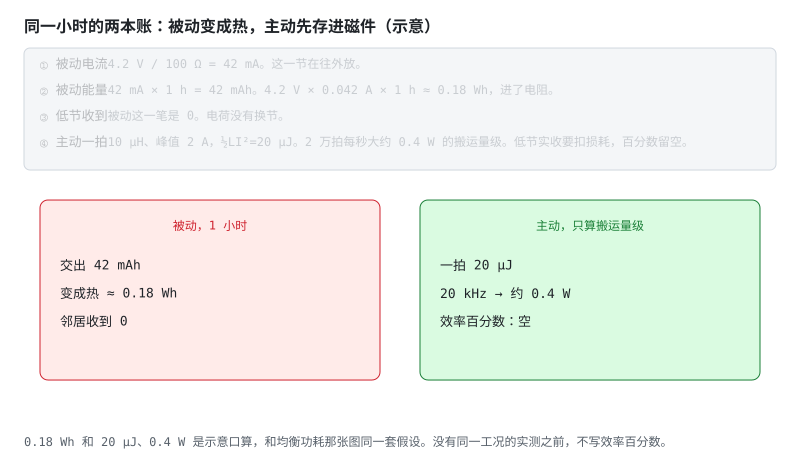

**不看动画版**：被动一行：交出 42 mAh，大约 0.18 Wh 变成热，邻居收到 0。主动一行：一拍 20 µJ，按示意 20 kHz 大约 0.4 W 的搬运量级。低节实收要扣开关和磁件，效率那一格是空的。

> **口诀**　被动的账能算到热。主动的账先算搬了多少，百分数先空着。

**看动画时盯住哪里**

- 左卡三行：毫安时、瓦时、邻居收到 0。
- 右卡三行：20 µJ、约 0.4 W、效率空。
- 黄点只在数字上闪，提醒你这是口算，不是功率计。

**短自测**

1. 42 mA 持续 1 小时，交出多少毫安时？
2. 20 kHz 乘 20 µJ，大约是多少瓦？
3. 右卡的空格应该填 Shang 的 94.5% 吗？

<b>参考答案（先自己想完再展开）</b>

1. 42 mAh。
2. 大约 0.4 W。20000 × 20e-6 = 0.4。这是搬运量级，不是效率。
3. 不该。那是另一台开关电容、另一个功率点。空表的规矩不变。

**练完你会怎样**：你能在没有效率百分数的时候，仍然把被动的热算出来。

三条能量动画的索引在 [电路动态分析](README.md#电路动态分析)。

> **原理**　电路简单到只有两样东西：**每串一个开关 + 一颗电阻**。电压高的串闭合开关，经电阻放电，能量变成热。
> **证据**　被动是电阻耗掉，主动是把能量搬走。定性对照 [MPS《主动均衡》](https://www.monolithicpower.com/en/learning/resources/active-balancing-how-it-works-and-its-advantages)（英文，可选，据厂商发布）。同一模型下的路径对比在 [§3.1](03-充电均衡与计量.md#31-同一模型下的拓扑对比-评价)。电感式和开关电容式的实测效率仍缺，见 [共建任务板](../共建任务板.md) T8。
> **延伸阅读**　[电感均衡拓扑综述](https://www.mdpi.com/2313-0105/11/2/77)（英文，可选）

## 3. 主动均衡：把水桶换成搬运工 [评价]

容量大了（几十 Ah 以上），"舀掉"太浪费也太慢，改成"搬运"：


> **动态**　初始态：高节偏高，电感里没有电流。扰动：第一拍把电感接到高节。中间态：电流在电感里上升，能量进了磁场。稳态：第二拍切到低节，磁场把电倒进去。开关和磁件仍有损耗。
> **口诀**　高节吸进电感，再倒给低节。搬走的不是百分百。

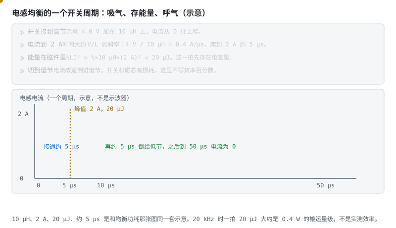

**不看动画版**：高节示意 4.0 V 加在 10 µH 上，电流约按 0.4 A/µs 爬，到 2 A 大约 5 µs。这一拍的能量是 ½LI² = 20 µJ。然后开关切到低节，电流倒进去。反激是同一拍：先存进磁件，再倒出去，只是磁件换成变压器、路径可以是节到包。这里仍不写效率百分数。

> **口诀**　先吸满，再倒出。能量先看 ½LI²，先别看百分数。

**看动画时盯住哪里**

- 电流三角形的上升沿：接通的大约 5 µs。
- 尖顶：2 A，旁边标着 20 µJ。
- 下降沿：切到低节，电流离开电感。

**短自测**

1. 10 µH 上加 4 V，电流每微秒大约增加多少？爬到 2 A 大约要多久？
2. 这一拍存了多少能量？
3. 能把 20 µJ 换成「效率 80%」吗？

<b>参考答案（先自己想完再展开）</b>

1. 大约 0.4 A/µs。2 / 0.4 = 5 µs。4 V / 10 µH = 4×10⁵ A/s。
2. 20 µJ。½ × 10×10⁻⁶ × 2²。
3. 不能。20 µJ 只是磁件里那一拍。损耗没测，百分数继续空着。

**练完你会怎样**：你能把「吸气」和「呼气」分成两拍，并算出尖顶上的那一笔能量。
> **错了会怎样**　把上一节右半的 0.4 W 写成效率百分数，选型时会把没测的损耗当成已经合格。

电感式的工作节拍：**第 1 拍**开关接到高电压电池，电感"吸气"把能量存进磁场；**第 2 拍**开关切到低电压电池，磁场"呼气"把能量倒进去。能量被搬走，开关和磁件仍有损耗。没有同一工况的实测之前，这里不写「效率 80%+」。路径对比在下一节。三种拓扑的定性差别：

| 拓扑 | 比喻 | 特点 |
|---|---|---|
| 电感式 | 搬水工人：从高桶舀一瓢倒进低桶 | 电流可做到安培级；电路与磁件复杂。效率要看 §3.1 的路径和实测，不写统一百分数 |
| 开关电容 | 接力水桶：电容在高桶装满、倒给低桶 | 器件少；逐级传递慢 |
| 反激式 | 小电梯：直接在各串与整包之间搬 | 任意串间转移；变压器多绕组复杂 |

选型直觉：消费/小储能 → 被动够用；大容量储能/高端车 → 电感式主动均衡（如 JK 主动均衡 BMS 的方案）。深入见 [学习路线 6.2](../bms-resources.md#62-算法精通)。

> **原理**　主动均衡把偏高那一节的能量搬到偏低的节，而不是在电阻上烧掉。路径不同，时间和损耗差很多。没有工况的效率百分数不能拿来选型。
> **证据**　定性对照 [MPS《主动均衡》](https://www.monolithicpower.com/en/learning/resources/active-balancing-how-it-works-and-its-advantages)（英文，可选，据厂商发布）。同一篇模型里的对比在 [§3.1](03-充电均衡与计量.md#31-同一模型下的拓扑对比-评价)。
> **延伸阅读**　[电感均衡拓扑综述](https://www.mdpi.com/2313-0105/11/2/77)（英文，可选）

### 3.1 同一模型下的拓扑对比 [评价]

上一节不写「效率 80%+」，是因为那句话没有串数、电流和测量条件。这里只收同一篇论文、同一套假设下能对上的结论。

Baronti、Roncella 与 Saletti 把均衡电路看成一台 DC/DC：能量从输入搬到输出，效率 η 和搬运速度是模型参数，不是某颗电感的实测。输入和输出可以是一节，也可以是整包。他们用随机抽出的不均衡做统计仿真，比较拉平要多久、损耗有多大。

| 路径 | 能量怎么走 | 这篇模型里能说的 |
|---|---|---|
| 被动 | 高的一节在电阻上耗掉 | 比较基准。损耗等于被扔掉的那一份 |
| 节到节 | 高节直接搬到低节 | 这组仿真里最快，也最省 |
| 节到包 | 高节把电送进整包 | 比节到节绕。论文没有给出可以抄进规格书的效率百分数 |
| 包到节 | 整包给低节补电 | 最差的一条。变换器效率低于 50% 时，耗掉的能量比被动还多 |
| 节与包双向 | 上面两条合成 | 落在中间。仍然不是实测效率表 |

「同一工况」在这里的意思是：不均衡的抽法相同，变换器共用一个效率和速度假设，再比谁先拉平、谁损耗大。摘要里没有「电感 92%、电容 80%」这种可以并列的百分数。不同论文、不同串数、不同电流的效率不要排进一张表。

MPS 的页面仍是厂商说明，只作上一节的定性。

2026-10-05 又找过「电感式和开关电容式、同一电流、同一串数」的实测。没有找到可以放进同一行的一对数字。最近的两篇各自成立，工况对不上：

| 来源 | 测的是什么 | 能引用的数 | 为什么不能和另一篇排成一行 |
|---|---|---|---|
| Shang 等，IEEE TPEL 2019（收稿日期 2017，DOI 2018） | 四节磷酸铁锂上的 delta 结构开关电容样机 | 25 kHz 时效率曲线更平：输出功率 0.31–1.90 W，效率超过 90%；峰值 94.5% 出现在输出 0.91 W。25–50 kHz 的 RMS 均衡电流 441–455 mA | 只有开关电容这一台。文中和既有均衡器的对照是元件和路径，没有同一电流下的电感效率 |
| Dai、Wei、Sun、Wang，IJEPES 67 (2015) 627–638 | 六节锰酸锂模组上的双电感均衡；能量从任意一节经放电母线送到模组 | 实验写的可接受效率是 86% | 串数是 6。摘要没有给出 0.91 W 或 441 mA。路径是节到模组，不是相邻节之间的电感和电容对打 |

仿真里用 SOC 账本算出来的「效率」接近 100%，那是模型记账，不是同一套功率表在时间窗里测到的能量比。那种数不进这张表。

以后若要补上 T8，测量按同一套条件做：串数取 4（两边文献各自有四节样机，对照点就落在这里）；I_bal 定义为时间窗内从高节流出的平均电流；两节的起始电压相同；η = 低节收到的能量 / 高节交出的能量，用同一套表、同一个时间窗；记下开关频率。0.91 W 的开关电容峰值，和六节模组上的 86%，仍然不能写成「电容 94.5%、电感 86%」。

同一工作点的空表先放在这里。格子先空着。左右要填，就得是同一次测量。

| 条件 | 电感式 | 开关电容式 |
|---|---|---|
| 串数 N | 4 | 4 |
| I_bal（时间窗内从高节流出的平均电流） |  |  |
| 起始电压对 |  |  |
| 开关频率 |  |  |
| 时间窗 |  |  |
| η = 低节收到的能量 / 高节交出的能量 |  |  |
| 来源（同一份测量记录） |  |  |

**收一行的标准。** 左右必须是同一次测量里的同一个串数、同一个 I_bal、同一对起始电压。这张表的串数已经写成 4，所以两边都只能是 4 串。η 用同一套表、同一个时间窗：低节收到的能量 / 高节交出的能量。缺任何一条，这一行留空。

**为什么论文数字不能填。** Shang 的 94.5% 是四节开关电容在输出 0.91 W 的峰值，旁边没有同一电流的电感；Dai 的 86% 是六节，路径是节到模组。两篇只在下面的证据行当参考文献，不进上面的空格。

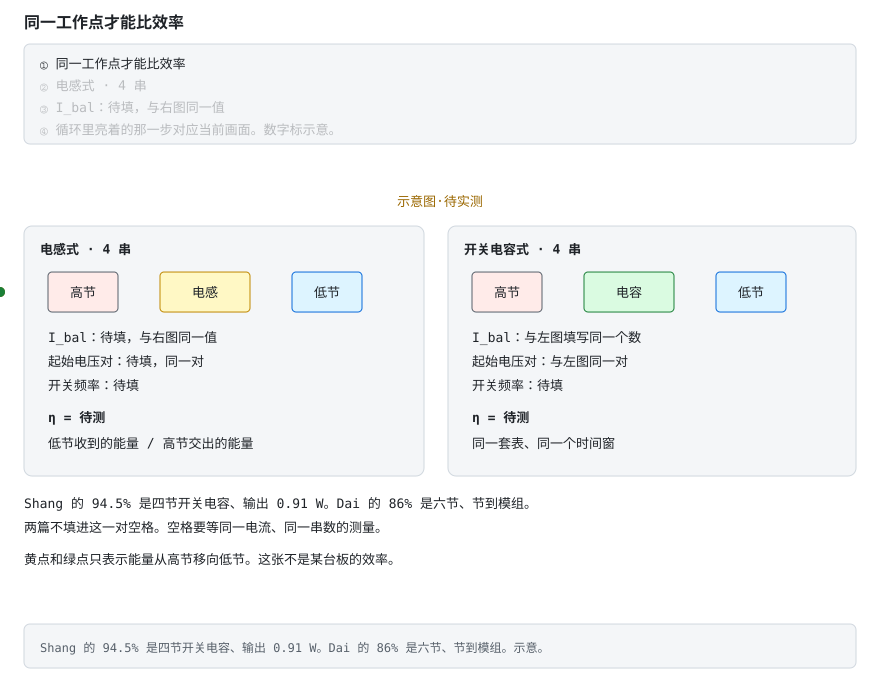

**不看动画版**：左格是 4 串电感，右格是 4 串开关电容。两边的 I_bal 和起始电压对都标着待填，而且必须填同一个数。η 两格都是待测。黄点和绿点只表示能量从高节移向低节。示意图·待实测。Shang 的峰值出现在输出 0.91 W，Dai 的 86% 是六节、节到模组，两篇不进这两格。

> **口诀**　串数和电流不同，百分数不能排成一行。

任务板 T8 是「欢迎读者贡献」。缺的是上面这张空表里的测量。没有电流的百分数先留在论文里。

**不看动画版**：四格分别是被动、节到节、节到包、包到节。节到节在这篇模型里最快最省；包到节在变换器效率低于 50% 时可以比被动更费。蓝点只表示电从高节移向低节。示意图，不是电路实拍，也不是某台板的效率。

> **口诀**　同一模型里才能比路径。效率低于 50% 的搬运可以比烧掉更费。

**故障分析**

- 把「主动」理解成任何路径都比被动省电。包到节在 η 低于 50% 时，模型里的损耗更大。
- 均衡很慢就加大电流，不先看是不是在用整包给一节补。
- 用主动均衡去补容量档或化学体系的差别。搬运搬不来没有的安时。错芯见 [阶段 6 §6.5.1](../stages/stage-6-精通与毕业项目.md#651-产线追溯错芯和贴错标-评价)。
- 把 Shang 的 94.5% 和 Dai 的 86% 写成电感与电容的高低。串数、功率和路径都不同。

**案例解析**（教学案例，对照的是这篇模型，不是某台产品的测试报告）

发生了什么：一组串联电芯里一节明显偏低。方案从被动分流改成整包给这一节补电。变换器效率没有按目标电流标定，口头按「主动所以在 80% 以上」理解。

信号：低节电压上升很慢；包里被搬走的电，多于「只把高节喂给低节」时的搬运。若这台变换器的效率掉到 50% 以下，Baronti 的模型说损耗会超过被动分流。

根因：选了模型里最差的那条路径，又把没有工况的效率口号当成这台变换器的效率。

BMS 上的教训：先写明路径是节到节、节到包还是包到节，再问这台变换器在目标电流下的效率从哪份 datasheet 或哪次测量来。效率未知时，不要用「主动」两个字替换热设计和时间预算。容量或电压窗口不在同一档的电芯，均衡不是纠正手段。

> **原理**　把均衡看成一台有损耗的 DC/DC 之后，路径决定时间和损耗。节到节直接搬；包到节要先经过整包，变换器效率低时可以比把电扔掉更费。
> **证据**　Baronti、Roncella、Saletti，[Journal of Power Sources 267 (2014) 603–609](https://doi.org/10.1016/j.jpowsour.2014.05.007)（英文，可选）：统计仿真中节到节最快也最省；包到节最差，变换器效率低于 50% 时损耗超过被动。η 是模型输入，不是他们测到的某一台电感的效率。开关电容样机见 Shang、Zhang、Cui 与 Mi，[《A Delta-Structured Switched-Capacitor Equalizer for Series-Connected Battery Strings》](https://doi.org/10.1109/TPEL.2018.2826010)，IEEE Transactions on Power Electronics, vol. 34, no. 1, 2019，起页 452（英文，可选）：四节，峰值 94.5% 在输出 0.91 W。作者公开稿是同一篇 DOI 的 PDF，约 8 MB，机房巡检在 20 秒内下不完，正文不再外链那个文件。双电感样机见 Dai 等，[IJEPES 2015](https://doi.org/10.1016/j.ijepes.2014.12.053)（英文，可选）：六节锰酸锂模组，实验效率 86%。两篇不构成同一工作点。
> **延伸阅读**　定性拓扑仍在本节上面。错芯不要靠均衡抹平，见 [阶段 6 §6.5.1](../stages/stage-6-精通与毕业项目.md#651-产线追溯错芯和贴错标-评价)。同一电流、同一串数的实测仍见 [任务板 T8](../共建任务板.md)。测量步骤写在本节。

## 4. 库仑计：剩多少电是怎么算出来的 [分析]

> **口诀**　安时一直在加。零漂会把油箱慢慢加歪，满充时拉回一次。

核心公式（约定充电 I>0）：

$$\text{SOC}(t) = \text{SOC}(0) + \frac{1}{Q}\int_0^t I\,d\tau$$

代码里就是 `SOC += I * dt / Q`。问题藏在"积"字上：**积分会把电流测量的零漂也一起积进去**——1mA 零漂，一天 24mAh，一个月下来显示值和真实值已经分道扬镳（动画里虚线与水位的分离）。

工程解法是给积分器**定期找参照物**：

- **满充校准**：CV 截止 → 必然 100%，复位（动画结尾的绿章）；
- **静置 OCV 校准**：长时间静置后电压可靠，查 OCV-SOC 表复位；
- **下电保存**：SOC 带 CRC 存 Flash，上电时用 OCV 交叉验证后决定采信谁。

更精细的做法（卡尔曼滤波把电压信息融入每一拍）见 [阶段 4 教程](../stages/stage-4-SOC-SOH算法.md)。

> **原理**　荷电状态由电流对时间的积分除以当前满充容量得到。没有满充或静置锚，零漂会让结果一直走。
> **证据**　安时积分没有绝对锚。可复现实验是仓库 `code/soc` 的 `compare.py`（CI 会跑）。模型背景见 [总纲关键论文](../bms-resources.md#关键论文主线背后的学术骨架) 的 Plett 2004。
> **延伸阅读**　[ECE5720 Notes03 中文导读](../ece5720-notes03-中文导读.md)（可选，原文英文）

阶段 4 把查表、局部容量和 dQ/dV 补成了三条曲线。自测在阶段 4，这里只留公式。

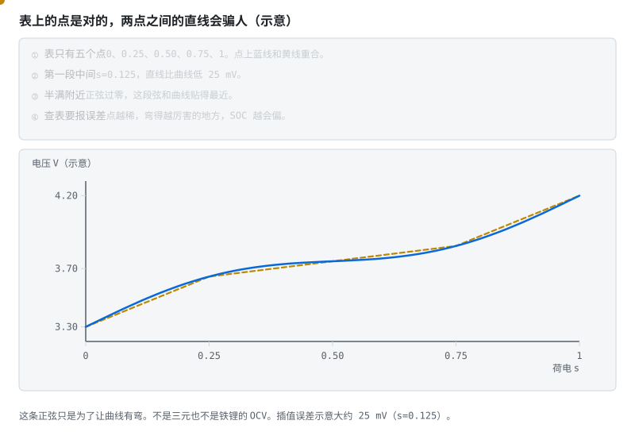

五个教学表点之间用直线。\(s=0.125\) 时直线比示意真曲线低大约 25 mV。真曲线是为了有弯而写的正弦，不是实测 OCV。

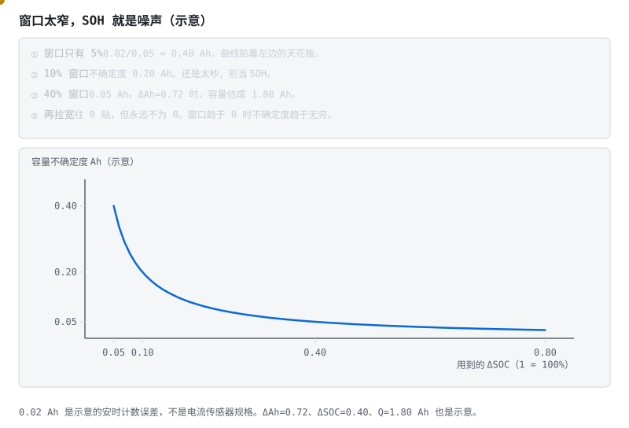

\(\sigma_Q=0.02/\Delta\mathrm{SOC}\) Ah。0.72 Ah / 0.40 = 1.80 Ah。窗口只有 5% 时，不确定度 0.40 Ah。

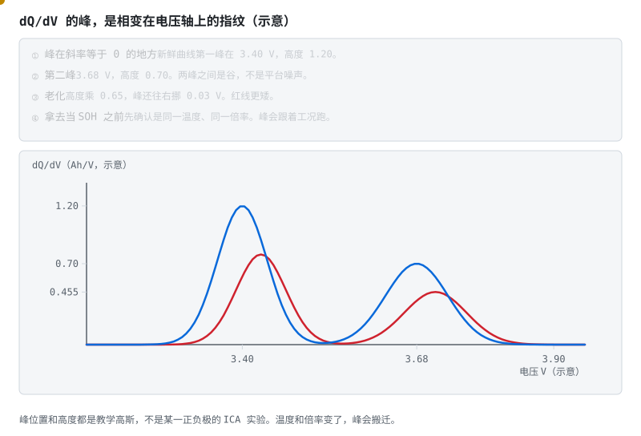

两座示意高斯峰在 3.40 V 和 3.68 V。老化示意成高度 ×0.65，再右移 0.03 V。不是某种化学的实测谱。

## 5. 自测 [分析]

> **先读/后读**：主层是 [分析]：均衡那笔热账，以及库仑计为什么会漂。

1. CV 段电流为什么会自然衰减？（从"电池自己吸"的角度答）
2. 均衡电阻是全板最热的元件之一，选型时按什么电压算功率？
3. 为什么被动均衡只在充电末端开？
4. 电感式主动均衡相比开关电容式强在哪？
5. 纯安时积分的误差为什么不收敛？两个校准点各自利用了什么物理事实？
6. 满充校准为什么用"CV 截止电流"而不是"电压到 4.2V"？

<b>参考答案（先自己想完再展开）</b>

1. CV 段充电器把端电压钉死在 4.2V 不动。充电电流由"设定电压与电池内部电动势之差"除以内阻决定：$I \approx (U_{\text{设定}} - U_{oc} - U_{\text{极化}}) / R_0$。随着电量灌进去，电池的 OCV 不断上升、越来越接近 4.2V，这个差值越来越小 → 电流自然越来越小，像快装满的水桶只能慢慢渗水。**没人去调小电流，是电池"吸不动了"**。电流衰减到截止值（0.05–0.1C）即判定真正充满。
2. 按**单体最高电压**算（不是标称电压）：$P = U_{max}^2 / R$，并在此基础上留 **2 倍余量**。因为均衡恰恰工作在充电末端——那正是单体电压最高的时刻（三元 4.2V、铁锂 3.65V），用标称电压算会低估功率。还要核算 PCB 散热（铜箔面积、放板边、远离 AFE 基准源以免热量带偏采样精度）以及多串同时均衡时的热叠加。
3. 三个理由。①**效果可见**：充电末端电压处于平台高端、OCV-SOC 曲线斜率较大，单体间的电压差才真实反映 SOC 差异；在中段平台区压差很小，均衡没有可靠判据，容易"均错人"（LFP 平台区尤其如此）。②**不浪费**：被动均衡把能量烧成热，在放电过程中做均衡等于一边放电一边扔电。③**条件配合**：充电末端电流小、电压稳定，便于在"关均衡 → 等稳定 → 采样"的时序里判断真实压差。
4. ①**速度与电流**：电感储能后以较大电流倒给目标电芯，均衡电流可做到安培级；开关电容靠电容在相邻串之间逐级传递，电流受限于电容容量与开关频率，相距较远的两串还要**逐级接力**，整体很慢。②**转移路径**：电感式（及反激式）可在指定的高压串与低压串之间直接搬运；开关电容的拓扑通常只在相邻串间转移。代价是电感式的电路与磁件更复杂、成本更高、EMC 更难做。这是定性差别。Baronti 等 2014 的模型比的是节到节、节到包、包到节。包到节在变换器效率低于 50% 时可以比被动更费。Shang 的 94.5%（四节、0.91 W）和 Dai 的 86%（六节、节到模组）不是同一工作点，不能排成「电容高于电感」（§3.1）。
5. 积分是**开环累加**：电流零漂每一拍都被加进去，误差随时间单调累积且没有回归机制（1mA 零漂 → 一天 24mAh → 10Ah 电池一个月漂约 7%）。**满充校准**利用"CV 段电流衰减到截止值时电池必然是满的"这个电化学事实；**静置 OCV 校准**利用"长时间静置后极化消散、端电压等于 OCV，而 OCV 与 SOC 单调对应"。两者都是**与积分历史无关的绝对参照物**。
6. 因为 CC 段末端的端电压 = $U_{oc} + IR_0 +$ 极化电压，充电电流越大、内阻越高（低温/老化）虚高成分越多。"电压碰到 4.2V"这一刻电池远没充满，撤流后电压会回落，用它校准会把 SOC **系统性标高**。而 CV 段电流衰减到 0.05–0.1C 意味着极化已基本松弛、内外接近平衡，这个"满"是电化学意义上的满，与电流/温度/老化的耦合小得多，是**可重复**的参照点。

**练完你会怎样**：你能说出电压到 4.2 V 只是进恒压，安时没有锚就会一直漂。同一工作点的均衡效率仍然空着，T8 不在这篇里关掉。

---

**上一篇**：[电路详解 ②：采样链与 AFE 芯片](02-采样链与AFE芯片.md) ｜ 返回 [目录](README.md)

> **原理**　这些题考的是上面几节的机制。先盖住折叠答案，用自己的话讲完再展开。
> **证据**　这些题考的是本篇前面几节的机制。对照 [瑞萨《BMS 教程》中文导读](../renesas-bms-tutorial-中文导读.md)。
> **延伸阅读**　[华之美 DW01A 数据手册](https://hmsemi.com/downfile/DW01A.PDF)
