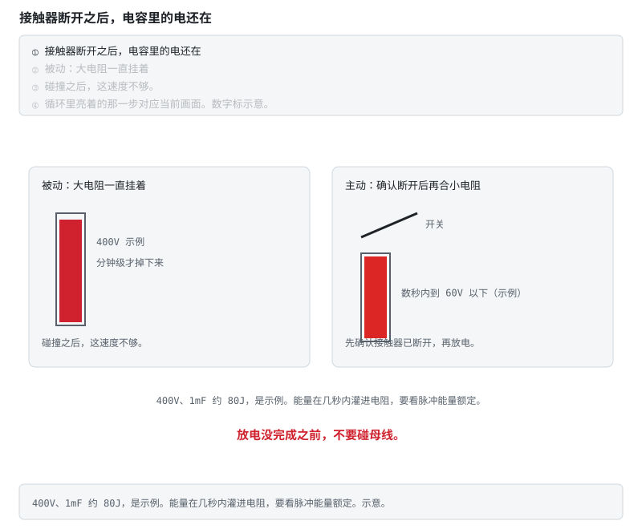
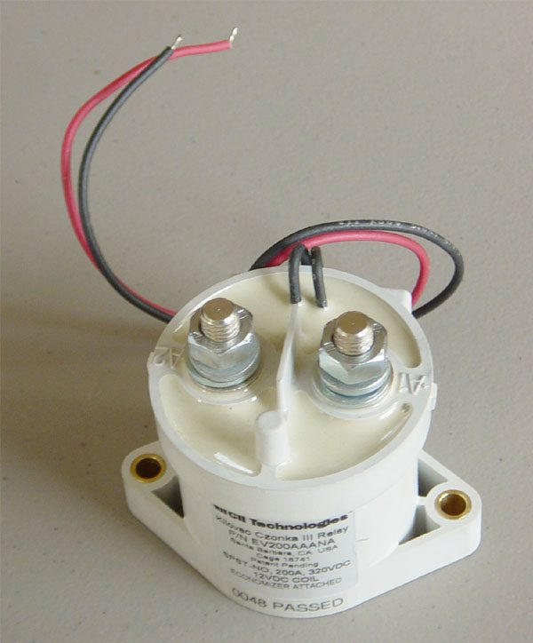
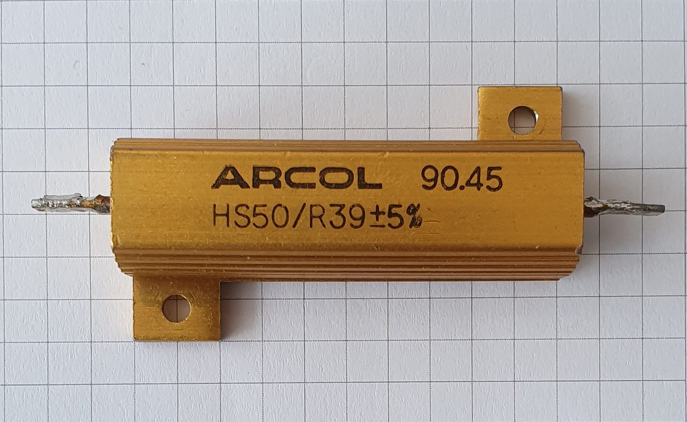
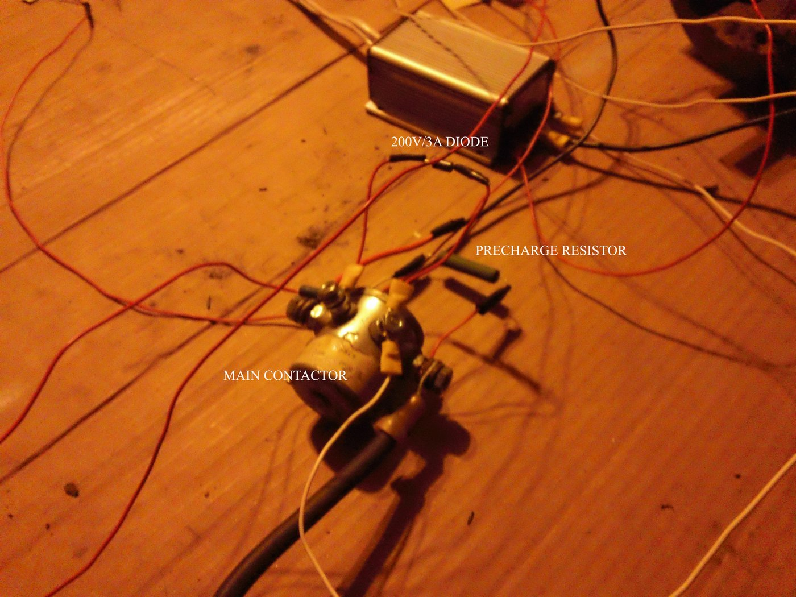
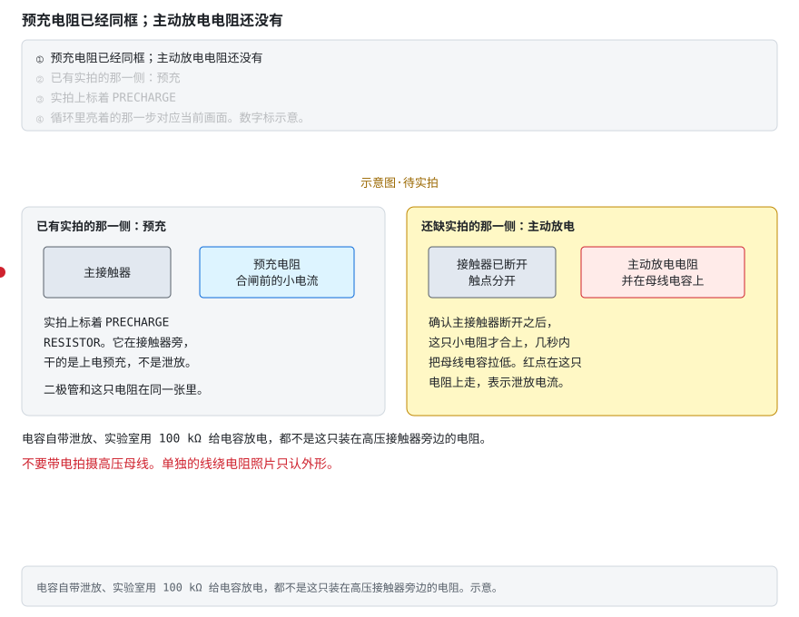
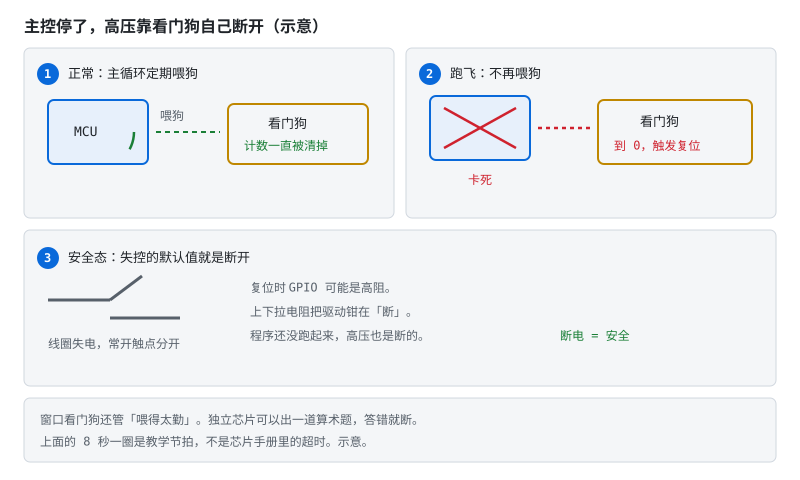
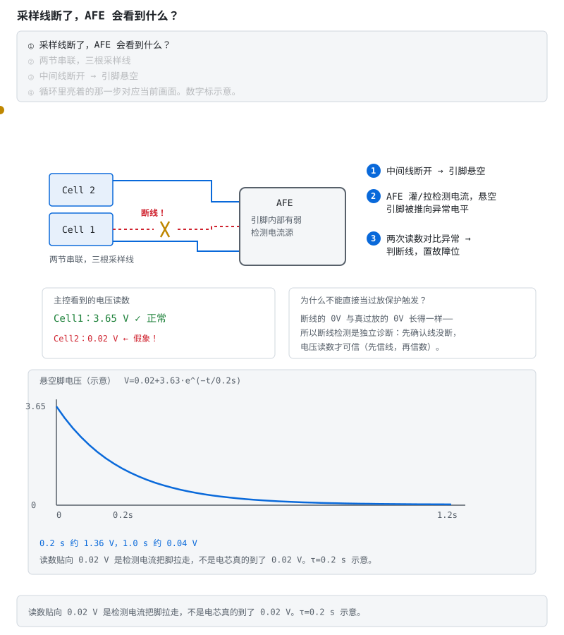

# ④ 系统安全与量产：高压互锁、接触器管理、功能安全与诊断追溯

> 前三篇详解讲"怎么工作"，这一篇讲"怎么不出事、出了事怎么知道、怎么证明"——从单板Demo走到量产车规，BMS 的主战场从功能转向安全。本文服务[阶段 6 精通与毕业项目](../stages/stage-6-精通与毕业项目.md)，并回收[阶段 5](../stages/stage-5-通信与集成.md)的诊断协议。

## 本页目录

按层走先看 [能力地图](../stages/bloom-map.md)。标题末尾的 `[记忆]` … `[创造]` 是布鲁姆层级。

- [④ 系统安全与量产：高压互锁、接触器管理、功能安全与诊断追溯](04-系统安全与量产.md#④-系统安全与量产高压互锁接触器管理功能安全与诊断追溯)
- [0. 参数速查 [记忆]](04-系统安全与量产.md#0-参数速查-记忆)
- [1. 高压安全三件套：HVIL、IMD、主动放电 [理解]](04-系统安全与量产.md#1-高压安全三件套hvilimd主动放电-理解)
  - [1.1 HVIL：一根低压线串起所有高压插头 [理解]](04-系统安全与量产.md#11-hvil一根低压线串起所有高压插头-理解)
  - [1.2 IMD 量产形态：外置监测器 [分析]](04-系统安全与量产.md#12-imd-量产形态外置监测器-分析)
  - [1.3 主动放电：碰撞后的 5 秒钟 [理解]](04-系统安全与量产.md#13-主动放电碰撞后的-5-秒钟-理解)
- [2. 接触器管理：高压回路的三只闸 [分析]](04-系统安全与量产.md#2-接触器管理高压回路的三只闸-分析)
  - [2.1 线圈驱动：吸合要狠，保持要省 [应用]](04-系统安全与量产.md#21-线圈驱动吸合要狠保持要省-应用)
  - [2.2 粘连检测：命令断了，电断没断？ [分析]](04-系统安全与量产.md#22-粘连检测命令断了电断没断-分析)
  - [2.3 不许带大电流分断 [评价]](04-系统安全与量产.md#23-不许带大电流分断-评价)
  - [2.4 上下电时序（汇总表） [应用]](04-系统安全与量产.md#24-上下电时序汇总表-应用)
- [3. 功能安全落地：ISO 26262 从纸面到电路 [评价]](04-系统安全与量产.md#3-功能安全落地iso-26262-从纸面到电路-评价)
  - [3.1 从 HARA 到技术方案：一个完整例子 [评价]](04-系统安全与量产.md#31-从-hara-到技术方案一个完整例子-评价)
  - [3.2 安全状态：设计"断电即安全" [评价]](04-系统安全与量产.md#32-安全状态设计断电即安全-评价)
  - [3.3 E-Gas 三层监控在 BMS 的映射 [分析]](04-系统安全与量产.md#33-e-gas-三层监控在-bms-的映射-分析)
  - [3.4 采样链的可信度：断线检测 [分析]](04-系统安全与量产.md#34-采样链的可信度断线检测-分析)
- [4. 诊断与量产：从实验室到产线 [应用]](04-系统安全与量产.md#4-诊断与量产从实验室到产线-应用)
  - [4.1 DTC 体系与快照 [应用]](04-系统安全与量产.md#41-dtc-体系与快照-应用)
  - [4.2 产线 EOL 测试：出厂前的最后一道筛 [评价]](04-系统安全与量产.md#42-产线-eol-测试出厂前的最后一道筛-评价)
  - [4.3 电芯筛选与追溯 [应用]](04-系统安全与量产.md#43-电芯筛选与追溯-应用)
- [5. 数据链路：一次碰撞后下电的完整信号流 [分析]](04-系统安全与量产.md#5-数据链路一次碰撞后下电的完整信号流-分析)
- [6. 失效模式速查 [分析]](04-系统安全与量产.md#6-失效模式速查-分析)
- [7. 边界与取舍 [评价]](04-系统安全与量产.md#7-边界与取舍-评价)

## 0. 参数速查 [记忆]

| 参数 | 典型值 | 出处/原因 |
|---|---|---|
| 安全电压分界 | 60V DC / 30V AC | GB/T 18384 B 级电压定义；人体接触安全阈值 |
| 碰撞后放电时限 | 工程上常按 5 s 内降到安全电压设计 | GB/T 18384 碰撞安全要求；主动放电电路由此而来 |
| HVIL 回路 | 低压直流环，串联全部高压接插件 | 机械状态监督：任何高压插头未插到位即断环 |
| 接触器保持电流 | 吸合的 30–50% | 线圈全压吸合后 PWM 降压保持，省功耗防过热 |
| 绝缘报警阈值 | 100 Ω/V 报警，500 Ω/V 注意 | GB/T 18384.1；400V 系统即 40 kΩ 报警线 |
| 看门狗超时 | 几十~几百 ms | 太短误复位，太长失控窗口大；窗口狗另管"喂太勤" |
| EOL 绝缘测试 | 产线必检，倍压限时 | 出厂前用绝缘电阻测试仪抽打 Y 电容与爬电距离 |

---

> **原理**　这张表把后文要用的数量级放在一处。数字仍是示例，设计以标准与 datasheet 为准。
> **证据**　表里的电压、电阻和秒数是示例。车规语境先对 [GB/T 38661 公开文本](https://openstd.samr.gov.cn/bzgk/std/newGbInfo?hcno=DB3ACC49AC4A146FAA311BB468ACA290) 与 [《车用 BMS 功能安全设计方法论》](https://www.mdpi.com/1996-1073/14/21/6942)（英文，可选）。
> **延伸阅读**　[ENNOID-BMS](https://github.com/EnnoidMe/ENNOID-BMS)（英文，可选）

## 1. 高压安全三件套：HVIL、IMD、主动放电 [理解]

> **先读/后读**：HVIL 和主动放电是 [理解]；§1.2 外置 IMD 是 [分析]。

三者管三种完全不同的风险，量产车上缺一不可：

| 装置 | 管什么 | 失效后果 |
|---|---|---|
| HVIL 高压互锁 | **物理连接**没到位/被拔开 | 带载插拔拉弧、裸露高压 |
| IMD 绝缘监测 | **电气隔离**退化（对地漏电） | 触电、跨接短路（阶段 6 §6.1.3 已详讲） |
| 主动放电 | **断电后残余能量** | 碰撞后/维修时母线电容带电伤人 |

> **原理**　HVIL 管插头是否插到位，IMD 管绝缘是否还在，主动放电管接触器断开后母线电容里的能量。三件事不能互相替代。
> **证据**　接触器断开后母线电容仍有能量。功能安全语境见 [《车用 BMS 功能安全设计方法论》](https://www.mdpi.com/1996-1073/14/21/6942)（英文，可选）。60V 与秒数是示例。
> **延伸阅读**　[ENNOID-BMS](https://github.com/EnnoidMe/ENNOID-BMS)（英文，可选）

### 1.1 HVIL：一根低压线串起所有高压插头 [理解]

HVIL 的精髓是"用低压监督高压"：一根 12V 回路穿过电池包每一个高压接插件的专用短针脚——插头插到位时短针脚接通回路，任何一个插头松脱，回路断开，BMS 在毫秒级内禁止上高压或直接跳接触器。断环之后的三步（环断开、接触器打开、母线掉下来）看 [阶段 6 的动画](../stages/stage-6-精通与毕业项目.md#611-高压电池系统架构-分析)，索引在 [电路动态分析](README.md#电路动态分析)。

设计细节：

- **针脚长度差**：HVIL 针脚比功率针脚短——拔插头时 HVIL 先断开，BMS 先断电，功率针脚后分离，从物理上消灭带载拉弧窗口；
- **检测方式**：恒流源+电压窗口判断，或电阻分压比对；回路自身断线/对地短路也要能区分（用两个不同电阻值编码"全闭合"与"异常"）；
- **去抖**：车辆颠簸会造成瞬时抖动，固件按阶段 2 §2.5 的去抖原则处理，但 HVIL 的去抖时间必须远短于人的插拔动作时间——几十 ms 级，不能像按键那样悠闲。

> **原理**　HVIL 的精髓是"用低压监督高压"：一根 12V 回路穿过电池包每一个高压接插件的专用短针脚——插头插到位时短针脚接通回路，任何一个插头松脱，回路断开，BMS 在毫秒级内禁止上高压或直接跳接触器。
> **证据**　低压环穿过高压插头，松脱要比人碰到端子更早切断。架构参考 [ENNOID-BMS](https://github.com/EnnoidMe/ENNOID-BMS)（英文，可选）。
> **延伸阅读**　[功能安全方法论](https://www.mdpi.com/1996-1073/14/21/6942)（英文，可选）

### 1.2 IMD 量产形态：外置监测器 [分析]

原理（桥式切换、低频注入）与多点失效分析见阶段 6 §6.1.3，不重复。量产上值得注意的是外置 IMD（如 Bender 系列）的接口形态：

- **输出是 PWM 占空比编码**：占空比落在不同区间分别表示"绝缘正常/退化/设备故障/自检中"——主控读占空比而非电压，天然带故障自报告；
- **周期性自检**：合格的监测器会定期自检并把"自检中"也编码出来，主控要识别该状态，避免把自检当报警；
- **与 Y 电容的相互妥协**：注入信号经 Y 电容耦合（阶段 6 §6.1.3），整车 EMC 设计与 IMD 灵敏度此消彼长，是系统级联调科目。

> **原理**　外置绝缘监测器给出电阻或报警电平。它的注入信号会经过 Y 电容，绝缘灵敏度和整车 EMC 要一起调。
> **证据**　外置监测器常用占空比或电平报告绝缘，自检状态不要当成漏电报警。过程见 [《车用 BMS 功能安全设计方法论》](https://www.mdpi.com/1996-1073/14/21/6942)（英文，可选），架构参考 [ENNOID-BMS](https://github.com/EnnoidMe/ENNOID-BMS)（英文，可选）。
> **延伸阅读**　[《车用 BMS 功能安全设计方法论》](https://www.mdpi.com/1996-1073/14/21/6942)（英文，可选）

### 1.3 主动放电：碰撞后的 5 秒钟 [理解]

母线电容（逆变器 DC-link，几百 µF ~ 几 mF）在接触器断开后仍存着 $E = \frac{1}{2}CU^2$ 的能量——400V、1mF 就是 80J，足以致命。GB/T 18384 的碰撞安全要求催生了主动放电：

- **被动放电**：并联泄放电阻常接，几十 kΩ，时间常数分钟级——平时够用，碰撞后不够快；
- **主动放电**：碰撞信号（安全气囊控制器广播）或下电指令触发，开关闭合接入小阻值放电电阻（或借用电机绕组/逆变器主动短路），目标几秒內把母线拉到 60V 以下；
- **BMS 的角色**：确认接触器已断（配合 §2.2 粘连检测）、监督放电过程、上报完成状态。放电电阻按脉冲功率选型——$E=\frac{1}{2}CU^2$ 全部热量在几秒内灌进电阻，连续功率额定值没意义，看脉冲能量额定。

**不看动画版**：被动泄放电阻一直挂着，电压掉得很慢；主动放电是确认接触器已经断开之后，用小电阻在几秒内把母线拉到安全电压以下。400V、1 mF、80 J、60 V 都是示例。放电没完成之前不要碰母线。

> **动态**　初始态：接触器合着，母线电容停在包压附近。扰动：下电或碰撞信号要求泄压。中间态：先确认触点已经分开，再把小电阻接到电容上，电压在数秒里往下掉。保护态：母线落到安全电压以下，并上报完成。触点还连着的时候，这只电阻停在断开。
> **口诀**　先确认接触器已经断开，再用小电阻把母线拉下来。

高压回路上的闸长这样：密封直流接触器，线圈和主触点分开。上传者注明这只是 Kilovac EV200 一类。不要带电拍摄母线。来源见 [照片来源](assets/photos/PHOTOS.md)。

预充电阻和主动放电电阻要能吃下一次脉冲能量。这张是 50 W 线绕电阻，用来认识外形，不是某台包里那只放电电阻，也没有和接触器同框。

同一张照片里，主接触器旁边接着预充电阻和一只二极管。上传者在画面上标了 MAIN CONTACTOR 和 PRECHARGE RESISTOR。这是预充回路，不是碰撞后那只主动放电电阻。主动放电电阻装在母线旁的实拍仍然没有。2026-10-05 又看过电源电容自带泄放，以及实验室里用 100 kΩ 给高压电容放电的照片，那是电容泄放，不是装在高压接触器旁边的主动放电电阻。见 [共建任务板](../共建任务板.md) T11。不要带电拍摄高压母线。来源见 [照片来源](assets/photos/PHOTOS.md)。

**不看动画版**：左半是已经有实拍的预充：主接触器旁的预充电阻，合闸前走小电流，画面上标的是 PRECHARGE RESISTOR。右半是还缺实拍的主动放电：接触器触点已经分开，小电阻并在母线电容上，确认断开之后才合上。红点在这只放电电阻上走。示意图·待实拍。电容自带泄放和实验室 100 kΩ 放电不是这只电阻。

> **口诀**　预充电阻在合闸前限流。主动放电电阻在断开后泄放。

**不看动画版**：上排是预充：电阻先通，母线爬到接近包压，再合主接触器。下排是主动放电：先确认触点已经分开，再投放电电阻，母线才掉下来。错序是接触器还合着就把放电电阻投上去。两只电阻不能换时间。示意图，不是实拍。不要带电碰母线。

> **动态**　上排是预充。初始态：电容空着，主闸打开。扰动：预充电阻接通。中间态：母线电压爬升。稳态：接近包压后合上主闸，预充退出。下排是主动放电。初始态：电容停在包压，主闸合着。扰动：下电或碰撞要求泄压。中间态：触点先分开。保护态：放电电阻投入，母线电压掉下来。
> **口诀**　预充在合主闸之前。主动放电在主闸打开之后。

两段过程的索引在 [电路动态分析](README.md#电路动态分析)。预充计算在 [详解① §3.2](01-功率回路-MOS保护与预充.md#32-解法与计算-应用)。

**视频**　YouTube · 英文，可选 · [E-T-A《高压接触器与旁路预充》](https://www.youtube.com/watch?v=Xy6EdcROX_M)

片子讲的是这家接触器自带的半导体旁路，用来在主触点动作前先把电流接上。不是所有电池包都这么做。教材里的电阻预充仍以详解①为准。

---

> **原理**　接触器断开后母线电容仍储存足以致命的能量。主动放电要在数秒内把电压降到安全值，BMS 负责确认接触器已断并监督放电完成。
> **证据**　接触器断开后母线电容仍有能量。功能安全语境见 [《车用 BMS 功能安全设计方法论》](https://www.mdpi.com/1996-1073/14/21/6942)（英文，可选）。上面的密封接触器和单独的线绕电阻是外形对照。同框那张是预充电阻，不是主动放电电阻。60V 与秒数是示例。
> **延伸阅读**　[ENNOID-BMS](https://github.com/EnnoidMe/ENNOID-BMS)（英文，可选）。电阻预充的计算在 [详解① §3.2](01-功率回路-MOS保护与预充.md#32-解法与计算-应用)。

## 2. 接触器管理：高压回路的三只闸 [分析]

> **先读/后读**：§2.1 驱动和 §2.4 时序是 [应用]；§2.3 不许带大电流分断是 [评价]；粘连检测是 [分析]。

详解①讲过预充时序（先主负→预充→主正），本篇深化接触器本身的管理。

> **原理**　详解①讲过预充时序（先主负→预充→主正），本篇深化接触器本身的管理。
> **证据**　预充、主正、主负是三只闸，合闸顺序错了就会打火。参考 [ENNOID-BMS](https://github.com/EnnoidMe/ENNOID-BMS)（英文，可选）。
> **延伸阅读**　[《车用 BMS 功能安全设计方法论》](https://www.mdpi.com/1996-1073/14/21/6942)（英文，可选）

### 2.1 线圈驱动：吸合要狠，保持要省 [应用]

电磁接触器的吸力特性：衔铁张开时气隙大、磁阻大，需要全额定电压产生足够吸力；吸合后气隙为零，很小的电流就能保持。于是：

- **吸合**：满电压几十~上百 ms；
- **保持**：PWM 降压到额定值的一半左右，线圈功耗降到约 1/4——四只接触器常吸合的 pack，省下的功耗与线圈温升相当可观；
- **代价**：PWM 频率避开可闻频段（>20kHz），否则线圈唱歌；续流回路按详解① §1.1 处理。

> **原理**　衔铁吸合前气隙大，线圈要全压；吸合后很小的电流就能保持。所以先全压吸合，再用 PWM 降低保持电流。
> **证据**　吸合要全压，保持可以降电流。线圈断电必须等于触点断开，否则就是粘连。参考 [ENNOID-BMS](https://github.com/EnnoidMe/ENNOID-BMS)（英文，可选）。
> **延伸阅读**　[《车用 BMS 功能安全设计方法论》](https://www.mdpi.com/1996-1073/14/21/6942)（英文，可选）

### 2.2 粘连检测：命令断了，电断没断？ [分析]

大电流分断时的电弧可能把触点熔焊在一起——线圈断电了，触点却没分开。这是"以为没电其实带电"的维修触电之源，所以每次下电必须验证：

**不看动画版**：命令断开后等触点稳定，读负载侧电压——正常应掉到零；若仍接近 pack 电压，即粘连，锁故障、禁止再上电、亮维修灯。判据要注意 Y 电容/预充回路造成的残压：负载侧电压会缓慢衰减，判"粘连"要给足衰减时间或用双电压交叉（电池侧 vs 负载侧同时采样比较）。

> **动态**　初始态：负载侧电压停在包压附近，线圈吸合。扰动：下电命令让线圈断电。中间态：正常侧触点分开，电压从包压往下掉；粘连侧触点仍连着，电压停住。保护态：正常侧掉到 0，高压已经隔开；粘连侧仍停在包压附近，锁故障，禁止再上电。图上 400 V、40 V、398 V 是示例，残压要等衰减窗口。
> **口诀**　命令已经断开，负载侧电压还不掉，就是粘连。

> **原理**　触点可能熔焊，线圈断电不代表电路已断。每次下电都要看负载侧电压是否掉下去，没掉就锁故障，禁止再上高压。
> **证据**　线圈断电不代表触点分开。每次下电读负载侧电压。安全目标的写法见 [功能安全方法论](https://www.mdpi.com/1996-1073/14/21/6942)（英文，可选）。
> **延伸阅读**　[阶段 6](../stages/stage-6-精通与毕业项目.md)

### 2.3 不许带大电流分断 [评价]

接触器 datasheet 的分断能力是按次数标定的：带 200A 分断可能只保证几十次寿命，带短路电流分断一次就可能粘连。因此时序纪律：

1. **正常下电**：先通过 CAN 请求用电器/充电机把电流降到接近零 → 再断接触器（"先卸货，再拉闸"）；
2. **故障下电**：过流/短路保护必须立即断——这是消耗接触器寿命换安全，事后按粘连检测确认状态并记录事件；
3. **灭弧手段**：高压直流接触器普遍用陶瓷密封+充气（氢气）灭弧腔+磁吹——选型看额定电压（直流电弧比交流难灭，过零救不了直流）、分断电流、短路耐受。

> **原理**　接触器的大电流分断次数是有限的。正常下电要先把电流降下来再分断，短路分断留给熔断器和最后一级保护。
> **证据**　带大电流拉开触点会拉弧，弧光把触点焊住。分断前先把电流降下来。参考 [ENNOID-BMS](https://github.com/EnnoidMe/ENNOID-BMS)（英文，可选）。
> **延伸阅读**　[《车用 BMS 功能安全设计方法论》](https://www.mdpi.com/1996-1073/14/21/6942)（英文，可选）

### 2.4 上下电时序（汇总表） [应用]

> **先读/后读**：表是 [记忆]；照这张表安排吸合顺序是 [应用]。先别跳步合主闸。

| 步骤 | 上电 | 下电 |
|---|---|---|
| 1 | 自检：IMD/HVIL/粘连检测（上次下电遗留） | 请求用电器降流 |
| 2 | 闭主负 | 电流≈0 确认 |
| 3 | 闭预充，监测母线电压上升斜率 | 断主正 |
| 4 | 母线≈pack（90–95%）→ 闭主正 | 断主负 |
| 5 | 断预充，进入运行态 | 主动放电 → 粘连检测 → 记录 |

任一步超时/超差即中止并回退到安全态（§3.2）。

---

> **原理**　任一步超时/超差即中止并回退到安全态（§3.2）。
> **证据**　入口 [《车用 BMS 功能安全设计方法论》](https://www.mdpi.com/1996-1073/14/21/6942)（英文，可选）与 [ENNOID-BMS](https://github.com/EnnoidMe/ENNOID-BMS)（英文，可选）。
> **延伸阅读**　[GB/T 38661 公开文本](https://openstd.samr.gov.cn/bzgk/std/newGbInfo?hcno=DB3ACC49AC4A146FAA311BB468ACA290)

## 3. 功能安全落地：ISO 26262 从纸面到电路 [评价]

> **先读/后读**：§3.1、§3.2 是 [评价]（安全目标与安全状态）；§3.3、§3.4 是 [分析]。

阶段 6 §6.2 给了标准地图与 ASIL 分级，这里落到电路与固件的三个抓手。

> **原理**　阶段 6 §6.2 给了标准地图与 ASIL 分级，这里落到电路与固件的三个抓手。
> **证据**　从危害到独立关断，再用失效注入证明。方法论文：[MDPI Energies 2021](https://www.mdpi.com/1996-1073/14/21/6942)（英文，可选）。
> **延伸阅读**　[《车用 BMS 功能安全设计方法论》](https://www.mdpi.com/1996-1073/14/21/6942)（英文，可选）

### 3.1 从 HARA 到技术方案：一个完整例子 [评价]

以"非预期输出高压"为例走一遍链条：

1. **危害分析**：维修人员接触带电母线 → 可能致命；
2. **ASIL 定级**：暴露率/可控性/严重度组合 → 此类危害通常定到 ASIL C/D 区间；
3. **安全目标**：非授权状态下高压不得出现在接插件端子；
4. **技术安全需求**（分解到硬件+固件）：
   - 接触器线圈驱动采用常开触点，失电即断开（fail-safe 的物理基础）；
   - HVIL 串联监督所有接插件（§1.1）；
   - 粘连检测每次下电执行（§2.2）；
   - 主控监控层独立于功能层（§3.3）。

> **原理**　以非预期输出高压为例：先写危害和安全目标，再落到独立于软件的关断，并用失效注入证明这条通路在软件失效时仍成立。
> **证据**　入口 [《车用 BMS 功能安全设计方法论》](https://www.mdpi.com/1996-1073/14/21/6942)（英文，可选）与 [ENNOID-BMS](https://github.com/EnnoidMe/ENNOID-BMS)（英文，可选）。
> **延伸阅读**　[《车用 BMS 功能安全设计方法论》](https://www.mdpi.com/1996-1073/14/21/6942)（英文，可选）。开线被当成过充的走法在 [阶段 6 §6.4.1](../stages/stage-6-精通与毕业项目.md#641-过充案例开线被当成过充-评价)。

### 3.2 安全状态：设计"断电即安全" [评价]

安全状态不是软件里的一行 `state = SAFE`，而是**物理默认态**：软件死机、MCU 复位、GPIO 高阻、程序没跑起来——任何情况下高压都必须默认断开：

**不看动画版**：主控正常时定期喂狗；跑飞后看门狗倒计时归零触发复位。关键在于驱动级用上下拉电阻把 GPIO 失控态钳在"断"位——接触器线圈是常开触点，失电即断。安全不靠软件靠谱，靠断电即安全。进阶的窗口看门狗还管"喂得太勤"（程序卡在循环里乱喂也算跑飞）；E-Gas 三层监控里甚至有独立芯片向 MCU 出算术题（问答式看门狗），答错就切断输出。

> **口诀**　不再喂狗就要复位。失控的引脚必须等于断开。

> **原理**　安全状态是物理默认态。MCU 复位或 GPIO 高阻时，上下拉把线圈驱动钳在断开，常开触点失电即断。
> **证据**　可核验演示：本节 SVG（浏览器打开即播），正文有不看动画也能读的说明。失控时的默认输出必须是断开高压，而不是保持上一拍。过程见 [《车用 BMS 功能安全设计方法论》](https://www.mdpi.com/1996-1073/14/21/6942)（英文，可选）。
> **延伸阅读**　[foxBMS 2](https://github.com/foxBMS/foxbms-2)（英文，可选）

### 3.3 E-Gas 三层监控在 BMS 的映射 [分析]

| 层 | 职责 | BMS 实例 |
|---|---|---|
| Level 1 功能层 | 正常功能 | 主 AFE 采样、SOC 算法、均衡控制 |
| Level 2 监控层 | 监督功能层输出合理性 | 冗余比较：软件阈值复核、双通道采样交叉校验、问答式看门狗 |
| Level 3 硬件层 | 独立硬件兜底 | 二级保护芯片（阶段 3 §3.3）：独立比较器直接驱动保险丝/接触器，不经过主控软件 |

三级保护的精髓是**独立性**：Level 3 不参与软件的任何假设——软件全错了它也能切断。这就是阶段 3 §3.3 说的"最后一道保险，永远有效"。

> **原理**　三级保护的精髓是**独立性**：Level 3 不参与软件的任何假设——软件全错了它也能切断。这就是阶段 3 §3.3 说的"最后一道保险，永远有效"。
> **证据**　多层监控是为了软件死掉时硬件仍能切断。过程见 [《车用 BMS 功能安全设计方法论》](https://www.mdpi.com/1996-1073/14/21/6942)（英文，可选）。
> **延伸阅读**　[foxBMS 2](https://github.com/foxBMS/foxbms-2)（英文，可选）

### 3.4 采样链的可信度：断线检测 [分析]

所有保护都建立在"电压读数是真的"之上。采样线断开时，AFE 引脚悬空，读数可能是 0V、满量程或随机值——**和真实过放的 0V 无法区分**：

**不看动画版**：AFE 利用引脚内部的弱检测电流源——断线时电流把悬空引脚推向异常电平，与正常闭合时的读数对比即可识别断线，置故障位。原则：**先信线，再信数**——断线检测通过之前，一切基于电压的保护结论都存疑。

> **口诀**　先信线还在，再信这串电压。0 mV 可以是断线。

---

> **原理**　保护结论建立在电压读数可信上。采样线断开时读数可以像过放，所以先确认开线检测通过，再相信这串电压。
> **证据**　可核验演示：本节 SVG（浏览器打开即播）。断线时检测电流把悬空脚推向异常电平，和真过放的 0V 不是同一件事。芯片族入口 [TI 储能 BMS 方案](https://www.ti.com.cn/solution/zh-cn/ess-battery-management-system-bms)（中文）。
> **延伸阅读**　[详解②](../circuits/02-采样链与AFE芯片.md)

## 4. 诊断与量产：从实验室到产线 [应用]

> **先读/后读**：§4.2 产线放行是 [评价]；DTC 和追溯是 [应用]。

> **原理**　实验室里能复现的故障，到产线要变成 DTC、快照和出厂测试项。否则现场只能看见一个故障码。
> **证据**　诊断是为了知道哪条保护结论还可信。过程见 [《车用 BMS 功能安全设计方法论》](https://www.mdpi.com/1996-1073/14/21/6942)（英文，可选）。
> **延伸阅读**　[《车用 BMS 功能安全设计方法论》](https://www.mdpi.com/1996-1073/14/21/6942)（英文，可选）

### 4.1 DTC 体系与快照 [应用]

阶段 5 §5.5 已讲 UDS 诊断服务与 DTC 快照（配套动画 dtc-snapshot）。量产补充两点：

- **老化计数与解闭锁**：关键 DTC（绝缘、粘连）置位后即使条件恢复也不能自动清除——需要维修确认后用诊断仪清除，防止故障被"颠簸没了"掩盖；
- **快照进闪存**：快照帧（电压/电流/温度/SOC/里程）写入 EEPROM/Flash，断电不丢——事故分析的黑匣子。

> **原理**　DTC 要带上触发瞬间的电压、电流和温度。没有快照，产线知道报了哪条码，不知道当时电池处于什么工况。
> **证据**　越线的那一瞬间要把电压、电流、温度和 SOC 冻住。结构可对照 [foxBMS 2](https://github.com/foxBMS/foxbms-2)（英文，可选）。
> **延伸阅读**　[《车用 BMS 功能安全设计方法论》](https://www.mdpi.com/1996-1073/14/21/6942)（英文，可选）。PC 上的快照回放在 [阶段 6 §6.2.5](../stages/stage-6-精通与毕业项目.md#625-故障注入与快照回放-应用)。

### 4.2 产线 EOL 测试：出厂前的最后一道筛 [评价]

| 测试项 | 方法 | 筛掉什么 |
|---|---|---|
| 绝缘电阻 | 兆欧表/绝缘测试仪倍压限时 | Y 电容失效、爬电距离不足、装配异物 |
| 接触器动作 | 逐只吸合/断开+母线电压验证 | 线圈虚焊、触点装反、粘连出厂缺陷 |
| 采样校准 | 标准源三点校准写入校准系数 | AFE 增益/偏移离散性 |
| 通信与诊断 | 全 DTC 遍历+UDS 服务扫描 | 固件版本错、诊断路由错 |
| 均衡功能 | 强制均衡命令+电流实测 | 均衡电阻虚焊、驱动故障 |

> **原理**　出厂测试用标准源和绝缘仪把增益、绝缘、接触器动作和均衡电流筛一遍。任一项超差就不出厂。
> **证据**　产线要能重复触发保护并留下记录。可复现的模拟方法见 [EEVblog 电芯模拟器讨论](https://www.eevblog.com/forum/projects/lithium-battery-cell-simulatoremulator-for-bms-testing/)。阈值仍以 datasheet 为准。
> **延伸阅读**　[《车用 BMS 功能安全设计方法论》](https://www.mdpi.com/1996-1073/14/21/6942)（英文，可选）。错芯和贴错标的案例在 [阶段 6 §6.5.1](../stages/stage-6-精通与毕业项目.md#651-产线追溯错芯和贴错标-评价)。

### 4.3 电芯筛选与追溯 [应用]

- **K 值分选**：化成之后把电芯静置，用开路电压下降的快慢（K 值）分档。同包里有的电芯偷偷掉电压，均衡只能长期补，补不齐微短路。单位要写明时间窗：产线论文里常见 mV/h，口头也有人说 mV/天，两条数字不能直接对比；
- **追溯链**：pack 序列号 ↔ 模组批次 ↔ 电芯批次 ↔ 产线测试数据，写入 BMS 的 DID（阶段 5 §5.5），售后可按 DID 读出全链信息；
- **OTA 闭环**：车云协同（阶段 6 §6.1.7）回传的运行数据反过来修正筛选阈值与 SOH 模型——量产不是终点，是数据飞轮的起点。

---

> **原理**　K 值是静置期间开路电压掉得有多快。金属屑造成的微短路会让个别电芯掉得特别快，容量和内阻筛选看不出来。同包 K 值差得大，均衡只能补救，不能从根上对齐。
> **证据**　张赫坤、孔祥栋、欧阳明高等把 K 值写成开路电压下降速率，用来在产线上筛金属异物。文中 Figure 4 把该中试线的传统固定上限画成 **0.0239 mV/h**。这是一条产线的经验界，不是电芯 datasheet 的通用红线，也不能直接写成「每天多少毫伏」。开放获取：[Batteries 2023, 9, 346](https://doi.org/10.3390/batteries9070346)（英文）。追溯链本身见阶段 5 的 DID 讨论。
> **延伸阅读**　厂商网页上的「小于 2 mV/天」没有对上电芯厂原文，这里不采用。若你有可点击的厂内规范，按共建任务板的方式补进来，并写明静置多久。错芯不要靠均衡抹平，见 [阶段 6 §6.5.1](../stages/stage-6-精通与毕业项目.md#651-产线追溯错芯和贴错标-评价)。

## 5. 数据链路：一次碰撞后下电的完整信号流 [分析]

| 环节 | 数值示例 | 单位/状态 |
|---|---|---|
| 碰撞信号 | CAN 广播 + 硬线双通道 | 事件触发 |
| 接触器断开 | 主正/主负同时断 | < 10 ms |
| 主动放电 | 400V → <60V | 目标 ≤ 5 s |
| 粘连检测 | 负载侧电压 vs 阈值 | 通过/锁故障 |
| IMD 复测 | 碰撞可能造成绝缘破损 | Ω/V 阈值 |
| DTC+快照 | 写入闪存 | 维修可读 |
| 云端上报 | 车云通道 | 售后联动 |

> **原理**　碰撞后下电是一条固定的信号链：硬线或 CAN 触发，接触器断开，主动放电，粘连和绝缘复测，最后把快照留下。
> **证据**　入口 [《车用 BMS 功能安全设计方法论》](https://www.mdpi.com/1996-1073/14/21/6942)（英文，可选）与 [ENNOID-BMS](https://github.com/EnnoidMe/ENNOID-BMS)（英文，可选）。
> **延伸阅读**　[GB/T 38661 公开文本](https://openstd.samr.gov.cn/bzgk/std/newGbInfo?hcno=DB3ACC49AC4A146FAA311BB468ACA290)

## 6. 失效模式速查 [分析]

| 现象 | 嫌疑 | 验证 |
|---|---|---|
| 无法上高压 | HVIL 断环/粘连检测锁存/IMD 报警 | 依次读三个故障位，先查 HVIL（最常见：插头没插到位） |
| 下电后母线仍有电压 | 主动放电失效/接触器粘连 | 粘连检测记录 + 放电回路电阻实测 |
| 绝缘报警时有时无 | 潮湿冷凝（阶段 6 §6.1.3 多点失效） | 烘干复测；查冷却液泄漏 |
| 看门狗频繁复位 | 任务超时/中断风暴/堆栈溢出 | 复位原因寄存器 + 快照电流工况 |
| 单体电压偶发 0V | 采样线断线（非真过放！） | 断线检测位 + 线束摇晃复现 |
| 接触器线圈过热 | 未用 PWM 保持，全压常吸 | 测线圈电压波形 |

> **原理**　现场现象先对到 HVIL、粘连、绝缘、看门狗或采样断线里的一种，再决定测插头、测母线电压还是摇线束。
> **证据**　失效模式要能对上检测手段，对不上的就还是盲区。过程见 [《车用 BMS 功能安全设计方法论》](https://www.mdpi.com/1996-1073/14/21/6942)（英文，可选）。
> **延伸阅读**　[ENNOID-BMS](https://github.com/EnnoidMe/ENNOID-BMS)（英文，可选）

## 7. 边界与取舍 [评价]

- **HVIL 去抖 vs 响应速度**：几十 ms 的去抖窗口内插头处于半插状态——靠针脚长度差兜底，软件去抖只是第二道；
- **主动放电速度 vs 电阻体积**：放得快就要小电阻大功率，体积与成本直线上升——5 s 是安全与工程妥协的甜点位；
- **粘连检测的残压干扰**：判据窗口太窄会误判（残压未衰完），太宽会漏判（部分粘连）——量产标定项，用 Y 电容参数算衰减曲线定窗口；
- **二级保护的成本**：独立比较器方案每 pack 增加几美元——低速车可以省，乘用车不能省；
- **E-Gas 全套 vs 裁剪**：功能安全不是全有或全无——ASIL 定级低的子系统允许裁剪监控层级，但裁剪必须写进安全分析报告，不能"忘了做"；
- **本库边界**：以上测试均为文档与代码层面的工程描述，不构成功能安全认证证据；真车认证需按 ISO 26262 流程由有资质的机构执行。

---

返回 [电路详解索引](README.md) | 上一篇 [③ 充电、均衡与计量](03-充电均衡与计量.md) | 配套 [阶段 6 精通与毕业项目](../stages/stage-6-精通与毕业项目.md)

> **原理**　去抖窗口、检测阈值和认证边界都是在漏报与误报之间取舍。用到车上的数字以标准和 datasheet 为准，本文不构成认证证据。
> **证据**　这篇覆盖的是 BMS 自己的安全相关行为，冷却回路和整车其余控制器另有主人。过程见 [《车用 BMS 功能安全设计方法论》](https://www.mdpi.com/1996-1073/14/21/6942)（英文，可选）。
> **延伸阅读**　[GB/T 38661 公开文本](https://openstd.samr.gov.cn/bzgk/std/newGbInfo?hcno=DB3ACC49AC4A146FAA311BB468ACA290)
