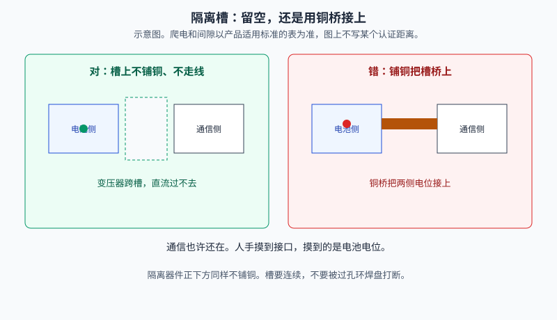

# ⑤ BMS 电路板绘制与设计要点

> **本篇你会学到**　分区、采样、栅极回流、均衡电阻的热、隔离槽，装配一端的线束、连接器与扭矩。对着 Gerber 和实物都能检查的句子。
> **预计用时**　随阶段 3 §3.6 精读。
> **前置**　阶段 3 的五条纪律。时间过程在 [电路动态分析](README.md#电路动态分析)。
> **一句话**　原理图答「对不对」，电路板答「行不行」——同一张图，画歪一步就不行。

> **先读/后读**：阶段 3 §3.6 的五条是目录。这一篇把分区、走线、热、地和隔离净空写成能对着 Gerber 检查的句子。层级以 [应用] 为主。
> 下面的电压、电阻、毫欧和毫伏都是**示例**。爬电和间隙不在这里抄一张认证表，投板前用产品适用的标准核对。
> 示意图上的数字是示例。不要带电测量高压母线。
> 时间过程（预充、短路、放电、互锁、均衡、扫描、粘连）在 [电路动态分析](README.md#电路动态分析)。这一篇写走线怎样把那些过程做坏。

## 本页目录

- [1. 分区：高压功率、采样、数字、隔离通信 [应用]](05-BMS电路板绘制与设计要点.md#1-分区高压功率采样数字隔离通信-应用)
- [2. 采样线 [应用]](05-BMS电路板绘制与设计要点.md#2-采样线-应用)
- [3. 功率回路 [应用]](05-BMS电路板绘制与设计要点.md#3-功率回路-应用)
- [4. 均衡电阻 [应用]](05-BMS电路板绘制与设计要点.md#4-均衡电阻-应用)
- [5. 地与隔离净空 [应用]](05-BMS电路板绘制与设计要点.md#5-地与隔离净空-应用)
- [6. ESD 与爬电间隙 [应用]](05-BMS电路板绘制与设计要点.md#6-esd-与爬电间隙-应用)
- [7. 线束、连接器与装配 [应用]](05-BMS电路板绘制与设计要点.md#7-线束连接器与装配-应用)
- [8. 五张对照 [理解]](05-BMS电路板绘制与设计要点.md#8-五张对照-理解)
- [9. 投板前检查表 [应用]](05-BMS电路板绘制与设计要点.md#9-投板前检查表-应用)
- [10. 自测 [理解]](05-BMS电路板绘制与设计要点.md#10-自测-理解)

## 1. 分区：高压功率、采样、数字、隔离通信 [应用]

一块 BMS 板先画四块，再谈线宽。

| 区 | 放什么 | 不放什么 |
|---|---|---|
| 高压功率 | 接触器驱动的功率铜、MOS、分流器、预充电阻 | 基准源、MCU 晶振 |
| 采样 | 电芯抽头、RC、分压、开尔文线 | 与功率回流平行的长距离并走 |
| 数字 | MCU、晶振、去耦 | 均衡电阻、功率过孔阵列 |
| 隔离通信 | 变压器或隔离器的另一侧、连接器 | 跨过隔离槽的铜皮和普通走线 |

四块之间用槽或净空分开。功率铜可以很粗，它不该从采样区和基准下面穿过去。

> **口诀**　先分区，再走线。功率、采样、数字、隔离各住各的。
> **错了会怎样**　功率铜从基准底下穿过，电流一变，整板的电压读数一起跳。

四块怎么住，看下面五张对照，不必再画一张总图。[电路动态分析](README.md#电路动态分析) 里的七个过程，都假定这四块还分开。

## 2. 采样线 [应用]

采样线成对紧贴、等长，离开功率回流。分压电阻放在接插件附近，长线只走已经分完、阻抗较低的那一侧。开尔文线从分流器本体引出，不从螺丝端子引出。

> **图说**　左边采样成对走在远离粗铜的位置，读数停在 3.712 V。

> **口诀**　采样线成对紧贴，远离大电流。
> **错了会怎样**　噪声进了毫伏到几十毫伏，均衡和保护会对着假的压差动作。

**看动画时盯住哪里**

右边采样贴着功率铜，读数在 3.65 V 和 3.78 V 之间跳。这是示意图上的数量级，不是某块板的频谱。

**练完你会怎样**：你能用上面那句口诀，把这张图讲给别人听。

> **图说**　示例取 100 A、分流器 0.5 mΩ，本体压降 50 mV。

> **口诀**　电流走功率端子，电压从本体另取一对。
> **算一笔**　多出来的电流 = 引线压降 / 分流电阻 = 40 mV / 0.5 mΩ = 80 A。采样线几乎不流电流，这段压降才进不了读数。同一笔账在 [详解② §8](02-采样链与AFE芯片.md#8-电流采样安时积分精度的天花板-分析)。
> **错了会怎样**　安时积分按偏大的电流累加，SOC 会越走越满。

**看动画时盯住哪里**

两侧引线共 0.4 mΩ，上面再掉 40 mV。从本体取电压，读数是 100 A。从螺丝端子取电压，读数变成 90 mV，折成 180 A。

**练完你会怎样**：你能用上面那句口诀，把这张图讲给别人听。

## 3. 功率回路 [应用]

功率路径短、铜厚、过孔成排。MOS 和分流器的热要有一条到外壳或到大铜皮的路，不要只靠一根细颈铜。栅极去路和回路包住驱动芯片、栅极电阻和源极引脚，不要绕到板子另一头再回来。

> **图说**　近环示意 10 μs 把 500 A 降到 0，远环示意 200 μs。累计 I²t 来自线性下降的积分。

> **口诀**　栅极电流从哪出去，就从源极旁边回来。
> **错了会怎样**　关断被环路电感拖慢，微秒级短路窗口在走线上被吃掉。短路时窗的数量级见 [阶段 2 的 I²t 示例](../stages/stage-2-保护板实践.md#23-多节保护s-8254a-与多通道芯片-理解)。

**看动画时盯住哪里**

金点沿远环电流走。近环在示意 10 μs 已经到 0，远环要到 200 μs。底栏同时读出两边的电流和累计 I²t。示意，不是驱动器手册波形。环越大，关断越慢。

**练完你会怎样**：你能用上面那句口诀，把这张图讲给别人听。

## 4. 均衡电阻 [应用]

电阻按最高单体电压算功率，再留余量。4.2 V、100 Ω 时大约 0.18 W，两倍余量就要电阻连续额定至少 0.35 W。这是示例。多串同时开，热量相加。电阻放在板边，远离基准源。

热的算式和主动均衡一拍能量在 [详解③ 的示例波形](03-充电均衡与计量.md#2-被动均衡电路热与调度-分析)。

> **图说**　左边电阻在板边，基准仍在自己的区里。

> **口诀**　均衡电阻住板边。基准源住凉的地方。
> **错了会怎样**　出厂标定修不掉随温度走的那一项，保护和 SOC 一起偏。

**看动画时盯住哪里**

右边电阻贴着基准，热把基准烤偏，整串读数一起偏。

**练完你会怎样**：你能用上面那句口诀，把这张图讲给别人听。

## 5. 地与隔离净空 [应用]

功率地和信号地单点汇合，汇合点放在分流器的采样参考侧，不要用一根长地线把两块地串起来。隔离槽两侧不共地。槽上不铺铜、不走线，隔离器件正下方同样留空。过孔的环焊盘不要把槽掐断。

> **图说**　空槽按示意高通挡住直流。铜桥让 400 V 的包电位出现在通信侧。不写爬电毫米。

> **口诀**　隔离槽是开口。铜皮不能当桥。
> **错了会怎样**　人手摸到通信口，摸到的是电池电位。报文还在，不代表隔离还在。

**看动画时盯住哪里**

蓝线随频率升起，红线贴着 400 V。金点沿蓝线走。人手摸到被铜桥接上的通信口，摸到的是电池电位。报文还能发，不代表人手是安全的。这一篇不写某个认证距离。

**练完你会怎样**：你能用上面那句口诀，把这张图讲给别人听。

## 6. ESD 与爬电间隙 [应用]

采样入口和通信口在连接器旁边放 TVS，路径短到地或短到该口自己的参考。TVS 放在芯片脚下、前面还有一段长线，静电先到芯片。

> **图说**　上排 TVS 贴在连接器旁，波前走两格就被钳住，后面那段长线是绿的；下排 TVS 挪到芯片脚下，同一股波前沿长线一路打到 AFE 引脚。底栏逐段报两种布局下芯片各看到什么。

**看动画时盯住哪里**

- 两排唯一的区别是 TVS 在线上的位置。线上的格数是教学比例，不是毫米。
- TVS 底下的接地符号是那句「短到地」：钳位电流走的路，要和这个口自己的参考同宽。
- 图上不报钳位电压，也不报认证距离。数值看所选 TVS 的 datasheet，间距查下一段说的那张表。

高压包的爬电和电气间隙按电压、污染等级和材料组别查产品适用的标准。这一篇不写某个认证距离。教学上把隔离槽留成连续开口，槽宽用毫米看，不用数字地那种 0.2 mm 的间距去套母线。投板前用所选标准的表改槽宽。

> **口诀**　TVS 守在门口。高压间距查表，不凭感觉留 0.2 mm。
> **错了会怎样**　沿面放电或静电先打进 AFE，板子还能通信，采样已经不可信。

## 7. 线束、连接器与装配 [应用]

板画得再对，装进电池包还要过端子和线束这一关。这一节是装配期能对着实物检查的句子：连接器、线径、压接与扭矩、振动、材料。

| 对象 | 检查什么 | 错了会怎样 |
|---|---|---|
| 采样连接器 | 每针额定电流、接触电阻（毫欧级）、胶壳带锁紧 | 针虚接，AFE 读到飞点，均衡对着假压差动作 |
| 高压连接器 | 额定电压与电流、插拔次数、高压互锁针先断后合 | 互锁不先断，带载拔插拉弧 |
| 线径 | 载流、压降、机械强度三笔账分开算 | 采样线拿去走功率电流，外皮先烤坏 |
| 压接与扭矩 | 压接用专用工具；端子按厂商标扭矩上紧 | 欠扭矩发热松弛，过扭矩滑丝开裂 |

四句展开：

- **连接器选型**：采样线常用的 XH/PH 这类胶壳，选型看两个数——每针额定电流和接触电阻。均衡电流才几十毫安，接触电阻偏大主要不是发热问题，而是它**串进采样回路**：针一虚接，电压读数整个飞掉。胶壳要带锁扣，只靠插拔摩擦的，振动里会退针。高压主回路的连接器还要看插拔次数和**高压互锁（HVIL）**针：互锁先于功率针断开，控制器先下电，人才去拔插头。
- **压接，不焊**：导线和端子的连接优先压接——冷形变形成气密接触，抗振动；焊锡在持续应力下会蠕变（冷流），多股线镀锡段容易疲劳断裂。焊接在样板上救急可以，量产装配按压接做。
- **扭矩**：大电流端子按端子厂商标的扭矩用扭矩螺丝刀上紧，不凭手感。欠扭矩，接触电阻大，充放电的热循环让它越松越热；过扭矩，滑丝或端子开裂。防松用弹垫或螺纹胶，装配说明里写数值，不写「拧紧」。
- **振动与固定**：电池包要过 [GB 38031 的振动试验](../stages/stage-6-精通与毕业项目.md#65b-法规门槛gb-38031-2025-的热扩散-分析)，板级层面的对策是大件（电解电容、磁性件、连接器）靠近安装点放、点胶或加固定柱；采样线束沿线用线夹或扎带固定，不留长悬空——共振疲劳断线是实车采样故障的常见来源。高压线束的橙色护套是行业统一的识别色，看到橙色就按带电对待。
- **阻燃与三防**：板材用 FR-4，结构件和胶壳看 UL94 V-0 这类阻燃标注。三防漆防的是凝露、盐雾和粉尘爬电，不是防火——两笔账分开算。

> **口诀**　端子靠压接，扭矩按标值；重物先固定，橙线当带电。
> **错了会怎样**　采样针虚接，AFE 读数飞点，保护对着假数据动作；大电流端子欠扭矩，热循环几轮后烧端子——两种故障在整车上都报成「BMS 坏」，根子在装配。

## 8. 五张对照 [理解]

上面五张都是示意图。栅极回流和隔离铜桥是时间或频率曲线，另外三张仍是左右对错。

| 图 | 错了会怎样 |
|---|---|
| [采样贴着功率](assets/sense-beside-power.svg) | 读数跟着电流跳 |
| [开尔文与两线](assets/kelvin-vs-twowire.svg) | 电流读大，安时积分偏 |
| [栅极回流](assets/gate-return-loop.svg) | 关断变慢 |
| [隔离槽上的铜桥](assets/isolation-copper-bridge.svg) | 隔离被直流短接 |
| [热烤基准](assets/ref-heat-couple.svg) | 整串电压一起漂 |

走线一错，[电路动态分析](README.md#电路动态分析) 里的时间过程先失败，四拍还没走到保护态：

- 栅极环绕远了，关断变慢，短路的微秒窗口先被电感吃掉。对照 [栅极回流](assets/gate-return-loop.svg) 和 [阶段 2 的 I²t 示例](../stages/stage-2-保护板实践.md#23-多节保护s-8254a-与多通道芯片-理解)。
- 采样贴着功率铜，读数跟着电流跳，去抖会把噪声当成越线。对照 [采样贴着功率](assets/sense-beside-power.svg) 和 [保护去抖](assets/protection-debounce.svg)。
- 电压从螺丝端子取，安时积分按偏大的电流累加。对照 [开尔文与两线](assets/kelvin-vs-twowire.svg)，同一笔账在 [详解② §8](02-采样链与AFE芯片.md#8-电流采样安时积分精度的天花板-分析)。
- 均衡电阻贴着基准，误差跟着温度走。对照 [热烤基准](assets/ref-heat-couple.svg)。常温标定只对那一个温度。

## 9. 投板前检查表 [应用]

- [ ] 四块分区还在：功率、采样、数字、隔离通信
- [ ] 采样成对、等长，没有长距离贴着功率铜
- [ ] 分压在接插件附近；开尔文从分流器本体出发
- [ ] 功率铜短、过孔成排；MOS 和分流器有热路径
- [ ] 栅极回路包住驱动和源极，没有绕全板
- [ ] 均衡电阻有功率余量，在板边，不贴基准
- [ ] 功率地与信号地单点汇合
- [ ] 隔离槽连续，槽上和器件下方没有铜、没有线
- [ ] 采样口和通信口的 TVS 在连接器旁边
- [ ] 采样与高压连接器的每针电流、锁紧和互锁时序核对过
- [ ] 大电流端子的扭矩数值和防松方式写进了装配说明
- [ ] 爬电和间隙已经用适用标准的表核对，不靠这一篇的示意

## 10. 自测 [理解]

1. 100 A、0.5 mΩ 的分流器，两侧引线共 0.4 mΩ。从螺丝端子取电压，读数会变成多少安？开尔文为什么能把这段剔掉？
2. 隔离槽上铺了一条铜，CAN 报文还在收发。这算隔离还在吗？
3. 栅极回路绕了半块板。短路保护的微秒窗口会怎样？
4. 均衡电阻贴着基准源。出厂标定能把这块误差修掉吗？
5. 采样线胶壳的某根针虚接，为什么这可能被整车报成「BMS 坏」？装配阶段哪两个动作能拦住它？

<b>参考答案（先自己想完再展开）</b>

1. 本体 50 mV，引线再掉 40 mV，一共 90 mV。90 mV / 0.5 mΩ = 180 A。开尔文的采样回路几乎不流电流，引线压降不在采样环里，读到的仍是本体 50 mV。
2. 不算。铜桥把两侧电位用直流接上了。报文能走，只说明芯片还在说话，不说明人可以摸通信口。
3. 环路电感把关断拖慢。比较器可以已经翻转，栅极电荷还抽不走，接通时间变长，I²t 按时间往上乘。示例里 500 A、10 μs 是 2.5 A²s，拖到 1 ms 就是 250 A²s，大约 100 倍。
4. 修不掉。热把基准烤偏，误差跟着温度走。常温下标一次，只对那一个温度。电阻放到板边，基准留在凉的区。
5. 针虚接让那一串读数飞掉，均衡和保护对着假数据动作，故障名落在 BMS 头上。拦住它的两个动作：选带锁扣、接触电阻合格的胶壳；端子按标称扭矩上紧并在振动路径上把线束固定住。

**练完你会怎样**：投板前你会先看隔离槽上有没有铜，均衡电阻有没有贴着基准，采样是不是从分流器本体走；装板时你会看胶壳锁扣有没有扣上、端子扭矩有没有按标值。

---

**上一篇**　[④ 系统安全与量产](04-系统安全与量产.md) ｜ **目录**　[五篇详解](README.md#五篇详解) ｜ **下一篇**　无（电路系列最后一篇） ｜ [阶段 3 §3.6](../stages/stage-3-AFE-MCU智能BMS.md#36-原理图与-pcb五条纪律-应用)

> **原理**　分区、采样、功率、热、地和隔离净空决定噪声、关断速度和人能不能碰到电池电位。
> **证据**　五张对照是示意图。开尔文的数字示例与 [详解② §8](02-采样链与AFE芯片.md#8-电流采样安时积分精度的天花板-分析) 相同。评审场所仍是 [EEVblog](https://www.eevblog.com/forum/)。
> **延伸阅读**　[阶段 3 §3.6](../stages/stage-3-AFE-MCU智能BMS.md#36-原理图与-pcb五条纪律-应用)
