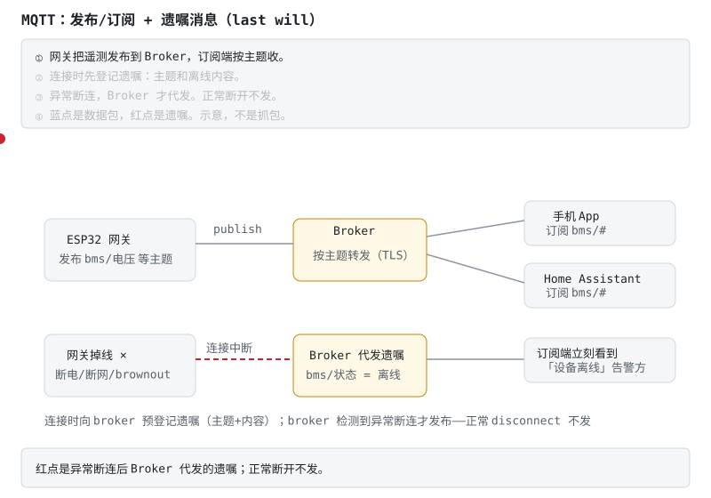
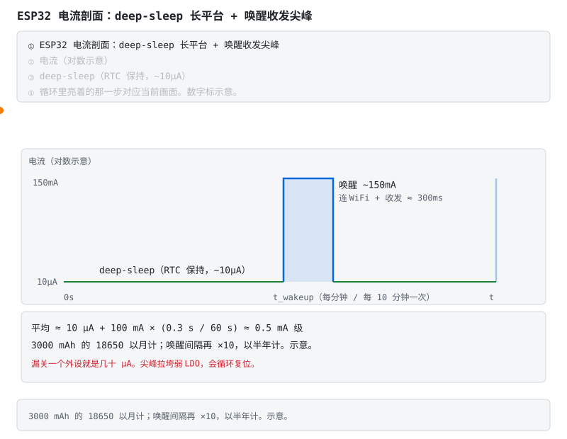

# ESP32 实战专题：BMS 的通信网关与低功耗上传

> 配套教程：[阶段 5（通信与集成）](stages/stage-5-通信与集成.md)。
> 一块 BMS 做得再好，用户看不见数据就等于不存在。ESP32 就是那个把电压、电流、SOC 端到用户手机上的**通信兵**——三十块钱，WiFi 蓝牙双全。本文回答四件事：**它干什么/不干什么、型号怎么选、IDF 还是 Arduino、BLE/MQTT/OTA 怎么落地、一节 18650 能让它活多久、坑在哪**。

## 1. 角色定位：通信层，不是安全层

ESP32 在 BMS 里的正当岗位：**通信网关**——UART 读商用 BMS（阶段 5 任务 1 的 JK/JBD/小象）或自家主控，把数据经 BLE/WiFi 推给手机、Home Assistant 或云。

它**永远不许进安全回路**，原因很物理：WiFi/BLE 协议栈随时可能去干私活（扫描、重连、射频校准），任务优先级再高也给不了你毫秒级的确定性。而保护动作恰恰要的就是确定性。分工必须铁：**保命归 AFE 和主控 MCU（[STM32 专题](stm32-bms专题.md)），通信兵只管报信**——ESP32 死机、重启、掉线，电池必须照样安全。

## 2. 型号速查（2026 视角）

| 型号 | 内核 | 无线 | BMS 网关适配 | 备注 |
|---|---|---|---|---|
| ESP32（经典） | Xtensa 双核 | WiFi + BLE 4.2 | ✅ 成熟资料多 | 老兵，新设计可看 C 系 |
| ESP32-S3 | Xtensa 双核 | WiFi + BLE 5 | ✅ 需 USB OTG/AI 时 | 原生 USB，调试顺手 |
| **ESP32-C3** | RISC-V 单核 | WiFi + BLE 5 | ✅✅ **网关甜点** | 板卡 ¥15–30 量级，性能对网关富余 |
| ESP32-C6 | RISC-V | WiFi 6 + BLE 5 + 802.15.4 | ✅ 面向 Thread/Matter | 想玩 Matter 选它 |

网关的活（串口转发 + BLE notify + MQTT）对算力要求低得可怜——**C3 是最常见正确答案**，把省下的钱花在隔离上（§6 第 6 条）。预算见 [器材清单](budget.md)。

## 3. ESP-IDF 还是 Arduino

| | Arduino core 3.x | ESP-IDF 5.x |
|---|---|---|
| 本质 | **底层就是 ESP-IDF**，`setup()/loop()` 糖衣 | 原生框架，FreeRTOS 全暴露 |
| 适合 | 快速验证、阶段 5 任务 1–2 起步 | 量产、精细控制任务/内存/功耗 |
| 关键概念 | 库生态现成（NimBLE、PubSubClient） | 任务/队列/事件组/通知；menuconfig 配置系统 |
| 构建 | Arduino IDE / PlatformIO | idf.py / PlatformIO |

**建议路径**：Arduino 把链路跑通（读串口 → BLE 推出来）→ 进阶翻 ESP-IDF。记住一个事实：`loop()` 其实跑在 `app_main` 创建的一个任务里——理解这一点，低功耗和 OTA 这些正经功能你才算摸到门把手。

## 4. 通信三件套落地要点

**BLE（手机直连）**：用 **NimBLE** 栈（比 Bluedroid 省一半内存，小闪存型号友好）。自定义一个 GATT service，电压/电流/SOC 各一个 characteristic 开 **notify**；不需要配对的场景别上加密——省掉的是一堆连接失败工单。

**WiFi + MQTT（Home Assistant/云）**：MQTT 必开 **TLS** 与**遗嘱消息**（last will）。HA 侧走 MQTT discovery 自动出实体。

**不看动画版**：正常时网关向 broker 发 `bms/电压` 等主题，broker 按订阅关系转发给手机与 HA；连接建立时网关**预登记**一条遗嘱（`bms/状态=离线`），broker 只有在检测到**异常**断连（断电/断网/brownout，而非正常 disconnect）时才代为发布——订阅端几秒内从"数据停更"变成明确的"设备离线"告警。没有遗嘱的监控系统，设备死了都像在装睡。

> **口诀**　断线之后遗嘱还能发出去。保护切断不走这条链路。

**OTA（远程升级）**：IDF 的双分区 OTA——新固件写到另一个 ota 分区、重启试运行、确认后标记 valid，起不来自动回滚旧分区。**没有回滚的 OTA 等于给远程变砖开了门**。

## 5. 电池供电能撑多久：睡眠电流的账

**不看动画版**：deep-sleep 时主域断电、RTC 域保持，电流 ~10µA 级；定时唤醒后连 WiFi + 收发数据是 ~150mA 级、持续几百毫秒的尖峰，完事立刻回 deep-sleep。账是这么算的：每分钟唤醒一次、每次工作 300ms、尖峰均值 100mA——平均电流 ≈ 10µA + 100mA×(0.3s/60s) ≈ **0.5mA 级**；一节 3000mAh 的 18650 理论续航以**月**计。唤醒间隔拉长到 10 分钟就是半年级。

> **口诀**　平均电流看占空比。峰值 150 mA 不是待机电流。

两个反向提醒：① 进 deep-sleep 前外设（串口、传感器供电）要逐个关，漏一个就是几十 µA 的"睡得不够死"——续航刺客都是小数目累出来的；② 这块电池自身的保护板休眠电流也在同一个 µA 级账本上，别只算 ESP32。

## 6. 著名坑清单

1. **ADC 别当计量前端**：ESP32 的 ADC 非线性出名（高衰减档尤其），WiFi 发射时读数还在抖。**计量归 AFE/库仑计**，它的 ADC 只配干看温度档的粗活。
2. **发射电流尖峰**：WiFi/BT 发射瞬间数百 mA，弱 LDO 直接被拉到 brownout 复位——电源按峰值设计，不是按均值。
3. **brownout 循环**：电池内阻大（低温/老化）时，唤醒尖峰 → 电压跌落 → brownout 复位 → 再唤醒再复位。现象是"永远连不上"，根子在电源，不在代码。
4. **deep-sleep 断电域**：主域断电后 GPIO 状态丢失（RTC GPIO 除外），唤醒是从复位重新启动——状态要靠 RTC slow memory 或 flash 保存，指望变量还在的人会怀疑人生。
5. **PSRAM/Flash 频率**：超频配置和实际模组不符会随机死机——menuconfig 里的 flash 模式（QIO/QOUT）照模组手册设。
6. **UART 接商用 BMS 要隔离**：JK/JBD 的 UART 参考地与被测电池共地，和 ESP32 的供电地可能差出压差——隔离串口（光耦/数字隔离器）是任务 1 的隐含前提，阶段 5 原文有安全口径。这条不是性能问题，是烧板问题。

## 7. 与阶段 5 任务的衔接

任务 1–2（ESP32 读商用 BMS、接 Home Assistant）仍是**自己动手**的留白——本文给的是地图：型号选 C3 量级、框架 Arduino 起步、BLE 用 NimBLE、MQTT 记得 TLS+遗嘱、OTA 必须带回滚、低功耗按 §5 的公式算账。协议解析本身对照 syssi 等开源实现（阶段 5 原文），帧解析的军规在 [code/protocol/](../code/protocol/) 有 PC 可跑版本。

## 8. 参考工程（GitHub，按学习价值排序）

1. [syssi/esphome-jk-bms](https://github.com/syssi/esphome-jk-bms)（1027★）— ESPHome 的 JK BMS 组件，阶段 5 任务 2（接 Home Assistant）的事实标准路线；同作者还有 JBD/Seplos/Daly 等系列组件，协议帧实现值得对照 [code/protocol/](../code/protocol/) 的军规读。
2. [stuartpittaway/diyBMSv4ESP32](https://github.com/stuartpittaway/diyBMSv4ESP32)（237★）— diyBMS v4 的 ESP32 控制器：Web UI、规则引擎、多串模块管理，一个"完整产品形态"的 ESP32 BMS 网关长什么样就看它（母项目 [diyBMSv4](https://github.com/stuartpittaway/diyBMSv4) 1136★）。
3. [kolins-cz/Smart-BMS-Bluetooth-ESP32](https://github.com/kolins-cz/Smart-BMS-Bluetooth-ESP32)（121★）— 小象（xiaoxiang）BMS 的 BLE 读取与显示，任务 1 的最小可行参考：BLE 连接、帧请求/解析、显示全链路。
4. [Belik1982/esp32-makita-bms-reader](https://github.com/Belik1982/esp32-makita-bms-reader)（99★）— Makita 电池诊断的 Web 工具：UART 读 BMS + ESP32 自建 Web 界面的紧凑样本。

配套库：[h2zero/NimBLE-Arduino](https://github.com/h2zero/NimBLE-Arduino)（BLE，§4 推荐栈）、[knolleary/pubsubclient](https://github.com/knolleary/pubsubclient)（MQTT 客户端）。

**短自测**

1. ESP32-C3 为什么便宜却不能做保护？
2. 断线之后，谁还发得出「离线」？

<b>参考答案（先自己想完再展开）</b>

1. 网关的活它富余。无线协议栈会去干私活，给不了毫秒级确定性。板卡大约 ¥15–30，省下的钱花在隔离串口上。
2. 遗嘱。Broker 在异常断连时代发。保护切断不走这条链路。

**练完你会怎样**：你能把 C3 当成电台。它死机，电池还得安全。

---

返回 [学习路线总纲](bms-resources.md) ｜ [阶段 5](stages/stage-5-通信与集成.md) ｜ [STM32 专题](stm32-bms专题.md)
