# 阶段 0 教程：前置知识

> 对应学习路线的阶段 0。建议用时 1–2 周。  
> 🚪 **零基础请先看**：[前两周怎么走](getting-started.md)（第 0 天实验 + 必读/可跳过对照）  
> 📖 配套扫盲（可选）：[瑞萨《BMS 教程》中文编译导读](../renesas-bms-tutorial-中文导读.md)
>
> 这篇教程不讲「BMS 怎么做」，讲的是「为什么 BMS 必须存在」。**懂了电池，保护规则你能自己推出来；不懂电池，只能死记硬背。**

### 本阶段怎么读（别一次啃完）

| 章节 | 是否必读 | 说明 |
|---|---|---|
| **§0.1 锂电池化学** | ✅ **必读** | 过充/过放/温度/CC-CV/SOC——后面所有阶段的地基 |
| **§0.2 电路基础** | 阶段 2 前补齐 | 可先快读结论；抄保护板前再精读 |
| **§0.3 嵌入式** | 阶段 3 前补齐 | 零基础可先跳过，不挡进入阶段 1 |
| §0.4 动手与验收 | 电池相关项必做 | 嵌入式「寻宝题」可延后 |

---

## 0.1 锂电池化学基础

### 0.1.1 一块电池里在发生什么

把锂电池拆开看（想象一下，别真拆——拆开你就得到一屋子烟），它是一个三明治：

- **正极**：锂离子的"宿舍"，满住状态是放电态；
- **负极**（石墨）：锂离子的"出差酒店"，结构像一层层抽屉，锂离子来了就插进层间住下；
- **隔膜**：一层多孔塑料膜，只许锂离子通过，**坚决不许电子通过**——它是防止两极直接接触的最后一道物理屏障，记住它，后面讲热失控还要回来找它。

充电和放电，就是锂离子在两个电极之间的"往返通勤"：

注意看动画里的分工：**锂离子走电池内部的电解液，电子被隔膜挡着、只能绕外电路走**。电子被迫绕路的这段旅程，就是设备得到的电流。电池能对外供电，本质上就是"逼着电子绕路打工"。

正极材料决定电池的"性格"，常见三位：

| 材料 | 性格 | 表现 |
|---|---|---|
| 三元锂 NCM | 激进的运动选手 | 能量密度高（跑得远），但热稳定性差（脾气爆），乘用车主流 |
| 磷酸铁锂 LFP | 稳重的中年人 | 安全、寿命三四千次起步、便宜，但电压平台平得反常（后面讲 SOC 你会恨它） |
| 钴酸锂 LCO | 精致但娇贵 | 能量密度极高、怕过充，手机平板专用，基本不会出现在大电池包里 |

### 0.1.2 过充：一场逐级升级的事故

4.2V（铁锂 3.65V）不是"建议值"，是**化学红线**。超过它，事故按剧本逐级上演：

1. **正极过度脱锂**：正极材料里的锂被抽走太多，晶体结构像被抽了砖的墙，开始坍塌——容量永久损失，这一步不可逆；
2. **电解液氧化分解**：高电压下电解液在正极表面被氧化，产生气体——电池开始**鼓包**。摸到鼓包的电池，事故已经演到第二幕了；
3. **负极析锂**：锂离子来得太猛、石墨层间住不下，只能在负极表面"露宿"——以金属锂的形式析出，长成针状结晶（**锂枝晶**）；
4. **枝晶刺穿隔膜**：还记得那层膜吗？针越长越长，扎穿它——正负极在内**部**短路；
5. **热失控**：内短路点瞬间放出大量热 → 温度飙升 → 电解液、正极材料分解加剧 → 放出更多热 → 链式反应，几百摄氏度的喷发，伴随火焰。这就是新闻里"电池自燃"的真身。

**热失控最阴险的地方是自我加速**：它不是"烧了就算了"，而是放热 → 升温 → 更放热的正反馈。而且它会传染——一节热失控烤热旁边的电芯，旁边的也跟着失控，一节变一包。这就是为什么 BMS 对"过充"的防护是冗余设计的（阶段 6 讲功能安全时会看到，防过充通常被定为最高安全等级）。

### 0.1.3 过放：安静的杀手

过充死得轰轰烈烈，过放死得悄无声息。

电压放得太低（三元 <2.5V 左右），负极的**铜集流体开始被氧化溶解**——铜变成铜离子跑进电解液。这时候电池往往还很"安静"，不鼓包不发热，你甚至觉得"还能抢救一下"。

但下次充电时，溶解的铜会在隔膜上重新沉积成金属铜——同样长成枝晶，同样可能刺穿隔膜。更直白地说：**过放的电池不是坏了，是变成了一颗定时炸弹**，你现在充进去的每一度电，都在给内部的短路点添砖加瓦。

所以 BMS 的过放保护（一般 2.8–3.0V 动作）留足了余量，而且过放保护板会进入微安级休眠——它宁可"装死"也不让你继续把这节电池往深渊里拖。

> 工程经验：一块静置多年的旧电池，量电压只有 1V 多，千万别直接上大电流"激活"。正确做法是按 datasheet 用 0.05C 以下的小电流预充恢复到 3V 以上再正常充——而且有鼓包、漏液迹象的直接报废，别舍不得。

### 0.1.4 温度：电池的脾气

电池有两副面孔，全看温度：

- **低温（<0°C）**：电解液变"稠"，锂离子跑不动。这时大电流充电，锂离子来不及钻进石墨层间，只能在负极表面析出金属锂——**和过充第三幕一模一样的析锂**，只不过导演从高压换成了低温。这就是"冬天快充伤电池"的物理本质，也是 BMS 必须**低温禁充或限流**的原因。
- **高温（>45°C）**：一切副反应加速。经验法则是温度每升高约 10°C，老化速率大致翻倍（阿伦尼乌斯定律的通俗版）。夏天把手机落在暴晒的车里，就是在用几倍速消耗电池寿命。

看明白了吗？**温度保护不是 BMS 的附加功能，它和电压保护一样是主菜。**

左边那幕只在**低温充电**时上演——低温放电只是没劲，不会析锂；右边那幕每一次高温都在累积。所以 BMS 的功率限制按温度分档：低温先砍充电，高温充放一起砍。

### 0.1.5 必背参数表 + C 倍率

| 参数 | 三元锂 NCM | 磷酸铁锂 LFP |
|---|---|---|
| 标称电压 | 3.6 / 3.7 V | 3.2 V |
| 满充电压 | 4.2 V | 3.65 V |
| 放电截止电压 | 2.8–3.0 V | 2.5 V |
| OCV 平台 | 有明显斜率 | 极平（阶段 4 的噩梦） |

> 表中为常见化学体系的典型值，**具体数值以你所用电芯的 datasheet 与保护 IC 的阈值版本为准**——同叫"三元"，不同厂家的满充/截止也可能差出 50mV。

**C 倍率**：1C = 一小时放完额定容量的电流。算一道：

> 一个 16 串 20Ah 磷酸铁锂储能包，用 0.5C 充电，充电电流多大？整包满充电压多少？
>
> 电流 = 20Ah × 0.5C = **10A**；满充电压 = 3.65V × 16 = **58.4V**（标称 3.2V × 16 = 51.2V，这就是"48V 储能系统"的真实电压范围）。

同一个 10A，对 10Ah 的包是 1C、对 20Ah 的包只是 0.5C——C 永远跟着容量走。上面那道题里的 0.5C，就是把龙头开在"两小时才放空"的位置上。

### 0.1.6 CC-CV：充电的两段论

标准锂电充电分两步走：

1. **预充**（可选）：深度过放的电池先喂 0.05–0.1C 的"流食"，恢复到安全电压；
2. **恒流 CC**：大水流猛灌，电压一路爬升；
3. **恒压 CV**：电压顶住满充值不动，让电池自己"吸"——越接近满，吸得越慢，电流自然衰减到截止电流（0.05–0.1C），判充满。

为什么不能一路恒流怼到底？因为电池快满时"吸收能力"下降（极化），硬灌只会让端电压虚高、负极析锂。这就像往快满的水杯里猛倒水——溢出来的不是水，是锂。

**重点结论（后面会反复用）："电压到 4.2V"不等于充满，那只是 CV 段的入场券；真正的满充判据是 CV 段电流衰减到截止值。**BMS 的 SOC=100% 校准就靠这个时刻（阶段 4 详讲）。

### 0.1.7 SOC 与 SOH：油表和油箱

- **SOC（荷电状态）**：油表读数——现在还剩多少电，0–100%；
- **SOH（健康状态）**：油箱本身的状况——用久了，油箱会"缩水"（容量衰减）还会"漏油变快"（内阻增大）。
  - 容量口径：SOH = 当前满充容量 / 出厂容量；
  - 内阻口径：SOH = 初始内阻 / 当前内阻（越小越好）。

注意一个容易忽略的事实：**SOC 的分母是"当前满充容量"而不是"标称容量"**——一块 SOH 只剩 80% 的电池，显示 100% 时也只有出厂八成的电。这就是为什么老手机"满电也不耐用"。

内阻增大还有个日常可感的表现：带载时端电压先"腿软"一截（I·R），卸载又弹回来——所以行驶中和停车后的油表读数会对不上，老化的电池软得更明显。这也是阶段 4 估 SOC 不能只靠电压的原因之一。

### 自测 0.1

1. 隔膜的作用是什么？热失控链条里它在哪一幕"阵亡"？
2. 为什么低温下大电流充电和过充会造成同一种损伤（析锂）？
3. 过放电池为什么"放着放着就坏了"，直接大电流激活有什么风险？
4. 16 串 50Ah 三元锂包，1C 充电电流多大？整包满充电压多少？
5. 为什么"电压到 4.2V"不能作为充满判据？满充的可靠判据是什么？
6. 一块 SOH=80% 的电池显示 SOC=100%，实际电量是出厂时的多少？

<b>参考答案（先自己想完再展开）</b>

1. **隔膜**是一层多孔塑料膜，职责有两条：只许锂离子通过、**坚决不许电子通过**；同时是防止正负极直接接触的最后一道物理屏障。它在五步链条的**第 4 幕**阵亡——负极析出的锂枝晶越长越长，把它扎穿，正负极在内部短路，直接引出第 5 幕热失控。
2. 两者的共同机制是**锂离子到达负极的速率超过它嵌入石墨层间的速率**，供过于求的那部分只能在负极表面以金属锂形式析出。过充是"来得太猛"（电压/电流把锂抽得太快），低温是"进得太慢"（电解液变稠、离子迁移与嵌入动力学变慢）。导演不同（高压 vs 低温），剧情一样：析锂 → 长枝晶 → 刺穿隔膜。
3. 过放时负极的**铜集流体被氧化溶解**成铜离子进入电解液，此时电池不鼓不热、外观安静，所以"放着放着就坏了"。下次充电时溶解的铜会在隔膜上重新沉积成金属铜枝晶，同样可能刺穿隔膜。所以它不是"坏了"，是变成了一颗定时炸弹。直接大电流激活 = 往一颗已有内短路隐患的电池里灌大电流 → 短路点发热 → 热失控。正确做法：按 datasheet 用 0.05C 以下小电流预充恢复到 3V 以上，再正常充；有鼓包、漏液迹象的直接报废。
4. 1C 电流 = 50Ah × 1C = **50A**（C 倍率只看容量，与串数无关）；满充电压 = 4.2V × 16 = **67.2V**（标称 3.7V × 16 = 59.2V，就是俗称的"60V 包"）。
5. 因为 4.2V 只是**进入 CV 段的入场券**。CC 段末端的端电压里含有 $IR_0$ 压降和极化电压，电压读到 4.2V 时电池内部实际还没充满（撤掉电流电压会回落）。可靠判据是 **CV 段电流衰减到截止电流（0.05–0.1C）**——此时极化已松弛、内外基本平衡。BMS 的 SOC=100% 校准就取这一刻。
6. **80%**。因为 SOC 的分母是"**当前**满充容量"而不是标称容量：SOC=100% 的含义是"装满了当前这个已经缩水的油箱"。这正是老手机满电也不耐用的原因。

---

## 0.2 电路基础：只学 BMS 用得上的

> 📌 **可后补**：若你只想先搞清「BMS 是干什么的」，读完 §0.1 与自测 0.1 即可进 [阶段 1](stage-1-认识BMS.md)；本节在拆保护板（阶段 2）前补齐即可。

不用啃完一整本《模拟电路》。BMS 原理图翻来覆去就用这五块电路，学透就够开工了。

### 0.2.1 RC 滤波：手册让你放，你就放

每串电池进 AFE 之前都有一级 RC：限流保护 + 滤掉高频干扰 + 泄放静电。截止频率 $f_c = \dfrac{1}{2\pi RC}$。

新人最爱问："滤波更强点不好吗？我把电容加大十倍！" 不好，原因有两个：

- **R 太大**：AFE 采样瞬间要从引脚吸一小口电流（漏电流），它在 R 上产生的压降会被原样算进你的测量值——R 越大，误差越大，而且漏电流随温度变，误差还会"漂移"；
- **C 太大**：均衡开关每次动作后，电压要等好几个 RC 时间常数才稳定——均衡期间你测到的全是"旧闻"。

**第一块板子，RC 值一个都别改，照抄手册典型应用电路。** 等你能在示波器上说出波形差异了，再谈优化。

### 0.2.2 ADC 与误差：刻度细 ≠ 尺子准

新人最容易混淆的一对概念：

- **分辨率**：尺子上的刻度有多细（12bit ADC 把量程分成 4096 格）；
- **精度**：尺子本身准不准（基准电压偏没偏、零点漂没漂、线性好不好）。

一把刻度细到 0.1mm 但受热会伸缩的塑料尺，量不出 0.1mm 的精度。BMS 要求单体电压 ±5mV，靠的是：AFE 内部出厂校准 + 你产线上的出厂标定（阶段 6 讲），而不是"ADC 位数高"。分析误差从**基准源的温漂**开始算起——它错了，后面全错。

动画把两件事分开演：台阶是分辨率（12bit 已经足够细），整尺平移才是精度事故——基准源一偏，所有读数同方向偏。出厂标定校的就是这后一笔。

### 0.2.3 MOSFET：电控闸门

三个阶段要用的知识先给个底（深度解析在 [电路详解 ①](../circuits/01-功率回路-MOS保护与预充.md)，有动画）：

- 栅极 G 是把手：VGS 够高就开，撤掉就关，几乎不耗驱动电流；
- **体二极管**：制造工艺白送的一个并联单向阀，导致**单颗 MOS 永远有一个方向关不死**——所以保护开关要两颗背靠背：M1 防充电、M2 防放电；
- 选型三参数：$V_{DS}$ 耐压（> 整包最高压 ×1.5）、$R_{DS(on)}$ 导阻（决定发热 $I^2R$）、$Q_g$ 栅电荷（决定驱动难易）。

### 0.2.4 电流采样：三条路线

| 方案 | 一句话原理 | 代价 |
|---|---|---|
| 低边分流 | 在 B- 回路串个毫欧电阻测压降 | 抬高地电位；检不出对地短路 |
| 高边分流 | 在 B+ 侧测 | 需要耐高共模的放大器 |
| 霍尔/磁通门 | 测电流产生的磁场，天然隔离 | 零漂是软肋，出厂必须标定 |

记住一句：**SOC 安时积分的精度天花板，在你选电流传感器那一刻就定死了。**

### 0.2.5 隔离：电池包上没有"随便接地"

低压板子里"地"是公共参考，随便连。电池包里不行：

- 电池包负极和大地/车体**不是**一个电位，可能浮动几十上百伏；
- 菊花链上相邻两块从板，"地"之间隔着十几节电池的电压。

通信口直连 = 拿几百伏的电位差去亲吻你的 MCU。判断标准不是"用了什么总线"，而是**链路两端是否跨电位**：跨高压、跨不同地的对外通信（UART/CAN）要做隔离——数字隔离器、隔离电源、变压器耦合，让信号过去、把电位差挡住；isoSPI 这类 AFE 板间链路则干脆把隔离做进了协议层（变压器耦合，详解 ② 有动画）；同一块低压板上、共地的短距离通信不需要隔离。画板时这是你布局的第一条纪律。

### 自测 0.2

1. 为什么 AFE 输入的 R、C 值不能自行加大？
2. 12bit ADC 就一定能测准 ±5mV 吗？还缺什么条件？
3. 为什么单颗 MOS 做不成双向保护开关？
4. 低边和高边电流采样各自的代价是什么？
5. 用调试器直连 BMS 的 UART 前，要先确认什么？

<b>参考答案（先自己想完再展开）</b>

1. **R 加大**：AFE 采样时要从引脚抽一小口电流（漏电流），它在 R 上的压降被原样算进测量值 → 该串读数系统性偏低；而且漏电流随温度变，这个误差还会**漂移**，一次出厂标定消不掉。**C 加大**：均衡开关动作后电压要等好几个 RC 时间常数才稳定 → 均衡期间测到的全是"旧闻"。（C 改小则抗混叠与抗 ESD 能力下降。）所以第一块板子照抄手册典型应用电路。
2. 不一定。12bit 是**分辨率**（刻度细），不是**精度**（尺子准）。还缺：基准源的初始误差与温漂（误差预算第一项）、ADC 的失调/增益/INL、输入链路的漏电流压降与 MUX 导阻、布局引入的干扰，以及产线上的出厂标定。一把刻度 0.1mm 但受热伸缩的塑料尺，量不出 0.1mm 的精度。
3. 因为制造工艺天然形成的**体二极管**并联在 D-S 之间。关断沟道后，电流仍能从体二极管的正向方向流过——所以单颗 MOS 永远有一个方向关不死。要双向阻断必须两颗背靠背，让两个体二极管方向相反对顶：M1 防充电、M2 防放电。
4. **低边**（B- 回路串毫欧电阻）：抬高/扰动地电位（地弹），且检不出对地短路；好处是成本低、放大器不需要耐高共模。**高边**（B+ 侧）：地干净，但需要耐高共模电压的放大器，成本与设计难度上去了。（第三条路线霍尔/磁通门天然隔离，代价是零漂，出厂必须标定。）
5. 三件事：①**电平**——3.3V TTL 还是 RS232 的 ±12V？插反可能烧口；②**是否跨电位、共地是否安全**——UART 共地意味着你的电脑和电池包连成一体，要么笔记本脱开适配器用电池供电，要么用隔离 USB 串口，别把市电地引进电池包；③**波特率与帧格式**——差 2% 以上就会偶发乱码，然后你会去怀疑程序。判断要不要隔离的标准不是"用了什么总线"，而是**链路两端是否跨电位**。

---

## 0.3 嵌入式开发基础

> 📌 **可后补**：零基础可整节跳过，先完成阶段 1；动手烧 AFE/MCU（阶段 3）前再回来。会 Arduino/STM32 的人扫读「翻车现场」即可。

### 0.3.1 BMS 用到的 MCU 外设（按用途记）

| 外设 | 在 BMS 里干什么 |
|---|---|
| GPIO | 驱动继电器/MOS、外部唤醒、LED 与蜂鸣器 |
| ADC | 读 NTC 温度、辅助电源电压 |
| 定时器/PWM | 均衡驱动时序、蜂鸣器音调、喂狗节奏 |
| I2C/SPI/UART | 跟 AFE 和外界说话（下一节细讲） |
| **独立看门狗 IWDG** | 安全件的灵魂：主程序卡死 → 自动复位。它平时毫无存在感，出事时是最后一道防线 |

### 0.3.2 三个通信接口的"事故现场"

| 接口 | 经典翻车现场 |
|---|---|
| I2C | 忘焊上拉电阻，总线永远读 FF；从机异常把 SDA 拉低不放，总线锁死（恢复：SCL 手动打 9 个时钟脉冲）；两个器件地址撞车 |
| SPI | CPOL/CPHA 模式配错，读出来全是移位后的乱码；片选 CS 时序不对，多机互相串话 |
| UART | 波特率差 2% 以上，偶发乱码还以为是程序 bug；3.3V/5V 电平混插；忘共地 |

每条背后都是某位工程师的一个通宵。现在它们是你在表格里看到的十秒钟。

### 0.3.3 C 语言：四个必须肌肉记忆的点

1. **`volatile`**：硬件寄存器、中断和主循环共享的变量必须加。不加的后果是编译器"好心"帮你把变量缓存进寄存器，中断改了它主循环也看不见——这种 bug 复现靠缘分；
2. **位操作**：读-改-写寄存器三件套（`|=` 置位、`&= ~` 清位、`<<` 移位）。AFE 的配置全是位域，躲不掉；
3. **固定宽度类型**：`uint8_t/uint16_t/uint32_t`，协议解析和寄存器操作只认它们；
4. **字节序与对齐**：解析通信帧时，大端小端搞反，4.2V 能给你解出 16641V——别笑，这是每个 BMS 工程师都打印过的日志。

### 0.3.4 怎么读数据手册（以 TI BQ76920 为例）

datasheet 上百页，没人从头读到尾。正确的打开顺序像寻宝：

1. **功能框图**（第一页附近）：先建立"输入→MUX→ADC→逻辑→接口"的地图，知道数据从哪进哪出；
2. **寄存器地图**：把寄存器分两类——**状态类**（电压/温度/故障标志，只读）和**配置类**（保护阈值、均衡使能，可写）；
3. **时序图**：上电顺序、通信建立过程——初始化代码照它写；
4. **典型应用电路**：第一版原理图照抄，一个电阻都别改。

练手题（阶段 2 还会用到）：在 BQ76920 手册里找出三个寄存器的地址——单体电压寄存器、过压保护阈值寄存器、均衡控制寄存器。

### 0.3.5 开发环境建议

- **STM32 + HAL 库**：上手最快，教程遍地；
- **Zephyr RTOS**：[LibreSolar 固件](https://github.com/LibreSolar/bms-firmware)用它，顺带学 RTOS 和设备树，简历加分项；
- **ESP32**：阶段 5 对接商用 BMS（UART/BLE）的主力，Arduino 或 ESP-IDF 都行。

### 自测 0.3

1. `volatile` 不加会有什么后果？为什么这种 bug 难复现？
2. I2C 总线被从机锁死（SDA 一直低）怎么恢复？
3. SPI 模式 0 和模式 3 差在哪？
4. 看门狗在安全系统里扮演什么角色？为什么强调"独立"看门狗？

<b>参考答案（先自己想完再展开）</b>

1. 不加 `volatile`，编译器会"好心"把变量缓存进寄存器、或把反复读取优化成一次读取。中断（或硬件）改了内存里的值，主循环读的还是寄存器里的旧值，看不见更新。难复现是因为它取决于优化等级、寄存器分配和周围代码——换个编译选项、加一行打印、调个函数顺序，症状就可能消失或转移。必须加的对象：硬件寄存器、中断与主循环共享的变量。
2. 主机用 GPIO 手动在 SCL 上打最多 **9 个时钟脉冲**，让从机把没发完的那个字节移位完成、释放 SDA，然后补一个 STOP 条件复位总线状态。根因通常是主机在传输中途被复位，从机还停在"我正在发数据"的状态里。
3. 差在 **CPOL（空闲时钟极性）**：模式 0 是 CPOL=0 / CPHA=0（空闲低电平，第一个边沿也就是上升沿采样）；模式 3 是 CPOL=1 / CPHA=1（空闲高电平，第二个边沿也就是上升沿采样）。两者的共同点是**都在上升沿采样**，所以不少器件两种模式都能跑；真正会让你读出一堆移位乱码的是 CPHA 配错。
4. 角色：主程序跑飞或死锁时自动复位 MCU，是**软件失效的最后一道防线**。强调"独立"（IWDG）是因为它有**自己的时钟源**，不依赖主系统时钟与 PLL——主时钟失效或被错误配置时它照样计数；而挂在被污染的时钟树上的看门狗可能跟着一起失效。它与 AFE 的硬件保护配合，构成"软件死了硬件还在"的冗余。

---

## 0.4 动手任务与验收

**动手任务**

1. 找一节锂电池（18650 或手机旧电池），静置 2 小时后用万用表测开路电压，对照 OCV-SOC 曲线估它的大致剩余电量；
2. 观察一次手机从 20% 充到 100%：前半段飞快、90% 后明显变慢——亲手感受 CC 段与 CV 段的分界；
3. 下载 TI BQ76920 数据手册，完成 0.3.4 的"寻宝题"，把三个寄存器地址抄进你的笔记。

**验收清单**

**进入阶段 1 的最低线（§0.1）：**

- [ ] 能默写三元锂与磷酸铁锂的标称 / 满充 / 截止电压
- [ ] 能完整讲出"过充 → 热失控"的五步链条和"过放 → 铜枝晶"的过程
- [ ] 能解释为什么低温禁充、为什么 4.2V ≠ 充满

**阶段 2 前补齐（§0.2）：**

- [ ] 能解释背靠背 MOS 的必要性

**阶段 3 前补齐（§0.3）：**

- [ ] 能说出 I2C / SPI / UART 各自最经典的翻车现场
- [ ] 能在数据手册里定位任意一个寄存器

> **本阶段一句话**：BMS 的每一条规则都对应电池内部一个物理过程——先懂电池，再谈管理。

最低线打勾 → 进入 [阶段 1：认识 BMS](stage-1-认识BMS.md)（总纲入口：[阶段 1](../bms-resources.md#阶段-1入门认识-bms1-周)）。

---

**上一阶段**：[前两周怎么走](getting-started.md) ｜ **下一阶段**：[阶段 1 认识 BMS](stage-1-认识BMS.md) ｜ [学习路线总纲](../bms-resources.md) ｜ [术语表](../glossary.md)
