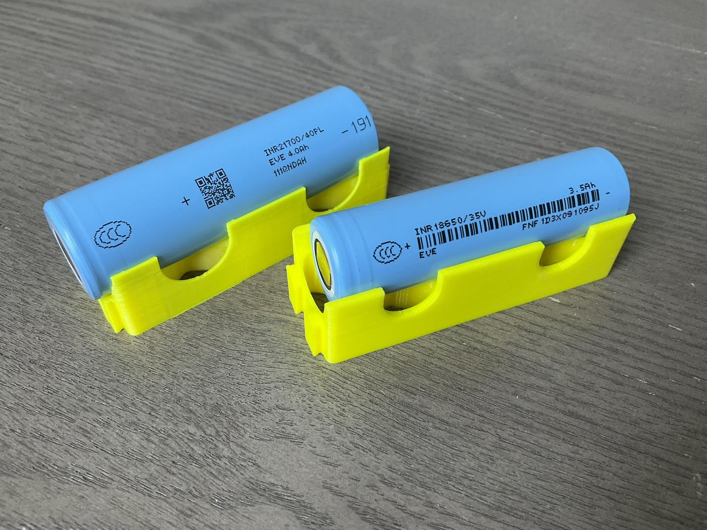
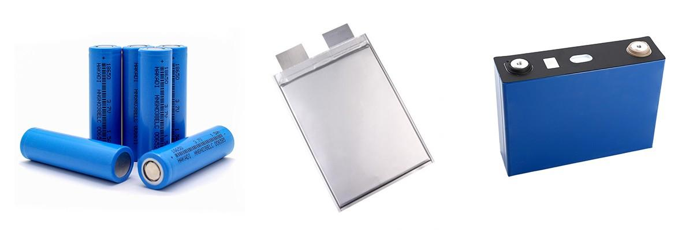
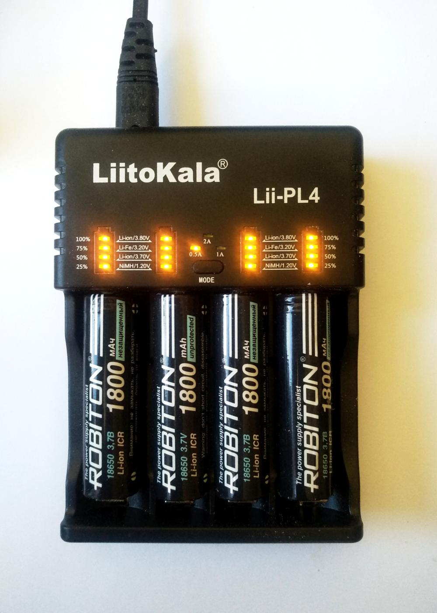
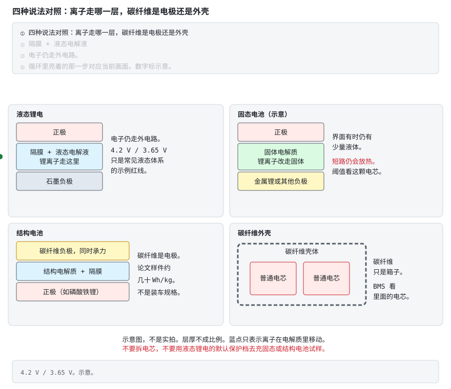

# 阶段 0 教程：前置知识

> 对应学习路线的阶段 0。建议用时 1–2 周。  
> 🚪 **零基础请先看**：[前两周怎么走](getting-started.md)（第 0 天实验 + 必读/可跳过对照）  
> 📖 配套扫盲（可选）：[瑞萨《BMS 教程》中文编译导读](../renesas-bms-tutorial-中文导读.md)
>
> 这篇教程不讲「BMS 怎么做」，讲的是「为什么 BMS 必须存在」。**懂了电池，保护规则你能自己推出来；不懂电池，只能死记硬背。**

## 本页目录

按层走先看 [能力地图](bloom-map.md)。标题末尾的 `[记忆]` … `[创造]` 是布鲁姆层级。

- [阶段 0 教程：前置知识](stage-0-前置知识.md#阶段-0-教程前置知识)
  - [本阶段怎么读（别一次啃完） [理解]](stage-0-前置知识.md#本阶段怎么读别一次啃完-理解)
- [0.1 锂电池化学基础 [理解]](stage-0-前置知识.md#01-锂电池化学基础-理解)
  - [0.1.1 一块电池里在发生什么 [理解]](stage-0-前置知识.md#011-一块电池里在发生什么-理解)
  - [0.1.2 过充：一场逐级升级的事故 [理解]](stage-0-前置知识.md#012-过充一场逐级升级的事故-理解)
  - [0.1.3 过放：安静的杀手 [理解]](stage-0-前置知识.md#013-过放安静的杀手-理解)
  - [0.1.4 温度：电池的脾气 [理解]](stage-0-前置知识.md#014-温度电池的脾气-理解)
  - [0.1.5 必背参数表 [记忆]](stage-0-前置知识.md#015-必背参数表-记忆)
  - [0.1.5b C 倍率：同一安培，容量不同就不是一回事 [理解]](stage-0-前置知识.md#015b-c-倍率同一安培容量不同就不是一回事-理解)
  - [0.1.6 CC-CV：充电的两段论 [理解]](stage-0-前置知识.md#016-cc-cv充电的两段论-理解)
  - [0.1.7 SOC 与 SOH：油表和油箱 [理解]](stage-0-前置知识.md#017-soc-与-soh油表和油箱-理解)
  - [0.1.8 固态电池：固体电解质换掉了什么 [理解]](stage-0-前置知识.md#018-固态电池固体电解质换掉了什么-理解)
  - [0.1.9 碳纤维结构电池：电极在承力，外壳是另一件事 [理解]](stage-0-前置知识.md#019-碳纤维结构电池电极在承力外壳是另一件事-理解)
  - [自测 0.1 [理解]](stage-0-前置知识.md#自测-01-理解)
- [0.2 电路基础：只学 BMS 用得上的 [理解]](stage-0-前置知识.md#02-电路基础只学-bms-用得上的-理解)
  - [0.2.1 RC 滤波：手册让你放，你就放 [理解]](stage-0-前置知识.md#021-rc-滤波手册让你放你就放-理解)
  - [0.2.2 ADC 与误差：刻度细 ≠ 尺子准 [理解]](stage-0-前置知识.md#022-adc-与误差刻度细--尺子准-理解)
  - [0.2.3 MOSFET：电控闸门 [理解]](stage-0-前置知识.md#023-mosfet电控闸门-理解)
  - [0.2.4 电流采样：三条路线 [分析]](stage-0-前置知识.md#024-电流采样三条路线-分析)
  - [0.2.5 隔离：电池包上没有"随便接地" [理解]](stage-0-前置知识.md#025-隔离电池包上没有随便接地-理解)
  - [自测 0.2 [理解]](stage-0-前置知识.md#自测-02-理解)
- [0.3 嵌入式开发基础 [理解]](stage-0-前置知识.md#03-嵌入式开发基础-理解)
  - [0.3.1 BMS 用到的 MCU 外设（按用途记） [记忆]](stage-0-前置知识.md#031-bms-用到的-mcu-外设按用途记-记忆)
  - [0.3.2 三个通信接口的"事故现场" [理解]](stage-0-前置知识.md#032-三个通信接口的事故现场-理解)
  - [0.3.3 C 语言：四个必须肌肉记忆的点 [记忆]](stage-0-前置知识.md#033-c-语言四个必须肌肉记忆的点-记忆)
  - [0.3.4 怎么读数据手册（以 TI BQ76920 为例） [应用]](stage-0-前置知识.md#034-怎么读数据手册以-ti-bq76920-为例-应用)
  - [0.3.5 开发环境建议 [评价]](stage-0-前置知识.md#035-开发环境建议-评价)
  - [自测 0.3 [理解]](stage-0-前置知识.md#自测-03-理解)
- [0.4 动手任务 [应用]](stage-0-前置知识.md#04-动手任务-应用)
- [0.5 验收清单 [评价]](stage-0-前置知识.md#05-验收清单-评价)

### 本阶段怎么读（别一次啃完） [理解]

| 章节 | 是否必读 | 说明 |
|---|---|---|
| **§0.1 锂电池化学** | ✅ **必读** | 过充/过放/温度/CC-CV/SOC——后面所有阶段的地基。§0.1.8 固态、§0.1.9 结构电池读完液态锂电再看，不挡进入阶段 1 |
| **§0.2 电路基础** | 阶段 2 前补齐 | 可先快读结论；抄保护板前再精读 |
| **§0.3 嵌入式** | 阶段 3 前补齐 | 零基础可先跳过，不挡进入阶段 1 |
| §0.4 动手 / §0.5 验收 | 电池相关项必做 | 嵌入式「寻宝题」可延后 |

**视频**　B 站 · [《电池管理系统 BMS 零基础》25 集](https://www.bilibili.com/video/BV1jtqCBCEpC/)

放在怎么读这一节，是因为零基础可以先用中文把「BMS 是什么、采样、均衡、SOC、CAN、上高压」过一遍，再回来啃 §0.1。UP 主「智造辅导员」是转载号，配套资料引流自行甄别。播放器打不开时用原页。门户页有内嵌：[视频教程](../../BMS学习路径.html#videos)。

---

> **原理**　这一节只排阅读顺序：哪几节是地基，哪几节可以后补。它不代替正文里的机制。
> **证据**　必读的是化学，电路和嵌入式可以后补。扫盲 [瑞萨《BMS 教程》中文导读](../renesas-bms-tutorial-中文导读.md)，路线见 [前两周](../stages/getting-started.md)。
> **延伸阅读**　[BU-409](https://batteryuniversity.com/article/bu-409-charging-lithium-ion)（英文，可选）

## 0.1 锂电池化学基础 [理解]

> **先读/后读**：§0.1.5 参数表是 [记忆]，拿来对照；§0.1.1–§0.1.4、§0.1.5b、CC-CV、SOC、固态电池和结构电池是 [理解]。先读液态锂电的机制，表当字典查。§0.1.8 和 §0.1.9 不要拿去改保护阈值。

> **原理**　这一层讲电池内部在发生什么：电子为什么要绕外电路、过充过放和低温各伤在哪，以及充电为什么要分成恒流和恒压。
> **证据**　这一层建立过充、过放、温度、CC-CV 和 SOC。入口 [BU-409](https://batteryuniversity.com/article/bu-409-charging-lithium-ion)（英文，可选）与 [瑞萨《BMS 教程》中文导读](../renesas-bms-tutorial-中文导读.md)。
> **延伸阅读**　[瑞萨《BMS 教程》中文导读](../renesas-bms-tutorial-中文导读.md)（可选扫盲）

### 0.1.1 一块电池里在发生什么 [理解]

把锂电池拆开看（想象一下，别真拆——拆开你就得到一屋子烟），它是一个三明治：

- **正极**：锂离子的"宿舍"，满住状态是放电态；
- **负极**（石墨）：锂离子的"出差酒店"，结构像一层层抽屉，锂离子来了就插进层间住下；
- **隔膜**：一层多孔塑料膜，只许锂离子通过，**坚决不许电子通过**——它是防止两极直接接触的最后一道物理屏障，记住它，后面讲热失控还要回来找它。

圆柱、方形和软包是三种常见外形。化学红线不跟着壳变：

左边是 18650，右边是 21700。看金属壳、正极凸台和绝缘圈。容量和内阻以这颗电芯的 datasheet 为准，不要按外壳尺寸猜。

三种封装只是壳不同。来源与许可见 [照片来源](../circuits/assets/photos/PHOTOS.md)。

充电和放电，就是锂离子在两个电极之间的"往返通勤"：

注意看动画里的分工：**锂离子走电池内部的电解液，电子被隔膜挡着、只能绕外电路走**。电子被迫绕路的这段旅程，就是设备得到的电流。电池能对外供电，本质上就是"逼着电子绕路打工"。

正极材料决定电池的"性格"，常见三位：

| 材料 | 性格 | 表现 |
|---|---|---|
| 三元锂 NCM | 激进的运动选手 | 能量密度高（跑得远），但热稳定性差（脾气爆），乘用车主流 |
| 磷酸铁锂 LFP | 稳重的中年人 | 安全、寿命三四千次起步、便宜，但电压平台平得反常（后面讲 SOC 你会恨它） |
| 钴酸锂 LCO | 精致但娇贵 | 能量密度极高、怕过充，手机平板专用，基本不会出现在大电池包里 |

> **原理**　锂离子走电解液，电子被隔膜挡住、只能绕外电路。电池对外供电，就是逼着电子走这段绕路。
> **证据**　锂离子走电解液、电子走外电路，扫盲对照 [瑞萨《BMS 教程》中文导读](../renesas-bms-tutorial-中文导读.md) 与 [瑞萨原文 PDF](https://www.renesas.com/en/document/whp/battery-management-system-tutorial)（英文，可选）。
> **延伸阅读**　[BU-409 锂电怎么充](https://batteryuniversity.com/article/bu-409-charging-lithium-ion)（英文，可选）。固体电解质和碳纤维结构电池在 [§0.1.8](stage-0-前置知识.md#018-固态电池固体电解质换掉了什么-理解)、[§0.1.9](stage-0-前置知识.md#019-碳纤维结构电池电极在承力外壳是另一件事-理解)，读完这一节再看。

### 0.1.2 过充：一场逐级升级的事故 [理解]

4.2V（铁锂 3.65V）不是"建议值"，是**化学红线**。超过它，事故按剧本逐级上演：

1. **正极过度脱锂**：正极材料里的锂被抽走太多，晶体结构像被抽了砖的墙，开始坍塌——容量永久损失，这一步不可逆；
2. **电解液氧化分解**：高电压下电解液在正极表面被氧化，产生气体——电池开始**鼓包**。摸到鼓包的电池，事故已经演到第二幕了；
3. **负极析锂**：锂离子来得太猛、石墨层间住不下，只能在负极表面"露宿"——以金属锂的形式析出，长成针状结晶（**锂枝晶**）；
4. **枝晶刺穿隔膜**：还记得那层膜吗？针越长越长，扎穿它——正负极在内**部**短路；
5. **热失控**：内短路点瞬间放出大量热 → 温度飙升 → 电解液、正极材料分解加剧 → 放出更多热 → 链式反应，几百摄氏度的喷发，伴随火焰。这就是新闻里"电池自燃"的真身。

**热失控最阴险的地方是自我加速**：它不是"烧了就算了"，而是放热 → 升温 → 更放热的正反馈。而且它会传染——一节热失控烤热旁边的电芯，旁边的也跟着失控，一节变一包。这就是为什么 BMS 对"过充"的防护是冗余设计的（阶段 6 讲功能安全时会看到，防过充通常被定为最高安全等级）。

> **原理**　4.2V（铁锂约 3.65V）是化学红线。越过它，正极过度脱锂、电解液产气鼓包、负极析锂，枝晶刺穿隔膜后会热失控。
> **证据**　过充热失控链（析锂、枝晶刺膜、正极释氧）见 [《过充与过热热失控的差异》](https://www.mdpi.com/2313-0105/11/7/242)（Batteries 2025，英文，可选，开放获取）。充电习惯对照 [BU-808](https://batteryuniversity.com/article/bu-808-how-to-prolong-lithium-based-batteries/)（英文，可选）。五步顺序是教学压缩，细节以这篇和电芯手册为准。
> **延伸阅读**　[瑞萨《BMS 教程》中文导读](../renesas-bms-tutorial-中文导读.md)（可选扫盲）

### 0.1.3 过放：安静的杀手 [理解]

过充死得轰轰烈烈，过放死得悄无声息。

电压放得太低（三元 <2.5V 左右），负极的**铜集流体开始被氧化溶解**——铜变成铜离子跑进电解液。这时候电池往往还很"安静"，不鼓包不发热，你甚至觉得"还能抢救一下"。

但下次充电时，溶解的铜会在隔膜上重新沉积成金属铜——同样长成枝晶，同样可能刺穿隔膜。更直白地说：**过放的电池不是坏了，是变成了一颗定时炸弹**，你现在充进去的每一度电，都在给内部的短路点添砖加瓦。

所以 BMS 的过放保护（一般 2.8–3.0V 动作）留足了余量，而且过放保护板会进入微安级休眠——它宁可"装死"也不让你继续把这节电池往深渊里拖。

> 工程经验：一块静置多年的旧电池，量电压只有 1V 多，千万别直接上大电流"激活"。正确做法是按 datasheet 用 0.05C 以下的小电流预充恢复到 3V 以上再正常充——而且有鼓包、漏液迹象的直接报废，别舍不得。

**不看动画版**：过放时铜离子离开集流体，电池可以不鼓包、不发热。再次充电，铜在隔膜附近长成针。不要用大电流激活过放电池。电压和时间是示意。

这是充电器里的圆柱电芯，不是保护板。有一节已经掉了外皮——掉皮、鼓包、漏液的不要继续充。

> **原理**　电压过低时负极的铜集流体溶解，再次充电会在隔膜上沉积成枝晶。过放的电池可以看起来很安静，却已经埋下内短路。
> **证据**　过放后铜集流体溶解、再充电沉积，见 [Zhang 等，International Journal of Energy Research，2023](https://onlinelibrary.wiley.com/doi/10.1155/2023/8571535)（英文，可选，开放获取）。不要大电流激活过放电池；恢复电流以电芯 datasheet 为准。
> **延伸阅读**　[瑞萨《BMS 教程》中文导读](../renesas-bms-tutorial-中文导读.md)（可选扫盲）

### 0.1.4 温度：电池的脾气 [理解]

电池有两副面孔，全看温度：

- **低温（<0°C）**：电解液变"稠"，锂离子跑不动。这时大电流充电，锂离子来不及钻进石墨层间，只能在负极表面析出金属锂——**和过充第三幕一模一样的析锂**，只不过导演从高压换成了低温。这就是"冬天快充伤电池"的物理本质，也是 BMS 必须**低温禁充或限流**的原因。
- **高温（>45°C）**：一切副反应加速。口诀是温度每升高约 10°C，老化速率大致翻倍。它不是定量定律，见下面的证据。夏天把手机落在暴晒的车里，就是在用几倍速消耗电池寿命。

看明白了吗？**温度保护不是 BMS 的附加功能，它和电压保护一样是主菜。**

左边那幕只在**低温充电**时上演——低温放电只是没劲，不会析锂；右边那幕每一次高温都在累积。所以 BMS 的功率限制按温度分档：低温先砍充电，高温充放一起砍。

> **原理**　低温大电流充电会在负极表面析锂，所以 BMS 必须低温禁充或限流；高温则让副反应变快，老化和热失控风险一起上升。
> **证据**　低温充电析锂、高温加速副反应，先对照 [BU-808](https://batteryuniversity.com/article/bu-808-how-to-prolong-lithium-based-batteries/)（英文，可选）。「每升高约 10°C 老化翻倍」只是口诀；[Diao 等，Applied Sciences 2018](https://www.mdpi.com/2076-3417/8/10/1786)（英文，可选）说明它不是定量定律。
> **延伸阅读**　[瑞萨《BMS 教程》中文导读](../renesas-bms-tutorial-中文导读.md)（可选扫盲）

### 0.1.5 必背参数表 [记忆]

> **先读/后读**：这张表是 [记忆]。C 倍率的含义在下一小节 [理解]，不要和电压红线记成一件事。

| 参数 | 三元锂 NCM | 磷酸铁锂 LFP |
|---|---|---|
| 标称电压 | 3.6 / 3.7 V | 3.2 V |
| 满充电压 | 4.2 V | 3.65 V |
| 放电截止电压 | 2.8–3.0 V | 2.5 V |
| OCV 平台 | 有明显斜率 | 极平（阶段 4 的噩梦） |

> 表中为常见化学体系的典型值，**具体数值以你所用电芯的 datasheet 与保护 IC 的阈值版本为准**——同叫"三元"，不同厂家的满充/截止也可能差出 50mV。

> **原理**　表里的电压是常见体系的示例。同一化学体系不同厂家也能差出几十毫伏，设计和保护阈值以电芯与芯片 datasheet 为准。
> **证据**　三元约 4.2V、铁锂约 3.65V 是常见满充示例，对照 [BU-409](https://batteryuniversity.com/article/bu-409-charging-lithium-ion)（英文，可选）。具体红线以电芯 datasheet 为准。
> **延伸阅读**　[瑞萨《BMS 教程》中文导读](../renesas-bms-tutorial-中文导读.md)（可选扫盲）

### 0.1.5b C 倍率：同一安培，容量不同就不是一回事 [理解]

**C 倍率**：1C = 一小时放完额定容量的电流。算一道：

> 一个 16 串 20Ah 磷酸铁锂储能包，用 0.5C 充电，充电电流多大？整包满充电压多少？
>
> 电流 = 20Ah × 0.5C = **10A**；满充电压 = 3.65V × 16 = **58.4V**（标称 3.2V × 16 = 51.2V，这就是"48V 储能系统"的真实电压范围）。

同一个 10A，对 10Ah 的包是 1C、对 20Ah 的包只是 0.5C——C 永远跟着容量走。上面那道题里的 0.5C，就是把龙头开在"两小时才放空"的位置上。

> **原理**　1C 是一小时放完额定容量的电流。同一个安培数，容量不同，C 倍率就不同。
> **证据**　1C 的定义和充电电流怎么选，对照 [BU-409](https://batteryuniversity.com/article/bu-409-charging-lithium-ion)（英文，可选）。容量不同，同一个安培数不是同一个倍率。
> **延伸阅读**　[瑞萨《BMS 教程》中文导读](../renesas-bms-tutorial-中文导读.md)（可选扫盲）

### 0.1.6 CC-CV：充电的两段论 [理解]

标准锂电充电分两步走：

1. **预充**（可选）：深度过放的电池先喂 0.05–0.1C 的"流食"，恢复到安全电压；
2. **恒流 CC**：大水流猛灌，电压一路爬升；
3. **恒压 CV**：电压顶住满充值不动，让电池自己"吸"——越接近满，吸得越慢，电流自然衰减到截止电流（0.05–0.1C），判充满。

为什么不能一路恒流怼到底？因为电池快满时"吸收能力"下降（极化），硬灌只会让端电压虚高、负极析锂。这就像往快满的水杯里猛倒水——溢出来的不是水，是锂。

**重点结论（后面会反复用）："电压到 4.2V"不等于充满，那只是 CV 段的入场券；真正的满充判据是 CV 段电流衰减到截止值。**BMS 的 SOC=100% 校准就靠这个时刻（阶段 4 详讲）。

> **原理**　恒流把电压顶到满充值，恒压阶段电流自己衰减到截止值才算充满。端电压到 4.2V 只是进入恒压，不是 SOC=100%。
> **证据**　恒流再恒压、电流衰减到截止才算充满，见 [BU-409](https://batteryuniversity.com/article/bu-409-charging-lithium-ion)（英文，可选）。
> **延伸阅读**　[瑞萨《BMS 教程》中文导读](../renesas-bms-tutorial-中文导读.md)（可选扫盲）

### 0.1.7 SOC 与 SOH：油表和油箱 [理解]

- **SOC（荷电状态）**：油表读数——现在还剩多少电，0–100%；
- **SOH（健康状态）**：油箱本身的状况——用久了，油箱会"缩水"（容量衰减）还会"漏油变快"（内阻增大）。
  - 容量口径：SOH = 当前满充容量 / 出厂容量；
  - 内阻口径：SOH = 初始内阻 / 当前内阻（越小越好）。

注意一个容易忽略的事实：**SOC 的分母是"当前满充容量"而不是"标称容量"**——一块 SOH 只剩 80% 的电池，显示 100% 时也只有出厂八成的电。这就是为什么老手机"满电也不耐用"。

内阻增大还有个日常可感的表现：带载时端电压先"腿软"一截（I·R），卸载又弹回来——所以行驶中和停车后的油表读数会对不上，老化的电池软得更明显。这也是阶段 4 估 SOC 不能只靠电压的原因之一。

> **原理**　SOC 是还剩多少电，分母是当前满充容量；SOH 是这块电池还能装多少、内阻变了多少。
> **证据**　SOC 分母是当前满充容量，讲义见 [Plett ECE5720](http://mocha-java.uccs.edu/ECE5720/index.html)（英文，可选）与仓库里的 [Notes03 中文导读](../ece5720-notes03-中文导读.md)。
> **延伸阅读**　[ECE5720 Notes03 中文导读](../ece5720-notes03-中文导读.md)（可选，原文英文）。金属锂负极和结构电池的电压曲线要另做表，见 [§0.1.8](stage-0-前置知识.md#018-固态电池固体电解质换掉了什么-理解)、[§0.1.9](stage-0-前置知识.md#019-碳纤维结构电池电极在承力外壳是另一件事-理解)。

### 0.1.8 固态电池：固体电解质换掉了什么 [理解]

这里说的固态电池，是用固体电解质代替液态有机电解液和多孔隔膜、或代替其中大部分的锂电池。文献里常分成氧化物（例如石榴石型 LLZO）、硫化物和聚合物几类。三类的电压窗口和温度窗口并不共用一张表，以你拿到的那颗电芯手册为准。

和 §0.1.1 比，变的是离子走的那一层：

- 锂离子改走固体。电子仍然穿不过电解质，还是绕外电路。供电的道理没变。
- 高能量的宣传多半还指望负极换成金属锂，而不是石墨那种一层层抽屉。金属锂的电位几乎是平的，电芯电压更跟着正极走。阶段 4 里「石墨 OCV 有台阶，静置可以查表」这套做法，要换成这颗电芯自己的曲线。
- 名字叫固态的样品，正极一侧仍可能点了少量液体或凝胶，用来降低界面电阻。Bates 等人把这种做法看成从液态走到全固态的过渡。看到「固态」先问两句：电解质里还有没有液体，负极是石墨、硅，还是金属锂。

对 BMS，有四件事先记住：

1. **保护阈值不能沿用**三元 4.2 V、铁锂 3.65 V 那些示例。允许电压、电流和温度以这颗电芯的 datasheet 为准。没有手册，就不要用现成保护板的默认档去充。
2. **短路和过充保护还在。** 固体电解质挡住电子，锂仍可能沿缺陷长进电解质里。Bates 等用热力学模型、以 LLZO 为例算过：外部加热时，全固态的放热可以低于常规液态锂电；短路时温升可以更高，包装和旁边的材料仍可能着火。这是模型，不是某台车上测到的温度。能带走的结论只有一句：固态电芯仍会在失效时放出大量热，BMS 的电压、电流和温度保护不能拆。
3. **界面电阻往往更大，也更吃温度。** 低温限流的理由还在。热管理没有因为「换掉液体」而消失。谁测温、谁限功率，仍按 [阶段 6 §6.1.6](stage-6-精通与毕业项目.md#616-bms-与热管理tms的边界-评价)。
4. **安时积分的形式还在**：流过的电荷仍要记。库仑效率、不可逆的锂损失、电压曲线都换了。SOC、SOH 的定义（还剩多少、还能装多少）可以留着，液态石墨电芯的查找表不能留着。

本仓库没有找到一份把固态电芯写进现行保护 IC 默认阈值的公开标准。接口仍是电压、电流、温度；数值来自该电芯。

成熟度按综述的原话收，不按发布会收。Janek 与 Zeier 在 2023 年写的是：固态被寄望成更安全、更稳、能量和倍率都更高的技术，但长期性能、比功率和经济性仍是问题；复合正极里要有够快的离子通道；高性能负极和界面保护仍然关键；金属锂也不一定是终点。他们要正视的是离规模化量产还差的那些关口。车展续航和「即将上车」不写进这里当事实。

**不看动画版**：左上是液态锂电，锂离子走隔膜里的液体。右上是固态示意，锂离子改走固体，负极常常想用金属锂，界面仍可能有少量液体。左下是结构电池，碳纤维自己做电极并承力。右下是碳纤维外壳，箱子是碳纤维，里面仍是普通电芯。蓝点和绿点只表示离子在动。这张是示意图，不是实拍。

> **原理**　固态电池换的是离子通道：液体电解液换成固体电解质，电子仍走外电路。金属锂负极会改掉电压曲线。少量残液、锂丝穿入固体、短路放热，都让「没有可燃电解液所以可以不设 BMS」站不住。
> **证据**　量产差距见 Janek、Zeier，[Nature Energy 2023](https://doi.org/10.1038/s41560-023-01208-9)（英文，可选）：长期性能、比功率和经济性仍是问题，金属锂不一定是终点。安全模型见 Bates 等，[Joule 2022](https://doi.org/10.1016/j.joule.2022.02.007)（英文，可选）：正极侧常加入少量液体以降低界面电阻；以 LLZO 做的热力学计算里，短路时全固态的温升可以高于常规液态锂电。两个结论都是论文口径，不是某款车的实测温度。
> **延伸阅读**　热管理分工仍在 [阶段 6 §6.1.6](stage-6-精通与毕业项目.md#616-bms-与热管理tms的边界-评价)。OCV 查表的前提在 [阶段 4 §4.3](stage-4-SOC-SOH算法.md#43-ocv-法好尺子但经常够不着-分析)。包级 BMS 手册仍缺，见 [共建任务板 T13](../共建任务板.md)。

### 0.1.9 碳纤维结构电池：电极在承力，外壳是另一件事 [理解]

两件东西都可能被叫成「碳纤维电池」，结构完全不同。

**结构电池**里，碳纤维同时做电极和承力件。离子走结构电解质（既要传力，也要导离子），正负极之间仍有隔膜或织物。材料既是结构，也是电池。

**碳纤维外壳**里，碳纤维是包的壳体。壳体里面仍是普通液态锂电芯。轻的是箱子。电压窗口、采样线和保护阈值按那些电芯来，和结构电池无关。

查尔姆斯一条实验室路线（Asp 等，2021）是：碳纤维做负极兼集流体，玻璃纤维隔开，正极是铝箔上的磷酸铁锂，中间是结构电解质。报道的能量密度约 24 Wh/kg，弹性模量约 25 GPa，拉伸强度超过 300 MPa。2024 年同一方向的全碳纤维试样（Chaudhary 等）：碳纤维做负极，表面涂了磷酸铁锂的碳纤维做正极，纤维素隔膜，能量密度 30 Wh/kg，电化学循环到约 1000 次、库仑效率约 100%，顺着纤维的模量超过 76 GPa。这些是复合材料试样的论文数字，不是装车电池包的规格。循环次数和模量若是分开测的，不要读成「承重的同时循环了一千次」。

Gray 等 2024 年的综述用一架设想中的双座电动飞机作对照：他们写下的门槛大约是 52 Wh/kg 和 103 W/kg，并认为当时的结构电池能量和功率都还没到，功率差得更远。那是综述里的对照，不是适航标准原文。和车用液态电芯比，结构电池赢的是「这块板子本来就要有重量」，单芯比能量仍低一个数量级上下；电芯侧的具体 Wh/kg 以 datasheet 为准，不要用这里的试样数字去换算续航。

对 BMS：

- 没有一节一节的圆柱电芯可采样。电极铺成一块板，量到的是这块板的端电压。局部干湿、局部受力和局部 SOC 可以对不齐。现成多串 AFE 的引脚图对不上这种几何。
- 负极仍是碳，锂仍要嵌进去。过充和析锂的担心还在，聚合物和结构电解质的热行为也要单独查。不要用三元保护板的默认阈值去充一块结构电池试样。不要拆开试样。
- 力学和电化学绑在一起。SOH 若只剩「容量」和「内阻」两个数，会漏掉载荷历史对接触的影响。这句话是从结构推出来的，还没有量产 BMS 手册可以核对。
- 安时积分仍然记电荷。容量小、面积大、内阻高，阶段 4 的噪声和漂移要重做。没有这件样品自己的 OCV 和容量曲线，就不要套铁锂或三元的表。

成熟度停在实验室和论文样件。本仓库没有可核验的「碳纤维结构电池已经作为量产车的主电池，并配有公开 BMS 手册」。碳纤维外壳的量产包按普通锂电 BMS 读。

> **原理**　结构电池让碳纤维兼做电极和承力件，能量存在承力路径里。碳纤维外壳只减轻壳体，电芯仍是普通锂电，BMS 假设不用改。结构电池的端电压是一整块板的平均，局部 SOC 和载荷可以对不齐。
> **证据**　Asp 等，[Advanced Energy and Sustainability Research 2021](https://doi.org/10.1002/aesr.202000093)（英文，可选）：碳纤维负极兼集流体，约 24 Wh/kg、弹性模量约 25 GPa、拉伸强度超过 300 MPa。Chaudhary 等，[Advanced Materials 2024](https://doi.org/10.1002/adma.202409725)（英文，可选）：全碳纤维试样约 30 Wh/kg，电化学循环约 1000 次，纤维方向模量超过 76 GPa。Gray 等，[Journal of Materials Chemistry A 2024](https://doi.org/10.1039/D4TA01008F)（英文，可选）：用 52 Wh/kg、103 W/kg 作设想中的飞机对照，并认为当时的结构电池还没达到，功率差得更远。三篇都是试样或综述，不是装车规格。
> **延伸阅读**　对照图和安全注记在 [§0.1.8](stage-0-前置知识.md#018-固态电池固体电解质换掉了什么-理解)。热管理边界在 [阶段 6 §6.1.6](stage-6-精通与毕业项目.md#616-bms-与热管理tms的边界-评价)。包级手册仍缺，见 [共建任务板 T13](../共建任务板.md)。

### 自测 0.1 [理解]

> **先读/后读**：八题都在考理解。第 4 题要用参数表做计算，仍然是在用机制，不是动手实测。第 7、8 题不挡进入阶段 1。

1. 隔膜的作用是什么？热失控链条里它在哪一幕"阵亡"？
2. 为什么低温下大电流充电和过充会造成同一种损伤（析锂）？
3. 过放电池为什么"放着放着就坏了"，直接大电流激活有什么风险？
4. 16 串 50Ah 三元锂包，1C 充电电流多大？整包满充电压多少？
5. 为什么"电压到 4.2V"不能作为充满判据？满充的可靠判据是什么？
6. 一块 SOH=80% 的电池显示 SOC=100%，实际电量是出厂时的多少？
7. 固态电池换掉了液态锂电的哪一层？为什么还要留着短路和过充保护？
8. 碳纤维做电极的结构电池，和碳纤维做外壳的电池包，BMS 各按什么读？

<b>参考答案（先自己想完再展开）</b>

1. **隔膜**是一层多孔塑料膜，职责有两条：只许锂离子通过、**坚决不许电子通过**；同时是防止正负极直接接触的最后一道物理屏障。它在五步链条的**第 4 幕**阵亡——负极析出的锂枝晶越长越长，把它扎穿，正负极在内部短路，直接引出第 5 幕热失控。
2. 两者的共同机制是**锂离子到达负极的速率超过它嵌入石墨层间的速率**，供过于求的那部分只能在负极表面以金属锂形式析出。过充是"来得太猛"（电压/电流把锂抽得太快），低温是"进得太慢"（电解液变稠、离子迁移与嵌入动力学变慢）。导演不同（高压 vs 低温），剧情一样：析锂 → 长枝晶 → 刺穿隔膜。
3. 过放时负极的**铜集流体被氧化溶解**成铜离子进入电解液，此时电池不鼓不热、外观安静，所以"放着放着就坏了"。下次充电时溶解的铜会在隔膜上重新沉积成金属铜枝晶，同样可能刺穿隔膜。所以它不是"坏了"，是变成了一颗定时炸弹。直接大电流激活 = 往一颗已有内短路隐患的电池里灌大电流 → 短路点发热 → 热失控。正确做法：按 datasheet 用 0.05C 以下小电流预充恢复到 3V 以上，再正常充；有鼓包、漏液迹象的直接报废。
4. 1C 电流 = 50Ah × 1C = **50A**（C 倍率只看容量，与串数无关）；满充电压 = 4.2V × 16 = **67.2V**（标称 3.7V × 16 = 59.2V，就是俗称的"60V 包"）。
5. 因为 4.2V 只是**进入 CV 段的入场券**。CC 段末端的端电压里含有 $IR_0$ 压降和极化电压，电压读到 4.2V 时电池内部实际还没充满（撤掉电流电压会回落）。可靠判据是 **CV 段电流衰减到截止电流（0.05–0.1C）**——此时极化已松弛、内外基本平衡。BMS 的 SOC=100% 校准就取这一刻。
6. **80%**。因为 SOC 的分母是"**当前**满充容量"而不是标称容量：SOC=100% 的含义是"装满了当前这个已经缩水的油箱"。这正是老手机满电也不耐用的原因。
7. 换掉的是离子通道：液态有机电解液和多孔隔膜，改成固体电解质（有的样品界面仍留少量液体）。电子仍走外电路。固体挡电子，挡不住锂沿缺陷长进去；Bates 等的热力学模型里，短路时温升可以更高。所以电压、电流、温度保护都要留，阈值改看这颗电芯的手册，不能沿用 4.2 V / 3.65 V 示例。
8. 结构电池：碳纤维是电极兼承力件，量到的是整块板的端电压，不能套现成多串 AFE 和液态电芯的 OCV 表。碳纤维外壳：碳纤维只是壳体，里面仍是普通电芯，BMS 按那些电芯的手册读。

---

> **原理**　这些题考的是上面几节的机制。先盖住折叠答案，用自己的话讲完再展开。
> **证据**　前六题考过充、过放、温度和 CC-CV。对照 [BU-409](https://batteryuniversity.com/article/bu-409-charging-lithium-ion)（英文，可选）与 [《过充与过热热失控的差异》](https://www.mdpi.com/2313-0105/11/7/242)（英文，可选）。第 7、8 题的论文在 [§0.1.8](stage-0-前置知识.md#018-固态电池固体电解质换掉了什么-理解) 和 [§0.1.9](stage-0-前置知识.md#019-碳纤维结构电池电极在承力外壳是另一件事-理解)。
> **延伸阅读**　[BU-808](https://batteryuniversity.com/article/bu-808-how-to-prolong-lithium-based-batteries/)（英文，可选）

## 0.2 电路基础：只学 BMS 用得上的 [理解]

> **先读/后读**：§0.2.4 三条采样路线是 [分析]（在比代价）；其余是 [理解]。抄板前再精读，零基础可以先去阶段 1。

> 📌 **可后补**：若你只想先搞清「BMS 是干什么的」，读完 §0.1 与自测 0.1 即可进 [阶段 1](stage-1-认识BMS.md)；本节在拆保护板（阶段 2）前补齐即可。

不用啃完一整本《模拟电路》。BMS 原理图翻来覆去就用这五块电路，学透就够开工了。

> **原理**　不用啃完一整本《模拟电路》。BMS 原理图翻来覆去就用这五块电路，学透就够开工了。
> **证据**　只留 BMS 会用到的 RC、ADC、MOS、采样和隔离。扫盲 [瑞萨《BMS 教程》中文导读](../renesas-bms-tutorial-中文导读.md)。
> **延伸阅读**　[TI 储能 BMS 方案](https://www.ti.com.cn/solution/zh-cn/ess-battery-management-system-bms)（中文）

### 0.2.1 RC 滤波：手册让你放，你就放 [理解]

每串电池进 AFE 之前都有一级 RC：限流保护 + 滤掉高频干扰 + 泄放静电。截止频率 $f_c = \dfrac{1}{2\pi RC}$。

新人最爱问："滤波更强点不好吗？我把电容加大十倍！" 不好，原因有两个：

- **R 太大**：AFE 采样瞬间要从引脚吸一小口电流（漏电流），它在 R 上产生的压降会被原样算进你的测量值——R 越大，误差越大，而且漏电流随温度变，误差还会"漂移"；
- **C 太大**：均衡开关每次动作后，电压要等好几个 RC 时间常数才稳定——均衡期间你测到的全是"旧闻"。

**第一块板子，RC 值一个都别改，照抄手册典型应用电路。** 等你能在示波器上说出波形差异了，再谈优化。

> **原理**　每串电池进 AFE 之前都有一级 RC：限流保护 + 滤掉高频干扰 + 泄放静电。截止频率 $f_c = \dfrac{1}{2\pi RC}$。
> **证据**　采样电阻电容照抄 AFE 手册：R 过大带来漏电误差，C 过大拖慢稳定。芯片族入口 [TI 储能 BMS 方案](https://www.ti.com.cn/solution/zh-cn/ess-battery-management-system-bms)（中文）。
> **延伸阅读**　[瑞萨《BMS 教程》中文导读](../renesas-bms-tutorial-中文导读.md)

### 0.2.2 ADC 与误差：刻度细 ≠ 尺子准 [理解]

新人最容易混淆的一对概念：

- **分辨率**：尺子上的刻度有多细（12bit ADC 把量程分成 4096 格）；
- **精度**：尺子本身准不准（基准电压偏没偏、零点漂没漂、线性好不好）。

一把刻度细到 0.1mm 但受热会伸缩的塑料尺，量不出 0.1mm 的精度。BMS 要求单体电压 ±5mV，靠的是：AFE 内部出厂校准 + 你产线上的出厂标定（阶段 6 讲），而不是"ADC 位数高"。分析误差从**基准源的温漂**开始算起——它错了，后面全错。

动画把两件事分开演：台阶是分辨率（12bit 已经足够细），整尺平移才是精度事故——基准源一偏，所有读数同方向偏。出厂标定校的就是这后一笔。

> **原理**　分辨率是刻度有多细，精度是尺子有没有偏。基准一偏，所有读数同方向错，跟 ADC 位数无关。
> **证据**　可核验演示：本节 SVG（浏览器打开即播），正文有不看动画也能读的说明。分辨率不是精度，基准一偏全偏。本地动画把量化台阶画出来了。扫盲对照 [瑞萨《BMS 教程》中文导读](../renesas-bms-tutorial-中文导读.md)。
> **延伸阅读**　[TI 储能 BMS 方案](https://www.ti.com.cn/solution/zh-cn/ess-battery-management-system-bms)（中文）

### 0.2.3 MOSFET：电控闸门 [理解]

三个阶段要用的知识先给个底（深度解析在 [电路详解 ①](../circuits/01-功率回路-MOS保护与预充.md)，有动画）：

- 栅极 G 是把手：VGS 够高就开，撤掉就关，几乎不耗驱动电流；
- **体二极管**：制造工艺白送的一个并联单向阀，导致**单颗 MOS 永远有一个方向关不死**——所以保护开关要两颗背靠背：M1 防放电、M2 防充电（M1 靠电池 B-、M2 靠对外 P-）；
- 选型三参数：$V_{DS}$ 耐压（> 整包最高压 ×1.5）、$R_{DS(on)}$ 导阻（决定发热 $I^2R$）、$Q_g$ 栅电荷（决定驱动难易）。

> **原理**　栅极电压决定通断，体二极管让单颗 MOS 总有一个方向关不死，所以保护开关要两颗背靠背。
> **证据**　栅极电压决定通断，体二极管决定为什么要两颗。入口 [瑞萨中文导读](../renesas-bms-tutorial-中文导读.md)。
> **延伸阅读**　[详解①](../circuits/01-功率回路-MOS保护与预充.md)

### 0.2.4 电流采样：三条路线 [分析]

| 方案 | 一句话原理 | 代价 |
|---|---|---|
| 低边分流 | 在 B- 回路串个毫欧电阻测压降 | 抬高地电位；检不出对地短路 |
| 高边分流 | 在 B+ 侧测 | 需要耐高共模的放大器 |
| 霍尔/磁通门 | 测电流产生的磁场，天然隔离 | 零漂是软肋，出厂必须标定 |

记住一句：**SOC 安时积分的精度天花板，在你选电流传感器那一刻就定死了。**

> **原理**　记住一句：**SOC 安时积分的精度天花板，在你选电流传感器那一刻就定死了。**
> **证据**　误差预算里标定只能修掉系统性增益和失调。AFE 侧对照 [TI 储能 BMS 方案](https://www.ti.com.cn/solution/zh-cn/ess-battery-management-system-bms)（中文）。
> **延伸阅读**　[详解②](../circuits/02-采样链与AFE芯片.md)

### 0.2.5 隔离：电池包上没有"随便接地" [理解]

低压板子里"地"是公共参考，随便连。电池包里不行：

- 电池包负极和大地/车体**不是**一个电位，可能浮动几十上百伏；
- 菊花链上相邻两块从板，"地"之间隔着十几节电池的电压。

通信口直连 = 拿几百伏的电位差去亲吻你的 MCU。判断标准不是"用了什么总线"，而是**链路两端是否跨电位**：跨高压、跨不同地的对外通信（UART/CAN）要做隔离——数字隔离器、隔离电源、变压器耦合，让信号过去、把电位差挡住；isoSPI 这类 AFE 板间链路则干脆把隔离做进了协议层（变压器耦合，详解 ② 有动画）；同一块低压板上、共地的短距离通信不需要隔离。画板时这是你布局的第一条纪律。

> **原理**　电池包里各串的参考电位不一样。把低压地和功率地随便短在一起，等于拿 MCU 去摸高压。
> **证据**　电池包的地和逻辑地可以差几百伏，直连等于把高压灌进芯片。隔离思路见 [ENNOID-BMS](https://github.com/EnnoidMe/ENNOID-BMS)（英文，可选）。
> **延伸阅读**　[TI 储能 BMS 方案](https://www.ti.com.cn/solution/zh-cn/ess-battery-management-system-bms)（中文）

### 自测 0.2 [理解]

1. 为什么 AFE 输入的 R、C 值不能自行加大？
2. 12bit ADC 就一定能测准 ±5mV 吗？还缺什么条件？
3. 为什么单颗 MOS 做不成双向保护开关？
4. 低边和高边电流采样各自的代价是什么？
5. 用调试器直连 BMS 的 UART 前，要先确认什么？

<b>参考答案（先自己想完再展开）</b>

1. **R 加大**：AFE 采样时要从引脚抽一小口电流（漏电流），它在 R 上的压降被原样算进测量值 → 该串读数系统性偏低；而且漏电流随温度变，这个误差还会**漂移**，一次出厂标定消不掉。**C 加大**：均衡开关动作后电压要等好几个 RC 时间常数才稳定 → 均衡期间测到的全是"旧闻"。（C 改小则抗混叠与抗 ESD 能力下降。）所以第一块板子照抄手册典型应用电路。
2. 不一定。12bit 是**分辨率**（刻度细），不是**精度**（尺子准）。还缺：基准源的初始误差与温漂（误差预算第一项）、ADC 的失调/增益/INL、输入链路的漏电流压降与 MUX 导阻、布局引入的干扰，以及产线上的出厂标定。一把刻度 0.1mm 但受热伸缩的塑料尺，量不出 0.1mm 的精度。
3. 因为制造工艺天然形成的**体二极管**并联在 D-S 之间。关断沟道后，电流仍能从体二极管的正向方向流过——所以单颗 MOS 永远有一个方向关不死。要双向阻断必须两颗背靠背，让两个体二极管方向相反对顶：M1 防放电、M2 防充电（M1 靠 B-、M2 靠 P-）。
4. **低边**（B- 回路串毫欧电阻）：抬高/扰动地电位（地弹），且检不出对地短路；好处是成本低、放大器不需要耐高共模。**高边**（B+ 侧）：地干净，但需要耐高共模电压的放大器，成本与设计难度上去了。（第三条路线霍尔/磁通门天然隔离，代价是零漂，出厂必须标定。）
5. 三件事：①**电平**——3.3V TTL 还是 RS232 的 ±12V？插反可能烧口；②**是否跨电位、共地是否安全**——UART 共地意味着你的电脑和电池包连成一体，要么笔记本脱开适配器用电池供电，要么用隔离 USB 串口，别把市电地引进电池包；③**波特率与帧格式**——差 2% 以上就会偶发乱码，然后你会去怀疑程序。判断要不要隔离的标准不是"用了什么总线"，而是**链路两端是否跨电位**。

---

> **原理**　这些题考的是上面几节的机制。先盖住折叠答案，用自己的话讲完再展开。
> **证据**　这些题考 RC、ADC、MOS 和隔离。对照 [瑞萨《BMS 教程》中文导读](../renesas-bms-tutorial-中文导读.md) 与 [TI 储能 BMS 方案](https://www.ti.com.cn/solution/zh-cn/ess-battery-management-system-bms)（中文）。
> **延伸阅读**　[LibreSolar 固件](https://github.com/LibreSolar/bms-firmware)（英文，可选）

## 0.3 嵌入式开发基础 [理解]

> **先读/后读**：§0.3.1 的外设名字是 [记忆]；§0.3.2 的翻车原因是 [理解]；§0.3.4 读手册是 [应用]；§0.3.5 选环境是 [评价]。

> 📌 **可后补**：零基础可整节跳过，先完成阶段 1；动手烧 AFE/MCU（阶段 3）前再回来。会 Arduino/STM32 的人扫读「翻车现场」即可。

> **原理**　这一层只记 BMS 会用到的外设、几个必踩的 C 语言坑，以及手册怎么查。怎么写固件留到阶段 3。
> **证据**　GPIO、通信和 volatile 是为了后面读 AFE。手册读法入口 [TI 储能 BMS 方案](https://www.ti.com.cn/solution/zh-cn/ess-battery-management-system-bms)（中文）。
> **延伸阅读**　[LibreSolar 固件](https://github.com/LibreSolar/bms-firmware)（英文，可选）

### 0.3.1 BMS 用到的 MCU 外设（按用途记） [记忆]

| 外设 | 在 BMS 里干什么 |
|---|---|
| GPIO | 驱动继电器/MOS、外部唤醒、LED 与蜂鸣器 |
| ADC | 读 NTC 温度、辅助电源电压 |
| 定时器/PWM | 均衡驱动时序、蜂鸣器音调、喂狗节奏 |
| I2C/SPI/UART | 跟 AFE 和外界说话（下一节细讲） |
| **独立看门狗 IWDG** | 安全件的灵魂：主程序卡死 → 自动复位。它平时毫无存在感，出事时是最后一道防线 |

> **原理**　这张表是外设名字和用途的对照。先记住 GPIO、ADC、定时器、通信口和看门狗各管什么，用法留到阶段 3。
> **证据**　外设按用途记：ADC 采样、定时器去抖、通信读寄存器。固件地图见 [LibreSolar 固件](https://github.com/LibreSolar/bms-firmware)（英文，可选）。
> **延伸阅读**　[TI 储能 BMS 方案](https://www.ti.com.cn/solution/zh-cn/ess-battery-management-system-bms)（中文）

### 0.3.2 三个通信接口的"事故现场" [理解]

| 接口 | 经典翻车现场 |
|---|---|
| I2C | 忘焊上拉电阻，总线永远读 FF；从机异常把 SDA 拉低不放，总线锁死（恢复：SCL 手动打 9 个时钟脉冲）；两个器件地址撞车 |
| SPI | CPOL/CPHA 模式配错，读出来全是移位后的乱码；片选 CS 时序不对，多机互相串话 |
| UART | 波特率差 2% 以上，偶发乱码还以为是程序 bug；3.3V/5V 电平混插；忘共地 |

每条背后都是某位工程师的一个通宵。现在它们是你在表格里看到的十秒钟。

> **原理**　每条背后都是某位工程师的一个通宵。现在它们是你在表格里看到的十秒钟。
> **证据**　I2C 锁死、SPI 模式不对、UART 电平接反，是三条常见事故。真实帧见 [esphome-jk-bms](https://github.com/syssi/esphome-jk-bms)（英文，可选）。
> **延伸阅读**　[LibreSolar 固件](https://github.com/LibreSolar/bms-firmware)（英文，可选）

### 0.3.3 C 语言：四个必须肌肉记忆的点 [记忆]

> **先读/后读**：四个关键字先记住（记忆）。每条下面「不加会怎样」是理解，不要只背词。

1. **`volatile`**：硬件寄存器、中断和主循环共享的变量必须加。不加的后果是编译器"好心"帮你把变量缓存进寄存器，中断改了它主循环也看不见——这种 bug 复现靠缘分；
2. **位操作**：读-改-写寄存器三件套（`|=` 置位、`&= ~` 清位、`<<` 移位）。AFE 的配置全是位域，躲不掉；
3. **固定宽度类型**：`uint8_t/uint16_t/uint32_t`，协议解析和寄存器操作只认它们；
4. **字节序与对齐**：解析通信帧时，大端小端搞反，4.2V 能给你解出 16641V——别笑，这是每个 BMS 工程师都打印过的日志。

> **原理**　中断和主循环共享的变量必须加 volatile。否则编译器可能把旧值留在寄存器里，主循环看不见硬件已经改写。
> **证据**　volatile 用来挡住编译器对硬件会改写的变量做优化。固件侧对照 [LibreSolar 固件](https://github.com/LibreSolar/bms-firmware)（英文，可选）。
> **延伸阅读**　[瑞萨《BMS 教程》中文导读](../renesas-bms-tutorial-中文导读.md)

### 0.3.4 怎么读数据手册（以 TI BQ76920 为例） [应用]

datasheet 上百页，没人从头读到尾。正确的打开顺序像寻宝：

1. **功能框图**（第一页附近）：先建立"输入→MUX→ADC→逻辑→接口"的地图，知道数据从哪进哪出；
2. **寄存器地图**：把寄存器分两类——**状态类**（电压/温度/故障标志，只读）和**配置类**（保护阈值、均衡使能，可写）；
3. **时序图**：上电顺序、通信建立过程——初始化代码照它写；
4. **典型应用电路**：第一版原理图照抄，一个电阻都别改。

练手题（阶段 2 还会用到）：在 BQ76920 手册里找出三个寄存器的地址——单体电压寄存器、过压保护阈值寄存器、均衡控制寄存器。

> **原理**　手册不要从头读到尾。先看引脚和推荐电路，再按寄存器地图找到你要改的那一个地址。状态寄存器只读，配置寄存器可写，抄反了会把故障标志当阈值去改。
> **证据**　练手就用 BQ76920 的寄存器地图。中文方案入口 [TI 储能 BMS](https://www.ti.com.cn/solution/zh-cn/ess-battery-management-system-bms)，官方介绍 [BQ76942 / BQ76952](https://www.youtube.com/watch?v=f0sG9cH1m8Q)（英文，可选）先建立「监测和保护分家」的地图，再回头对地址。
> **延伸阅读**　[立创开源 BQ76920 工程](https://oshwhub.com/kaijun/mps-energy-station)

### 0.3.5 开发环境建议 [评价]

- **STM32 + HAL 库**：上手最快，教程遍地；
- **Zephyr RTOS**：[LibreSolar 固件](https://github.com/LibreSolar/bms-firmware)用它，顺带学 RTOS 和设备树，简历加分项；
- **ESP32**：阶段 5 对接商用 BMS（UART/BLE）的主力，Arduino 或 ESP-IDF 都行。

> **原理**　按下一阶段要碰的接口选环境：只看保护板可以先不写代码；要跟 AFE 说话再用 STM32 或 Zephyr；ESP32 适合做通信网关，不进断开回路。
> **证据**　Zephyr 上同时支持几颗 AFE 的固件是 [LibreSolar](https://github.com/LibreSolar/bms-firmware)（英文，可选）。ESP32 为什么不能做保护决策，见 [ESP32 专题](../esp32-bms专题.md)。
> **延伸阅读**　[术语表](../glossary.md) · [总纲](../bms-resources.md)

### 自测 0.3 [理解]

1. `volatile` 不加会有什么后果？为什么这种 bug 难复现？
2. I2C 总线被从机锁死（SDA 一直低）怎么恢复？
3. SPI 模式 0 和模式 3 差在哪？
4. 看门狗在安全系统里扮演什么角色？为什么强调"独立"看门狗？

<b>参考答案（先自己想完再展开）</b>

1. 不加 `volatile`，编译器会"好心"把变量缓存进寄存器、或把反复读取优化成一次读取。中断（或硬件）改了内存里的值，主循环读的还是寄存器里的旧值，看不见更新。难复现是因为它取决于优化等级、寄存器分配和周围代码——换个编译选项、加一行打印、调个函数顺序，症状就可能消失或转移。必须加的对象：硬件寄存器、中断与主循环共享的变量。
2. 主机用 GPIO 手动在 SCL 上打最多 **9 个时钟脉冲**，让从机把没发完的那个字节移位完成、释放 SDA，然后补一个 STOP 条件复位总线状态。根因通常是主机在传输中途被复位，从机还停在"我正在发数据"的状态里。
3. 差在 **CPOL（空闲时钟极性）**：模式 0 是 CPOL=0 / CPHA=0（空闲低电平，第一个边沿也就是上升沿采样）；模式 3 是 CPOL=1 / CPHA=1（空闲高电平，第二个边沿也就是上升沿采样）。两者的共同点是**都在上升沿采样**，所以不少器件两种模式都能跑；真正会让你读出一堆移位乱码的是 CPHA 配错。
4. 角色：主程序跑飞或死锁时自动复位 MCU，是**软件失效的最后一道防线**。强调"独立"（IWDG）是因为它有**自己的时钟源**，不依赖主系统时钟与 PLL——主时钟失效或被错误配置时它照样计数；而挂在被污染的时钟树上的看门狗可能跟着一起失效。它与 AFE 的硬件保护配合，构成"软件死了硬件还在"的冗余。

---

> **原理**　这些题考的是上面几节的机制。先盖住折叠答案，用自己的话讲完再展开。
> **证据**　这些题考外设、通信事故和 volatile。对照 [LibreSolar 固件](https://github.com/LibreSolar/bms-firmware)（英文，可选）与 [esphome-jk-bms](https://github.com/syssi/esphome-jk-bms)（英文，可选）。
> **延伸阅读**　[TI 储能 BMS 方案](https://www.ti.com.cn/solution/zh-cn/ess-battery-management-system-bms)（中文）

## 0.4 动手任务 [应用]

1. 找一节锂电池（18650 或手机旧电池），静置 2 小时后用万用表测开路电压，对照 [OCV-SOC 曲线](../circuits/assets/ocv-soc-curve.svg)（读法见 [阶段 4 §4.3](stage-4-SOC-SOH算法.md)）估它的大致剩余电量；
2. 观察一次手机从 20% 充到 100%：前半段飞快、90% 后明显变慢——亲手感受 CC 段与 CV 段的分界；
3. 下载 TI BQ76920 数据手册，完成 0.3.4 的"寻宝题"，把三个寄存器地址抄进你的笔记。

> **原理**　动手是把机制变成一次可核对的记录：条件、读数、和规格差在哪。没有记录的操作不算做完。
> **证据**　可核验演示：本节 SVG（浏览器打开即播），正文有不看动画也能读的说明。动手是把化学和电路做到纸上或板上。不要拆电芯，不要大电流激活过放电池。对照 [BU-808](https://batteryuniversity.com/article/bu-808-how-to-prolong-lithium-based-batteries/)（英文，可选）。
> **延伸阅读**　[瑞萨《BMS 教程》中文导读](../renesas-bms-tutorial-中文导读.md)

## 0.5 验收清单 [评价]

**进入阶段 1 的最低线（§0.1）：**

- [ ] 能默写三元锂与磷酸铁锂的标称 / 满充 / 截止电压
- [ ] 能完整讲出"过充 → 热失控"的五步链条和"过放 → 铜枝晶"的过程
- [ ] 能解释为什么低温禁充、为什么 4.2V ≠ 充满

**读完 §0.1.8 / §0.1.9 之后（不挡进入阶段 1）：**

- [ ] 能说出固态电池换掉的是离子通道，以及为什么不能沿用 4.2 V 保护档
- [ ] 能分开「碳纤维做电极的结构电池」和「碳纤维做外壳的普通电池包」

**阶段 2 前补齐（§0.2）：**

- [ ] 能解释背靠背 MOS 的必要性

**阶段 3 前补齐（§0.3）：**

- [ ] 能说出 I2C / SPI / UART 各自最经典的翻车现场
- [ ] 能在数据手册里定位任意一个寄存器

> **本阶段一句话**：BMS 的每一条规则都对应电池内部一个物理过程——先懂电池，再谈管理。

最低线打勾 → 进入 [阶段 1：认识 BMS](stage-1-认识BMS.md)（总纲入口：[阶段 1](../bms-resources.md#阶段-1入门认识-bms1-周)）。

---

**上一阶段**：[前两周怎么走](getting-started.md) ｜ **下一阶段**：[阶段 1 认识 BMS](stage-1-认识BMS.md) ｜ [学习路线总纲](../bms-resources.md) ｜ [术语表](../glossary.md)

> **原理**　验收问的是能不能用机制做判断。勾得上才进入下一阶段，勾不上就回到对应小节，而不是把目录再看一遍。
> **证据**　验收问的是能不能讲清机制。对照 [BU-409](https://batteryuniversity.com/article/bu-409-charging-lithium-ion)（英文，可选）与 [瑞萨《BMS 教程》中文导读](../renesas-bms-tutorial-中文导读.md)。
> **延伸阅读**　[《车用 BMS 功能安全设计方法论》](https://www.mdpi.com/1996-1073/14/21/6942)（英文，可选）
