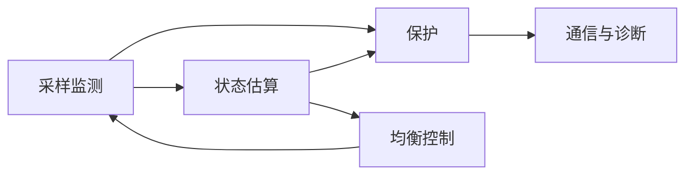

# 阶段 1 教程：认识 BMS

> 对应学习路线的阶段 1。目标：说清 BMS 是什么、解决什么问题、由哪些模块组成。
> 建议用时 1 周。前置：已通过阶段 0 验收。

---

## 1.1 为什么需要 BMS

阶段 0 已经得出结论：锂电池过充 → 热失控起火，过放 → 永久损伤。所以**每一节锂电池都必须被看管**。

但单节电池用一块简单保护电路就够了，真正需要"系统"的是**串联电池组**：

- 设备需要更高电压（12V、48V、400V、800V）→ 多节串联；
- 串联后，任何一节出问题都会拖累整组，且**无法只凭总电压判断单节状态**。

这就是 BMS 存在的理由：**看住每一节电池，而不是只看整包**。

## 1.2 串联电池组的特殊问题：不一致性

世界上没有两节完全相同的电池。差异来源：

- 制造：容量、内阻、自放电率的离散性；
- 使用：电池包内温度梯度（中间热、边缘冷）加速部分单体老化；
- 长期累积：差异随循环次数放大（发散性）。

**木桶效应**：整包可用容量被最弱的那节单体决定——

- 充电时，最弱单体**最先到达满充电压** → 必须提前停止充电（否则它过充）；
- 放电时，最弱单体**最先到达截止电压** → 必须提前停止放电（否则它过放）；
- 结果：整包只能用"最弱单体的容量"，而且最弱单体每次都工作在更极限的区间，老化更快 → 恶性循环。

BMS 的两个手段：**监测每一节**（发现问题）+ **均衡**（主动缩小差异）。

## 1.3 BMS 的五大功能模块



| 模块 | 干什么 | 关键指标 |
|---|---|---|
| **采样监测** | 测每串电压、总压、电流、温度（NTC） | 电压精度 ±5mV 级；电流精度 <1% |
| **保护** | 超限时断开充放电回路（MOS/继电器） | 阈值、延时、恢复条件 |
| **均衡** | 缩小单体间电压/容量差异 | 均衡电流（被动 50–200mA） |
| **状态估算** | 计算 SOC（剩多少电）、SOH（老化程度）、SOP（能出多大力） | SOC 误差 <5% |
| **通信诊断** | 上报数据、记录故障、接受控制 | UART/CAN/RS485/BLE，CRC 校验 |

五大保护（**要求背下来**）：

1. **过充保护（OVP）**：任一单体电压 > 阈值（如 4.25V）→ 断充电 MOS；
2. **过放保护（UVP）**：任一单体电压 < 阈值（如 2.8V）→ 断放电 MOS；
3. **过流保护（OCP）**：放电电流 > 阈值且持续超过延时 → 断开；
4. **短路保护（SCD）**：电流瞬间巨大 → 微秒级快速断开；
5. **温度保护（OTP/UTP）**：高温禁止充放电，低温禁止充电（阶段 0 的析锂机制）。

注意保护三要素：**阈值 + 延时 + 恢复条件**。例如过放保护：单体 <2.8V 持续 1 秒 → 断开放电；恢复条件：插入充电器或电压回升到 3.0V 以上。

## 1.4 BMS 的三种形态

| 形态 | 构成 | 能做什么 | 不能做什么 | 典型场景 |
|---|---|---|---|---|
| **保护板** | 保护 IC + MOS（无 MCU） | 五大保护（阈值写死） | 无 SOC、无通信、不可配置 | 小家电、电动工具 |
| **智能 BMS** | AFE + MCU | 可编程保护、SOC 估算、通信、均衡策略 | — | 储能、两轮车、机器人 |
| **分布式 BMS** | 主控 BMU + 若干从板 CMU | 高压大串数（几十到几百串）、菊花链、功能安全 | 成本高 | 电动汽车、储能电站 |

- 保护板示例：DW01（单节）、S-8254A（3–4 节串联）——阶段 2 深入；
- 智能 BMS 示例：TI BQ769x2 + STM32——阶段 3 深入；
- 分布式示例：车用 96 串以上用 LTC681x 菊花链——阶段 6 深入。

## 1.5 保护决策逻辑（状态机雏形）

保护不是简单的"超限就断"，而是一套决策：

```
正常 ──超限且超过延时──▶ 保护状态（断开 MOS）
  ◀──满足恢复条件──────┘
```

- **为什么要延时**：电机启动、负载突变会产生毫秒级正常尖峰，无延时会误触发；
- **恢复条件举例**：
  - 过放保护 → 断开负载或插入充电器后恢复；
  - 过充保护 → 接入负载放电后恢复；
  - 短路保护 → 断开负载 + 延时后恢复；
- **故障分级**（阶段 6 展开）：提示（只上报）→ 限功率（降额运行）→ 断开（硬保护）。

## 1.6 均衡初步

- **被动均衡**：给电压偏高的单体并联电阻放电，把多余能量变成热量耗掉。只在充电末端（单体电压 > 阈值且整组接近充满）工作；均衡电流小（50–200mA），因为电阻功率有限。
- **主动均衡**：用电感/电容把高电压单体的能量**搬运**给低电压单体，不浪费能量、电流可做到安培级；电路复杂、成本高，大容量储能场景才划算。
- 直觉理解：被动均衡像"把高个子的水舀掉"，主动均衡像"把高个子的水倒进矮个子"。
- 关键认知：**均衡治不了根本**——均衡电流远小于充放电电流，它只能缓慢修正差异，不能替代一致性问题（选型、配组、热设计同样重要）。

## 1.7 自测题

1. 为什么串联电池组不能只看总电压判断状态？
2. 木桶效应在充电和放电两个方向分别怎么表现？
3. 背出五大保护及其典型动作（断哪个 MOS）。
4. 保护为什么需要延时？短路保护的延时为什么必须极短？
5. 保护板和智能 BMS 的本质区别是什么？
6. 被动均衡为什么只在充电末端工作？
7. 过放保护后，恢复条件通常是什么？为什么这样设计？
8. 为什么说均衡不能替代配组？

## 1.8 动手任务与验收

**动手任务**

1. 找一块成品保护板的规格书（如 3S/4S 三元锂保护板），列出它全部保护参数：OVP/UVP/OCP 阈值、延时、恢复条件；
2. 不看答案，画出你理解的 BMS 功能框图，标注每个模块的输入与输出；
3. 观察一次手机从 20% 充到 100% 的过程：注意前段快（CC）、末段慢（CV），与阶段 0 的充电曲线对应起来。

**验收清单**

- [ ] 能画出 BMS 功能框图并说清每个模块的输入输出
- [ ] 能默写五大保护及保护三要素（阈值/延时/恢复条件）
- [ ] 能说出三种 BMS 形态的差异与适用场景
- [ ] 能解释木桶效应与均衡的作用及局限

全部通过 → 进入 [阶段 2：保护板实践](../bms-resources.md#阶段-2基础实践保护板24-周)。
