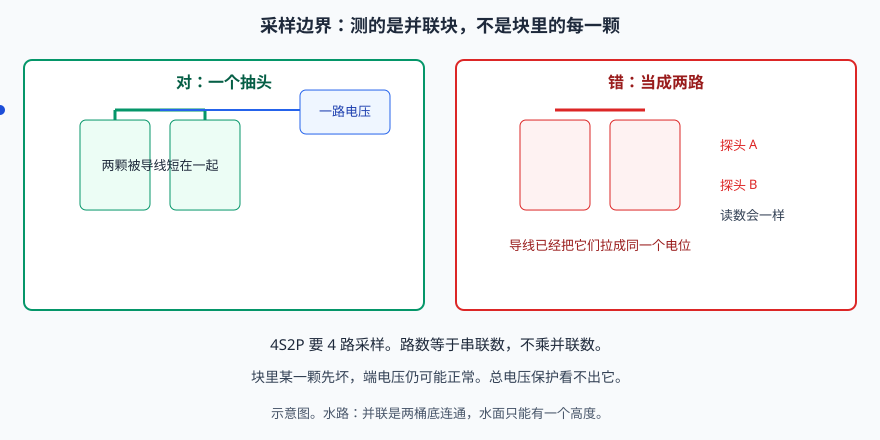
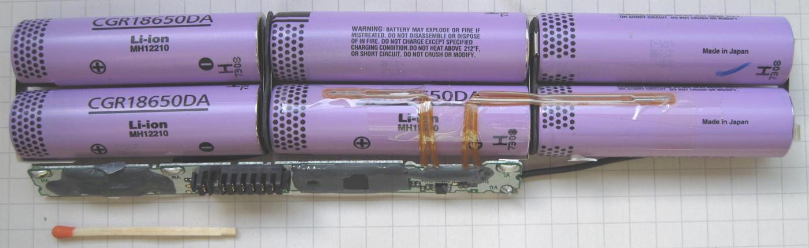
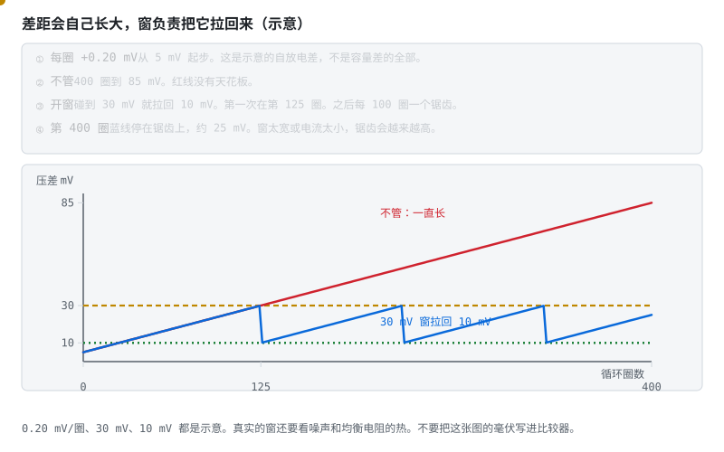
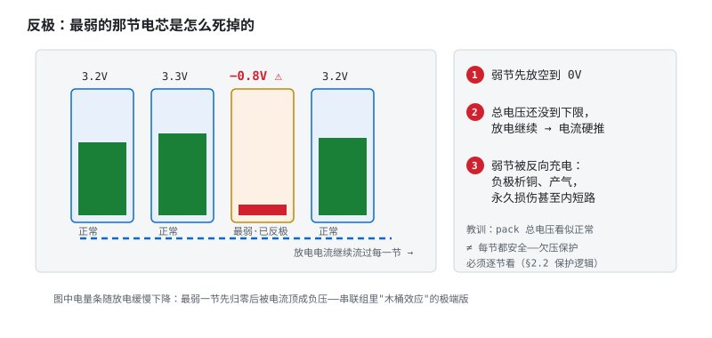
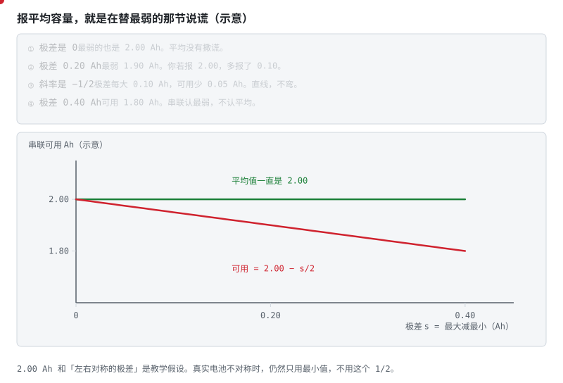
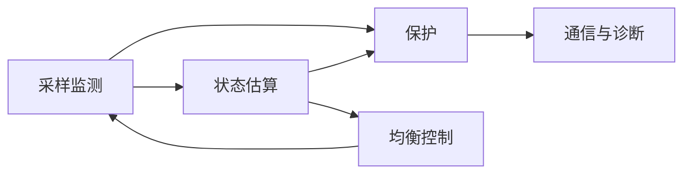
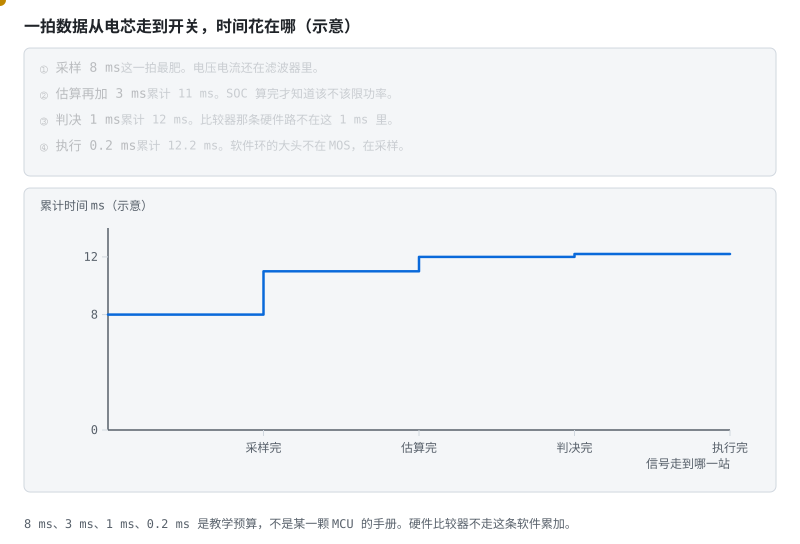
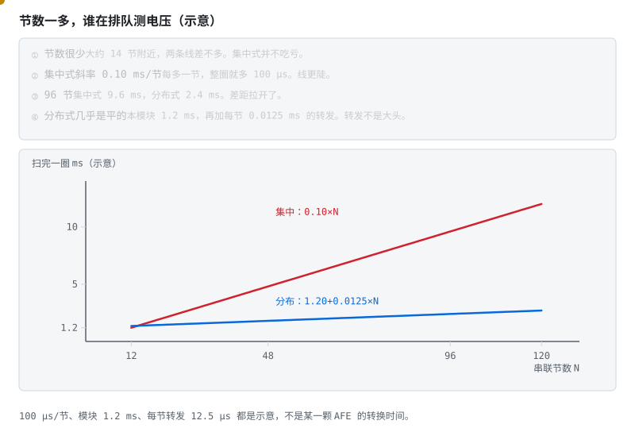

# 阶段 1 教程：认识 BMS

> **本篇你会学到**　一节电池怎么变成一串队伍：木桶效应、五大功能、五大保护，以及保护板和智能 BMS 怎么选。
> **预计用时**　1 周。
> **前置**　阶段 0 的 §0.1 最低验收。电路和嵌入式可以后补，见 [前两周怎么走](getting-started.md)。

> 对应学习路线的阶段 1。建议用时 1 周。前置：阶段 0 **§0.1 最低验收**（电路/嵌入式可后补，见 [前两周怎么走](getting-started.md)）。
> 🔍 配套深入解析（含动画）：[电路详解 ① 功率回路](../circuits/01-功率回路-MOS保护与预充.md)（可与本阶段并行，也可阶段 2 再精读）
> 可选讲义：[ECE5720 Notes01《BMS 需求》中文导读](../ece5720-notes01-中文导读.md)（非官方编译）。采样、接触器、绝缘、保护和功率限制的需求清单在那一章。

---

## 本页目录

按层走先看 [能力地图](bloom-map.md)。标题末尾的 `[记忆]` … `[创造]` 是布鲁姆层级。

- [1.1 从一节电池到一支"马拉松队伍" [理解]](stage-1-认识BMS.md#11-从一节电池到一支马拉松队伍-理解)
- [1.2 木桶效应：亲眼看看浪费有多大 [理解]](stage-1-认识BMS.md#12-木桶效应亲眼看看浪费有多大-理解)
- [1.3 BMS 的五大功能模块 [理解]](stage-1-认识BMS.md#13-bms-的五大功能模块-理解)
- [1.4 五大保护：名词、断口与三要素 [记忆]](stage-1-认识BMS.md#14-五大保护名词断口与三要素-记忆)
- [1.4b 五大保护：每一条背后都有一个事故 [理解]](stage-1-认识BMS.md#14b-五大保护每一条背后都有一个事故-理解)
- [1.5 热失控链：为什么安全是最高优先级 [理解]](stage-1-认识BMS.md#15-热失控链为什么安全是最高优先级-理解)
- [1.6 BMS 的三种形态 [理解]](stage-1-认识BMS.md#16-bms-的三种形态-理解)
- [1.7 保护决策逻辑（状态机雏形） [理解]](stage-1-认识BMS.md#17-保护决策逻辑状态机雏形-理解)
- [1.8 均衡初步 [理解]](stage-1-认识BMS.md#18-均衡初步-理解)
- [1.9 自测题 [理解]](stage-1-认识BMS.md#19-自测题-理解)
- [1.10 动手任务 [应用]](stage-1-认识BMS.md#110-动手任务-应用)
- [1.11 验收清单 [评价]](stage-1-认识BMS.md#111-验收清单-评价)

## 1.1 从一节电池到一支"马拉松队伍" [理解]

阶段 0 的结论：锂电池过充会起火，过放会慢性自杀。一节电池配一块保护电路就够了——手机电池就是这么活的。

**视频**　B 站 · [《BMS 项目实战》](https://www.bilibili.com/video/BV1pv4y1T7Xi/)

放在串联成组之前，是因为这条中文视频先把「为什么要有 BMS」讲成完整的小项目，再回来看木桶和五大模块。播放器打不开时用原页。门户页有内嵌：[视频教程](../../BMS学习路径.html#videos)。

但设备要的电压越来越高：电动工具 12–21V、两轮车 48–72V、储能 51.2V、电动车 400–800V。单节锂电池满打满算 4.2V，怎么办？**串联**。

一串起来，游戏规则就变了。把 16 节电池想象成 16 个绑腿跑的运动员，规则残酷：

- 电流相同——**所有人的配速完全一样**（串联电流处处相等）；
- 但每个人的"体力"（容量、内阻、自放电率）天生不同，跑步时的体温（环境温度）也不一样；
- 裁判只看一件事：**任何一个人倒下（过放）或撞线（过充），全队立即停止。**

于是最弱的那个队员决定了全队的成绩——而且他每次都被迫第一个冲过极限，体力透支得更快，下一场更弱。这就是 BMS 存在的理由：**盯着队伍里的每一个人，不让任何一个人倒下，还要想办法让弱的跟上。**

串联解决电压，并联解决容量——两种组合可以同时上（4S2P 之类）：



> **图说**　串并联成组动画

> **口诀**　串联抬电压，并联加容量。采样路数等于串联数。

底栏把卡通里的 3.7 V 收成直线：\(V=3.7	imes N_s\)。4 串是 14.8 V，和画面上的总压一致。2 并仍是 20 Ah，那是另一条乘法，不画在这根电压线上。黄点从 1 串走到 4 串。


注意最后一幕：**BMS 的监测对象是"并联块"而不是单颗电芯**——并联块内部被导线强制等电位，测不出单颗。所以 4S2P 只需要 4 路采样，采样路数永远等于串联数 S。

**练完你会怎样**：你能用上面那句口诀，把这张图讲给别人听。



> **图说**　左边两颗电芯被导线接在一起，只引出一路电压。

> **口诀**　并联块只有一个电压。块里坏一颗，端电压可以仍正常。

**看动画时盯住哪里**

右边把两根探头当成两路采样，读数仍会一样，因为导线已经把它们拉成同一个电位。4S2P 是 4 路，不是 8 路。块里某一颗先坏，端电压可以仍正常。示意图。

**练完你会怎样**：你能用上面那句口诀，把这张图讲给别人听。



打开的笔记本电池包：圆柱电芯串在一起，底部小电路板是充电和安全电路，有的电芯上贴着温度传感器。采样和保护是贴着电芯做的。来源见 [照片来源](../circuits/assets/photos/PHOTOS.md)。

> **原理**　阶段 0 的结论：锂电池过充会起火，过放会慢性自杀。一节电池配一块保护电路就够了——手机电池就是这么活的。
> **证据**　可核验演示：本节 SVG（浏览器打开即播），正文有不看动画也能读的说明。串联电流相同，最弱的一节决定整包。成组关系见本节动画。扫盲 [瑞萨《BMS 教程》中文导读](../renesas-bms-tutorial-中文导读.md)。
> **延伸阅读**　[《过充与过热热失控的差异》](https://www.mdpi.com/2313-0105/11/7/242)（英文，可选）

## 1.2 木桶效应：亲眼看看浪费有多大 [理解]


> **图说**　木桶效应动画

> **口诀**　串联电流一样。最矮的那一节锁死整桶。

底栏用的就是画面上的数：另外三节 50 Ah 时，整包可用等于最弱那节。最弱从 50 收到 35，可用也从 50 收到 35，斜率是 1。绿线停在 50，那是强节的名牌，整包拿不到。黄点沿着「可用 = 最弱」走。


动画里 3 号电池容量只有 35Ah，其他三节都是 50Ah：

- **充电**：同样的电流灌进去，3 号先到自己的满充线——BMS 必须停充，其他三节只充到七成；
- **放电**：水的确是一起往下走的（串联电流相同），但**端电压**不一样——3 号容量小（SOC 掉得快）、内阻通常还更大（IR 压降更狠），同样电流下它的端电压最先跌破截止线 → BMS 必须停放；
- **结果**：整包可用容量被锁死在 **35Ah**。注意别算错账——**串联电流处处相同，容量（Ah）不相加；只有电压（V）和能量（Wh）按串数累加**（要加 Ah 得靠并联）。其余三节头部空间成了永远用不到的"死容量"，损失的是能量：3 节好电池各浪费约 15Ah × 3.2V ≈ 48Wh。

> 严谨补一刀：充电时先触发 OVP 的是**端电压最高**的那节，放电时先触发 UVP 的是**端电压最低**的那节——不一定是同一节。"容量最小"只是"最弱"的一种来源：内阻大、温度高、SOC 偏低，都能让一节电池先触线。

更糟的是恶性循环：最弱单体每次都工作在最高 SOC（充电末端它电压最高）和最低 SOC（放电末端它电压最低）的极限区间，老化速度比兄弟们快，容量差距随循环次数**越拉越大**——不加干预，整包可用容量的缩水速度会远快于单体的自然老化。

若每一圈只固定长大一点点，不管它，压差就是一根没有天花板的直线。均衡窗的作用，是在它碰到门槛时拉回来：

**练完你会怎样**：你能用上面那句口诀，把这张图讲给别人听。



> **图说**　示意从 5 mV 起步，每圈 +0.20 mV。

> **口诀**　不管，差距按圈往上爬。窗负责在门槛上把它拉回来。

**看动画时盯住哪里**

不管的话，400 圈到 85 mV。开了窗：碰到 30 mV 就拉回 10 mV。第一次在第 125 圈，之后每 100 圈一个锯齿。第 400 圈停在大约 25 mV，而不是 85 mV。

- 红线一直爬，没有回头。
- 蓝线和黄点走锯齿：上到 30 mV，回到 10 mV。
- 两条横线就是这个窗。窗太宽，锯齿会越来越高。

**短自测**

1. 为什么第 125 圈才第一次拉回来？
2. 400 圈不管和开窗，示意各是多少毫伏？
3. 30 mV 能写进你的比较器吗？

<details>
<summary><b>参考答案（先自己想完再展开）</b></summary>

1. (30−5)/0.20 = 125。这是这张图的口算，不是你的包长多快。
2. 不管约 85 mV，开窗后落在锯齿上，约 25 mV。
3. 不能。30 mV 和 10 mV 是教学窗。真实门槛还要看噪声和均衡电阻的热。

</details>

**练完你会怎样**：你看见压差慢慢变大时，会去问均衡窗有没有把它拉住，而不是等它自己停。


均衡电流搬得动这点自放电差，搬不动两节电芯本来就不在同一容量档。错芯那一节，加大均衡没有用，见阶段 6。

恶性循环的终点比"缩水"更可怕——放电末端如果没人喊停，最弱那节会被同伴的电流**反向充电**：



> **图说**　串联放电时电流流过每一节；最弱一节先放空到 0V，但 pack 总电压还没到下限，放电继续——电流硬推着这节进入负压（反极），负极析铜、产气，造成永久损伤甚至内短路。

> **口诀**　总电压还没到下限，最弱的一节可以已经反极。

**看动画时盯住哪里**

这就是"欠压保护必须逐节看"的原因：总电压正常 ≠ 每节都安全。

BMS 的两件武器：**监测**（看见每个人的状态）和**均衡**（把水位拉齐——本阶段末讲原理，阶段 3 讲电路）。

> **原理**　串联时整包容量由最弱的一节决定。总电压正常，不代表每一节都还在安全区，所以欠压必须逐节看。
> **证据**　串联容量由最弱一节决定。反极损伤的动画在本节；成组背景见 [瑞萨导读](../renesas-bms-tutorial-中文导读.md)。
> **延伸阅读**　[阶段 1 教程](stage-1-认识BMS.md)


木桶那张图已经说「最弱的锁死整包」。这里把账算出来。

**练完你会怎样**：你能用上面那句口诀，把这张图讲给别人听。



> **图说**　最弱节决定可用安时

> **口诀**　串联认最小。平均是安慰，不是容量。

**看动画时盯住哪里**

红点沿下降的直线走。绿线不许跟着掉。两线开口就是被浪费的安时。

示意：平均容量钉在 2.00 Ah，极差 \(s\) 左右对称，最弱的就是 \(2.00-s/2\)。极差 0.20 Ah，可用 1.90 Ah。极差 0.40 Ah，可用 1.80 Ah。斜率是 \(-\frac{1}{2}\)，直线，不弯。绿线一直停在 2.00，那是「我用平均值报容量」的谎言。

若四节并不对称，比如 2.10、2.00、1.95、1.80 Ah，平均大约 1.96 Ah，整包仍是 1.80 Ah。这时不要再用 \(s/2\)。最小值永远对，对称公式只在这张图的假设里对。

**短自测**

1. 极差 0.40 Ah、平均 2.00 Ah、左右对称时，可用多少？
2. 上面那四节不对称的例子，为什么不能用 \(s/2\)？

<details>
<summary><b>参考答案（先自己想完再展开）</b></summary>

1. 1.80 Ah。
2. \(s/2\) 假定最弱和最强到平均值的距离一样。不对称时只取最小的那一节。2.10 与 1.80 的极差是 0.30 Ah，可用仍是 1.80，不是 \(2.00-0.15\)。

</details>

**练完你会怎样**：报整包容量时，你先找最小的那一节，再决定要不要提平均。


## 1.3 BMS 的五大功能模块 [理解]



| 模块 | 干什么 | 关键指标 |
|---|---|---|
| **采样监测** | 测每串电压、总压、电流、温度（NTC） | 电压精度 ±5mV 级；电流精度 <1% |
| **保护** | 超限时断开充放电回路（MOS/继电器） | 阈值、延时、恢复条件 |
| **均衡** | 缩小单体间电压/容量差异 | 均衡电流（被动常见 50–200mA，示例范围） |
| **状态估算** | 算 SOC（剩多少电）、SOH（老没老）、SOP（能出多大力） | SOC 误差 <5% |
| **通信诊断** | 上报数据、记录故障、接受控制 | UART/CAN/RS485/BLE + CRC |

初学者最容易犯的错是把 BMS 理解成"一块保护板"。保护只是五项之一，而且是兜底项——**真正值钱的是采样精度和状态估算**（阶段 3、4 的主战场）。

> **原理**　初学者最容易犯的错是把 BMS 理解成"一块保护板"。保护只是五项之一，而且是兜底项——**真正值钱的是采样精度和状态估算**（阶段 3、4 的主战场）。
> **证据**　入口 [瑞萨《BMS 教程》中文导读](../renesas-bms-tutorial-中文导读.md)。过充链见 [《过充与过热热失控的差异》](https://www.mdpi.com/2313-0105/11/7/242)（英文，可选）。
> **延伸阅读**　[BU-808](https://batteryuniversity.com/article/bu-808-how-to-prolong-lithium-based-batteries/)（英文，可选）。五类需求的讲义整理见 [ECE5720 Notes01 中文导读](../ece5720-notes01-中文导读.md)。


五项功能不是同时发生的。一拍数据要排队。



> **图说**　信号链时间账

> **口诀**　软件这一拍，大头在采样，不在 MOS。

**看动画时盯住哪里**

黄点在四段平台上跳。第一段最高的一截，就是采样。最后那 0.2 ms 几乎贴着前一截。

示意预算：采样 8 ms，估算 3 ms，判决 1 ms，执行 0.2 ms。累计 8、11、12、12.2 ms。台阶是加出来的，不是拟合出来的。硬件比较器那条过流、短路的路不在这 12.2 ms 里。它不排队。

设计时若把「MOS 只要 0.2 ms」当成整条保护的速度，软件环的 8 ms 采样就被藏起来了。

**短自测**

1. 四段加完是多少毫秒？
2. 短路比较器为什么不在这张累加里？

<details>
<summary><b>参考答案（先自己想完再展开）</b></summary>

1. 12.2 ms。
2. 它不经过 MCU 这一拍。微秒级关断是另一条硬件路。这里的数字都是示意预算。

</details>

**练完你会怎样**：你能把「反应时间」拆开，指出哪一段最肥。


## 1.4 五大保护：名词、断口与三要素 [记忆]

要求先背下来的五条。下面的电压是三元锂体系的**示例值**——铁锂、钛酸锂完全不同，以保护 IC 的阈值版本与产品规格为准。

1. **过充保护（OVP）**：任一单体 > 阈值（如 4.25V）→ 断**充电** MOS。
2. **过放保护（UVP）**：任一单体 < 阈值（如 2.8V）→ 断**放电** MOS。
3. **过流保护（OCP）**：电流 > 阈值且持续超过延时 → 断开对应方向的 MOS。
4. **短路保护（SCD）**：电流瞬间暴增 → **微秒级**断开放电 MOS。
5. **温度保护（OTP/UTP）**：高温禁充放（两个都断）、低温禁充（断充电 MOS）。

**保护三要素**就三个词：**阈值 + 延时 + 恢复条件**。恢复条件先记这三句搭配：过放后插充电器恢复；过充后接负载放电恢复；短路后卸载并延时恢复。

> **先读/后读**：本节只记名字、断哪个开关、三要素叫什么（记忆）。每一条「没有它会怎样」、以及延时为什么不能省，在下一节（理解）。

> **原理**　要求先背下来的五条。下面的电压是三元锂体系的**示例值**——铁锂、钛酸锂完全不同，以保护 IC 的阈值版本与产品规格为准。
> **证据**　名词、断口和三要素是记忆项。单节阈值示例对照 [华之美 DW01A 数据手册](https://hmsemi.com/downfile/DW01A.PDF)，以料号为准。
> **延伸阅读**　[ABLIC S-8254A 中文手册](https://www.ablic.com/cn/doc/datasheet/battery_protection/S8254A_C.pdf)

## 1.4b 五大保护：每一条背后都有一个事故 [理解]

1. **没有 OVP**：充电机失控或充电器不匹配时，阶段 0 讲的热失控五幕剧完整上演。
2. **没有 UVP**：用户把设备用到「自动关机」还继续放，铜枝晶悄悄生长，电池变成定时炸弹。
3. **没有 OCP**：电机堵转、控制器击穿时，线束和 MOS 在几秒内变成电热丝。
4. **没有 SCD**：一把扳手搭在两个端子上，火花四溅、MOS 炸裂——短路电流上千安培时，**毫秒都嫌慢**。
5. **没有 OTP/UTP**：冬天户外快充等于批量制造锂枝晶；高温环境使用等于几倍速消耗寿命。

为什么要延时：电机启动、负载突变的毫秒级尖峰是正常现象，无延时会误触发到怀疑人生。过充是化学过程，留秒级延时是为了躲开电压毛刺；短路是 I²t，毫秒都嫌慢。两者不是同一套时间。

工程里还有「故障分级」：提示 → 限功率 → 断开（阶段 6 展开）。

> **原理**　五条保护各自挡住一种事故：过充走向热失控，过放留下铜枝晶，过流和短路烧线束与 MOS，过温把副反应加快。
> **证据**　每条保护背后是一次化学或电气事故。过充链见 [《过充与过热热失控的差异》](https://www.mdpi.com/2313-0105/11/7/242)（英文，可选）。
> **延伸阅读**　[BU-808](https://batteryuniversity.com/article/bu-808-how-to-prolong-lithium-based-batteries/)（英文，可选）

## 1.5 热失控链：为什么安全是最高优先级 [理解]


> **图说**　热失控链动画

> **口诀**　过充把锂逼出来，刺穿隔膜才到起火。

底栏把「看斜率」算成两条直线，从 25 °C 出发，走 10 s。0.05 °C/s 只到 25.5 °C；1 °C/s 到 35 °C。黄点沿慢的那条走。完整的拐弯和 70 s 处的早警，在阶段 6 的速率图里。这里先记住：同样的时间，斜率差一个数量级，温度差就出来了。


阶段 0 讲过的热失控链再看一遍动态版（动画把五步压缩成四幕），这次注意**时间轴**：从过充到起火可能只要几分钟到几十分钟，但早期信号（某节温升速率异常）比"温度高"出现得早得多。

所以量产 BMS 不只盯绝对温度，还盯 **dT/dt（温升速率）**——一节电池在整包都正常时独自快速升温，就是热失控的最早可观测信号。很多项目把防过充定为 BMS 里等级最高的安全条目（示例：ASIL C/D，具体由 HARA 定级决定，阶段 6 细讲）。

> **原理**　阶段 0 讲过的热失控链再看一遍动态版（动画把五步压缩成四幕），这次注意**时间轴**：从过充到起火可能只要几分钟到几十分钟，但早期信号（某节温升速率异常）比"温度高"出现得早得多。
> **证据**　过充触发的热失控（析锂、刺膜、正极释氧）见 [Batteries 2025 综述](https://www.mdpi.com/2313-0105/11/7/242)（英文，可选）。
> **延伸阅读**　[瑞萨《BMS 教程》中文导读](../renesas-bms-tutorial-中文导读.md)。固态电芯短路仍会放热，见 [阶段 0 §0.1.8](stage-0-前置知识.md#018-固态电池固体电解质换掉了什么-理解)。

**练完你会怎样**：你能用上面那句口诀，把这张图讲给别人听。

## 1.6 BMS 的三种形态 [理解]

> **先读/后读**：本节讲每种形态是什么（理解）。该买保护板还是做智能 BMS，是评价，去 [按目标选路线](按目标选路线.md)。

| 形态 | 构成 | 能做什么 | 不能做什么 | 典型场景 |
|---|---|---|---|---|
| **保护板** | 保护 IC + MOS（无 MCU） | 五大保护（阈值写死） | 无 SOC、无通信、不可配置 | 小家电、电动工具 |
| **智能 BMS** | AFE + MCU | 可编程保护、SOC 估算、通信、均衡调度 | — | 储能、两轮车、机器人 |
| **分布式 BMS** | 主控 BMU + 从板 CMU×N | 几十到几百串、菊花链、功能安全 | 贵 | 电动汽车、储能电站 |

这条路线的主线是中间那档（阶段 3 主战场），两头分别在阶段 2 和阶段 6 触及。

**视频**　YouTube · 英文，可选 · [GreatScott!《BMS || DIY or Buy》](https://www.youtube.com/watch?v=rT-1gvkFj60)

放在三种形态这里，是因为这条片用硬件视角比较自制保护板和成品板，对应「买一块还是自己做」。需要能打开 YouTube 的网络。中文门户页有内嵌播放器。

[](https://www.youtube.com/watch?v=rT-1gvkFj60)

> **原理**　这条路线的主线是中间那档（阶段 3 主战场），两头分别在阶段 2 和阶段 6 触及。
> **证据**　保护板、智能 BMS、分布式，差在逻辑写死还是可编程，以及能管多少串。对照 [瑞萨《BMS 教程》中文导读](../renesas-bms-tutorial-中文导读.md) 与 [LibreSolar 固件](https://github.com/LibreSolar/bms-firmware)（英文，可选）。
> **延伸阅读**　[foxBMS 2](https://github.com/foxBMS/foxbms-2)（英文，可选）


三种形态的差别，也可以收成两条直线：节数一多，谁在排队测电压。



> **图说**　集中式与分布式的扫描时间

> **口诀**　节数少，集中式不吃亏。节数多，排队的是集中式。

**看动画时盯住哪里**

黄点贴着较平的那条（分布式）。陡的红线是集中式。看它们在左端几乎挨着，往右开口。

示意：集中式 \(T=0.10\times N\) ms，每节 100 µs。分布式 \(T=1.20+0.0125\times N\) ms：本模块先花 1.2 ms，转发每节再加 12.5 µs。两条线大约在 14 节附近碰上。96 节时，集中式 9.6 ms，分布式 2.4 ms。分布式的斜率很浅，大头是那固定的 1.2 ms，不是线上的飞行。

4 串的小包去上分布式，多半是在为还没出现的节数付钱。一百节仍用一根长线轮流测，圈时间会先爆。

**短自测**

1. 96 节时两条线各是多少毫秒？
2. 为什么节数很少时分布式不一定更快？

<details>
<summary><b>参考答案（先自己想完再展开）</b></summary>

1. 集中式 9.6 ms，分布式 2.4 ms。
2. 分布式有 1.2 ms 的固定账。交点大约在 14 节。100 µs、1.2 ms、12.5 µs 都是示意，不是某一颗 AFE 的转换时间。

</details>

**练完你会怎样**：你选集中还是分布，会先问节数，再问那一圈必须在多少毫秒内扫完。


## 1.7 保护决策逻辑（状态机雏形） [理解]

保护不是"超限就断"的一锤子买卖，而是一套决策：

```
正常 ──超限且超过延时──▶ 保护状态（断开 MOS）
  ◀──满足恢复条件──────┘
```

每个保护项都要回答三个问题：什么条件触发（阈值+延时）、断哪个开关、什么条件放人（恢复）。把这张表写清楚，你已经迈出了固件状态机设计的第一步（阶段 3 把它写成代码）。

看一个完整剧情（三元锂 3S 保护板，示例值）：单体 2.90V → 什么都没发生（高于 2.80V 阈值）；跌到 2.79V 但只持续 0.9s → 还是没发生（没超过 1s 延时）；2.79V 持续 1.1s → **触发**，断放电 MOS；卸载并插入充电器，电压回到 3.0V → **恢复**。阈值、延时、恢复条件，一个不缺才构成一次合格的保护。



> **图说**　保护去抖与回差动画

> **口诀**　毛刺清零。持续越线才断。回来要过回差。

上面剧情里的"1 秒延时"就是去抖：毛刺短于它，计时器清零、不动作；持续超限才走满计时、断开 MOS。恢复线比阈值更保守（回差），是为了防止电压在阈值附近抖动时开关反复跳。


> **原理**　每条保护都要写清触发（阈值加延时）、断开哪一侧、以及什么条件才允许恢复。只写超限就断，会反复打火或锁死。
> **证据**　每个状态写清进入、周期、退出，任意状态都能进故障。巡游动画在本节；代码落点是 `code/firmware` 的 `test_bms`。
> **延伸阅读**　[LibreSolar/bms-firmware](https://github.com/LibreSolar/bms-firmware)（英文，可选）

**短自测**　过程在 [保护去抖与回差](../circuits/assets/protection-debounce.svg)。数字沿用上面的三元 3S 示例。

1. 阈值 2.80 V、延时 1 s。单体在 2.79 V 停了 0.9 s，放电 MOS 断吗？
2. 恢复线如果也画在 2.80 V，纹波贴着这条线时开关会怎样？
3. 去抖挡的是哪一种误动作，回差挡的是哪一种？

<details>
<summary><b>参考答案（先自己想完再展开）</b></summary>

1. 不断。0.9 s 短于 1 s，计时清零。剧情里要 2.79 V 持续到 1.1 s 才断放电 MOS。
2. 会来回打。电压在阈值附近一抖，刚恢复又触发。恢复要设得更保守，示例里是回到 3.0 V 才放行。
3. 去抖挡短毛刺：没走满延时就当没发生。回差挡回来的路上来回跳：触发线和恢复线分开。

</details>

**练完你会怎样**：你能用上面那句口诀，把这张图讲给别人听。

## 1.8 均衡初步 [理解]

- **被动均衡**：给电压偏高的单体并一颗电阻，把多余能量烧成热量排掉。只在充电末端工作，电流 50–200mA（受电阻功率限制）。像"把高个子的水舀掉"；
- **主动均衡**：用电感/电容把高电压单体的能量**搬**给低电压单体——大部分能量被回收利用（开关与磁件仍有损耗）、电流可达安培级，电路复杂成本高。像"把高个子的水倒进矮个子"；
- 关键认知：**均衡治不了根本**。均衡电流比充放电电流小两三个数量级，只能缓慢修正差异——一致性要靠选型配组、热设计、均衡三管齐下。

**视频**　YouTube · 英文，可选 · [How does a BMS work? 被动与主动均衡](https://www.youtube.com/watch?v=q4wDa_m9-8E)

放在均衡初步，是因为动画把「烧掉」和「搬走」两条路分开了。效率数字仍以论文和手册为准，厂商宣传值不要直接当结论。

[](https://www.youtube.com/watch?v=q4wDa_m9-8E)

> **原理**　被动均衡是给偏高的那一节并一颗电阻，把多余能量变成热。电流只有几十到两百毫安，只能慢慢修，不能代替配组。
> **证据**　被动是电阻耗掉，主动是把能量搬走。定性对照 [MPS《主动均衡》](https://www.monolithicpower.com/en/learning/resources/active-balancing-how-it-works-and-its-advantages)（英文，可选，据厂商发布）。拓扑效率的定量对比仍见 [共建任务板](../共建任务板.md) T8。
> **延伸阅读**　[电感均衡拓扑综述](https://www.mdpi.com/2313-0105/11/2/77)（英文，可选）

**练完你会怎样**：你能画出五大模块，并说出串联时最矮的那一节锁死整包。过充把锂逼出来，短路你交给硬件的微秒，不交给软件的毫秒。去抖那道就地题在 §1.7，下面的长题用来收口。

## 1.9 自测题 [理解]

> **先读/后读**：第 3 题是 [记忆]（背出五条和断口）；其余是 [理解]。

1. 为什么串联组不能只看总电压判断状态？（提示：两节 3.0V + 两节 4.1V 的 4 串，总压是多少？）
2. 木桶效应里"死容量"是怎么产生的？为什么最弱单体老化会加速？
3. 背出五大保护及各自断哪个 MOS。
4. 为什么短路保护必须微秒级，而过充保护可以秒级？
5. dT/dt 报警为什么比绝对温度报警更早？
6. 保护板和智能 BMS 的本质区别是什么？
7. 过放保护的恢复条件为什么设计成"插充电器"？
8. 为什么说均衡不能替代配组？

<details>
<summary><b>参考答案（先自己想完再展开）</b></summary>

1. 总压 = 3.0×2 + 4.1×2 = **14.2V**，和"四节都 3.55V"的健康包**一模一样**。总压把"两节接近过放 + 两节接近过充"完全掩盖了。保护永远由**极值单体**触发而不是平均值，所以必须逐串监测——这就是 BMS 必须有多路采样的根本理由。
2. 串联电流处处相同：充电时**端电压最高**的那节先撞 OVP → 必须停充，其余各节的头部空间永远用不到；放电时**端电压最低**的那节先撞 UVP → 必须停放，其余各节的底部余量也用不到。两头用不到的部分就是死容量，整包可用容量被最弱单体锁死。老化加速是因为最弱单体每个循环都被推到最高 SOC（充电末端它电压最高）与最低 SOC（放电末端它电压最低）的极限区间工作，老化速率高于兄弟 → 容量差越拉越大 → 恶性循环。
3. **OVP** 过充 → 断**充电** MOS；**UVP** 过放 → 断**放电** MOS；**OCP** 过流 → 断对应方向的 MOS（充电过流断充电、放电过流断放电）；**SCD** 短路 → 断**放电** MOS，μs 级；**OTP/UTP** 温度 → 高温禁充放（两个都断）、低温禁充（断充电 MOS）。
4. 损伤机理的时间尺度差几个数量级。短路电流可上千安培，$I^2t$ 能量按**毫秒**计就能烧穿 MOS 硅片与线束，所以必须硬件比较器 μs 级直接关闸。过充是化学过程（脱锂、电解液氧化、析锂）在分钟级累积，而且阈值附近电压爬升缓慢；留秒级延时反而是**必要的**——用来躲开负载突变造成的电压毛刺。
5. 因为热失控是**自我加速的正反馈**（放热 → 升温 → 更放热）。等绝对温度到达报警阈值时，正反馈往往已经启动。而"整包都正常、某一节独自快速升温"这个**速率异常**出现在绝对值越线之前，是最早的可观测信号。所以量产 BMS 两个都盯。
6. 保护板（保护 IC + MOS，无 MCU）的保护逻辑**写死在模拟电路里**：阈值是激光修调的、延时由电容或片内定时决定，它不认识 SOC、不能通信、不可配置、不能升级。智能 BMS（AFE + MCU）把"感知"和"决策"分开：AFE 负责高精度采样与硬件保护兜底，MCU 负责可编程策略、SOC/SOH 估算、均衡调度、通信与故障记录。一句话：**保护板只会保护，智能 BMS 会管理**。
7. 如果允许"电压自己回升就恢复"，会陷入放电—恢复—再放电的死循环，把电池一步步拖向更深的过放，而保护板本身也在持续耗电。设计成"检测到充电器接入（或电压被外部抬到恢复值）才恢复"，保证恢复的前提是**有能量进来**，而不是电池自己虚弱地反弹。配套地，保护后进入微安级休眠——宁可装死也不继续掉电。
8. 量级问题。均衡电流只有几十到几百毫安，比充放电电流小**两三个数量级**，只能在充电末端缓慢修正微小差异。而配组解决的是单体容量/内阻/自放电率的**初始分布**：一开始就把 35Ah 和 50Ah 串在一起，均衡电流再跑也补不回 15Ah 的差距。一致性要靠选型配组、热设计（温度分布不均会持续制造新的不一致）、均衡三管齐下。

</details>

> **原理**　这些题考的是上面几节的机制。先盖住折叠答案，用自己的话讲完再展开。
> **证据**　这些题考木桶、五大保护和热失控。过充链见 [《过充与过热热失控的差异》](https://www.mdpi.com/2313-0105/11/7/242)（英文，可选）。
> **延伸阅读**　[瑞萨《BMS 教程》中文导读](../renesas-bms-tutorial-中文导读.md)

## 1.10 动手任务 [应用]

1. 找一块成品保护板的规格书，把它的 OVP/UVP/OCP/SCD/温度保护的**阈值、延时、恢复条件**抄成一张表——大部分规格书只给阈值，想想为什么；
2. 不看资料，默画 BMS 功能框图并标注每个模块的输入输出；
3. 算一算：12 串铁锂包，11 节 50Ah、1 节 46Ah，可用容量（Ah）和可用能量（Wh）各是多少？（答案：容量 ≈ **46Ah**——串联 Ah 不相加，被最弱那节锁死；能量 ≈ 46Ah × 12 × 3.2V ≈ **1.77kWh**）

> **原理**　动手是把机制变成一次可核对的记录：条件、读数、和规格差在哪。没有记录的操作不算做完。
> **证据**　动手是把功能框图画出来。对照 [瑞萨《BMS 教程》中文导读](../renesas-bms-tutorial-中文导读.md)。
> **延伸阅读**　[《过充与过热热失控的差异》](https://www.mdpi.com/2313-0105/11/7/242)（英文，可选）

## 1.11 验收清单 [评价]

- [ ] 能画出 BMS 功能框图并说清每个模块的输入输出
- [ ] 能默写五大保护 + 保护三要素
- [ ] 能讲清木桶效应与恶性循环
- [ ] 能说出三种 BMS 形态的差异与适用场景
- [ ] 能解释 dT/dt 早警的意义

> **本阶段一句话**：BMS 是串联电池队伍的裁判兼教练——盯住每一个人（监测），谁触线谁停赛（保护），还要帮弱的跟上（均衡）。

全部通过 → 进入 [阶段 2：保护板实践](stage-2-保护板实践.md)（总纲入口：[阶段 2](../bms-resources.md#阶段-2基础实践保护板24-周)）。

---

**上一篇**　[阶段 0 前置知识](stage-0-前置知识.md) ｜ **目录**　[阶段教程](../../README.md#阶段教程) ｜ **下一篇**　[阶段 2 保护板实践](stage-2-保护板实践.md) ｜ [学习路线总纲](../bms-resources.md) ｜ [术语表](../glossary.md)

> **原理**　验收问的是能不能用机制做判断。勾得上才进入下一阶段，勾不上就回到对应小节，而不是把目录再看一遍。
> **证据**　验收要能说出每一块的输入和输出。对照 [瑞萨《BMS 教程》中文导读](../renesas-bms-tutorial-中文导读.md)。
> **延伸阅读**　[《车用 BMS 功能安全设计方法论》](https://www.mdpi.com/1996-1073/14/21/6942)（英文，可选）
