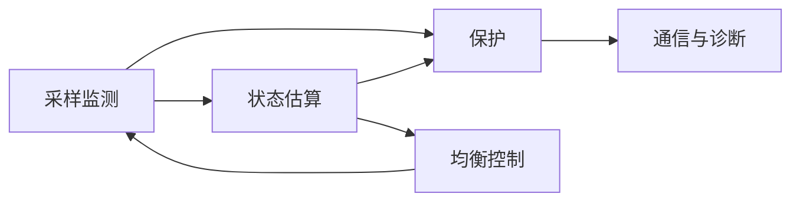

# 阶段 1 教程：认识 BMS

> 对应学习路线的阶段 1。建议用时 1 周。前置：已通过阶段 0 验收。
> 🔍 配套深入解析（含动画）：[电路详解 ① 功率回路](../circuits/01-功率回路-MOS保护与预充.md)

---

## 1.1 从一节电池到一支"马拉松队伍"

阶段 0 的结论：锂电池过充会起火，过放会慢性自杀。一节电池配一块保护电路就够了——手机电池就是这么活的。

但设备要的电压越来越高：电动工具 12–21V、两轮车 48–72V、储能 51.2V、电动车 400–800V。单节锂电池满打满算 4.2V，怎么办？**串联**。

一串起来，游戏规则就变了。把 16 节电池想象成 16 个绑腿跑的运动员，规则残酷：

- 电流相同——**所有人的配速完全一样**（串联电流处处相等）；
- 但每个人的"体力"（容量、内阻、自放电率）天生不同，跑步时的体温（环境温度）也不一样；
- 裁判只看一件事：**任何一个人倒下（过放）或撞线（过充），全队立即停止。**

于是最弱的那个队员决定了全队的成绩——而且他每次都被迫第一个冲过极限，体力透支得更快，下一场更弱。这就是 BMS 存在的理由：**盯着队伍里的每一个人，不让任何一个人倒下，还要想办法让弱的跟上。**

## 1.2 木桶效应：亲眼看看浪费有多大



动画里 3 号电池容量只有 35Ah，其他三节都是 50Ah：

- **充电**：同样的电流灌进去，3 号先到自己的满充线——BMS 必须停充，其他三节只充到七成；
- **放电**：水的确是一起往下走的（串联电流相同），但**端电压**不一样——3 号容量小（SOC 掉得快）、内阻通常还更大（IR 压降更狠），同样电流下它的端电压最先跌破截止线 → BMS 必须停放；
- **结果**：整包可用容量被锁死在 **35Ah**。注意别算错账——**串联电流处处相同，容量（Ah）不相加；只有电压（V）和能量（Wh）按串数累加**（要加 Ah 得靠并联）。其余三节头部空间成了永远用不到的"死容量"，损失的是能量：3 节好电池各浪费约 15Ah × 3.2V ≈ 48Wh。

> 严谨补一刀：充电时先触发 OVP 的是**端电压最高**的那节，放电时先触发 UVP 的是**端电压最低**的那节——不一定是同一节。"容量最小"只是"最弱"的一种来源：内阻大、温度高、SOC 偏低，都能让一节电池先触线。

更糟的是恶性循环：最弱单体每次都工作在最高 SOC（充电末端它电压最高）和最低 SOC（放电末端它电压最低）的极限区间，老化速度比兄弟们快，容量差距随循环次数**越拉越大**——不加干预，整包可用容量的缩水速度会远快于单体的自然老化。

BMS 的两件武器：**监测**（看见每个人的状态）和**均衡**（把水位拉齐——本阶段末讲原理，阶段 3 讲电路）。

## 1.3 BMS 的五大功能模块



| 模块 | 干什么 | 关键指标 |
|---|---|---|
| **采样监测** | 测每串电压、总压、电流、温度（NTC） | 电压精度 ±5mV 级；电流精度 <1% |
| **保护** | 超限时断开充放电回路（MOS/继电器） | 阈值、延时、恢复条件 |
| **均衡** | 缩小单体间电压/容量差异 | 均衡电流（被动常见 50–200mA，示例范围） |
| **状态估算** | 算 SOC（剩多少电）、SOH（老没老）、SOP（能出多大力） | SOC 误差 <5% |
| **通信诊断** | 上报数据、记录故障、接受控制 | UART/CAN/RS485/BLE + CRC |

初学者最容易犯的错是把 BMS 理解成"一块保护板"。保护只是五项之一，而且是兜底项——**真正值钱的是采样精度和状态估算**（阶段 3、4 的主战场）。

## 1.4 五大保护：每一条背后都有一个事故

要求背下来的五条，配上"如果没有它"的场景：

1. **过充保护（OVP）**：任一单体 > 阈值（如 4.25V）→ 断充电 MOS。
   *没有它*：充电机失控或充电器不匹配时，阶段 0 讲的热失控五幕剧完整上演。
2. **过放保护（UVP）**：任一单体 < 阈值（如 2.8V）→ 断放电 MOS。
   *没有它*：用户把设备用到"自动关机"还继续放，铜枝晶悄悄生长，电池变成定时炸弹。
3. **过流保护（OCP）**：电流 > 阈值且持续超过延时 → 断开。
   *没有它*：电机堵转、控制器击穿时，线束和 MOS 在几秒内变成电热丝。
4. **短路保护（SCD）**：电流瞬间暴增 → 微秒级断开。
   *没有它*：一把扳手搭在两个端子上，火花四溅、MOS 炸裂——短路电流上千安培时，**毫秒都嫌慢**。
5. **温度保护（OTP/UTP）**：高温禁充放、低温禁充。
   *没有它*：冬天户外快充 = 批量制造锂枝晶；高温环境使用 = 几倍速消耗寿命。

> 以上阈值均为三元锂体系的**示例值**——铁锂、钛酸锂的阈值完全不同，具体以保护 IC 的阈值版本与产品规格为准。

**保护三要素**（写进骨子里）：**阈值 + 延时 + 恢复条件**。

- 为什么要延时：电机启动、负载突变的毫秒级尖峰是正常现象，无延时会误触发到怀疑人生；
- 恢复条件举例：过放后插充电器恢复；过充后接负载放电恢复；短路后卸载延时恢复；
- 工程里还有"故障分级"：提示 → 限功率 → 断开（阶段 6 展开）。

## 1.5 热失控链：为什么安全是最高优先级



阶段 0 讲过的四幕剧再看一遍动态版，这次注意**时间轴**：从过充到起火可能只要几分钟到几十分钟，但早期信号（某节温升速率异常）比"温度高"出现得早得多。

所以量产 BMS 不只盯绝对温度，还盯 **dT/dt（温升速率）**——一节电池在整包都正常时独自快速升温，就是热失控的最早可观测信号。很多项目把防过充定为 BMS 里等级最高的安全条目（示例：ASIL C/D，具体由 HARA 定级决定，阶段 6 细讲）。

## 1.6 BMS 的三种形态

| 形态 | 构成 | 能做什么 | 不能做什么 | 典型场景 |
|---|---|---|---|---|
| **保护板** | 保护 IC + MOS（无 MCU） | 五大保护（阈值写死） | 无 SOC、无通信、不可配置 | 小家电、电动工具 |
| **智能 BMS** | AFE + MCU | 可编程保护、SOC 估算、通信、均衡调度 | — | 储能、两轮车、机器人 |
| **分布式 BMS** | 主控 BMU + 从板 CMU×N | 几十到几百串、菊花链、功能安全 | 贵 | 电动汽车、储能电站 |

这条路线的主线是中间那档（阶段 3 主战场），两头分别在阶段 2 和阶段 6 触及。

## 1.7 保护决策逻辑（状态机雏形）

保护不是"超限就断"的一锤子买卖，而是一套决策：

```
正常 ──超限且超过延时──▶ 保护状态（断开 MOS）
  ◀──满足恢复条件──────┘
```

每个保护项都要回答三个问题：什么条件触发（阈值+延时）、断哪个开关、什么条件放人（恢复）。把这张表写清楚，你已经迈出了固件状态机设计的第一步（阶段 3 把它写成代码）。

看一个完整剧情（三元锂 3S 保护板，示例值）：单体 2.90V → 什么都没发生（高于 2.80V 阈值）；跌到 2.79V 但只持续 0.9s → 还是没发生（没超过 1s 延时）；2.79V 持续 1.1s → **触发**，断放电 MOS；卸载并插入充电器，电压回到 3.0V → **恢复**。阈值、延时、恢复条件，一个不缺才构成一次合格的保护。

## 1.8 均衡初步

- **被动均衡**：给电压偏高的单体并一颗电阻，把多余能量烧成热量排掉。只在充电末端工作，电流 50–200mA（受电阻功率限制）。像"把高个子的水舀掉"；
- **主动均衡**：用电感/电容把高电压单体的能量**搬**给低电压单体——大部分能量被回收利用（开关与磁件仍有损耗）、电流可达安培级，电路复杂成本高。像"把高个子的水倒进矮个子"；
- 关键认知：**均衡治不了根本**。均衡电流比充放电电流小两三个数量级，只能缓慢修正差异——一致性要靠选型配组、热设计、均衡三管齐下。

## 1.9 自测题

1. 为什么串联组不能只看总电压判断状态？（提示：两节 3.0V + 两节 4.1V 的 4 串，总压是多少？）
2. 木桶效应里"死容量"是怎么产生的？为什么最弱单体老化会加速？
3. 背出五大保护及各自断哪个 MOS。
4. 为什么短路保护必须微秒级，而过充保护可以秒级？
5. dT/dt 报警为什么比绝对温度报警更早？
6. 保护板和智能 BMS 的本质区别是什么？
7. 过放保护的恢复条件为什么设计成"插充电器"？
8. 为什么说均衡不能替代配组？

## 1.10 动手任务与验收

**动手任务**

1. 找一块成品保护板的规格书，把它的 OVP/UVP/OCP/SCD/温度保护的**阈值、延时、恢复条件**抄成一张表——大部分规格书只给阈值，想想为什么；
2. 不看资料，默画 BMS 功能框图并标注每个模块的输入输出；
3. 算一算：12 串铁锂包，11 节 50Ah、1 节 46Ah，可用容量（Ah）和可用能量（Wh）各是多少？（答案：容量 ≈ **46Ah**——串联 Ah 不相加，被最弱那节锁死；能量 ≈ 46Ah × 12 × 3.2V ≈ **1.77kWh**）

**验收清单**

- [ ] 能画出 BMS 功能框图并说清每个模块的输入输出
- [ ] 能默写五大保护 + 保护三要素
- [ ] 能讲清木桶效应与恶性循环
- [ ] 能说出三种 BMS 形态的差异与适用场景
- [ ] 能解释 dT/dt 早警的意义

> **本阶段一句话**：BMS 是串联电池队伍的裁判兼教练——盯住每一个人（监测），谁触线谁停赛（保护），还要帮弱的跟上（均衡）。

全部通过 → 进入 [阶段 2：保护板实践](../bms-resources.md#阶段-2基础实践保护板24-周)。
