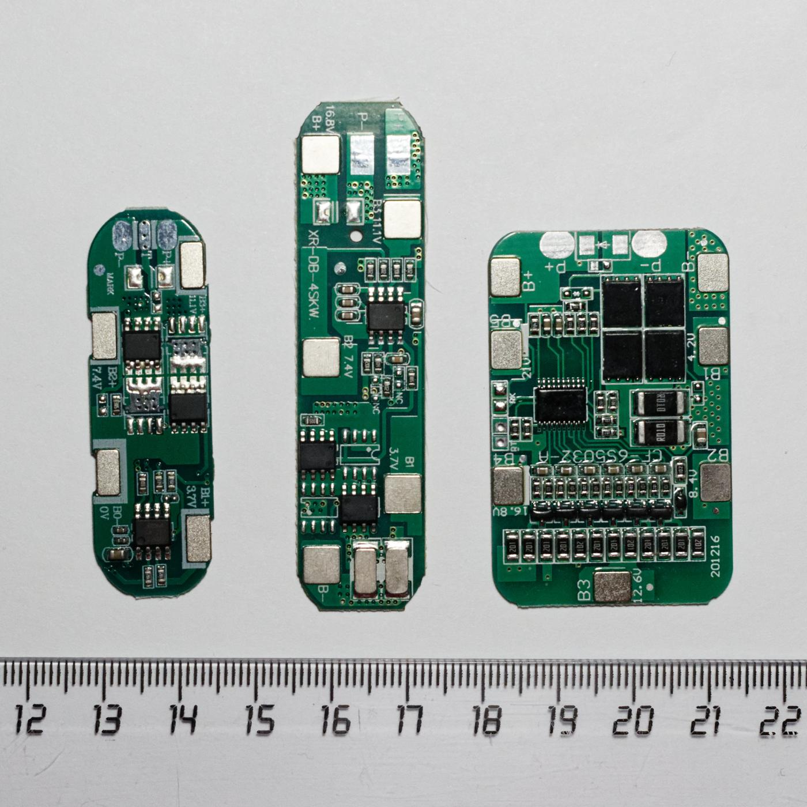
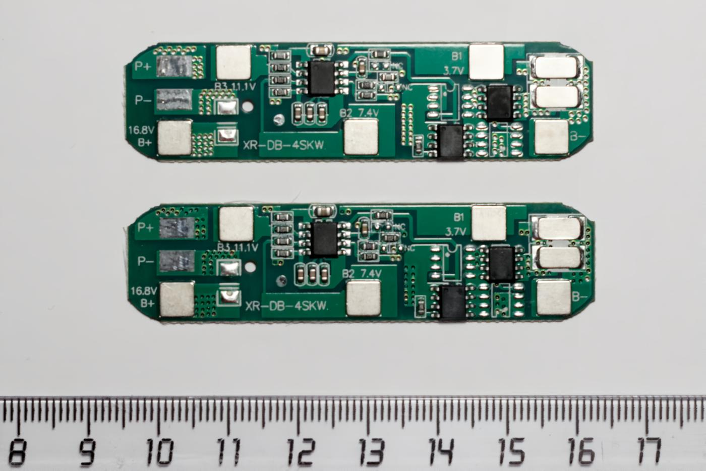
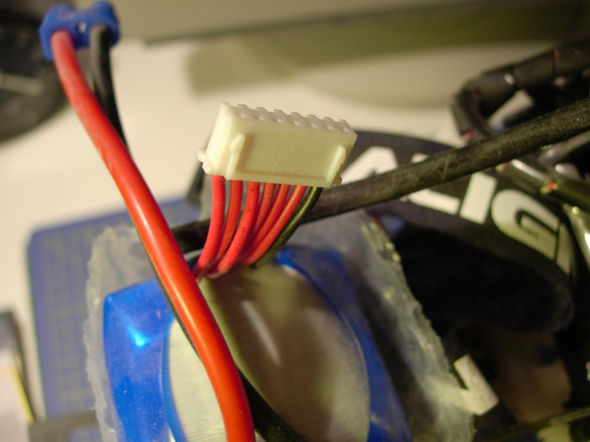
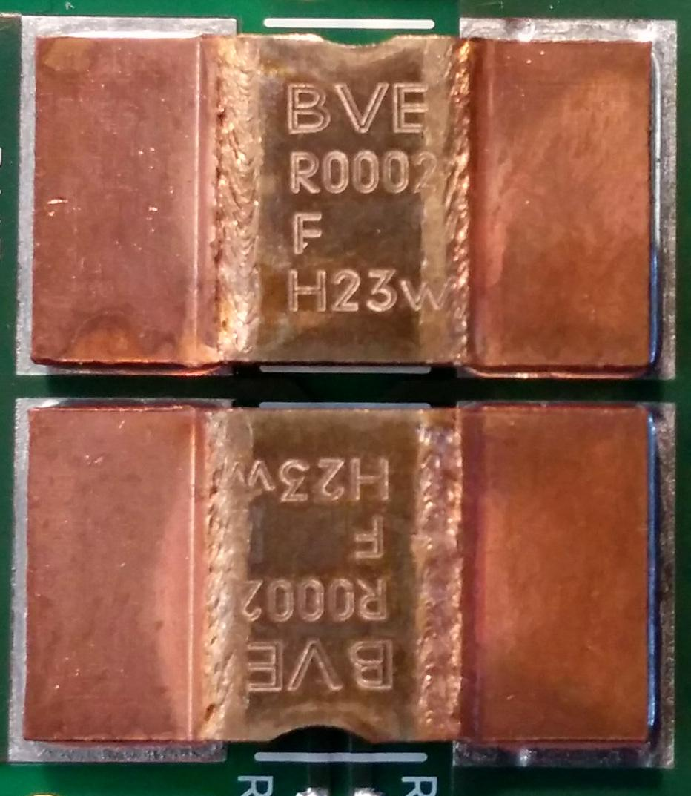
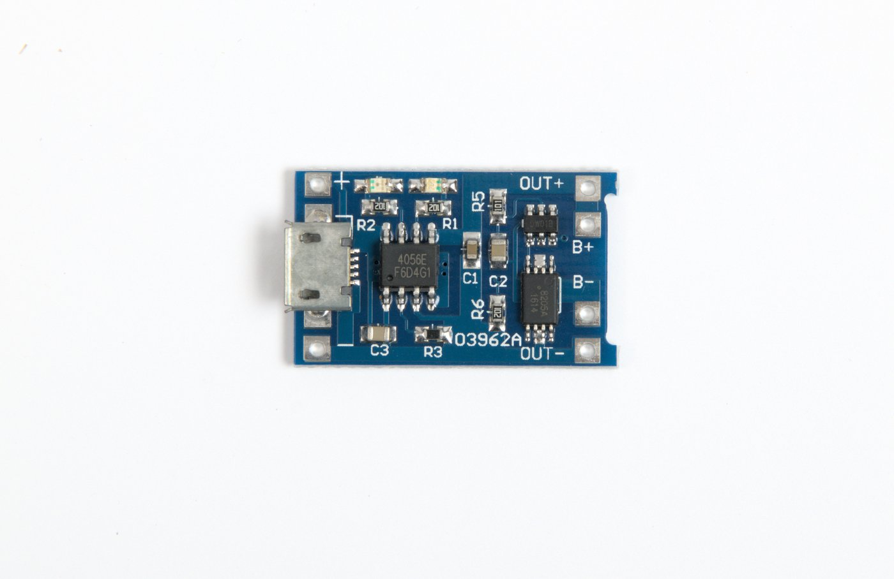
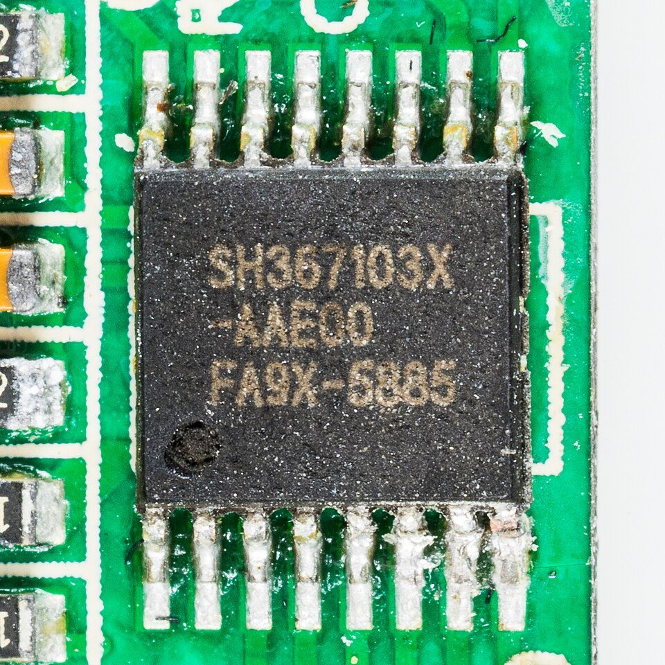
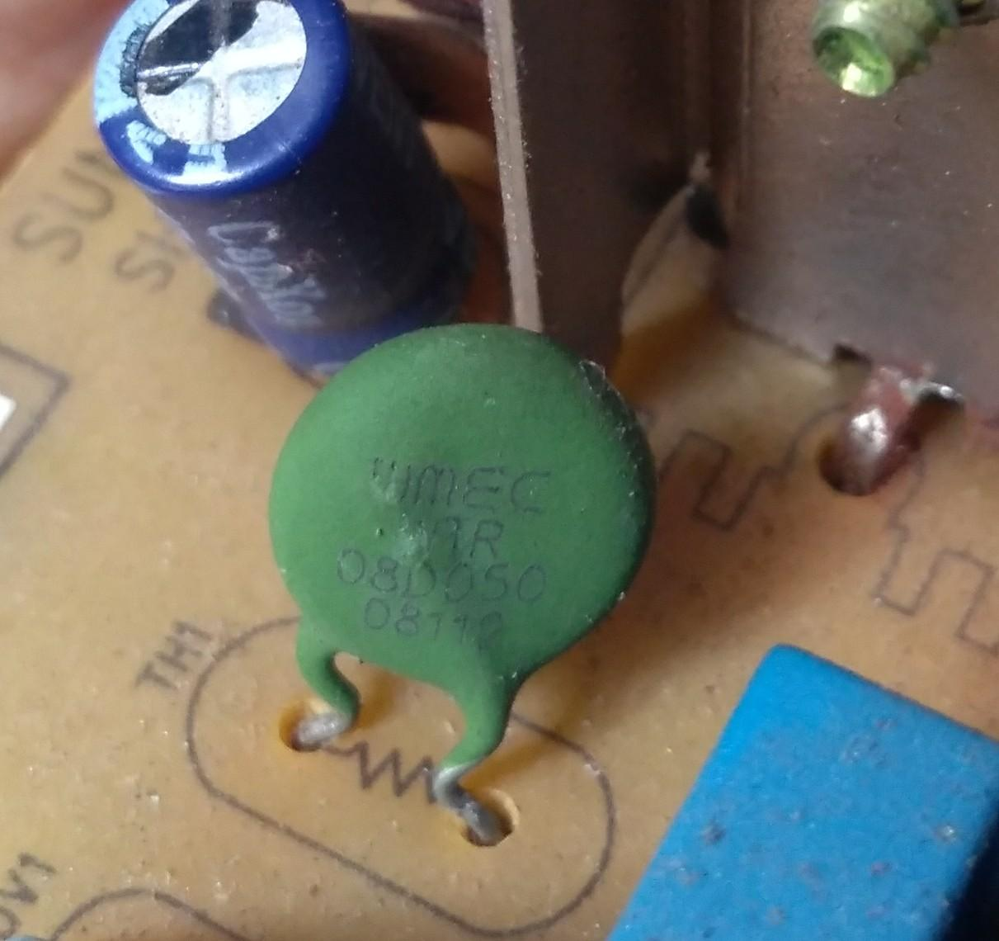
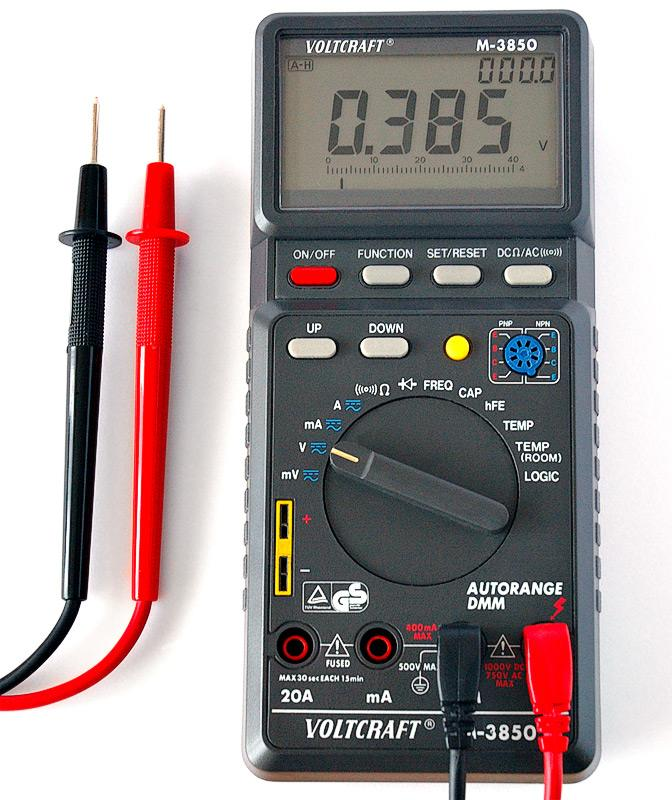
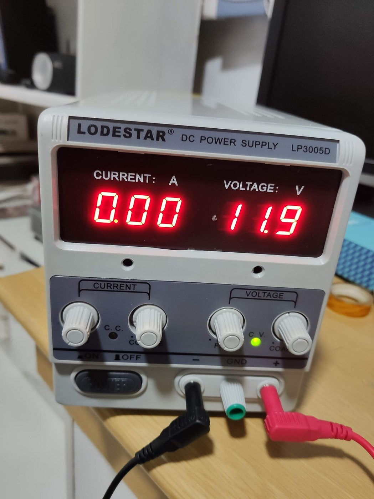
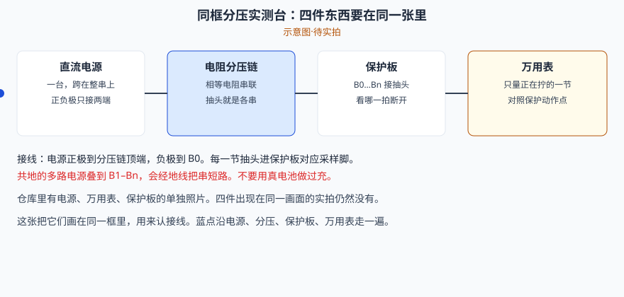

# 阶段 2 教程：保护板实践

> 对应学习路线的阶段 2。建议用时 2–4 周。前置：已通过阶段 1 验收。
> 🔍 配套深入解析（含动画）：[电路详解 ① 功率回路：MOS、保护与预充](../circuits/01-功率回路-MOS保护与预充.md) ｜ [③ 充电、均衡与计量](../circuits/03-充电均衡与计量.md)
>
> ⚠️ **安全警告**：本阶段开始接触真实锂电池。**短路测试只允许用可调电源模拟，绝不允许用真电池直接短接**。操作区备好灭火沙，电池下方垫防火垫，戴护目镜。一块 18650 短路的喷射火焰能烧穿塑料瓶——别用手试。

---

## 本页目录

按层走先看 [能力地图](bloom-map.md)。标题末尾的 `[记忆]` … `[创造]` 是布鲁姆层级。

- [阶段 2 教程：保护板实践](stage-2-保护板实践.md#阶段-2-教程保护板实践)
- [2.1 先拆一块板子看 [应用]](stage-2-保护板实践.md#21-先拆一块板子看-应用)
- [2.2 DW01：只有三道判断题的保安 [理解]](stage-2-保护板实践.md#22-dw01只有三道判断题的保安-理解)
- [2.3 多节保护：S-8254A 与多通道芯片 [理解]](stage-2-保护板实践.md#23-多节保护s-8254a-与多通道芯片-理解)
- [2.4 MOS 与驱动细节 [分析]](stage-2-保护板实践.md#24-mos-与驱动细节-分析)
- [2.5 NTC 与 ID：电池包的"体温计"和"身份证" [理解]](stage-2-保护板实践.md#25-ntc-与-id电池包的体温计和身份证-理解)
- [2.6 保护板实测方法（本阶段核心技能） [应用]](stage-2-保护板实践.md#26-保护板实测方法本阶段核心技能-应用)
- [2.7 自测题 [理解]](stage-2-保护板实践.md#27-自测题-理解)
- [2.8 动手任务 [应用]](stage-2-保护板实践.md#28-动手任务-应用)
- [2.9 验收清单 [评价]](stage-2-保护板实践.md#29-验收清单-评价)

## 2.1 先拆一块板子看 [应用]

> **先读/后读**：端子字母是 [记忆]；对着板子指认电流路径是 [应用]。

找一块最便宜的 3S 保护板（几块钱那种），翻到背面，按图索骥：



从左到右大约是 6S、4S、3S，旁边有尺子。串数变了，板长和采样焊盘数量跟着变。



近看：找功率 MOS、采样排针、丝印 B- 和 P-。图里有飞线焊在功率端上，那是拍摄者的改动，不要当成推荐接法。

**视频**　B 站 · [《锂电池保护板原理》](https://www.bilibili.com/video/BV1F7411t7Xq/) · [开源保护板硬件原理](https://www.bilibili.com/video/BV1CB4y1d7Fx/)

这两条中文片对着原理图讲保护板，适合和手里的板一起看。播放器打不开时用原页。门户页有内嵌：[视频教程](../../BMS学习路径.html#videos)。

- **保护 IC**：那块最小的 SOT 封装芯片，整板的大脑；
- **功率 MOS**：两颗（或更多）SO-8 大点的封装，背靠背串联——电流的"总闸门"；
- **检流电阻**：一两个毫欧级的贴片电阻（印着 R005、R010 之类），回路的"电流传感器"；
- **NTC**：小黑头或贴片热敏电阻，贴电芯测温；
- **采样排线**：B1、B2、B3……每节电芯一根，是板子的"神经末梢"。

**接线端子必须分清**（接错一个就烧板）：

| 端子 | 含义 |
|---|---|
| B+ / B- | 电池组总正 / 总负（接电芯） |
| P+ / P- | 对外端口（接负载与充电器） |
| C- | 充电负极（仅分口板） |
| D- | 放电负极（仅分口板） |



多串包上常见的小间距平衡插头（图中是 XH）。针数一般是串联数加 1。插反或少插一针，采样会错位。

- **同口板**：充放电共用 P-，一组背靠背 MOS——便宜量大；
- **分口板**：充放电 MOS 分开，可独立切断——UPS、太阳能场景常见。

检流电阻还有个看不见的细节——它是怎么"量"的：



> **口诀**　电流取样走电阻本体的内侧。走线压降不要算进电流。

毫欧级电阻上的压降只有几十毫伏，和走线、焊盘上的压降是一个量级。好板子的采样点直接从电阻本体内侧引出（四线开尔文），烂板子从焊盘外侧随便一拉——电流精度的天花板，在这一步就定了。



贴片检流电阻很小，阻值印在本体上（R010 常见是 10 mΩ，以该厂丝印规则为准）。采样从哪引出，上面的动画已经讲了。来源见 [照片来源](../circuits/assets/photos/PHOTOS.md)。

> **原理**　保护板上能看见采样电阻、保护 IC、背靠背 MOS 和 NTC。采样点从电阻内侧引出还是从焊盘随便拉，决定电流精度的上限。
> **证据**　可核验演示：本节 SVG（浏览器打开即播），正文有不看动画也能读的说明。板上要能指认保护 IC、功率 MOS、检流电阻、NTC 和采样线。单节手册 [华之美 DW01A 数据手册](https://hmsemi.com/downfile/DW01A.PDF)。实测讨论 [EEVblog 电芯模拟器讨论](https://www.eevblog.com/forum/projects/lithium-battery-cell-simulatoremulator-for-bms-testing/)。
> **延伸阅读**　[ABLIC S-8254A 中文手册](https://www.ablic.com/cn/doc/datasheet/battery_protection/S8254A_C.pdf)

## 2.2 DW01：只有三道判断题的保安 [理解]

> **先读/后读**：阈值表是 [记忆]，而且是示例，以料号 datasheet 为准。三道判断和断口方向是 [理解]。

单节保护 IC DW01 是理解一切保护芯片的起点。它只有 6 个引脚，内部像个只会做三道判断题的保安：

- **VDD/VSS**：直接跨接电芯——判断题一：电压太高？（过充）判断题二：电压太低？（过放）
- **CS**：检流引脚，感知 VSS 与 CS 间的压差——判断题三：电流太猛？（过流/短路，充电放电两个方向都判）
- **OD/OC**：两个执行输出，分别驱动放电 MOS 与充电 MOS 的栅极；
- **TD**：测试引脚——出厂测试时用来**缩短**延时，快速验证保护功能；各类保护延时由芯片**内部产生**，不需要外接任何定时元件。

典型保护参数（**以实际料号 datasheet 为准**）：

| 保护项 | 典型阈值 | 典型延时 |
|---|---|---|
| 过充 | 4.30V ±50mV | 1s 级（口令；DW01A 手册约 80–200 ms） |
| 过放 | 2.40V ±100mV | 100ms 级 |
| 放电过流 | CS > 150mV（120–180mV） | 10ms 级 |
| 短路 | CS > 1.35V（典型） | **微秒级** |
| 充电过流 | CS 反向阈值 | 10ms 级 |

过放保护后 DW01 进入微安级低功耗模式（宁可装死也不让电池继续掉电），插充电器或电压回升后恢复。配套 MOS 常用 8205A——单封装里两颗 N-MOS，天然背靠背。



> **口诀**　电压越线，比较器拉栅，MOS 断开。软件可以不在这条路上。

上面这个动画就是 DW01 的日常：电压爬过 4.30V →（内部延时确认不是毛刺）→ OC 拉低 → 充电 MOS 断开 → 电压回落 → 自动恢复。**阈值 + 延时 + 恢复条件**，三要素在这颗小芯片上一个不少。

对着典型应用电路把三道判断题走一遍：



> **口诀**　三道判断题：过充、过放、过流。答案是断哪一只 MOS。

- **采样**：B+ 经 R1（100Ω）进 VDD，C1（0.1µF）跨 VDD–VSS 滤高频；
- **执行**：OD/OC 分别进 8205A 的两个栅极——M1（靠 B- 侧）防放电、M2（靠 P- 侧）防充电，与 [详解 ① §1.2](../circuits/01-功率回路-MOS保护与预充.md) 的口诀同向；
- **判流**：CS 经 R2（1k）看 B- 侧压差；VM 经 R3（5.1k）感知充电器接入；
- 阻容取值是 datasheet 典型应用的**示例值**，换兼容料号先查手册。

**读懂一张 DW01 应用图 = 掌握了保护板 80% 的原理**：采样（VDD）、执行（OD/OC → MOS）、判流（CS）、内部定时（延时芯片内部产生）。剩下的 20% 是多串问题。

**视频**　B 站 · [《DW01 工作原理》](https://www.bilibili.com/video/BV1fMWBesE6M/)

放在这张应用图后面，是因为视频顺着六个引脚把三道判断走了一遍。阈值仍以你买到的手册为准。



**不看动画版**：单节板上先找六脚的保护 IC，印字里应有 DW01；再找八脚的双 MOS，印字里应有 8205A。封装相同的料很多，以印字为准。上面这张是示意图，用来标位置，不是实拍。

> **口诀**　先对印字，再谈引脚。封装相同的料很多。



看右侧两颗黑色芯片。上传者在共享资源说明里写明：六脚是 DW01A，八脚是 8205A；左边大芯片是充电用的 TP4056，不是保护 IC。仓库里这张图长边压到 1400 像素，激光印字会变小，对不清请打开原图。本仓库用 tesseract 扫过原图，没有稳定抽出完整料号，所以料号以上传者说明和原图为准，不把自动识别当证据。来源见 [照片来源](../circuits/assets/photos/PHOTOS.md)。



这张是另一颗锂电保护 IC 的丝印特写，用来练眼睛：字符印在封装顶上，料号以能读出的印字为准。它是中颖 SH367103X，不是 DW01，也不是 8205A。来源见 [照片来源](../circuits/assets/photos/PHOTOS.md)。

> **原理**　DW01 用比较器看电压和电流，延时确认不是毛刺，再分别关掉充电或放电 MOS。过放后它会进微安休眠，避免把电芯继续放空。
> **证据**　[华之美 DW01A 数据手册](https://hmsemi.com/downfile/DW01A.PDF)（过充典型 4.30V±50mV，过充延时典型约 80–200 ms）。原厂英文稿：[Fortune DW01A-DS-11](http://www.ic-fortune.com/upload/Download/DW01A-DS-11_EN.pdf)。正文表里的「1s 级」是数量级口令，不是这两份手册的标称。
> **延伸阅读**　[B 站：DW01 工作原理](https://www.bilibili.com/video/BV1fMWBesE6M/)

## 2.3 多节保护：S-8254A 与多通道芯片 [理解]

单节方案没法简单堆叠成多串——每节的"地"都不一样高。多串保护 IC 的解法：

- 内部集成多个独立检测通道，每通道跨接一节电芯（VDD1-VSS1、VDD2-VSS2…），各自悬空比较；
- **S-8254A**：一颗管 3–4 节（SEL 引脚选 3/4 节模式）；官方手册就定位在 3/4 串，**没有多颗级联方案**——别指望两颗拼 7 串；
- **三段过流检测**：过流 1（小过载，延时较长）→ 过流 2（大过载，延时短）→ 短路（微秒级瞬间动作）——为什么短路必须这么快？看动画：



> **动态**　初始态：负载电流在正常范围，MOS 导通。扰动：输出被短路，电流在微秒里冲上去。中间态：硬件比较器翻转，栅极电荷被抽走；这一拍还在软件轮询之外。保护态：MOS 关断，回路断开。图上约 2 μs、10 μs 是示意，以保护 IC 手册和系统验证为准。
> **口诀**　短路按微秒关。软件那一拍来不及。

索引见 [电路动态分析](../circuits/README.md#电路动态分析)。

  上千安培下，I²t 能量按毫秒计就能烧穿 MOS 的硅片。软件保护（MCU 轮询，毫秒级）通常赶不上第一道口，所以**短路保护必须由硬件比较器直接关闸**（动画中的 2/10μs 为示意值，以具体保护 IC datasheet 为准）——这也是"硬件保护兜底"思想（阶段 3、6 反复出现）的最早体现。



**不看动画版**：示例取 500 A，不是示波器截图，也不是某颗 MOS 的安全工作区。10 μs 切断时 I²t = 500² × 10 μs = 2.5 A²s。1 ms 才切断时 I²t = 250 A²s，大约 100 倍。

> **算一笔**　I²t 按电流平方乘以接通时间。时窗从 10 μs 放到 1 ms，能量大约乘 100。
> **口诀**　短路按微秒关。软件那一拍来不及。
> **错了会怎样**　只靠软件毫秒轮询，这一示例里的能量先耗在 MOS 里。
- 保护阈值由出厂激光修调固定：三元 4.2V 满充与铁锂 3.65V 满充的保护板**阈值版本不同，不能混用**——买板子时先报化学体系；
- 外置延时电容只有两个引脚：**CDT** 同时管过放与过流 1 的延时（两者固定 10:1），**CCT** 管过充；更快的过流 2 与短路延时由内部固定，不可调（注意这和 DW01 的内部延时不同，别记混）。

更多串数（6–17 串）怎么办？直接选**多通道单芯片**（如中颖 SH367309，一颗覆盖 1–17 串），内部集成全部检测通道——国产多串保护板的主流路线，检测原理与 S-8254A 相同。

> **原理**　多串不能把单节芯片按各自的地叠起来。多串芯片把每一节变到自己能测的范围；短路仍要硬件比较器直接关闸，软件轮询来不及。
> **证据**　[ABLIC S-8254A 数据手册（简体中文）](https://www.ablic.com/cn/doc/datasheet/battery_protection/S8254A_C.pdf)；英文版 [S8254A_E.pdf](https://www.ablic.com/en/doc/datasheet/battery_protection/S8254A_E.pdf)（可选）。SEL 选 3/4 串，过充/过放阈值按料号步进，延时由 CCT/CDT 外接电容设定。
> **延伸阅读**　[CSDN：S-8254A 保护方案解析](https://bbs.csdn.net/weixin_29169899/article/details/100241878)

**短自测**　先看 [短路时间尺度](../circuits/assets/short-circuit-timeline.svg)，再看 [I²t 时窗](../circuits/assets/short-i2t-window.svg)。

1. 短路这一拍，谁来关闸？
2. 示例 500 A。10 μs 切断和 1 ms 切断，I²t 各是多少？

<b>参考答案（先自己想完再展开）</b>

1. 硬件比较器直接关闸。软件走采样、判定、去抖、输出，周期本身就在毫秒，赶不上这一拍。
2. 10 μs 是 \(500^2 \times 10\,\mu\mathrm{s} = 2.5\) A²s。1 ms 是 250 A²s，大约 100 倍。图上 2 μs、10 μs 是示意，以保护 IC 手册为准。栅极回路若绕远，这扇窗还会再被电感吃掉，见 [详解⑤ §3](../circuits/05-BMS电路板绘制与设计要点.md#3-功率回路-应用)。

## 2.4 MOS 与驱动细节 [分析]

- **背靠背两种接法**：**共漏**（两漏极相连）——两源极电位不同，两个栅极必须**分别驱动**（DW01 的 OD/OC 正是分两路输出各驱各的），胜在 8205A 这类共漏双 MOS 封装便宜易得，保护板主流；**共源**（两源极相连）——两栅可共用一路驱动，但共同源极悬浮在回路中间，驱动需要浮地设计。两种接法的体二极管都反向对顶，双向阻断能力相同，差别在驱动方式；
- **VGS 红线 ±20V**：栅氧层薄，多串回路的驱动电压稍不注意就击穿——保护 IC 内部已处理，自己设计驱动时必查；
- **并联扩流**：大电流板（>30A）多颗 MOS 并联摊薄 I²R 发热。并联不是白捡的：器件要同批次、布局要对称，否则电流分配不均，热的更热；
- **发热估算**：$P = I^2 \times R_{DS(on)}$，温升靠 PCB 铜箔和散热片带走——阶段 0 的公式在这里变现。



> **口诀**　发热跟电流的平方走。越热电阻越大，再越热。

把这笔账画出来看：电流从 10A 加到 20A，发热不是翻倍而是四倍（平方关系）；更麻烦的是 R_DS(on) 随温度上升，热本身会抬高电阻——正反馈。多颗并联在这里有个隐藏福利：热的那颗阻值升高，电流自动让给凉快的那颗。

> **原理**　共漏是两漏极相连，两个栅极必须分开驱动；共源可以共栅，但源极悬浮，驱动要浮地。两种接法都能双向关断，差在驱动怎么做。
> **证据**　可核验演示：本节 SVG（浏览器打开即播），正文有不看动画也能读的说明。发热按电流平方涨，导通电阻还随温度升高。背靠背的原因见 [瑞萨《BMS 教程》中文导读](../renesas-bms-tutorial-中文导读.md)，执行端对照 [华之美 DW01A 数据手册](https://hmsemi.com/downfile/DW01A.PDF)。
> **延伸阅读**　[EEVblog 电芯模拟器讨论](https://www.eevblog.com/forum/projects/lithium-battery-cell-simulatoremulator-for-bms-testing/)

## 2.5 NTC 与 ID：电池包的"体温计"和"身份证" [理解]

- **NTC**：负温度系数热敏电阻——越热阻值越小。与固定电阻分压送 ADC（或保护 IC 温度脚），换算靠 B 值方程或查表。贴的位置有讲究：贴电芯本体测的是电芯温度，贴 MOS 旁测的是板子温度，保护策略不同；
- **ID 引脚**：用电阻值编码电池型号/容量档，主机一读电阻就知道"插上的是哪块电池"——也是低成本防兼容的手段。



带引线的 NTC，头要贴到被测的那一节或那颗 MOS 上，不要悬在空气里。板子上的贴片热敏电阻是同一类器件，外形不同。

> **原理**　NTC 越热阻值越小。贴在电芯上测的是电芯温度，贴在 MOS 旁测的是板温，两边的保护策略不能混用。
> **证据**　NTC 越热阻值越小，和分压电阻一起送给 ADC。保护板侧的接法见 [EET《ID 与 NTC》](https://www.eet-china.com/mp/a179929.html)。
> **延伸阅读**　[详解②](../circuits/02-采样链与AFE芯片.md)

## 2.6 保护板实测方法（本阶段核心技能） [应用]

原则一句话：**先用电源模拟，后用真电池验证**——你想看的每个保护动作，在真电池上都意味着把电池推向一次危险边缘，而在模拟器上只是拧拧旋钮。



测动作电压用直流电压档，看清表笔和量程。微安级休眠电流要换到电流档并串进回路，不要用电压档去「量电流」。



电源长这样：一台可调直流源。这张照片里没有保护板，也没有万用表。来源见 [照片来源](../circuits/assets/photos/PHOTOS.md)。



**不看动画版**：一台电源跨接一串相等的电阻，抽头接到保护板各串采样点，万用表只量正在拧的那一节。共地的多路电源叠到 B1–Bn 上，会经地线把串短路。不要用真电池做过充。这张是示意图。共享资源里用 bench power supply、cell simulator、battery emulator、electronics lab 检索过，2026-10-05 又对过电容泄放和开发板近邻，同日再看过牵引电池外观和接触器剖视，仍然没有电源、分压链、保护板、万用表在同一张里的照片。LibreSolar 的开源台架把板子和电芯放在一张、电源放在另一张，见 [详解② §5](../circuits/02-采样链与AFE芯片.md)，那也不是这四件同框。认领见共建任务板 T11。

> **口诀**　用分压链代替真电池。共地的多路电源会把串短路。



**不看动画版**：同一框里从左到右是直流电源、电阻分压链、保护板、万用表。电源只接分压链两端，每一节抽头进保护板对应采样脚，万用表只量正在拧的那一节。蓝点沿这四件走一遍。示意图·待实拍。仓库里的电源、万用表、保护板仍是分开的照片。

> **口诀**　电源、分压、保护板、万用表要在同一拍对上。

1. **电芯模拟**：首选**单电源 + 电阻分压链**——一串电阻跨接一台电源，各分压点天然串联参考，安全便宜（做法参考 [EEVblog 实操帖](https://www.eevblog.com/forum/projects/lithium-battery-cell-simulatoremulator-for-bms-testing/)）。若用多路可调电源，**每一路必须是隔离浮地输出**，并按"上一路负极接下一路正极"串联叠成电池串。⚠️ **共地（非隔离）的多路电源直接接到 B1–Bn，会把电池串经地线短路——烧板烧电源**，这是新手烧掉的第一块板子的最常见死因；
2. **测过充**：缓慢上调某一"节"电压，记录动作电压与延时，对照规格书（偏差应在规格允许范围内，典型 ±50mV 量级，以具体料号为准）；
3. **测过放**：缓慢下调，同上；
4. **测过流**：P 口接电子负载，阶梯加大电流，记录各段动作点与延时；
5. **测静态功耗**：微安表串入 B+ 回路，正常态与过放休眠态各测一次（μA 级是常见合格线，以产品规格为准——储能板待机一年不能抽干电池）；
6. **测恢复**：触发保护后验证恢复条件（卸载 / 插充）；
7. **带均衡的板子**：把一节电压调高，充电至末端，摸（或热成像看）该节均衡电阻是否温热工作。

记录表格模板：| 项目 | 规格书值 | 实测值 | 判定 |——这张表就是你的第一份 BMS 测试报告。

> 踩坑现场：用示波器测保护板时，**示波器探头地夹就是大地**！夹在 B- 以外的点等于把该点直接对地短路。要用差分探头，或给示波器用隔离电源/电池供电的示波器。

> **原理**　原则一句话：**先用电源模拟，后用真电池验证**——你想看的每个保护动作，在真电池上都意味着把电池推向一次危险边缘，而在模拟器上只是拧拧旋钮。
> **证据**　分压链怎么代替电芯，讨论见 [EEVblog 电芯模拟器帖](https://www.eevblog.com/forum/projects/lithium-battery-cell-simulatoremulator-for-bms-testing/)。动作电压仍对 [DW01A 手册](https://hmsemi.com/downfile/DW01A.PDF) 的那一档，不要把示意图上的 4.28 V 当成你这块板的规格。
> **延伸阅读**　[术语表](../glossary.md) · [总纲](../bms-resources.md)

**练完你会怎样**：你能用分压链让保护板该断的时候断，并且知道探头地夹就是大地。三元板和铁锂板你不会混。不隔离的多路电源你不会拿来当电芯。短路的时间尺度，就地题在 §2.3。

## 2.7 自测题 [理解]

> **先读/后读**：第 1 题（同口还是分口）和第 4 题（三元板能不能管铁锂）是 [评价]；其余是 [理解]。

1. 同口板与分口板各适合什么场景？
2. DW01 的 CS 引脚为什么能同时判放电过流与充电过流？
3. 多串保护 IC 为什么不能把多个 DW01 简单叠加？
4. 三元锂保护板能直接用在磷酸铁锂组上吗？
5. 短路保护为什么必须微秒级、且必须是硬件动作？（从 I²t 与 MOS 耐受答）
6. MOS 并联除了扩流还有什么代价？
7. 为什么多路台式电源接 B1–Bn 前必须确认"隔离浮地 + 串联叠接"？
8. 示波器直接测保护板有什么隐藏危险？

<b>参考答案（先自己想完再展开）</b>

1. **同口板**：充放电共用 P- 端、一组背靠背 MOS，便宜量大，适合消费电子、电动工具、小家电——用户只用一个接口充放。**分口板**：充电（C-）与放电（D-）MOS 分开，可以只断充电保留放电（或反之），适合 UPS、太阳能路灯/储能这类"一边充一边放"或需要独立控制两条路径的场景。
2. 因为 CS 感知的是 VSS 与 CS 之间的压差，也就是**检流电阻上的压降**。放电电流与充电电流流过同一个检流电阻，但**方向相反**，产生的压降**极性相反**。DW01 内部对这个压差做双向阈值比较：一个极性越线判放电过流/短路，另一个极性越线判充电过流。一个引脚管两个方向。
3. 因为每节电芯的"地"电位不一样高。DW01 的 VSS 直接接在它所监测那节电芯的负极上，第 2 节的 VSS 比第 1 节高了一整节电压；多颗芯片的输出逻辑电平各自参考自己的 VSS，无法直接共线驱动同一组 MOS，也无法互相"或"起来。多串保护 IC 的解法是**片内集成多个独立检测通道**（VDD1-VSS1、VDD2-VSS2…）各自悬空比较，再在片内把结果汇总成统一输出。
4. **不能**。保护阈值是出厂激光修调固定的：三元锂的过充阈值在 4.2–4.3V 量级，而铁锂满充只有 3.65V。拿三元板管铁锂，铁锂充到 3.65V 远没触发 4.25V 的 OVP，会被**持续过充**；过放阈值同理也不匹配。买板子必须先报化学体系、确认阈值版本。
5. 短路电流可达上千安培，MOS 的热损伤由 $I^2t$ 决定——电流的**平方**项让能量在毫秒内就累积到烧穿硅片的量级，线束同时在发热。而 MCU 走的是"周期采样 → 判定 → 去抖 → 输出"的软件路径，周期本身就是毫秒级，赶不上第一道口。所以短路必须由保护 IC / AFE 内部的**硬件比较器直接关闸**，不经过 MCU——这是"硬件保护兜底"思想的最早体现。
6. ①**电流分配不均**：$R_{DS(on)}$ 与阈值电压的个体差异让导阻小的那颗分到更多电流 → 更热（开关瞬态与线性区尤其明显，不能指望导阻正温度系数把它救回来）→ 热的更热。对策是同批次器件 + 对称布局 + 栅极各串小电阻抑制振荡。②开关瞬态均流更差，容易出现单颗承担大部分开关损耗。③总栅电荷 $Q_g$ 成倍增加，驱动能力要求提高、关断变慢。④成本、面积与焊接可靠性。
7. 多路电源若**共地**（非隔离），各路的负端在机内是连通的。按 B1–Bn 分别接到电池串各节正极后，相当于把电池串的中间节点经电源内部地线短路——电池串被逐节短接，**烧板烧电源**。正确做法：每一路必须是隔离浮地输出，并按"上一路负极接下一路正极"真正串联叠成电池串。更安全省事的入门方案是**单电源 + 电阻分压链**，各分压点天然串联参考。
8. 示波器探头的**地夹经电源线直通大地**。把地夹夹在 B- 以外的任何点，等于把该点对地短路——瞬间大电流，烧板、烧探头、甚至烧示波器前端。对策：用**差分探头**，或用隔离变压器供电 / 电池供电的手持示波器。同理，USB 串口和调试器直连存在完全相同的共地问题。

> **原理**　这些题考的是上面几节的机制。先盖住折叠答案，用自己的话讲完再展开。
> **证据**　这些题考同口分口、DW01 的三道判断，以及铁锂不能用三元阈值。手册 [华之美 DW01A 数据手册](https://hmsemi.com/downfile/DW01A.PDF) 与 [ABLIC S-8254A 中文手册](https://www.ablic.com/cn/doc/datasheet/battery_protection/S8254A_C.pdf)。
> **延伸阅读**　[EEVblog 电芯模拟器讨论](https://www.eevblog.com/forum/projects/lithium-battery-cell-simulatoremulator-for-bms-testing/)

## 2.8 动手任务 [应用]

1. 拆解一块成品 3S 保护板，画出原理框图（IC、MOS、检流、NTC、端子），标注电流路径；
2. 按 2.6 七步流程实测一块板子，填测试报告表；
3. 调试 [立创开源 BQ76920 5S 工程](https://oshwhub.com/kaijun/mps-energy-station)，对比它与纯硬件保护板的差异——能读到每串电压的那一刻，你已经站在阶段 3 的门口了。

> **原理**　动手是把机制变成一次可核对的记录：条件、读数、和规格差在哪。没有记录的操作不算做完。
> **证据**　本节可点击来源：[立创开源 BQ76920 5S 工程](https://oshwhub.com/kaijun/mps-energy-station)。阈值与宣传口径仍以 datasheet / 标准原文为准。
> **延伸阅读**　[术语表](../glossary.md) · [总纲](../bms-resources.md)

## 2.9 验收清单 [评价]

- [ ] 能指认陌生保护板上每个关键器件并说明作用
- [ ] 能用电芯模拟器完成 OVP/UVP/OCP 三项实测并判定合格与否
- [ ] 能解释背靠背 MOS、检流电阻、短路 μs 级动作三个细节
- [ ] 测试数据整理成表，规格值与实测值的偏差能给出解释

> **本阶段一句话**：保护板 = 会做三道判断题的保安 + 两颗背靠背闸门；实测一律先上电芯模拟器，别拿真电池冒险。

全部通过 → 进入 [阶段 3：AFE + MCU 智能 BMS](stage-3-AFE-MCU智能BMS.md)（总纲入口：[阶段 3](../bms-resources.md#阶段-3进阶afe--mcu-的智能-bms12-个月)）。

---

**上一阶段**：[阶段 1 认识 BMS](stage-1-认识BMS.md) ｜ **下一阶段**：[阶段 3 AFE+MCU 智能 BMS](stage-3-AFE-MCU智能BMS.md) ｜ [学习路线总纲](../bms-resources.md) ｜ [术语表](../glossary.md)

> **原理**　验收问的是能不能用机制做判断。勾得上才进入下一阶段，勾不上就回到对应小节，而不是把目录再看一遍。
> **证据**　要能说明每个关键器件，并知道先用电源模拟。讨论见 [EEVblog 电芯模拟器讨论](https://www.eevblog.com/forum/projects/lithium-battery-cell-simulatoremulator-for-bms-testing/)。
> **延伸阅读**　[《车用 BMS 功能安全设计方法论》](https://www.mdpi.com/1996-1073/14/21/6942)（英文，可选）
