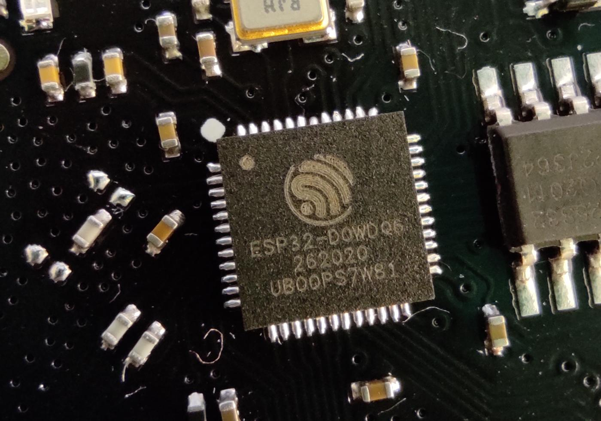
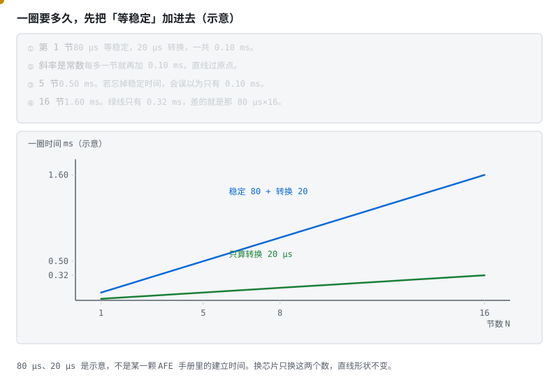
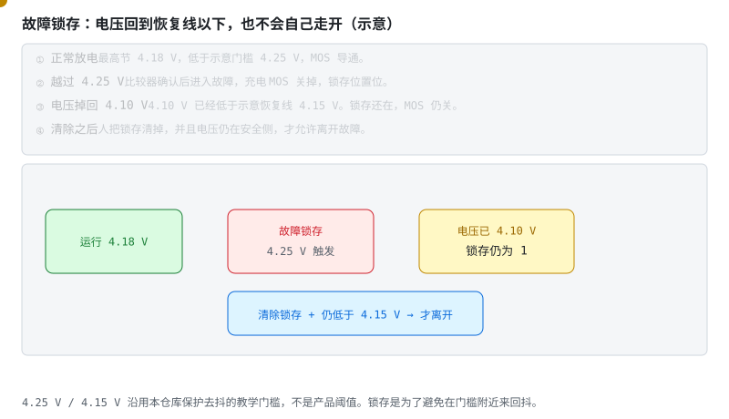
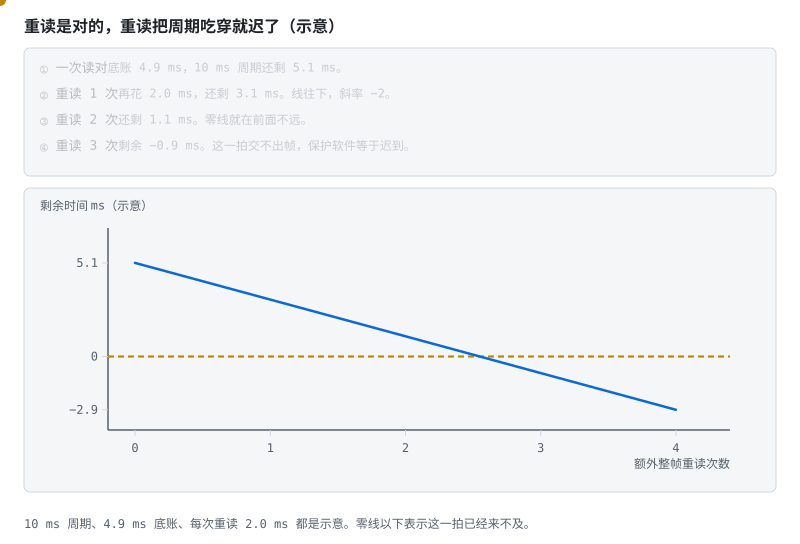
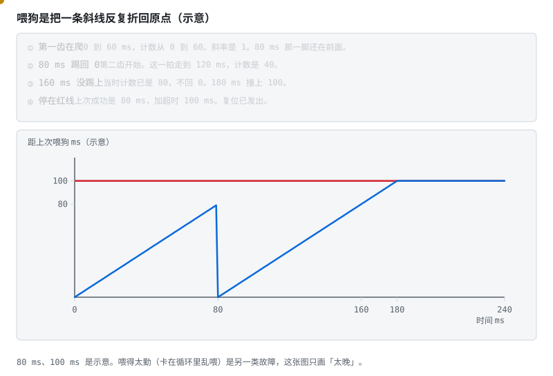

# 阶段 3 教程：AFE + MCU 智能 BMS

> **本篇你会学到**　AFE 怎么替你巡逻采样，MCU 状态机怎么守住保护，原理图和 PCB 有哪五条纪律。
> **预计用时**　1–2 个月。
> **前置**　已通过阶段 2 验收。

> 对应学习路线的阶段 3。建议用时 1–2 个月。前置：已通过阶段 2 验收。
> 🔍 配套深入解析（含动画）：[电路详解 ② 采样链与 AFE 芯片](../circuits/02-采样链与AFE芯片.md) ｜ [⑤ 电路板绘制与设计要点](../circuits/05-BMS电路板绘制与设计要点.md)
>
> 这是整条路线工程量最大的阶段，也是爱好者与工程师的分水岭——跨过它，你做的就不只是"能用的板子"，而是"能讲清楚每一块为什么这样做的板子"。

---

## 本页目录

按层走先看 [能力地图](bloom-map.md)。标题末尾的 `[记忆]` … `[创造]` 是布鲁姆层级。

- [3.1 架构之变：保护板缺了什么 [理解]](stage-3-AFE-MCU智能BMS.md#31-架构之变保护板缺了什么-理解)
- [3.2 AFE 精读：以 BQ769x0/x2 为线 [分析]](stage-3-AFE-MCU智能BMS.md#32-afe-精读以-bq769x0x2-为线-分析)
- [3.3 高压与菊花链：LTC6811 的世界 [分析]](stage-3-AFE-MCU智能BMS.md#33-高压与菊花链ltc6811-的世界-分析)
- [3.4 固件架构：四层 + 一台状态机 [应用]](stage-3-AFE-MCU智能BMS.md#34-固件架构四层--一台状态机-应用)
- [3.5 高边与低边：保护开关挂在哪一头 [评价]](stage-3-AFE-MCU智能BMS.md#35-高边与低边保护开关挂在哪一头-评价)
- [3.6 原理图与 PCB：五条纪律 [应用]](stage-3-AFE-MCU智能BMS.md#36-原理图与-pcb五条纪律-应用)
- [3.7 调试流程：先模拟，后真电池 [应用]](stage-3-AFE-MCU智能BMS.md#37-调试流程先模拟后真电池-应用)
- [3.8 自测题 [分析]](stage-3-AFE-MCU智能BMS.md#38-自测题-分析)
- [3.9 动手任务 [应用]](stage-3-AFE-MCU智能BMS.md#39-动手任务-应用)
- [3.10 验收清单 [评价]](stage-3-AFE-MCU智能BMS.md#310-验收清单-评价)

## 3.1 架构之变：保护板缺了什么 [理解]

阶段 2 的保护板有个本质限制：**保护逻辑写死在模拟电路里**。阈值是激光修调的，延时是电容定的，它不认识 SOC，不会说话，更不能升级。

智能 BMS 把"感知"和"决策"分开：

```
电芯 → RC 滤波 → AFE（高精度采样 + 硬件保护兜底）
                    │ I2C / SPI
                    ▼
                  MCU（策略、算法、通信）→ MOS 驱动 / 继电器
                    │
                    ▼
              UART / CAN / BLE 对外
```



这是主控模组（图中为 ESP32），负责策略和通信。它不是 AFE，也不是保护板。不要把开发板引脚直接接到电池包的高压上。

**视频**　B 站 · [达尔闻《1 小时讲透 BMS 设计》](https://www.bilibili.com/video/BV1NwnRzAEb3/)

放在架构之变，是因为这条中文片从系统原理讲到保护回路和 MOS，适合对照上面的分工图。门户页有内嵌：[视频教程](../../BMS学习路径.html#videos)。

- **AFE** 干粗活：多串电压高精度测量、温度采集、内置独立硬件保护（MCU 死机也能保护）、均衡开关驱动；
- **MCU** 干细活：可编程保护策略、SOC 算法、均衡调度、通信协议、故障记录；
- 第一设计原则，量产门票：**硬件保护（AFE 内置）兜底，软件保护在前**——双通道冗余。软件反应快、可配置，做第一级；硬件独立、不可死机，做第二级。

> **原理**　阶段 2 的保护板有个本质限制：**保护逻辑写死在模拟电路里**。阈值是激光修调的，延时是电容定的，它不认识 SOC，不会说话，更不能升级。
> **证据**　感知在 AFE，策略在 MCU，硬件保护独立兜底。固件参考 [LibreSolar 固件](https://github.com/LibreSolar/bms-firmware)（英文，可选），芯片族 [TI 储能 BMS 方案](https://www.ti.com.cn/solution/zh-cn/ess-battery-management-system-bms)（中文）。
> **延伸阅读**　[立创开源 BQ76920 工程](https://oshwhub.com/kaijun/mps-energy-station)

## 3.2 AFE 精读：以 BQ769x0/x2 为线 [分析]

拿起数据手册，按信号链顺序读，每读一块就问"它替我把哪件事做掉了"。

**输入级**

- VC0…VCn 跨接各串电芯，每路串 RC——**阻值容值照抄手册**（理由在阶段 0：R 大引入漏电流误差，C 大拖慢均衡后的稳定）；
- 串数选型（是**支持范围**，不只是上限）：bq76920 3–5S、bq76930 6–10S、bq76940 9–15S、bq76952 3–16S——先数串数再选芯片；只看"最高支持"会选错（4 串用不了 bq76930，2 串用不了 bq76920）。具体通道数、温度路数、阈值位数因型号而异，以所选料号手册为准；
- **开线检测**：采样线断开时读数会被邻近通道拉偏——AFE 有专门诊断功能，量产必须启用，断线那串等于失去保护。

**测量子系统**


> **图说**　盯住过原点的直线和沿它走的黄点：图上 5 串一圈 0.50 ms，同一条线到 16 串是 1.60 ms。这是时间账。

> **口诀**　一颗 ADC 轮流看每一串。这一拍的电压不是同一瞬间。
> **动态**　初始态：开关停在某一串。扰动：通道号加一。中间态：等这一路稳定再转换。稳态：数字锁进寄存器，再扫下一串。各串的采样时刻沿扫描往后排。同一过程在 [详解② §2](../circuits/02-采样链与AFE芯片.md#2-mux-巡逻式测量一颗-adc-测-16-串-理解)。

盯住底栏，按每串 100 µs 画直线。图上是 5 串，一圈 0.50 ms。同一条线走到 16 串是 1.60 ms。黄点沿直线走，过原点。这是时间账，不是电压误差。


一圈扫描里电流若还在变，首尾两串会差出一截压降。100 μs、50 A、1 mΩ 的示例在 [详解② §2](../circuits/02-采样链与AFE芯片.md#2-mux-巡逻式测量一颗-adc-测-16-串-理解)。

内部没有 16 颗 ADC，而是**一颗 ADC + 多路选择器巡逻扫描**（动画）。这个架构的两个重要性质：

- 所有串共用一颗 ADC、一个基准 → **串间一致性极好**（均衡和保护关心的正是相对差）；
- 但各串不是同一时刻测的——电流剧烈波动时，首尾两串对应不同瞬间，算法层要留意。

电流测量是独立高速通道：外部检流电阻 + 内部**库仑计**，直接输出电流积分值——硬件替你做了安时积分（阶段 4 的主角之一）。温度靠多路 TS 引脚接 NTC + 片内温度。

**保护子系统（硬件兜底）**

OV/UV/SCD/OCD/OT/UT 各有独立比较器 + 可配阈值/延时寄存器，触发后**不经过 MCU 直接动作**。回想阶段 2 的短路动画——SCD 微秒级关断就是它干的，软件永远赶不上。

**均衡**

每串一个内部开关 + 外接均衡电阻，MCU 写位选择对哪些串放电。注意手册的占空比/热限制：内部开关长时间导通会发热，多串要均衡时**分时轮询**，别全开。

**通信与供电**

- I2C（x0）或 SPI/I2C/HDQ（x2），**CRC 校验强烈建议打开**——电池包是强干扰环境；
- AFE 直接从电池组取电，自带 LDO（REGOUT）给 MCU 供电；进出 shutdown 控制整机静态功耗——储能板待机一年不能抽干电池，全靠这个模式。

**练完你会怎样**：你能用上面那句口诀，把这张图讲给别人听。



> **图说**　盯住 CRC 对不上的那一拍：这一帧丢掉重读，不要拿它去做保护决定。

> **口诀**　读数带 CRC。对不上就重读，不要用坏帧。

一次寄存器读取的完整旅程：I2C 时序走完全程，MCU 用同一多项式重算 CRC——对不上就丢弃重读，绝不拿受干扰的数据去做保护决策。另外记住：读到的是寄存器快照，AFE 自己按转换周期刷新，读得再快也只是把旧数据多拿几次。

> 读手册实操：把 bq76920 手册"寄存器地图"整节过一遍，给每个寄存器标注"状态类 / 配置类 / 保护类"。这一小时会在你写驱动时十倍还回来。

> **原理**　拿起数据手册，按信号链顺序读，每读一块就问"它替我把哪件事做掉了"。MUX 共用一把尺子，所以串间差可信；各串不是同一瞬间测的，脉冲电流下首尾两串不要拿来算瞬时功率。
> **证据**　串数范围和保护分工见 [BQ76952 产品页](https://www.ti.com/product/BQ76952) 与官方介绍 [BQ76942 / BQ76952](https://www.youtube.com/watch?v=f0sG9cH1m8Q)（英文，可选）。中文方案入口 [TI 储能 BMS](https://www.ti.com.cn/solution/zh-cn/ess-battery-management-system-bms)。片子里的精度是宣传口径，以你选的料号手册为准。
> **延伸阅读**　[立创开源 BQ76920 工程](https://oshwhub.com/kaijun/mps-energy-station)。评估板没有可转载的实拍；官方演示里板子出镜，见 [详解② §5](../circuits/02-采样链与AFE芯片.md#5-bq769x0x2-内部巡游以手册功能框图为地图-分析)。那一节的静帧照片仍是笔记本上的 BQ20Z45，不是评估板。


一圈要多久，先把「等稳定」加进去。只算 ADC 转换，会把时间算短。

**练完你会怎样**：你能用上面那句口诀，把这张图讲给别人听。



> **图说**　盯住较陡的蓝线和更平的绿线：绿线是忘掉每节等待之后的虚报，两条开口越来越大。

> **口诀**　每节先等，再转换。忘掉等待，整圈会虚报。

**看动画时盯住哪里**

黄点沿较陡的蓝线走。绿线是「忘记等待」。两条都过原点，开口越来越大。

示意：稳定 80 µs，转换 20 µs，每节 100 µs。$T=0.100\times N$ ms，直线过原点。5 节是 0.50 ms，16 节是 1.60 ms。若只算转换，16 节只剩 0.32 ms，少掉的就是 $80\times 16$ µs。斜率是常数：每多一节，固定再加 0.10 ms。

采样点若赶在稳定之前，读到的是上一节的尾巴。换芯片只换这两个微秒，直线还是直线。

**短自测**

1. 16 节，含稳定和只算转换，各是多少毫秒？
2. 为什么两条都是直线？

<details>
<summary><b>参考答案（先自己想完再展开）</b></summary>

1. 1.60 ms 和 0.32 ms。
2. 每节的时间相同，总时间正比于节数。80 µs 和 20 µs 是示意，不是某一颗 AFE 手册里的建立时间。

</details>

**练完你会怎样**：你估扫描周期时，会先问「稳定算进去了没有」。


## 3.3 高压与菊花链：LTC6811 的世界 [分析]

超过 16 串（储能 48V+、车用 96–400 串），换一套思路：

- **LTC6811**：单芯片 12 串，多颗**菊花链**级联覆盖上百串；
- **isoSPI**：变压器耦合的差分 SPI——每级之间完全电气隔离，数据像接力棒逐级"接收→再生→转发"，共模电压差几百伏也伤不到芯片（动画与原理见 [电路详解 ②](../circuits/02-采样链与AFE芯片.md)）；
- 入门精读工程：[vamoirid/LTC6811+STM32](https://github.com/vamoirid/Battery-Management-System-LTC6811-STM32)，重点看它的驱动分层和断线检测实现。主控 MCU 的选型、外设映射与坑的系统整理见 [STM32 实战专题](../stm32-bms专题.md)。

**主流 AFE / 保护 / 计量芯片速查**（选型先看串数与角色，再看生态与资料厚度）：

| 芯片 | 厂商 | 串数 | 角色 | 一句话定位 | 资料 |
|---|---|---|---|---|---|
| BQ76942 / BQ76952 | TI | 3–10 / 3–16 串 | AFE | 入门首选：I2C/SPI 直读，中文资料最全 | [产品页](https://www.ti.com/product/BQ76942) |
| BQ76920/30/40 | TI | ≤5/10/15 串 | AFE | 上一代主力，手册与应用笔记极成熟（本节寄存器精读对象） | [产品页](https://www.ti.com/product/BQ76920) |
| LTC6811 → ADBMS6815 | ADI | 12 串 | AFE | isoSPI 菊花链标杆，车规高压包主力（无线版见 §6.5） | [产品页](https://www.analog.com/en/products/ltc6811-1.html) |
| ISL78714 | Renesas | 14 串 | AFE | 车规高串数，可菊花链扩展 | [产品页](https://www.renesas.com/en/products/isl78714) |
| MC33771C / MC33772C | NXP | 7–14 / 3–6 串 | AFE | 车规，TPL 菊花链，NXP 生态绑定深 | [产品页](https://www.nxp.com/products/MC33771C) |
| L9963E | ST | ≤14 串 | AFE | 车规级里价格最友好的一档，隔离菊花链 | [产品页](https://www.st.com/en/power-management/l9963e.html) |
| SH367309 | 中颖 | 1–17 串 | 保护 IC | 国产保护板主力：纯硬件保护、无通信接口 | 实战文章见 [阶段 2](stage-2-保护板实践.md) |
| DW01 | 多家兼容 | 1 串 | 保护 IC | 单节保护「活化石」，理解保护逻辑的最小样本 | [详解 ① §2](../circuits/01-功率回路-MOS保护与预充.md) |
| BQ40Z50 | TI | 1–4 串 | 电量计 | 阻抗跟踪（Impedance Track）商用标杆，笔记本电池包主流 | [产品页](https://www.ti.com/product/BQ40Z50) |

> **原理**　串数超过单颗 AFE 以后，从板之间地电位可以差几十到几百伏。采样靠菊花链或隔离 SPI 传回主控，不能拿普通导线把从板地连到 MCU。
> **证据**　菊花链从板怎么接到 STM32，见 [LTC6811+STM32 工程](https://github.com/vamoirid/Battery-Management-System-LTC6811-STM32)（英文，可选）。isoSPI 是变压器耦合，线束照片仍缺。2026-10-05 再搜：共享资源里 BQ769 / BQ76952 零条，isoSPI 文件名落到无关照片；LibreSolar 手册里的测试接线是 SVG，不是 TI 官方评估板。检索记在 [照片来源](../circuits/assets/photos/PHOTOS.md)。认领走 [共建任务板](../共建任务板.md) T11，不另开号。机制看 [详解② 的菊花链动画](../circuits/assets/isospi-daisy.svg)。
> **延伸阅读**　[术语表](../glossary.md) · [总纲](../bms-resources.md)

## 3.4 固件架构：四层 + 一台状态机 [应用]

> **先读/后读**：四层谁干什么，§3.1 已经是 [理解]。本节把纪律落到状态机，并对着 [code/firmware](../../code/firmware/README.md) 看代码，是 [应用]。

推荐分层（对照 [LibreSolar/bms-firmware](https://github.com/LibreSolar/bms-firmware) 读源码）：

| 层 | 职责 | 要点 |
|---|---|---|
| 驱动层 | AFE 寄存器读写、CRC、开线检测 | 读失败重试并计数，**绝不静默吞错** |
| 服务层 | 周期采样（10–100ms）、保护判定、均衡调度 | 保护判定要**去抖**：连续 N 次超限才动作 |
| 应用层 | 状态机、SOC（阶段 4）、通信协议 | 状态机集中管理，禁止到处散落 if |
| 安全层 | 看门狗、故障锁存、参数校验 | 独立看门狗 + AFE 硬件保护兜底 |

**主状态机**：BMS 固件的灵魂。看令牌怎么在状态之间巡游：



> **图说**　盯住一次只停在一个圆里的令牌：底栏红框里电压已经回到恢复线以下，令牌仍留在故障。

> **口诀**　同一时刻只停在一个状态。保护事件可以打断它。

**看动画时盯住哪里**

- 令牌一次只停在一个圆里。
- 底栏红框：电压掉回恢复线以下，令牌仍留在故障。
- 「恢复条件」要包括清除锁存。示意门槛仍是 4.25 V 触发、4.15 V 才谈恢复。

**练完你会怎样**：你能用上面那句口诀，把这张图讲给别人听。



> **图说**　最高节 4.18 V 时还在运行。

> **口诀**　进故障很容易。自己走出来不行。要人清锁存，还要原因已经没了。

**看动画时盯住哪里**

越过示意门槛 4.25 V，进入故障并锁存，充电 MOS 关掉。后来电压掉到 4.10 V，已经低于示意恢复线 4.15 V，锁存仍为 1，MOS 仍关。只有清除锁存，并且电压仍在安全侧，才离开故障。不然会在门槛附近来回抖。

- 中间红框：锁存位置位的那一拍。
- 右边黄框：电压已经 4.10 V，锁存仍是 1。
- 下面蓝条：清除加上仍低于 4.15 V，两件一起才离开。

**短自测**

1. 电压从 4.28 V 掉到 4.10 V，示意里 MOS 会自己打开吗？
2. 为什么不让它自动恢复？
3. 4.25 V 和 4.15 V 是产品阈值吗？

<details>
<summary><b>参考答案（先自己想完再展开）</b></summary>

1. 不会。4.10 V 已经低于 4.15 V，可是锁存还在。
2. 门槛附近来回抖时，自动恢复会让 MOS 反复开关。
3. 不是。它们沿用本仓库保护去抖的教学门槛。产品阈值看手册和电芯规格。

</details>

**练完你会怎样**：你能解释：电压已经回到安全侧，故障灯为什么还可以亮着。


工程纪律三条：

1. **所有迁移集中在状态机一处**——出现"某处 if 里偷偷切状态"就是 bug 温床；
2. 每个状态明确"进入动作 / 周期动作 / 退出动作"；
3. **任意状态下，保护触发都可以直接拉进故障态**——安全路径不许绕路。故障态必须记录快照（触发瞬间的电压/电流/温度），现场问题复盘全靠它。

> 💻 **参考实现（PC 可跑）**：[code/firmware/](../../code/firmware/) — 上述三条纪律的 C99 状态机骨架（去抖 / 快照 / 锁存 / 均衡 / 休眠）。不含 AFE 驱动与预充，扩展清单见该目录头文件注释。**逐行走读**：[code/README.md §代码走读](../../code/README.md#代码走读带行号-应用)。

> **原理**　固件按采集、保护、状态机、应用分层。保护每拍都先评估完，状态只能按一张迁移表走，故障态也要留下触发瞬间的快照。
> **证据**　本节可点击来源：[LibreSolar/bms-firmware](https://github.com/LibreSolar/bms-firmware)。阈值与宣传口径仍以 datasheet / 标准原文为准。
> **延伸阅读**　[术语表](../glossary.md) · [总纲](../bms-resources.md)


重读是对的。重读把 10 ms 的周期吃穿，这一拍就迟到了。



> **图说**　盯住往下走、穿过 0 的黄点：示意第三次整帧重读已经来不及，这一拍交不出帧。

> **口诀**　重读有预算。第三次整帧重读，这张示意已经穿零。

**看动画时盯住哪里**

黄点沿直线往下。金线是 0。点穿过 0 的那一拍，就是交不出帧的地方。

示意：周期 10 ms。底账 4.9 ms，里面是读 2.0、校验 0.4、SOC 1.0、限值 0.5、报文 1.0。一次读对，还剩 5.1 ms。每多一次整帧重读再花 2.0 ms，剩余 $5.1-2n$。重读 2 次还剩 1.1 ms。重读 3 次是 −0.9 ms。零点在 2.55 次，所以第三次整帧重读已经来不及。斜率是 −2 ms/次，直线。

无限重试如果写在这 10 ms 里面，保护软件会饿死。失败要计数，并且给重试封顶。

**短自测**

1. 不重读时剩多少？重读 3 次剩多少？
2. 斜率为什么是 −2？

<details>
<summary><b>参考答案（先自己想完再展开）</b></summary>

1. 5.1 ms，以及 −0.9 ms。
2. 每次整帧重读示意花 2.0 ms。10 ms、4.9 ms 都是教学预算，不是某一颗 MCU 的实测。

</details>

**练完你会怎样**：你写通信重试时，会先算它最多能占这一拍的几毫秒。


喂狗是把一条斜线反复折回原点。漏了一次，斜线会一直爬到超时。



> **图说**　盯住 80 ms 被折回横轴的一次，和 160 ms 没有折回的那一脚：锯齿变成斜线，180 ms 撞上红线。

> **口诀**　正常是锯齿。漏一脚，锯齿变成撞线。

**看动画时盯住哪里**

黄点在 80 ms 被折回横轴一次。160 ms 该折回的时候没有折回，一直爬到红线。红线是 100 ms。

示意：每 80 ms 踢一脚，计数清零。超时在 100 ms，所以每次踢的时候还差 20 ms。斜率是 1：时间走 1 ms，计数加 1 ms。160 ms 那一脚没踢上。这一刻计数已经是 80，不会回到 0。斜线接着爬，180 ms 撞上 100。因为上次成功喂狗在 80 ms，$80+100=180$。撞线之后停在 100，复位已经发出。

这张图只画「喂得太晚」。程序卡在循环里乱喂，是另一类故障，图上没有。

**短自测**

1. 漏喂之后，哪一毫秒撞上超时？
2. 为什么正常喂的时候最高只到 80，不是 100？

<details>
<summary><b>参考答案（先自己想完再展开）</b></summary>

1. 180 ms。上次成功喂狗在 80 ms，超时 100 ms，$80+100=180$。漏喂不会把计数清零。
2. 喂的周期是 80 ms，超时是 100 ms，余量 20 ms。数字是示意。

</details>

**练完你会怎样**：你看门狗超时和喂狗周期之间，会留出一段余量。漏一次时，复位落在「上次成功喂狗再加超时」，示意就是 $80+100=180$ ms。


## 3.5 高边与低边：保护开关挂在哪一头 [评价]

保护 MOS（或接触器）可以串在包的**正极回路**（高边）或**负极回路**（低边）。这不是审美问题——决定驱动怎么做、失效模式是什么、成本和 EMC 怎么走。

| | 低边（串在 B−） | 高边（串在 B+） |
|---|---|---|
| **驱动难度** | 源极近地，MCU/驱动器直接推栅极即可 | 源极随负载浮动，栅极必须相对源极偏置 → 电荷泵 / 自举 / 专用高边驱动 IC |
| **成本** | 低；保护板与小功率智能 BMS 主流 | 高；驱动芯片 + 布局约束更多 |
| **失效风险** | 断 B− 后负载端仍可能经漏电/Y 电容带电；对地短路时低边开关未必在回路里 | 断 B+ 后负载侧失电更彻底；对地短路时高边仍在电流路径上 |
| **典型场景** | 电动工具、小储能、入门板 | 车用 / 高压包、要求"正极断开"的安全规范 |

取舍口诀：**能低边就低边；规范或系统要求"断正极"再上高边**。无论哪边，背靠背两颗（或充放分口）的体二极管纪律不变——只是驱动参考点从"地"变成了"各自的源极"。详见 [电路详解 ① §1.4](../circuits/01-功率回路-MOS保护与预充.md)。



> **图说**　盯住开通之后往下掉的直线：示意每毫秒掉 0.1 V，从 10 V 出发，30 ms 后剩 7 V。不是某一颗驱动器的手册曲线。

> **口诀**　高边栅压要高于母线。自举电容放完就不能一直开着。

盯住底栏开通之后往下掉的那条线：示意 100 nF、漏电 10 µA，$I/C=100$ V/s，也就是每毫秒 0.1 V。栅压余量从卡通里的 10 V 出发，20 ms 后剩 8 V，30 ms 后剩 7 V。黄点沿这条下降的直线走。不是某一颗驱动器的手册曲线。


高边为什么难，一张图就够：源极浮在母线上，要开通就得把栅压顶到比 B+ 还高 10V。自举电容像只小水桶——先充满，再被源极整体抬上去。它便宜，但靠循环充电活着，所以无法 100% 占空比常开：BMS 里长期闭合的主回路开关，得用电荷泵或隔离驱动。

**算一笔**　示例：自举电容 100 nF，栅极需要 50 nC。$\Delta V = Q/C = 50\,\mathrm{nC}/100\,\mathrm{nF} = 0.5$ V。这 0.5 V 是放掉的一截，不是某颗驱动的规格。占空比停在 100% 时，低边没有那一拍把桶重新充满，栅压继续往下掉，MOS 会离开可靠导通。长期闭合的主开关改用电荷泵或隔离驱动。过程看 [高边驱动与自举](../circuits/assets/highside-gate-drive.svg)。


> **原理**　保护 MOS（或接触器）可以串在包的**正极回路**（高边）或**负极回路**（低边）。这不是审美问题——决定驱动怎么做、失效模式是什么、成本和 EMC 怎么走。
> **证据**　开关放在正极还是负极，决定驱动和失效模式。对照 [瑞萨原文 PDF](https://www.renesas.com/en/document/whp/battery-management-system-tutorial)（英文，可选）里的切断 FET 讨论，以及 [中文导读](../renesas-bms-tutorial-中文导读.md)。
> **延伸阅读**　[详解①](../circuits/01-功率回路-MOS保护与预充.md)

**短自测**

1. 自举电容为什么撑不住高边 MOS 一直开着？
2. 上面 100 nF、50 nC 这一笔，栅极电压大约掉多少？

<details>
<summary><b>参考答案（先自己想完再展开）</b></summary>

1. 桶里的电荷供给栅极之后要有低边开通的那一拍补回来。占空比停在 100%，源极一直浮在母线上，桶没有回路去充电，栅压掉到开不稳。
2. 大约 0.5 V。$Q/C = 50\,\mathrm{nC}/100\,\mathrm{nF}$。数字是示例。真正要高出源极多少伏，看 MOS 的 $V_{GS}$ 和驱动手册。

</details>

**练完你会怎样**：你能用上面那句口诀，把这张图讲给别人听。

## 3.6 原理图与 PCB：五条纪律 [应用]

1. **采样走线**：每串采样线等长、紧贴、远离大电流回路；分压点在接插件处就近；
2. **均衡电阻**：按最高单体电压 × 均衡电流选阻值，功率留 2 倍余量；放板边散热，**远离 AFE 基准源**（热会带偏精度）；
3. **功率地 vs 信号地**：检流电阻开尔文接法，两地单点汇合；
4. **隔离区**：通信口与电池侧之间划隔离带，隔离器件下方不走线不铺铜；
5. **ESD/浪涌**：采样输入端、通信口加 TVS。

这五条是目录。分区、开尔文算式、栅极回流、均衡电阻的热、隔离槽和投板检查表在 [详解⑤](../circuits/05-BMS电路板绘制与设计要点.md)。走线把短路窗口、采样和安时积分做坏的对照，在那一篇 [§7](../circuits/05-BMS电路板绘制与设计要点.md#7-五张对照-理解)。

画完别急着投板——把原理图发到 [EEVblog](https://www.eevblog.com/forum/) 或 EEWORLD 求评，老外和老工程师挑毛病是真不含糊，一遍评审能省你两次打板。

> **原理**　采样线远离大电流回路，功率回路短而粗，栅极驱动就近回流。这三条决定噪声、发热和关断是不是干净。
> **证据**　本节可点击来源：[EEVblog](https://www.eevblog.com/forum/)。阈值与宣传口径仍以 datasheet / 标准原文为准。
> **延伸阅读**　[术语表](../glossary.md) · [总纲](../bms-resources.md)

## 3.7 调试流程：先模拟，后真电池 [应用]

1. 供电：只上电，查 REGOUT、MCU 电源、静态电流；
2. 通信：读 AFE 芯片 ID/状态寄存器——I2C 不通先查上拉和地址；
3. 单串采样：接电芯模拟器，逐串给 3.7V，核对每串误差（目标 <10mV）；
4. 全串与温度：全通道扫一遍 + NTC 对照温度计；
5. 保护：模拟过压/欠压，验证 **AFE 硬件保护与 MCU 软件保护各自独立生效**（分别屏蔽一边测）；
6. 均衡：置一节高压，充电末端看均衡是否按调度工作、板温是否可接受；
7. 真电池接入：先小电流，逐步加大。

常见故障速查：采样跳变 → 虚焊/排线接触；某串恒定异常 → 开线或该路 RC 焊错；I2C 全 FF → 上拉缺失或 AFE 未供电。

> **原理**　调试先确认供电和通信，再用电源或电阻分压看保护动作，最后才接真电池。真电池上的每一次保护，都是把电芯推向一次危险边缘。
> **证据**　调试先用可重复的电芯模拟，不要拿真电池试保护边沿。讨论见 [EEVblog 电芯模拟器讨论](https://www.eevblog.com/forum/projects/lithium-battery-cell-simulatoremulator-for-bms-testing/)。
> **延伸阅读**　[立创开源 BQ76920 工程](https://oshwhub.com/kaijun/mps-energy-station)

**练完你会怎样**：你能说明 AFE 里的比较器不睡觉，MCU 是指挥不是保险丝。自举电容那道就地题在 §3.5。真电池留到模拟器把保护走通之后。

## 3.8 自测题 [分析]

> **先读/后读**：第 9 题（高边还是低边）是 [评价]；其余是 [分析]。

1. 为什么有了软件保护还必须保留 AFE 内置硬件保护？
2. MUX 扫描架构为什么"串间一致性好"？这对哪个功能最重要？
3. 开线检测的原理是什么？为什么断线串等于失去保护？
4. 被动均衡为什么要分时轮询？
5. isoSPI 解决了什么问题？
6. 保护判定为什么要去抖？去抖时间与误触发/漏触发怎么权衡？
7. 检流电阻为什么要开尔文接法？
8. 为什么要求"任意状态可直接进故障态"？
9. 保护开关放高边还是低边，各付出什么代价？什么时候必须上高边？
10. STM32 选型时为什么 F3/G4 常是 BMS 主控的"甜点区"？F1 为什么不适合新项目？
11. 电流和电压为什么必须"同一时刻"采样？注入组靠什么把采样时差压到亚微秒级？

<details>
<summary><b>参考答案（先自己想完再展开）</b></summary>

1. 两条独立通道互相覆盖失效模式。软件通道快速、可配置、能做复杂策略（分级、去抖、限功率），但它依赖 MCU 活着、固件没 bug、时钟没跑飞；硬件通道（AFE 内部比较器）阈值固定、不灵活，但**不依赖 MCU**——MCU 死机、固件跑飞、看门狗还没来得及复位时它照样关闸，而且 μs 级的短路保护只有它做得到。量产（尤其车规）的门票就是这条：任何单点失效都还有一道独立防线。
2. 因为所有串共用**同一颗 ADC、同一个基准源**：基准的初始误差与温漂、ADC 的失调与增益误差，对各串是**共同的系统性偏差**，在求"串与串之差"时大部分被抵消。对**均衡**和**保护**最重要——它们判断的恰恰是相对关系（谁最高、谁最低、压差多大），而不是绝对值。代价是各串不在同一瞬间采样，电流剧烈波动时首尾串对应不同瞬间。
3. 原理：AFE 内部用一个小电流源往该通道注入（或拉出）电流，再看引脚电压是否被显著拉动——正常连着电芯时电芯是低阻源，电压几乎不动；断线后该引脚只挂着滤波电容，是高阻点，电压会明显偏移。断线等于失去保护是因为：断线后读数被片内/片外电容"记忆"在旧值附近，MUX 扫描邻近通道的电荷注入还会把它往邻近串拉偏，**读数既不是 0 也不是真值，而是一个似是而非的"正常"值**。BMS 以为这串好着呢，实际它已经失去监测，可以被一路过充到热失控。
4. 两个限制。①**热**：AFE 内部均衡开关导通有功耗，均衡电阻又是全板最热的元件之一；多串同时开，热量集中会超过 AFE 的结温限制，并把热传给基准源、带偏采样精度（手册给出占空比与同时开通路数限制）。②**采样**：均衡开关动作会扰动该串的采样电压（RC 要重新稳定），均衡期间测不准，需要"关均衡 → 等稳定 → 采样 → 再开均衡"的时序配合。所以按优先级分时轮询，别全开。
5. 解决菊花链上**相邻从板之间巨大的共模电位差**。几十到几百串的系统里，相邻 CMU 的"地"隔着十几节电池、相差几十到几百伏，普通 SPI 直连等于把这个电位差灌进芯片 I/O。isoSPI 把 SPI 调制成差分交流信号经**变压器**耦合：变压器只传交变信号、不传直流电位，信号穿过去、电位差被挡在墙外，同时隔断地环流。附带好处是菊花链"接收 → 再生 → 转发"的接力方式天然抵抗长链路衰减。
6. 去抖是为了躲开正常工况的瞬态——电机启动、负载突变、接插瞬间的毫秒级电压跌落与电流尖峰都是正常现象，不去抖会误触发到不可用。权衡：去抖时间（或连续超限次数 N）**太短 → 误触发**，频繁断电本身有害且体验崩坏；**太长 → 漏触发/响应迟缓**，真实故障下器件已经受损。定法是按被保护对象的耐受能力定**上限**（电芯的过压耐受时间、MOS 的 $I^2t$），按正常工况的瞬态时长定**下限**，在两者之间取值。不同保护项差几个数量级：短路 μs、过流 ms–10ms、过压 s 级。
7. 检流电阻只有毫欧级，而它的焊盘、引线、过孔、焊点也在毫欧量级。若电压采样与大电流通路共用同一对端子，引线上的压降会被一起测进去 → 电流读数系统性偏大，且随焊接工艺与温度漂移。开尔文（四线）把两件事分开：大电流走一对**功率端子**，电压采样走另一对从电阻本体引出的**信号端子**，采样回路几乎不流电流，测到的就是电阻本体的真实压降。
8. 因为安全路径不许绕路。如果故障只能从某几个状态进入（比如必须先回待机再进故障），那么"充电 → 预充"这类过渡状态里触发的故障就会被延迟甚至丢失——而故障恰恰最容易在过渡态发生。把"保护触发 → 故障态"实现成一条**对所有状态都成立的最高优先级迁移**，才能保证无论令牌停在哪里，断开动作都立即执行。配套要求：进故障态时记录快照（触发瞬间的电压/电流/温度），否则现场问题无法复盘。
9. **低边**便宜、驱动简单（源极近地），但断 B− 后负载端仍可能带电，且对地短路时开关未必在回路里。**高边**断 B+ 后负载侧失电更彻底、对地短路时仍在电流路径上，但源极浮动，必须用电荷泵/自举/专用驱动 IC，成本与布局都上去。必须上高边的典型理由：车规/高压安全规范要求"正极断开"，或系统架构规定主断路点在 B+。口诀：能低边就低边；规范要求断正极再上高边。
10. F3/G4 的模拟外设是 STM32 全家最强：运放/PGA/比较器/高分辨率定时器加 5Msps 级 ADC（G4 还自带 FDCAN）——BMS 的测量链、均衡驱动、整车通信都能少放外围器件；M4 内核带 FPU，跑状态机加算法余量充足。F1 是老架构：ADC 只有 1Msps、无 FDCAN、没有新一代模拟外设，生态虽大，新设计等于一上来就背技术债——读老代码可以，新产品别选（详见 [STM32 专题](../stm32-bms专题.md) §2）。
11. 功率 P=U·I、内阻 ΔU/ΔI 都是"同一瞬间"的积与商；软件轮询先读电流、几十微秒后再读电压，脉冲负载下电流已经变了，算出来的是错配时刻的值。注入组用定时器 TRGO 的一个硬件沿同时启动电流、电压两个注入通道，背靠背转换、DMA 搬走，时差压到亚微秒级；触发与 PWM 同步还能刻意躲开开关噪声窗（详见 [STM32 专题](../stm32-bms专题.md) §4 动画）。

</details>

> **原理**　这些题考的是上面几节的机制。先盖住折叠答案，用自己的话讲完再展开。
> **证据**　这些题考 AFE 与 MCU 的分工。对照 [TI 储能 BMS 方案](https://www.ti.com.cn/solution/zh-cn/ess-battery-management-system-bms)（中文）与 [LibreSolar 固件](https://github.com/LibreSolar/bms-firmware)（英文，可选）。
> **延伸阅读**　[立创开源 BQ76920 工程](https://oshwhub.com/kaijun/mps-energy-station)

## 3.9 动手任务 [应用]

1. 以 [LibreSolar bms-c1](https://github.com/LibreSolar/bms-c1) 为蓝本，抄板设计一块 8–16S 智能 BMS（原理图 + PCB），投板焊接；
2. 烧录 [bms-firmware](https://github.com/LibreSolar/bms-firmware)（或自写 bq769x2 驱动），按 3.7 七步流程调试；
3. 写调试记录：每步的现象、数据、结论——这份记录就是你的工程资产，面试时比简历有用。

> **原理**　动手是把机制变成一次可核对的记录：条件、读数、和规格差在哪。没有记录的操作不算做完。
> **证据**　本节可点击来源：[LibreSolar bms-c1](https://github.com/LibreSolar/bms-c1)。阈值与宣传口径仍以 datasheet / 标准原文为准。
> **延伸阅读**　[术语表](../glossary.md) · [总纲](../bms-resources.md)

## 3.10 验收清单 [评价]

- [ ] 全串电压采样误差 <10mV（电芯模拟器下）
- [ ] 硬件保护与软件保护能分别独立触发，阈值与延时符合配置
- [ ] 被动均衡按调度工作，满载均衡时板温可接受
- [ ] 能讲清自己板子上 AFE 每个外围元件的作用，以及保护开关选高边还是低边的理由
- [ ] 固件有完整状态机与故障快照

> **本阶段一句话**：AFE 管"测得准、保得住"（硬件兜底），MCU 管"想得全"（状态机与算法）——分层与冗余就是工程本身。

全部通过 → 进入 [阶段 4：SOC/SOH 算法](stage-4-SOC-SOH算法.md)（总纲入口：[阶段 4](../bms-resources.md#阶段-4核心soc--soh--sop-估算算法13-个月)）。

---

**上一篇**　[阶段 2 保护板实践](stage-2-保护板实践.md) ｜ **目录**　[阶段教程](../../README.md#阶段教程) ｜ **下一篇**　[阶段 4 SOC/SOH 算法](stage-4-SOC-SOH算法.md) ｜ [学习路线总纲](../bms-resources.md) ｜ [术语表](../glossary.md)

> **原理**　验收问的是能不能用机制做判断。勾得上才进入下一阶段，勾不上就回到对应小节，而不是把目录再看一遍。
> **证据**　验收要能按信号链读一块 AFE。工程入口 [立创开源 BQ76920 工程](https://oshwhub.com/kaijun/mps-energy-station)。
> **延伸阅读**　[《车用 BMS 功能安全设计方法论》](https://www.mdpi.com/1996-1073/14/21/6942)（英文，可选）。只有电脑时，状态机五天在 [共学 · 固件](../共学/03-固件五天.md)。画板和 BQStudio 的官网说明在 [工具箱](../工具箱.md)。
