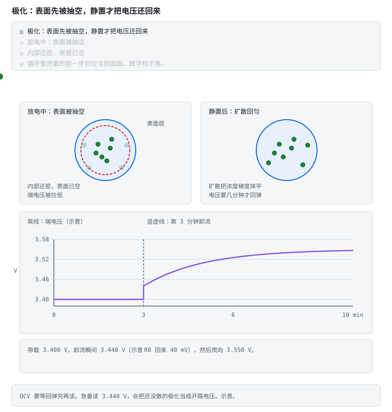
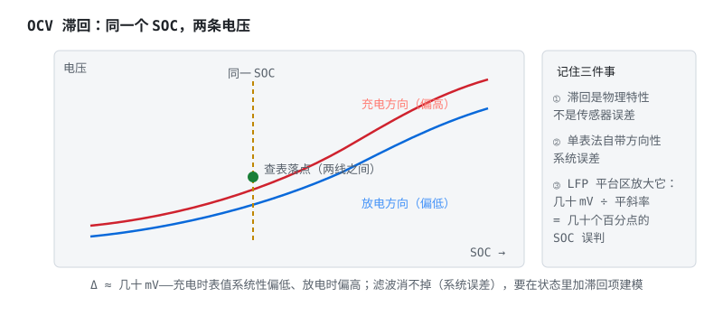

# 阶段 4 教程：SOC / SOH / SOP 估算算法

> 对应学习路线的阶段 4。建议用时 1–3 个月。前置：阶段 3 验收（手里最好有一块能采电压电流的板子）。
> 数学先修：矩阵乘法、期望与方差、正态分布（大一程度）——只有 §4.5 卡尔曼一节真正需要；公式卡壳时先抓每节末尾的工程结论，回头再补推导。
> 🔍 配套深入解析（含动画）：[电路详解 ③ 充电、均衡与计量](../circuits/03-充电均衡与计量.md)
>
> 这是 BMS 的软件核心。用户每天看到的"还剩 63%"，背后是本阶段的全部内容。

---

## 本页目录

按层走先看 [能力地图](bloom-map.md)。标题末尾的 `[记忆]` … `[创造]` 是布鲁姆层级。

- [阶段 4 教程：SOC / SOH / SOP 估算算法](stage-4-SOC-SOH算法.md#阶段-4-教程soc--soh--sop-估算算法)
- [4.1 问题定义：给电池做油量表，难在哪 [理解]](stage-4-SOC-SOH算法.md#41-问题定义给电池做油量表难在哪-理解)
- [4.2 安时积分（库仑计）：主力，但它会梦游 [分析]](stage-4-SOC-SOH算法.md#42-安时积分库仑计主力但它会梦游-分析)
- [4.3 OCV 法：好尺子，但经常够不着 [分析]](stage-4-SOC-SOH算法.md#43-ocv-法好尺子但经常够不着-分析)
- [4.4 等效电路模型：让电压在动态中也能用 [分析]](stage-4-SOC-SOH算法.md#44-等效电路模型让电压在动态中也能用-分析)
- [4.5 卡尔曼滤波：两个不完美信息源的联姻 [分析]](stage-4-SOC-SOH算法.md#45-卡尔曼滤波两个不完美信息源的联姻-分析)
- [4.6 SOH 与联合估计：让算法把电池"看透" [分析]](stage-4-SOC-SOH算法.md#46-soh-与联合估计让算法把电池看透-分析)
- [4.7 SOP：电池此刻能出多大力 [分析]](stage-4-SOC-SOH算法.md#47-sop电池此刻能出多大力-分析)
- [4.8 工程落地要点 [评价]](stage-4-SOC-SOH算法.md#48-工程落地要点-评价)
- [4.9 自测题 [分析]](stage-4-SOC-SOH算法.md#49-自测题-分析)
- [4.10 动手任务 [应用]](stage-4-SOC-SOH算法.md#410-动手任务-应用)
- [4.11 验收清单 [评价]](stage-4-SOC-SOH算法.md#411-验收清单-评价)

## 4.1 问题定义：给电池做油量表，难在哪 [理解]

$$\text{SOC}(t) = \frac{\text{剩余可用容量}}{\text{当前满充容量}}$$

汽车油量表好做：油箱形状不变，液面一浮子量到底。电池不行——它有四个"捣蛋鬼"：

1. **电流零漂**：电流传感器零点总会偏一点，积分把这点偏差一分一秒攒起来；
2. **容量未知**：电池老化后，"满充容量"本身在缩水，分母都在动；
3. **OCV 不确定**：电压-电量曲线随温度、老化、充放方向（滞回）变化；
4. **温度**：-10°C 时可用容量能跌两三成，油表说冻就冻不准。

所有 SOC 算法的本质都是同一句话：**安时积分为主干，用电压信息不断校正**。分歧只在"怎么校正"。

**视频**　B 站 · [跟着戴海峰老师学 BMS（SOC / SOH / SOP）](https://www.bilibili.com/video/BV1BB4y1o7xC/)

放在问题定义，是因为这组中文课专门讲状态估计，和后面的库仑计、OCV、卡尔曼是同一条线。播放器打不开时用原页。

**视频**　YouTube · 英文，可选 · [Plett 等效电路模型课的公开欢迎片段](https://www.youtube.com/watch?v=fRgre6Tn3mw)

正课要在 Coursera 注册旁听。这条只用来看讲解风格，公式以仓库里的讲义为准。

> **原理**　$$\text{SOC}(t) = \frac{\text{剩余可用容量}}{\text{当前满充容量}}$$
> **证据**　SOC 的分母是当前满充容量，不是出厂标称。讲义 [Plett ECE5720](http://mocha-java.uccs.edu/ECE5720/index.html)（英文，可选）与 [Notes03 中文导读](../ece5720-notes03-中文导读.md)。
> **延伸阅读**　[Plett BMS2 课程站](http://mocha-java.uccs.edu/BMS2)（英文，可选）

## 4.2 安时积分（库仑计）：主力，但它会梦游 [分析]

约定**充电为正**（I>0 充、I<0 放——写进代码注释，全项目统一）：

$$\text{SOC}(t) = \text{SOC}(0) + \frac{1}{Q}\int_0^t I(\tau)\, d\tau$$

代码就一行：`SOC += I * dt / Q`。

问题出在"积"字上。看动画：显示水位（虚线）和真实水位是怎样一点点分开的——

**算一笔账**：1mA 的电流零漂（对 ±1A 量程的传感器来说小得几乎无法避免），一天累积 24mAh，10Ah 电池一天漂 0.24%，**一个月 7%**。纯安时积分的误差不收敛——它不会自己回来，只会越走越远。

所以工程上必须给它"锚点"：

- **满充校准**：CV 段电流衰减到截止值 → 必然是 100%，复位（动画结尾的绿章）；
- **静置 OCV 校准**：长时间静置后电压可靠，查 OCV 表复位；
- **下电保存**：SOC 带 CRC 存 Flash，上电用 OCV 交叉验证后决定采信谁。

> **原理**　安时积分把电流对时间累加再除以当前容量。它没有绝对锚，零漂和容量误差会一直累加，所以必须有满充或静置校正。
> **证据**　安时积分没有绝对锚。可复现实验是仓库 `code/soc` 的 `compare.py`（CI 会跑）。模型背景见 [总纲关键论文](../bms-resources.md#关键论文主线背后的学术骨架) 的 Plett 2004。
> **延伸阅读**　[ECE5720 Notes03 中文导读](../ece5720-notes03-中文导读.md)（可选，原文英文）

## 4.3 OCV 法：好尺子，但经常够不着 [分析]

开路电压（OCV）和 SOC 有单调对应关系——是天然的尺子，但用起来三个坎：

- **要等静置**：断电后极化电压要几分钟到几小时才消散，行车中根本等不起；

**不看动画版**：放电时电极表面的锂离子被快速抽走，形成浓度梯度——表面"空"了，端电压立刻被拉低（这就是极化压降）；静置时扩散把浓度重新抹匀，电压慢慢回弹。OCV 法要等的就是这个回弹完成。

- **滞回**：充电的 OCV 曲线和放电的不重合，中间差几十 mV——单张表自带系统误差；

**不看动画版**：同一个 SOC，充电方向的 OCV 曲线在上、放电方向在下，中间差几十 mV。游标停在哪一格，查表点都落在两线之间——充电时表值系统性偏低、放电时偏高。这不是噪声，滤波救不了；LFP 平台区把几十 mV 放大成几十个百分点的 SOC 误判。
- **LFP 平台**：看动画就懂了——

铁锂平台区 SOC 变 40%，电压只动 30mV——摊到每 1% SOC 只有约 0.75mV，**已经低于 2–5mV 的采样噪声**。所以纯电压法在 LFP 平台区基本失效，这也是铁锂电池包特别需要好算法的原因（三元锂的斜率就友好得多）。

> **原理**　开路电压和 SOC 单调对应，但要静置够久，而且磷酸铁锂平台区几乎是平的，单靠电压分不出中间电量。
> **证据**　开路电压这把尺子要静置，铁锂平台区几乎是平的。曲线对照本节动画；讲义见 [Notes03 中文导读](../ece5720-notes03-中文导读.md)。
> **延伸阅读**　[ECE5720 Notes03 中文导读](../ece5720-notes03-中文导读.md)（可选，原文英文）。金属锂负极和结构电池要各自的 OCV 曲线，见 [阶段 0 §0.1.8](stage-0-前置知识.md#018-固态电池固体电解质换掉了什么-理解)、[§0.1.9](stage-0-前置知识.md#019-碳纤维结构电池电极在承力外壳是另一件事-理解)。

## 4.4 等效电路模型：让电压在动态中也能用 [分析]

静置等不起，那就建模把"动态的电压"翻译成 SOC：

- **Rint 模型**：$U = U_{oc} + IR_0$（沿用全局约定：充电 I>0，端电压被顶高；放电 I<0，端电压被拉低）——太粗，忽略了"电压会慢慢回弹"这件事；
- **Thevenin（一阶 RC）**：$U = U_{oc} + IR_0 + U_{RC}$，其中 $\dot{U}_{RC} = -\dfrac{U_{RC}}{R_1C_1} + \dfrac{I}{C_1}$——工程主力。$R_0$ 是"立刻的压降"（欧姆内阻），$R_1C_1$ 是"慢慢来的压降"（极化）。注意 $U_{RC}$ 跟随电流符号：放电时为负，把端电压进一步往下拉；
- **二阶 RC**：极化分快慢两路，更准但参数更多。

**不看动画版**：真实电芯的脉冲响应前段有一个快速下陷（电荷转移极化，τ 秒级）再接缓慢长尾（扩散/浓差极化，τ 十秒到分钟级）。一阶 RC 只有一条支路，前段怎么调参都拟合不上（失配区）；二阶 RC 用快、慢两条支路各管一段才能贴合——代价是多两个参数要辨识。

参数从哪来？**HPPC 脉冲测试**：在不同 SOC 点给电池打电流脉冲，从电压响应曲线拟合出 $R_0, R_1, C_1$（脚本见 [AlterWL 工程](https://github.com/AlterWL/Battery_SOC_Estimation)与 Plett 课程；本仓库合成演示：[code/soc/hppc_demo.py](../../code/soc/hppc_demo.py)——把"打脉冲→三步反推→与真值对账"全流程跑给你看）。

> **原理**　端电压等于开路电压减去欧姆压降和极化压降。模型把这两部分分开，动态过程里也能从电压反推 SOC。
> **证据**　一阶 RC 拟合不上脉冲前段，二阶才把快慢两条时间常数分开。可跑的对照实现见 [AlterWL 工程](https://github.com/AlterWL/Battery_SOC_Estimation)（英文，可选）。参数是辨识出来的，不是动画里的示意数。
> **延伸阅读**　[ECE5720 Notes03 中文导读](../ece5720-notes03-中文导读.md)（可选，原文英文）

## 4.5 卡尔曼滤波：两个不完美信息源的联姻 [分析]

现在的局面：积分会漂、电压有噪。卡尔曼滤波的思想朴素动人——**每一步都先按模型预测，再按测量修正，谁的可信度高就多听谁的**。

看蓝线：它在灰线（真值）附近缓慢跑偏（预测在漂），然后被一次次绿色箭头（电压观测修正）拉回来——锯齿状，但始终贴住真值。而橙线（纯积分）已经一路漂走了。

把电池写成状态空间：状态 $x = [\text{SOC}, U_{RC}]^T$，输入 $I$，观测 $U$。

**预测步**：

$$\hat{x}^- = f(\hat{x}, I), \quad P^- = A P A^T + Q$$

**更新步**：

$$K = P^- C^T (C P^- C^T + R)^{-1}, \quad \hat{x} = \hat{x}^- + K\,(U_{\text{实测}} - g(\hat{x}^-)), \quad P = (I - KC)P^-$$

EKF 与线性 KF 的区别只在 $f$/$g$ 非线性（OCV 表是曲线），用雅可比矩阵 A、C 在当前工作点线性化。

**调参直觉**（比公式更难背的是这个）：

- Q 大 = 不信任模型 → 跟着测量跑，响应快但抖；
- R 大 = 不信任测量 → 平滑但滞后；
- **发散诊断**：残差 $U_{\text{实测}} - g(\hat{x}^-)$ 持续偏大 → 模型错了（参数漂移/温度没补偿），不是滤波器错了——别拧滤波器，去修模型。

把 Q/R 的直觉再换个角度看：增益 K 本质是两个信息源之间的信任分配——测量噪就信模型，模型漂久了就信测量，协方差条带在预测时变宽、更新时被压窄。LFP 平台区是个特例：电压对 SOC 几乎不敏感，测量的信息量极低，此时 K 必须自动变小，否则噪声会被当成信号灌进 SOC。

上手路径：先在 MATLAB 跑通 [AlterWL 的 EKF 工程](https://github.com/AlterWL/Battery_SOC_Estimation)，再用 [Battery Archive](https://www.batteryarchive.org/) 的公开数据换数据集验证。

> **原理**　现在的局面：积分会漂、电压有噪。卡尔曼滤波的思想朴素动人——**每一步都先按模型预测，再按测量修正，谁的可信度高就多听谁的**。
> **证据**　增益大就多信电压，增益小就多信积分。铁锂平台区电压几乎不动，这时不该把增益开大。实现对照 [AlterWL 的 EKF 工程](https://github.com/AlterWL/Battery_SOC_Estimation)（英文，可选）和仓库里的 `code/soc/`。
> **延伸阅读**　[ECE5720 Notes03 中文导读](../ece5720-notes03-中文导读.md)（可选，原文英文）

## 4.6 SOH 与联合估计：让算法把电池"看透" [分析]

老化的两个可观测后果：满充容量 $Q$ 下降、内阻 $R_0$ 上升。巧的是，它们都能写进状态向量一起估：

**不看动画版**：容量曲线从新电池的 100% 缓慢滑向 80%（EOL 惯用线），内阻曲线同期上翘——而且内阻往往先咬到 SOP（功率能力）：车还能跑、但"没劲儿"了。这两个可观测后果正好是慢 EKF 的估计目标。

- **双卡尔曼（联合估计）**：一个快 EKF 估 SOC（秒级节奏），一个慢 EKF 估 $Q$ 或 $R_0$（天级节奏）——慢参数当状态、快状态当已知，交替更新；
- **可观测性条件**：参数只有在电流激励下才"看得见"——长期静置或电流纹丝不动时，参数估计的协方差会长大。工程对策：激励不足时**冻结参数更新**，别让慢滤波器在黑暗中乱走；
- 朴素法也有价值：记录每次完整循环的吞吐容量比，长期拟合——简单、稳、可解释。

> **原理**　老化表现为满充容量下降、内阻上升。这两个量要在电流有变化时才估得准，长期静置时估计会发散。
> **证据**　容量下降、内阻上升要在电流有变化时才估得准。公开数据可从 [Battery Archive](https://www.batteryarchive.org/) 取。
> **延伸阅读**　[ECE5720 Notes03 中文导读](../ece5720-notes03-中文导读.md)（可选，原文英文）

## 4.7 SOP：电池此刻能出多大力 [分析]

SOP = 未来 T 秒（2s/10s/30s 分级）内允许的最大充/放电功率，取多约束的**最小值**：

- **电压约束**：放电时端电压不许跌破下限。由 $U = U_{oc} + IR_0 + U_{RC} \ge U_{min}$ 解出放电电流幅值上限：$|I_{\text{放}}| \le \dfrac{U_{oc} + U_{RC} - U_{min}}{R_0}$（放电时 $U_{RC}<0$，极化在吃电压——这正是大电流不能持久的数学表达）；
- **电流约束**：电芯与系统的最大允许电流；
- **SOC 约束**：低 SOC 限放电、高 SOC 限充电（回冲）；
- **温度约束**：低温降额（析锂风险）——所以冬天的电动车"没劲儿"，是 BMS 在保护电池。

整车/逆变器按 SOP 限功率运行——仪表盘上的"动力受限"提示，源头在这里。

动画里那条红线永远卡在最矮的约束柱上——这就是取 min 的几何含义。注意两个工程细节：时间窗越短允许的功率越高（热还没积累起来）；输出必须平滑，约束切换时 SOP 跳变会让整车扭矩跟着抖。

> **原理**　SOP 是未来几秒到几十秒内允许的最大充放电功率，取电压、电流和温度各条约束里最紧的那一个。
> **证据**　允许多大功率取多条约束里最紧的一条。课程入口：[Coursera《电池包均衡与功率估计》](https://www.coursera.org/learn/battery-pack-balancing-power-estimation)（英文，可选）。
> **延伸阅读**　[ECE5720 Notes03 中文导读](../ece5720-notes03-中文导读.md)（可选，原文英文）

## 4.8 工程落地要点 [评价]

- **OCV 表分温度**：至少 -10/0/25/45°C 四张表，查表插值；
- **满充校准判据**：CV 段电流 < 0.05C 且持续 t 秒，不是电压碰上限（阶段 0 的结论）；
- **精度目标**：恒流工况 <5% 是入门线；车用全工况 <3% 需要温度补偿 + 联合估计；
- **先仿真后上板**：[MiniBMS（Simulink）](https://github.com/ks-santosh/MiniBMS) 提供完整被控对象，在仿真里把算法调对，再上真板——在真电池上调发散的滤波器，调试成本是仿真的十倍。

> **原理**　OCV 表至少按几档温度分开查。电流零点要标定，滤波器先在仿真里收敛，再上真电池。
> **证据**　本节可点击来源：[MiniBMS（Simulink）](https://github.com/ks-santosh/MiniBMS)。阈值与宣传口径仍以 datasheet / 标准原文为准。
> **延伸阅读**　[术语表](../glossary.md) · [总纲](../bms-resources.md)

## 4.9 自测题 [分析]

1. 安时积分的误差为什么不收敛？两个校准点分别利用了什么物理事实？
2. OCV 滞回会给单表法带来什么误差？LFP 平台区为什么更要命？
3. Thevenin 模型里 $R_0$ 和 $R_1C_1$ 各对应电池什么物理过程？
4. EKF 中 Q、R 调大各自什么效果？残差持续偏大说明什么？
5. 双卡尔曼为什么能估容量？可观测性条件是什么？
6. SOP 为什么取多约束最小值？低温对 SOP 的影响路径？
7. 满充校准为什么用"CV 截止电流"而不是"电压到 4.2V"？

<b>参考答案（先自己想完再展开）</b>

1. 积分是**开环累加**：电流传感器的零漂每一拍都被加进去，误差随时间单调累积，没有任何机制把它拉回来（1mA 零漂 → 一天 24mAh → 10Ah 电池一个月漂约 7%）。两个校准点各自利用的物理事实：**满充校准**利用"CV 段电流衰减到截止值时电池必然是满的"这个电化学事实，把 SOC 直接复位到 100%；**静置 OCV 校准**利用"长时间静置后极化电压消散、端电压等于 OCV，而 OCV 与 SOC 单调对应"，查表复位。本质都是引入一个**与积分历史无关的绝对参照物**来打断误差累积。
2. 滞回 = 充电方向的 OCV-SOC 曲线与放电方向不重合，中间差几十 mV。单张表必然落在两条曲线之间，于是**充电时系统性偏一个方向、放电时偏另一个方向**——这是无法用滤波消除的**系统误差**（要消除得在状态里加滞回电压项建模，见 Plett Vol. II）。LFP 更要命是因为它的平台区本来就平：SOC 变 40% 电压只动 30mV，摊到每 1% SOC 约 0.75mV。几十 mV 的滞回误差换算成 SOC 误差就是几十个百分点——误差被平坦的斜率**放大**了。
3. $R_0$（欧姆内阻）对应**瞬时**电压变化：电解液离子导电、集流体与极耳的电子导电、接触电阻——电流一加/一撤，电压立刻跳变的那一段。$R_1C_1$（极化环节）对应**有时间常数的慢过程**：电极/电解液界面的电荷转移阻抗与双电层电容，以及（二阶模型里更慢那一路）锂离子在电极内部的扩散。表现就是电流撤掉后端电压不是立刻到位，而是慢慢回弹几秒到几分钟。
4. **Q 调大** = 声明"我不信任模型" → 增益 K 变大 → 更多跟着测量走：响应快、收敛快，但估计值跟着电压噪声抖。**R 调大** = 声明"我不信任测量" → K 变小 → 更依赖积分预测：平滑，但滞后、对真实变化反应慢。残差 $U_{\text{实测}} - g(\hat{x}^-)$ **持续**偏大（不是偶发尖峰）说明**模型错了**而不是滤波器参数错了——典型原因是 $R_0/R_1/C_1$ 随老化漂移、OCV 表没做温度补偿、容量 $Q$ 偏离真值。此时拧 Q/R 只是把症状压下去，应该去修模型、重标参数。
5. 思路是把慢变参数（容量 $Q$ 或内阻 $R_0$）也当成状态量，用一个独立的**慢滤波器**以天级节奏估它；快滤波器以秒级节奏估 SOC，估计时把慢参数当已知常数，两者交替更新。能估出来的原因：容量误差会在"积分预测的 SOC"与"电压观测反推的 SOC"之间制造**与电流吞吐成比例的系统性偏差**，这个偏差模式可以反解出容量。**可观测性条件**：必须有足够的**电流激励**——参数只有在电流流动、SOC 大范围变化时才"看得见"。长期静置或电流纹丝不动时慢滤波器的协方差会持续长大、估计值随机漂移。工程对策是激励不足时**冻结参数更新**。
6. 因为每条约束都是"不得越过"的硬边界：电压约束（端电压不许跌破下限）、电流约束（电芯与系统的最大允许电流）、SOC 约束（低 SOC 限放、高 SOC 限充）、温度约束（降额）。任何一条被突破都会造成损伤或触发保护，所以允许功率必须取所有约束各自算出的上限中**最小的那个**——木桶原理的又一次出现。低温的影响有两条路径叠加：①低温下 $R_0$ 显著增大 → 同样电流的 $IR_0$ 压降更大 → 电压约束更早触顶，解出的允许电流更小；②低温有析锂风险，策略上还要主动降额/禁充。合起来就是冬天电动车"没劲儿"——那是 BMS 在保护电池。
7. 因为 CC 段末端的端电压 = $U_{oc} + IR_0 +$ 极化电压，充电电流越大、内阻越高（低温/老化），虚高的成分越多。"电压碰到 4.2V"这一刻电池内部远没充满，撤流后电压会回落——用它校准会把 SOC **系统性标高**。而 **CV 段电流衰减到截止值（0.05–0.1C）**意味着极化基本松弛、内外电位接近平衡，此时的"满"是电化学意义上的满，与电流、温度、老化的耦合小得多，是**可重复**的参照点。

> **原理**　这些题考的是上面几节的机制。先盖住折叠答案，用自己的话讲完再展开。
> **证据**　这些题考库仑计漂移、OCV 和校正。对照 [Plett ECE5720](http://mocha-java.uccs.edu/ECE5720/index.html)（英文，可选）与 [Notes03 中文导读](../ece5720-notes03-中文导读.md)。
> **延伸阅读**　[Plett BMS2 课程站](http://mocha-java.uccs.edu/BMS2)（英文，可选）

## 4.10 动手任务 [应用]

1. 用 [Battery Archive](https://www.batteryarchive.org/) 一组公开循环数据，在 MATLAB/Python 依次实现：安时积分 → OCV 校正 → Thevenin + EKF，画出三条 SOC 曲线与真值对比；
   - 仓库已提供**同构对比**的合成工况版（初始 SOC 误差 + 零漂 + 容量误差 + 三种估算器）：[code/soc/](../../code/soc/)（`python3 compare.py --plot`）。先跑通再换真实数据集。**逐行走读**：[code/README.md §代码走读](../../code/README.md#代码走读带行号-应用)。
2. 做一组 HPPC 脉冲实验（或用数据集里的脉冲段），辨识 $R_0, R_1, C_1$（真实数据辨识须自做；合成演示见 [code/soc/hppc_demo.py](../../code/soc/hppc_demo.py)，含"40s 窗为什么拟合不动 τ"的实测教训）；
3. 把"安时积分 + 满充校准 + 静置 OCV 校准"移植到阶段 3 的板子上，恒流放电验证误差（无仓库代码，须上板）。

> **原理**　动手是把机制变成一次可核对的记录：条件、读数、和规格差在哪。没有记录的操作不算做完。
> **证据**　本节可点击来源：[Battery Archive](https://www.batteryarchive.org/)。阈值与宣传口径仍以 datasheet / 标准原文为准。
> **延伸阅读**　[术语表](../glossary.md) · [总纲](../bms-resources.md)

## 4.11 验收清单 [评价]

- [ ] 能手推 EKF 五步方程并说明每个矩阵的含义
- [ ] 恒流放电工况自实现 SOC 误差 <5%（与放电容量反推真值对比）
- [ ] 能解释 LFP 平台区的处理策略
- [ ] 能画出 SOP 的多约束决策过程

> **本阶段一句话**：积分为主干、电压做校正——所有 SOC 算法都是这句话的不同实现。

全部通过 → 进入 [阶段 5：通信与集成](stage-5-通信与集成.md)（总纲入口：[阶段 5](../bms-resources.md#阶段-5系统通信与集成24-周)）。

---

**上一阶段**：[阶段 3 AFE+MCU 智能 BMS](stage-3-AFE-MCU智能BMS.md) ｜ **下一阶段**：[阶段 5 通信与集成](stage-5-通信与集成.md) ｜ [学习路线总纲](../bms-resources.md) ｜ [术语表](../glossary.md)

> **原理**　验收问的是能不能用机制做判断。勾得上才进入下一阶段，勾不上就回到对应小节，而不是把目录再看一遍。
> **证据**　验收要能说清校正通道，而不是背公式。对照 [Plett ECE5720](http://mocha-java.uccs.edu/ECE5720/index.html)（英文，可选）。
> **延伸阅读**　[《车用 BMS 功能安全设计方法论》](https://www.mdpi.com/1996-1073/14/21/6942)（英文，可选）
