# 阶段 4 教程：SOC / SOH / SOP 估算算法

> **本篇你会学到**　用户看见的「还剩百分之几」从哪来：安时积分、开路电压、卡尔曼，以及 SOH / SOP。
> **预计用时**　1–3 个月。
> **前置**　阶段 3 验收。手里最好有一块能采电压和电流的板子。数学卡壳时先抓每节末尾的工程结论。

> 对应学习路线的阶段 4。建议用时 1–3 个月。前置：阶段 3 验收（手里最好有一块能采电压电流的板子）。
> 数学先修：矩阵乘法、期望与方差、正态分布（大一程度）——只有 §4.5 卡尔曼一节真正需要；公式卡壳时先抓每节末尾的工程结论，回头再补推导。
> 🔍 配套深入解析（含动画）：[电路详解 ③ 充电、均衡与计量](../circuits/03-充电均衡与计量.md)
>
> 这是 BMS 的软件核心。用户每天看到的"还剩 63%"，背后是本阶段的全部内容。

---

## 本页目录

按层走先看 [能力地图](bloom-map.md)。标题末尾的 `[记忆]` … `[创造]` 是布鲁姆层级。

- [4.1 问题定义：给电池做油量表，难在哪 [理解]](stage-4-SOC-SOH算法.md#41-问题定义给电池做油量表难在哪-理解)
- [4.2 安时积分（库仑计）：主力，但它会梦游 [分析]](stage-4-SOC-SOH算法.md#42-安时积分库仑计主力但它会梦游-分析)
- [4.3 OCV 法：好尺子，但经常够不着 [分析]](stage-4-SOC-SOH算法.md#43-ocv-法好尺子但经常够不着-分析)
- [4.4 等效电路模型：让电压在动态中也能用 [分析]](stage-4-SOC-SOH算法.md#44-等效电路模型让电压在动态中也能用-分析)
- [4.5 卡尔曼滤波：两个不完美信息源的联姻 [分析]](stage-4-SOC-SOH算法.md#45-卡尔曼滤波两个不完美信息源的联姻-分析)
- [4.6 SOH 与联合估计：让算法把电池"看透" [分析]](stage-4-SOC-SOH算法.md#46-soh-与联合估计让算法把电池看透-分析)
- [4.7 SOP：电池此刻能出多大力 [分析]](stage-4-SOC-SOH算法.md#47-sop电池此刻能出多大力-分析)
- [4.7b 充电地图：把析锂、温度、SOP 合成一条允许电流 [应用]](stage-4-SOC-SOH算法.md#47b-充电地图把析锂温度sop-合成一条允许电流-应用)
- [4.8 工程落地要点 [评价]](stage-4-SOC-SOH算法.md#48-工程落地要点-评价)
- [4.9 自测题 [分析]](stage-4-SOC-SOH算法.md#49-自测题-分析)
- [4.10 动手任务 [应用]](stage-4-SOC-SOH算法.md#410-动手任务-应用)
- [4.11 验收清单 [评价]](stage-4-SOC-SOH算法.md#411-验收清单-评价)

## 4.1 问题定义：给电池做油量表，难在哪 [理解]

$$\text{SOC}(t) = \frac{\text{剩余可用容量}}{\text{当前满充容量}}$$

汽车油量表好做：油箱形状不变，液面一浮子量到底。电池不行——它有四个"捣蛋鬼"：

1. **电流零漂**：电流传感器零点总会偏一点，积分把这点偏差一分一秒攒起来；
2. **容量未知**：电池老化后，"满充容量"本身在缩水，分母都在动；
3. **OCV 不确定**：电压-电量曲线随温度、老化、充放方向（滞回）变化；
4. **温度**：-10°C 时可用容量能跌两三成，油表说冻就冻不准。

所有 SOC 算法的本质都是同一句话：**安时积分为主干，用电压信息不断校正**。分歧只在"怎么校正"。

**视频**　B 站 · [跟着戴海峰老师学 BMS（SOC / SOH / SOP）](https://www.bilibili.com/video/BV1BB4y1o7xC/)

放在问题定义，是因为这组中文课专门讲状态估计，和后面的库仑计、OCV、卡尔曼是同一条线。播放器打不开时用原页。

**视频**　YouTube · 英文，可选 · [Plett 等效电路模型课的公开欢迎片段](https://www.youtube.com/watch?v=fRgre6Tn3mw)

正课要在 Coursera 注册旁听。这条只用来看讲解风格，公式以仓库里的讲义为准。

> **原理**　$$\text{SOC}(t) = \frac{\text{剩余可用容量}}{\text{当前满充容量}}$$
> **证据**　SOC 的分母是当前满充容量，不是出厂标称。讲义 [Plett ECE5720](http://mocha-java.uccs.edu/ECE5720/index.html)（英文，可选）与 [Notes03 中文导读](../ece5720-notes03-中文导读.md)。
> **延伸阅读**　[Plett BMS2 课程站](http://mocha-java.uccs.edu/BMS2)（英文，可选）

## 4.2 安时积分（库仑计）：主力，但它会梦游 [分析]

约定**充电为正**（I>0 充、I<0 放——写进代码注释，全项目统一）：

$$\text{SOC}(t) = \text{SOC}(0) + \frac{1}{Q}\int_0^t I(\tau)\, d\tau$$

代码就一行：`SOC += I * dt / Q`。

问题出在"积"字上。看动画：显示水位（虚线）和真实水位是怎样一点点分开的——

> **图说**　盯住离开原点的黄点：示意每小时偏 0.10 个百分点，24 小时是 2.4。这是 SOC 的百分数，不是「1 mA 一天 24 mAh」那一笔。

> **口诀**　安时一直在加。零漂会把油箱慢慢加歪，满充时拉回一次。

盯住底栏那条离开原点的直线。10 小时偏 1.0 个百分点，24 小时偏 2.4 个百分点。黄点沿直线离开原点。这是 SOC 的百分数，不是那张「1 mA 一天 24 mAh」的另一笔账。两笔不要加在同一个格子里，除非你先写明容量。

**算一笔账**：1mA 的电流零漂（对 ±1A 量程的传感器来说小得几乎无法避免），一天累积 24mAh，10Ah 电池一天漂 0.24%，**一个月 7%**。纯安时积分的误差不收敛——它不会自己回来，只会越走越远。

零偏是一根慢慢爬的斜线。分流器一发热，还会在大电流那一小时里额外弯一截：

**练完你会怎样**：你能用上面那句口诀，把这张图讲给别人听。

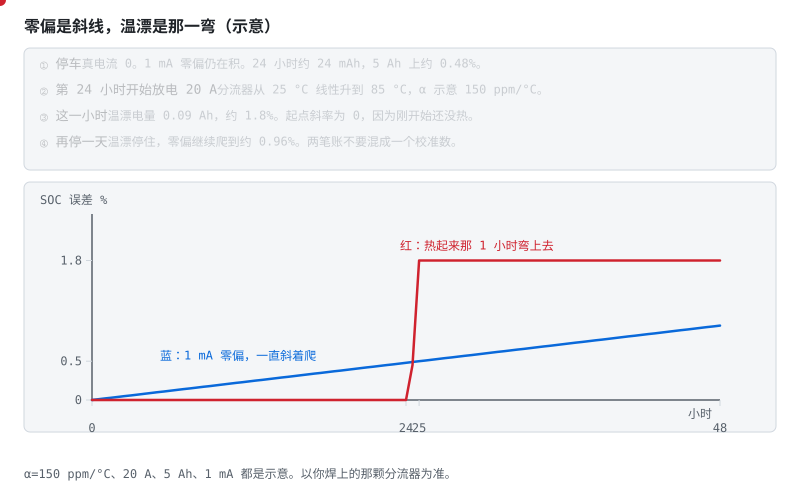

> **图说**　示意 5 Ah 的包。

> **口诀**　零偏一天天斜着爬。温漂在发热的那一小时里弯上去。

**看动画时盯住哪里**

1 mA 零偏一直在积，24 小时约 0.48%，48 小时约 0.96%。第 24 小时用 20 A 放电，分流器从 25 °C 线性升到 85 °C，温漂系数示意 150 ppm/°C。这一小时的温漂电量是 0.09 Ah，约 1.8%。刚开始还没热，所以这一弯的起点斜率是 0。停下来以后温漂不再长，零偏继续爬。

- 蓝线：只有 1 mA，几乎是直线。
- 红线和红点：第 24 到 25 小时拱起来，然后停住。
- 不要把这两笔收成一个「传感器误差」。

**短自测**

1. 停车时温漂为什么几乎不长？
2. 这一小时的 1.8% 是怎么来的？
3. 150 ppm/°C 能当成锰铜分流器的规格吗？

<b>参考答案（先自己想完再展开）</b>

1. 真电流接近 0，电阻变一点点也乘不出多少安。零偏却跟电流大小无关，停车也在积。
2. 平均温升 30 °C，20 A × 150 ppm × 30 °C = 0.09 A，乘 1 小时是 0.09 Ah。0.09/5 = 1.8%。示意口算。
3. 不能。它是为了把弯画出来。你焊上的那颗以它的手册为准，铜走线往往更差。

**练完你会怎样**：你校零点和看温漂会分成两笔账。大电流发热那一小时，不再只用停车时的零点去解释。

所以工程上必须给它"锚点"：

- **满充校准**：CV 段电流衰减到截止值 → 必然是 100%，复位（动画结尾的绿章）；
- **静置 OCV 校准**：长时间静置后电压可靠，查 OCV 表复位；
- **下电保存**：SOC 带 CRC 存 Flash，上电用 OCV 交叉验证后决定采信谁。

> **原理**　安时积分把电流对时间累加再除以当前容量。它没有绝对锚，零漂和容量误差会一直累加，所以必须有满充或静置校正。
> **证据**　安时积分没有绝对锚。可复现实验是仓库 `code/soc` 的 `compare.py`（CI 会跑）。模型背景见 [总纲关键论文](../bms-resources.md#关键论文主线背后的学术骨架) 的 Plett 2004。
> **延伸阅读**　[ECE5720 Notes03 中文导读](../ece5720-notes03-中文导读.md)（可选，原文英文）

## 4.3 OCV 法：好尺子，但经常够不着 [分析]

开路电压（OCV）和 SOC 有单调对应关系——是天然的尺子，但用起来三个坎：

- **要等静置**：断电后极化电压要几分钟到几小时才消散，行车中根本等不起；

> **图说**　放电时电极表面的锂离子被快速抽走，形成浓度梯度——表面"空"了，端电压立刻被拉低（这就是极化压降）；静置时扩散把浓度重新抹匀，电压慢慢回弹。

> **口诀**　刚卸流的电压不是开路电压。等表面的离子走匀。

**看动画时盯住哪里**

OCV 法要等的就是这个回弹完成。

- 左边颗粒：表面的点变淡，就是电压被拉低的原因。
- 右边那一颗在走动的离子：静置是扩散，不是表自己变准。
- 底下一行示意电压：3.400 V 带载，卸流瞬间 3.440 V，几分钟后才到 3.550 V 附近。

**短自测**

1. 卸流瞬间从 3.400 V 跳到 3.440 V，可以拿去查 OCV 表吗？
2. 后面从 3.440 V 慢慢走到 3.550 V，走的是哪一项？
3. 这些伏特数是某一次实验记录吗？

<b>参考答案（先自己想完再展开）</b>

1. 先别查。示意里这 40 mV 只是欧姆压降回来了，极化还在。
2. 极化。表面的锂离子要靠扩散走匀，所以要几分钟，急不得。
3. 不是。3.400 / 3.440 / 3.550 V 是教学示意，帮你记住先后，不是某一颗电芯的静置曲线。

**练完你会怎样**：你能把「刚断电的电压」和「等够的开路电压」分成两拍。第一拍只还了欧姆那一截。

- **滞回**：充电的 OCV 曲线和放电的不重合，中间差几十 mV——单张表自带系统误差；

> **图说**　同一个 SOC，充电方向的 OCV 曲线在上、放电方向在下，中间差几十 mV。

> **口诀**　同一个荷电，充电电压更高，放电电压更低。静置抹不平这条缝。

**看动画时盯住哪里**

游标停在哪一格，查表点都落在两线之间——充电时表值系统性偏低、放电时偏高。这不是噪声，滤波救不了；LFP 平台区把几十 mV 放大成几十个百分点的 SOC 误判。

- 两条曲线之间的竖缝：同一根 SOC 竖线，上面一颗电压和下面一颗不是同一个数。
- 底栏的示意：充电支 3.320 V，放电支 3.280 V，缝 40 mV。
- 平台若按本节约 0.75 mV / 1%，40 / 0.75 ≈ 53，大约 53 个百分点。

**短自测**

1. 静置半小时，充电支和放电支会合成一条吗？
2. 40 mV 的缝，在约 0.75 mV / 1% 的平台上，大约是多少 SOC？
3. 滤波能把这条缝消掉吗？

<b>参考答案（先自己想完再展开）</b>

1. 不会。静置抹平的是极化。滞回是充放电两条开路电压本来就不重合。
2. 大约 53 个百分点。40 / 0.75 ≈ 53。这是用本节平台口算做的示意，不是新的测量。
3. 消不掉。它是方向性的系统误差，不是来回跳的噪声。

**练完你会怎样**：你看见同一个荷电有两套开路电压时，不会再只留一张表。


> **图说**　带载 3.450 V。

> **口诀**　立刻回来的是内阻。慢慢回来的是极化。两条开路电压的缝，等不没。

**看动画时盯住哪里**

电流一停，欧姆那 40 mV 立刻回来，到 3.490 V。再等示意 τ=3 min，放电方向的开路电压才靠近 3.620 V。同一荷电的充电支仍在 3.660 V 附近。等再久，这条缝还在。

- 竖着掉下去又立刻抬起的那一截：欧姆。
- 随后慢慢靠向 3.620 V 的那一截：极化。
- 上面那条 3.660 V 的虚线：充电方向的开路电压，它不跟着这次静置下来。

**短自测**

1. 卸流后 3.490 V 为什么还不能当开路电压？
2. 等了十分钟，为什么充电支和放电支还差 40 mV？
3. 3.450 V 这些数能写进保护比较器吗？

<b>参考答案（先自己想完再展开）</b>

1. 极化还在往回走。示意里它要再靠向 3.620 V。
2. 那是滞回，不是没等够。静置只抹平这一次的极化。
3. 不能。全是示意，用来分清三截电压，不是阈值。

**练完你会怎样**：你能把一次卸流拆成三截：立刻的、慢慢的、怎么等都还在的。

要等多久，也看温度。冷的时候同一套计时会太短：

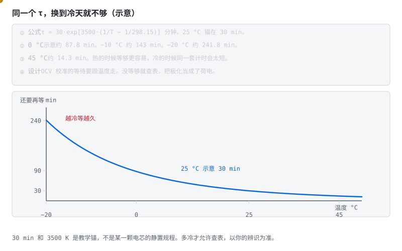

> **图说**　示意 τ = 30·exp[3500·(1/T−1/298.15)] 分钟。

> **口诀**　同一个等待时间，换到冷天就不够。

**看动画时盯住哪里**

25 °C 锚在 30 min。0 °C 约 88 min，−10 °C 约 143 min，−20 °C 约 242 min，45 °C 约 14 min。冷侧陡，热侧变缓。

- 黄点从冷往热走，等待时间很快变短。
- 25 °C 的 30 min 是锚。左边高得多。
- 这是「还要再等」，不是内阻那张图，虽然形状像。

**短自测**

1. 室温等 30 分钟就查表。拿到 0 °C 还够吗？
2. 为什么曲线在冷侧更陡？
3. 242 min 能写成你的静置规程吗？

<b>参考答案（先自己想完再展开）</b>

1. 按这张示意不够。0 °C 大约要 88 分钟。没等够，极化还在，查表会把荷电看偏。
2. 时间和内阻一样，示意里放进了活化能。越冷，扩散越慢，斜率越大。
3. 不能。30 min 和 3500 K 是教学锚。多冷才允许查表，以你的辨识为准。

**练完你会怎样**：你给开路电压校准设等待时，会让它跟着温度变，而不是全温度共用一个秒数。

铁锂平台先看结论：荷电从大约 30% 到 70%，电压只动约 30 mV，摊到每 1% 只有约 0.75 mV，已经和 2–5 mV 的采样噪声缠在一起。这段不信电压。

> **图说**　盯住几乎贴平的那一段：示意 30% 到 70% 只爬 30 mV，几毫伏噪声能盖住好几个百分点。

> **口诀**　平台上电压几乎不动，荷电可以差一大截。

盯住底栏那条几乎贴平的直线。40 个百分点只爬 30 mV，斜率 0.75 mV / 每个百分点。50% 时是 3.295 V。黄点沿这条几乎平的线走。2–5 mV 的噪声能盖住好几个百分点。

**练完你会怎样**：你能用上面那句口诀，把这张图讲给别人听。


> **图说**　一条几乎水平的线上有两个点，电压差不多，荷电可以差几十个百分点。

> **口诀**　同一小段毫伏，可以是两个很不同的荷电。这段信积分。

**看动画时盯住哪里**

错的读法是「电压一样，SOC 就一样」。对的读法是这段改信安时积分。三元斜率更陡，电压还能用。示意图，不是某一颗电芯的规格。

把铁锂、三元和钠离子的示意开路电压放在同一张轴上，就看得见图为什么：

**练完你会怎样**：你能用上面那句口诀，把这张图讲给别人听。

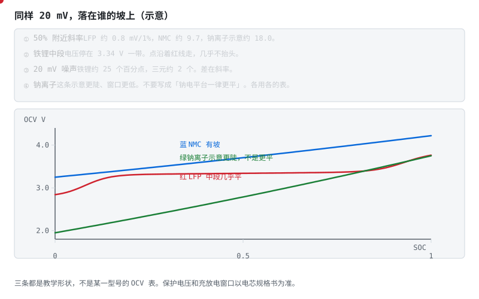

> **图说**　50% 附近的斜率，铁锂示意约 0.8 mV/1%，三元约 9.7 mV/1%，钠离子这条示意约 18 mV/1%。

> **口诀**　铁锂中段几乎是平的。同样的毫伏，在它身上换算成的荷电最大。

**看动画时盯住哪里**

同样 20 mV 的噪声，铁锂上大约是 25 个百分点，三元上大约是 2 个。钠离子这条更陡、窗口更低，不要写成「钠电平台一律更平」。

- 红点和红线：铁锂走到中间几乎不抬头。
- 蓝线有坡，绿线更陡。
- 三条都是教学形状。保护电压仍以规格书为准。

**短自测**

1. 20 mV 噪声，在这张铁锂示意上大约是多少 SOC？
2. 为什么钠离子不能画成比铁锂更平？
3. 3.34 V 能当成铁锂 50% 的规格吗？

<b>参考答案（先自己想完再展开）</b>

1. 大约 25 个百分点。20 / 0.8 ≈ 25。三元大约 2 个。所以铁锂中段改信积分。
2. 不同材料的开路电压不一样。这张示意里钠离子更陡。上一轮已经写过：不要说平台一律更平。
3. 不能。它是这条示意曲线在 50% 的读数，用来比斜率。

**练完你会怎样**：别人把三种电池的电压画在一起时，你先看中段陡不陡，再决定能不能用电压估荷电。

> **原理**　开路电压和 SOC 单调对应，但要静置够久，而且磷酸铁锂平台区几乎是平的，单靠电压分不出中间电量。
> **证据**　开路电压这把尺子要静置，铁锂平台区几乎是平的。曲线对照本节动画；讲义见 [Notes03 中文导读](../ece5720-notes03-中文导读.md)。
> **延伸阅读**　[ECE5720 Notes03 中文导读](../ece5720-notes03-中文导读.md)（可选，原文英文）。金属锂负极和结构电池要各自的 OCV 曲线，见 [阶段 0 §0.1.8](stage-0-前置知识.md#018-固态电池固体电解质换掉了什么-理解)、[§0.1.9](stage-0-前置知识.md#019-碳纤维结构电池电极在承力外壳是另一件事-理解)。钠离子不要写成平台一律更平，见 [§0.1.10](stage-0-前置知识.md#0110-钠离子硬碳和另一套电压窗口-理解)。

表上的点可以是对的。两点之间若用直线连，弯的地方会离开真曲线。

> **图说**　盯住表点中间蓝线和虚线分开的地方：示意中间比曲线低大约 25 mV，表点上才碰上。

> **口诀**　点上重合，点间会分家。弯得越厉害，分得越开。

**看动画时盯住哪里**

黄点贴着蓝线（真曲线）。黄虚线是弦。看它们在表点上碰上，在两表点中间分开。

示意真曲线 $V=3.30+0.90s+0.12\sin(2\pi s)$。这不是三元，也不是铁锂，只是一条有弯的教学曲线。表点在 0、0.25、0.50、0.75、1。$s=0.125$ 时真值大约 3.497 V，弦是 3.473 V，直线比曲线低大约 25 mV。这一带斜率大约每个百分点 14 mV，25 mV 大概是 2 个百分点的 SOC。半满附近正弦过零，弦和曲线贴得最近。

表越稀，膝部越吃亏。把插值误差当成 0，SOC 会在弯的地方静静地偏。

**短自测**

1. $s=0.125$ 时，示意误差大约多少毫伏？
2. 为什么五个点不能保证整段都准？

<b>参考答案（先自己想完再展开）</b>

1. 大约 25 mV。直线偏低。
2. 直线只保证端点。中间的弯曲没有被采样。这条正弦不是实测 OCV。

**练完你会怎样**：你查表插值时，会问表在弯的地方够不够密，而不是只数一共有几个点。

## 4.4 等效电路模型：让电压在动态中也能用 [分析]

电流还在流的时候，端电压里混着三样：开路电压、立刻出现的欧姆压降、慢慢回弹的极化。静置是为了等后两样退去。等不起，就用模型把它们分开，动态里的电压才还能拿来对 SOC。

- **Rint 模型**：$U = U_{oc} + IR_0$（沿用全局约定：充电 I>0，端电压被顶高；放电 I<0，端电压被拉低）——太粗，忽略了"电压会慢慢回弹"这件事；
- **Thevenin（一阶 RC）**：$U = U_{oc} + IR_0 + U_{RC}$，其中 $\dot{U}_{RC} = -\dfrac{U_{RC}}{R_1C_1} + \dfrac{I}{C_1}$——工程主力。$R_0$ 是"立刻的压降"（欧姆内阻），$R_1C_1$ 是"慢慢来的压降"（极化）。注意 $U_{RC}$ 跟随电流符号：放电时为负，把端电压进一步往下拉；
- **二阶 RC**：极化分快慢两路，更准但参数更多。

> **图说**　真实电芯的脉冲响应前段有一个快速下陷（电荷转移极化，τ 秒级）再接缓慢长尾（扩散/浓差极化，τ 十秒到分钟级）。

> **口诀**　前段掉得快，后段拖得慢。一阶只有一根时间。

**看动画时盯住哪里**（[一阶与二阶](../circuits/assets/second-order-rc.svg) 底栏）

一阶 RC 只有一条支路，前段怎么调参都拟合不上（失配区）；二阶 RC 用快、慢两条支路各管一段才能贴合——代价是多两个参数要辨识。

- 红色失配区：一阶贴不上的快陷。
- 底栏写明：20 A、2 mΩ、立刻 40 mV，这一截不归时间常数。
- 快路示意 τ₁≈1 s，慢路示意 τ₂≈30 s。两根时间，各管一段。

**算一笔**　示例：放电 20 A，欧姆内阻 2 mΩ，立刻掉 $20 \times 0.002 = 0.040$ V，也就是 40 mV。查 OCV 表之前，先把这 40 mV 从端电压里拿掉。后面继续下沉、又慢慢回来的那一截，才是 RC。一阶只有一根时间，脉冲最前面那一截快掉拟合不上。

**练完你会怎样**：你能用上面那句口诀，把这张图讲给别人听。

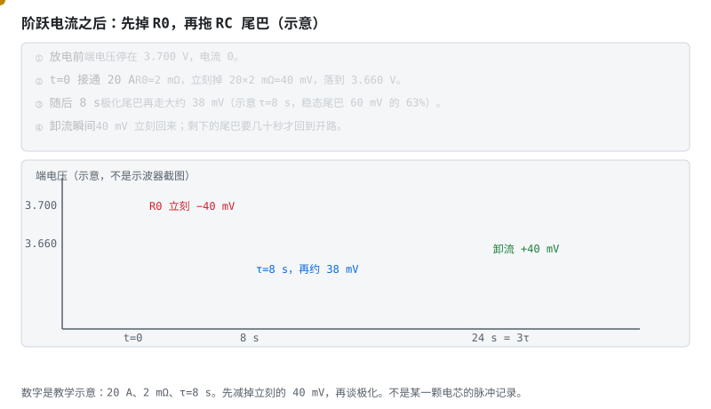

> **图说**　电流在 t=0 变成放电 20 A。

> **口诀**　接通先掉一根竖直的。随后才是拖尾巴。卸流时，竖直的那根先回来。

**看动画时盯住哪里**

端电压先竖直掉 40 mV，这是 R0。随后沿示意 τ=8 s 的指数再往下走，8 秒时尾巴大约走完 63%。电流再变为 0 时，40 mV 立刻回来，尾巴还要继续退。

- 竖线：接通瞬间的 40 mV。
- 弯下去的蓝线：RC 尾巴，示意 τ=8 s。
- 时间轴上的黄点：先看竖直，再看弯曲。

**短自测**

1. 20 A、2 mΩ，立刻掉多少？它属于 R0 还是 RC？
2. 为什么卸流时有一截电压马上回来，还有一截不回来？
3. τ=8 s 能当作你的电芯参数吗？

<b>参考答案（先自己想完再展开）</b>

1. 40 mV，属于 R0。20×0.002=0.040 V。它不需要时间常数。
2. R0 跟着电流，电流没了它就没了。RC 上的电压要按自己的 τ 退掉。
3. 不能。它是和上面那笔 40 mV 配套的示意，参数仍要从 HPPC 拟合。

**练完你会怎样**：你能在一条阶跃波形上指出：哪一截是内阻，哪一截才要等。

把频率从高扫到低，这三截会在一张复平面上分开：

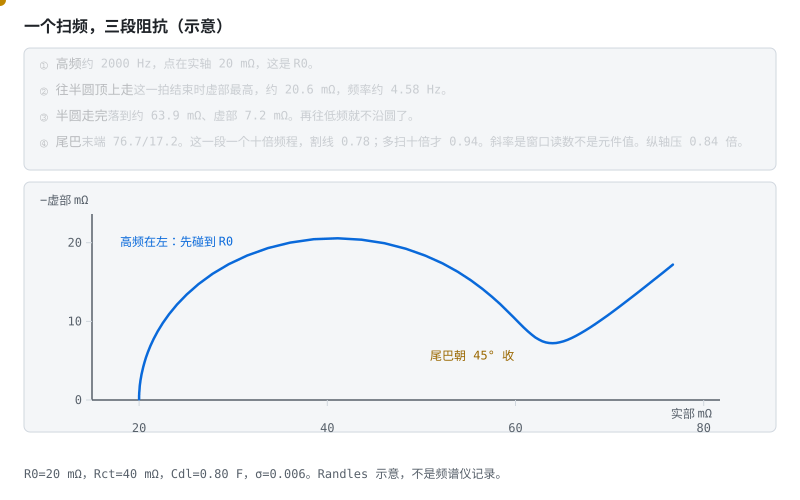

> **图说**　示意 Randles 电路，R0 = 20 mΩ，Rct = 40 mΩ，Cdl = 0.80 F，Warburg 系数 σ = 0.006。

> **口诀**　高频先碰到内阻。半圆是电荷转移。45° 的尾巴是扩散。

**看动画时盯住哪里**

高频约 2000 Hz 时，点停在实轴 20 mΩ，那是 R0。半圆顶大约在 4.6 Hz，虚部约 21 mΩ。半圆走完，实部大约 64 mΩ。再往低频，尾巴斜率约 0.94，接近 45°。那一截是扩散，不要再当成一个电阻。

- 第一拍：点在最左边，贴着实轴。
- 第二拍结束：点在半圆顶上。
- 第四拍：点沿尾巴往右上走，不再绕圆。

**短自测**

1. 为什么高频读数最接近 R0？
2. 尾巴的斜率大约是多少？它代表什么？
3. 这张图的 20 mΩ 能写进电芯规格吗？

<b>参考答案（先自己想完再展开）</b>

1. 电容在高频上接近短路，半圆缩掉，先剩下串联的那颗欧姆电阻。
2. 大约 0.94，接近 45°。它是扩散（Warburg），不是再串一颗电阻。
3. 不能。R0、Rct、Cdl 和 σ 是一套教学数，用来把三段分开。

**练完你会怎样**：你看见一条往右上 45° 的尾巴时，不会把它拟合成又一个 RC。

参数从哪来？**HPPC 脉冲测试**：在不同 SOC 点给电池打电流脉冲，从电压响应曲线拟合出 $R_0, R_1, C_1$（脚本见 [AlterWL 工程](https://github.com/AlterWL/Battery_SOC_Estimation)与 Plett 课程；本仓库合成演示：[code/soc/hppc_demo.py](../../code/soc/hppc_demo.py)——把"打脉冲→三步反推→与真值对账"全流程跑给你看）。

> **原理**　端电压等于开路电压减去欧姆压降和极化压降。模型把这两部分分开，动态过程里也能从电压反推 SOC。
> **证据**　一阶 RC 拟合不上脉冲前段，二阶才把快慢两条时间常数分开。可跑的对照实现见 [AlterWL 工程](https://github.com/AlterWL/Battery_SOC_Estimation)（英文，可选）。参数是辨识出来的，不是动画里的示意数。
> **延伸阅读**　[ECE5720 Notes03 中文导读](../ece5720-notes03-中文导读.md)（可选，原文英文）

**短自测**　动画是 [一阶与二阶 RC](../circuits/assets/second-order-rc.svg)。

1. 电流还在流，端电压能直接查 OCV 表吗？
2. 上面那笔 20 A、2 mΩ，立刻掉的 40 mV 是哪一项？
3. 一阶 RC 贴不上脉冲的哪一段？

<b>参考答案（先自己想完再展开）</b>

1. 不能直接查。端电压里还有欧姆压降和极化，这两项要等静置退去，或先用模型减掉。
2. 欧姆内阻 $R_0$。它跟着电流立刻出现，也立刻消失。极化是后面那根更慢的时间。
3. 最前面那一截快掉（电荷转移，时间常数到秒级）。一阶只有 $R_1C_1$ 一根时间，前段怎么调都留一块失配。慢尾巴要另给一根。

## 4.5 卡尔曼滤波：两个不完美信息源的联姻 [分析]

现在的局面：积分会漂、电压有噪。卡尔曼滤波的思想朴素动人——**每一步都先按模型预测，再按测量修正，谁的可信度高就多听谁的**。

> **图说**　盯住金线充回去仍偏低，蓝线贴着灰虚线。这组曲线来自 `compare.py`、种子 42：纯安时整段 RMSE 10.6183%，EKF 0.2004%。仿真，不是电芯考试。

> **口诀**　积分往前走，电压负责把它拉回来。

**看动画时盯住哪里**

- 金线是纯安时，没有人拉它，充回去仍偏低。
- 灰虚线是真值。蓝线是 EKF，贴着真值。
- 下面红线是全程误差。底栏读这一时刻的真值和误差。脚注「1 mA 一天 24 mAh」是另一笔示意账，不是这条曲线。图上写明：种子 42，17000 步，每步 1 秒。

**练完你会怎样**：你能用上面那句口诀，把这张图讲给别人听。

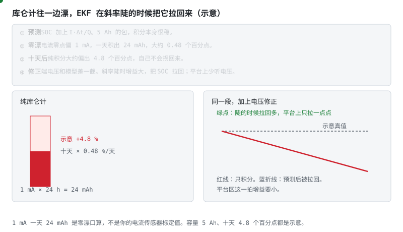

> **图说**　预测步只做 SOC += I·Δt/Q。

> **口诀**　积分负责走。电压负责在坡陡的时候拽一把。平地上别用力拽。

**看动画时盯住哪里**

零点若偏 1 mA，一天积 24 mAh。示意容量 5 Ah 时，十天大约偏 4.8 个百分点，纯积分不会自己拐回来。电压残差在斜率陡的时候把估计拉回；平台上这一拍要少听电压。

- 左边红柱往上长：十天的零漂，没有修正。
- 右边蓝折线被绿点拽回：修正发生在残差出现的那一拍。
- 底行 24 mAh：1 mA 乘 24 小时，先把单位算完再谈滤波器。

**短自测**

1. 1 mA 零漂，5 Ah 的示意包，一天大约偏多少 SOC？
2. 为什么平台上不能把电压修正的增益拧大？
3. 24 mAh 是电流计的出厂误差吗？

<b>参考答案（先自己想完再展开）</b>

1. 大约 0.48 个百分点。24 mAh / 5000 mAh。十天大约 4.8 个百分点，仍是示意。
2. 平台上几十毫伏对应几十个百分点。噪声会灌进 SOC。坡陡才多听电压。
3. 不是。它是「1 mA 积一天」的口算，用来看漂移的方向。你的零点要自己标定。

**练完你会怎样**：你能讲清：库仑计为什么越走越偏，以及 EKF 在哪一拍才有资格拉它。

开路电压是弯的。无迹卡尔曼不在工作点上拉一条切线，而是先放几个点穿过去：

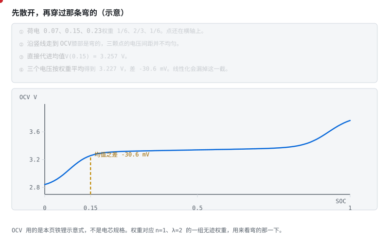

> **图说**　示意三个点在荷电 0.07、0.15、0.23，权重 1/6、2/3、1/6。

> **口诀**　先把点散开，再穿过那条弯的。平均值的电压，不是电压的平均。

**看动画时盯住哪里**

直接把均值代进去，V(0.15) = 3.257 V。三个电压按权重平均是 3.227 V，低了 30.6 mV。差在膝部：左边那个点已经掉下平台，线性化会把这一截漏掉。

- 第一拍三个点还在横轴上。
- 第二拍它们沿竖线走到曲线上，间距并不均匀。
- 图上那 30.6 mV，就是「先平均再代」和「先代再平均」的差。

**短自测**

1. 为什么三个点的电压不能简单用中间那个代替？
2. 30.6 mV 出在曲线的哪一段？
3. 这组权重是某一篇论文的推荐调参吗？

<b>参考答案（先自己想完再展开）</b>

1. 曲线是弯的。左边的点掉下了膝部，拉低了加权平均。V(0.15) 看不到这件事。
2. 荷电 0.15 附近的膝。平台中段如果几乎是直的，这个差会小很多。
3. 不是。1/6、2/3、1/6 对应 n=1、λ=2 的一组无迹权重，只为了把弯的那一下演出来。

**练完你会怎样**：你能说明，为什么在铁锂膝部，只做一次线性化会把电压均值估偏。

增益自己也会走到一个平台。测量越吵，平台越低；过程噪声更大，平台更高。三条线画在下面那张 [卡尔曼增益](../circuits/assets/kalman-gain.svg) 上，不另开一张。

> **图说**　蓝线 R=0.001，红线 R=0.020，绿线把 Q 乘 4。一维示意。

> **口诀**　刚开始可以多听测量。吵起来以后，增益自己变小，然后停在一个平台。

**看动画时盯住哪里**

起步 P = 0.04，每步加 Q = 0.0004，再按 K = P/(P+R) 更新。R = 0.001 时第一步 K ≈ 0.98，后来收到约 0.46。R = 0.02 时，稳态大约 0.13。绿线 Q = 0.0016，平台比蓝线高。三条都从高处往下走，然后停住，不会回到 0。

- 金点沿着蓝线：测量比较静，平台还比较高。
- 红线更低：同样的 Q，R 大了十倍以上。
- 绿线更高：模型更不可信，就多听测量。三条都有平台。那是稳态，不是故障。

**短自测**

1. 为什么第一步的增益特别大？
2. R 从 0.001 改成 0.02，稳态增益大约变成多少？
3. 这张图的 Q、R 能抄进仓库里的 EKF 吗？

<b>参考答案（先自己想完再展开）</b>

1. 起步协方差 P=0.04，比 R=0.001 大得多，所以几乎全听这一次测量。更新之后 P 变小，增益就降下来。
2. 大约 0.13。测量更吵，就该少听电压。铁锂平台区的信息更少，方向相同。
3. 不能。这是一维随机游走的示意，不是 `code/soc` 里的调参。

**练完你会怎样**：你看见增益慢慢降下来并停住时，知道那是 P、Q、R 谈妥了，不是滤波器坏了。

看上面那张 EKF 图：金线是纯安时，充回去仍偏低；蓝线贴着灰虚线真值。数来自 `code/soc/compare.py`，种子 42。图上整段 RMSE：纯安时 10.6183%，EKF 0.2004%。下面红线是 EKF 减去真值。工况写在图底：假定容量 9.5 Ah（模型 10 Ah）、初值 0.7（模型 0.8）、零漂 +2 mA。

把电池写成状态空间：状态 $x = [\text{SOC}, U_{RC}]^T$，输入 $I$，观测 $U$。

**预测步**：

$$\hat{x}^- = f(\hat{x}, I), \quad P^- = A P A^T + Q$$

**更新步**：

$$K = P^- C^T (C P^- C^T + R)^{-1}, \quad \hat{x} = \hat{x}^- + K\,(U_{\text{实测}} - g(\hat{x}^-)), \quad P = (I - KC)P^-$$

EKF 与线性 KF 的区别只在 $f$/$g$ 非线性（OCV 表是曲线），用雅可比矩阵 A、C 在当前工作点线性化。

**调参直觉**（比公式更难背的是这个）：

- Q 大 = 不信任模型 → 跟着测量跑，响应快但抖；
- R 大 = 不信任测量 → 平滑但滞后；
- **发散诊断**：残差 $U_{\text{实测}} - g(\hat{x}^-)$ 持续偏大 → 模型错了（参数漂移/温度没补偿），不是滤波器错了——别拧滤波器，去修模型。

> **图说**　盯住两条往下收的曲线：蓝线 R=0.001，红线 R=0.020。式子是 K=P/(P+R)。红线停得更低。

> **口诀**　平台上少信电压。斜率陡的时候才多信电压。

增益按 $K=P/(P+R)$ 把信任分出去。图上 P 从 0.04 起步，每步先加 Q=0.0004，再按 $(1-K)P$ 收缩。R=0.001 的蓝线第一步 K=0.9758，后来收到 0.4633。R=0.020 的红线收到 0.1318。绿线把 Q 提到 0.0016，平台比蓝线高：过程更吵，就多听这一次测量。右上角小图是平台：荷电 0.50 处大约 0.75 mV/1%，所以更该靠近红线。这是一维示意，不是 `code/soc` 里 EKF 的调参。测量更吵，K 自己变小；平台上电压几乎不动，同样要少信电压，否则噪声灌进 SOC。

上手路径：先在 MATLAB 跑通 [AlterWL 的 EKF 工程](https://github.com/AlterWL/Battery_SOC_Estimation)，再用 [Battery Archive](https://www.batteryarchive.org/) 的公开数据换数据集验证。

> **原理**　现在的局面：积分会漂、电压有噪。卡尔曼滤波的思想朴素动人——**每一步都先按模型预测，再按测量修正，谁的可信度高就多听谁的**。
> **证据**　增益大就多信电压，增益小就多信积分。铁锂平台区电压几乎不动，这时不该把增益开大。实现对照 [AlterWL 的 EKF 工程](https://github.com/AlterWL/Battery_SOC_Estimation)（英文，可选）和仓库里的 `code/soc/`。
> **延伸阅读**　[ECE5720 Notes03 中文导读](../ece5720-notes03-中文导读.md)（可选，原文英文）

**短自测**　先看 [EKF 融合](../circuits/assets/ekf-estimation.svg)，再看 [增益怎么分](../circuits/assets/kalman-gain.svg)。

1. 铁锂平台上电压几乎不动。这一步多听积分，还是多听电压？
2. 残差 $U_{\text{实测}} - g(\hat{x}^-)$ 一直很大。先把增益拧大，还是先查模型？
3. 纯积分那条线为什么一路漂走？

<b>参考答案（先自己想完再展开）</b>

1. 多听积分。平台上大约 30% 到 70% 只动约 30 mV，每 1% 约 0.75 mV，和 2–5 mV 的采样噪声缠在一起。增益要小，否则噪声灌进 SOC。斜率陡的时候才多听电压。
2. 先查模型。残差持续偏大，是参数漂了，或温度没补上。把增益拧大，只是把错的电压灌进状态。
3. 电流零漂和容量误差没有第二头锚。积分只按电流往前加，电压这一头不来拉，它就慢慢走偏。

**练完你会怎样**：你能用上面那句口诀，把这张图讲给别人听。

## 4.6 SOH 与联合估计：让算法把电池"看透" [分析]

老化的两个可观测后果：满充容量 $Q$ 下降、内阻 $R_0$ 上升。巧的是，它们都能写进状态向量一起估：

> **图说**　容量曲线从新电池的 100% 缓慢滑向 80%（EOL 惯用线），内阻曲线同期上翘——而且内阻往往先咬到 SOP（功率能力）：车还能跑、但"没劲儿"了。

> **口诀**　容量还在掉。内阻往往先把功率收走。

**看动画时盯住哪里**

这两个可观测后果正好是慢 EKF 的估计目标。

- 蓝线往 80% 那条虚线滑：容量。
- 红线往上翘，光点先碰到「先咬 SOP」：内阻。
- 底栏对照：示意新电池 5.0 Ah、20 mΩ；容量到 80% 时 4.0 Ah、45 mΩ。20 A 的欧姆压降从 0.40 V 变成 0.90 V。

**短自测**

1. 容量还剩 80% 时，为什么车可以先「没劲」？
2. 20 A 时，20 mΩ 和 45 mΩ 的欧姆压降各是多少？
3. 5.0 Ah 和 45 mΩ 能当作寿命数据引用吗？

<b>参考答案（先自己想完再展开）</b>

1. 内阻先涨。同样电流，压降更大，电压墙更早到来，功率先被收走。
2. 0.40 V 和 0.90 V。20×0.020 与 20×0.045。示意口算。
3. 不能。用来记住「容量和内阻一起变，功率往往先感觉到」，不是循环实验表。

**练完你会怎样**：你能用一笔压降说明：容量还没到报废线，脚已经软了。

容量为什么会慢慢掉，有一条常见的膜生长：SEI 按平方根变厚，开头快、后来慢。反复在低温用大电流充电，析锂不走这根弯线：

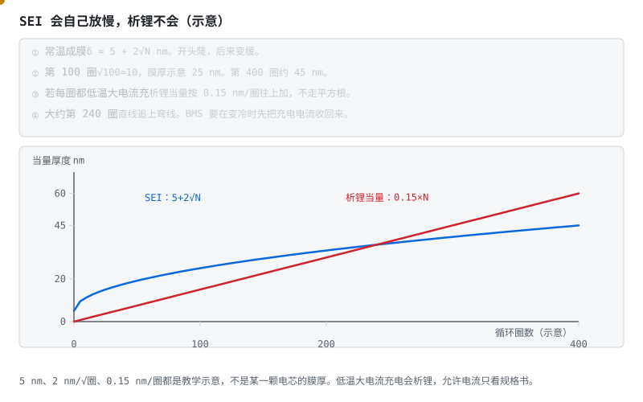

> **图说**　示意膜厚 δ = 5 + 2√N nm。

> **口诀**　SEI 开头长得快，后来自己变慢。析锂是按圈往上堆。

**看动画时盯住哪里**

第 100 圈是 25 nm，第 400 圈约 45 nm。若每一圈都做一次低温大电流充电，析锂当量按 0.15 nm/圈直线累加，大约第 240 圈追上 SEI。这不是测到的膜厚。它只说明：扩散限制的膜会自己放慢，析锂不会。

- 黄点贴着蓝线。左边陡，右边变平。
- 红线是直线，大约在第 240 圈和蓝线交叉。
- 红线的前提是「每圈都低温大电流充」。规格书不允许，就不要充。

**短自测**

1. 为什么 SEI 后来长得慢？
2. 第 100 圈的示意膜厚是多少？
3. 0.15 nm/圈 能当成析锂实验数据吗？

<b>参考答案（先自己想完再展开）</b>

1. 膜越厚，新的反应物要扩散穿过它，所以厚度按 √圈增长，斜率越来越小。
2. 25 nm。5 + 2×√100。示意，不是某一颗电芯的测量。
3. 不能。它用来和弯线做对照。低温大电流充电会析锂，允许电流只看规格书。

**练完你会怎样**：你能向别人讲清，为什么 BMS 要在变冷时先把充电电流收回来，而不是等 SEI 那种慢变化。

- **双卡尔曼（联合估计）**：一个快 EKF 估 SOC（秒级节奏），一个慢 EKF 估 $Q$ 或 $R_0$（天级节奏）——慢参数当状态、快状态当已知，交替更新；
- **可观测性条件**：参数只有在电流激励下才"看得见"——长期静置或电流纹丝不动时，参数估计的协方差会长大。工程对策：激励不足时**冻结参数更新**，别让慢滤波器在黑暗中乱走；
- 朴素法也有价值：记录每次完整循环的吞吐容量比，长期拟合——简单、稳、可解释。

> **原理**　老化表现为满充容量下降、内阻上升。这两个量要在电流有变化时才估得准，长期静置时估计会发散。
> **证据**　容量下降、内阻上升要在电流有变化时才估得准。公开数据可从 [Battery Archive](https://www.batteryarchive.org/) 取。
> **延伸阅读**　容量和电阻的讲义整理见 [ECE5720 Notes04 中文导读](../ece5720-notes04-中文导读.md)。滤波器仍看 [ECE5720 Notes03 中文导读](../ece5720-notes03-中文导读.md)（可选，原文英文）

用一段局部充电来估整包容量，窗口太窄时，答案主要是噪声。

> **图说**　盯住从左上陡壁往右下走、越走越平的黄点：窗口越窄，容量越吵，右边才够用来报 SOH。

> **口诀**　窗口越窄，SOH 越吵。不确定度跟 ΔSOC 成反比。

**看动画时盯住哪里**

黄点从左上的陡壁往右下走，越走越平。左边是窗太窄，右边是窗够用。

容量估计 $Q=\Delta\mathrm{Ah}/\Delta\mathrm{SOC}$。示意安时误差 0.02 Ah 时，容量不确定度 $\sigma_Q=0.02/\Delta\mathrm{SOC}$。窗口只有 5%，$\sigma_Q=0.40$ Ah。10% 窗口是 0.20 Ah。40% 窗口是 0.05 Ah。$\Delta\mathrm{SOC}$ 趋于 0 时，这条双曲线趋于无穷；窗口拉大，它往 0 贴，但不到 0。

算一笔：充了 0.72 Ah，SOC 从 30% 到 70%，$\Delta\mathrm{SOC}=0.40$，$Q=1.80$ Ah。若名牌 2.00 Ah，SOH 示意 90%。不确定度 0.05 Ah，相对 2.00 Ah 大约 2.5 个百分点。5% 的窗口则能晃 0.40 Ah，那就不能当 SOH 发布。

**短自测**

1. 0.72 Ah 配 $\Delta\mathrm{SOC}=0.40$，容量是多少？
2. 为什么 5% 的窗口几乎不能用？

<b>参考答案（先自己想完再展开）</b>

1. 1.80 Ah。
2. 示意不确定度有 0.40 Ah，和容量本身同一量级。0.02 Ah 不是电流传感器规格。

**练完你会怎样**：你用局部充电报 SOH 之前，会先看这次 SOC 走过了多宽。

增量容量把「这一小段电压里塞进了多少安时」画成峰。峰是相变的指纹，不是噪声尖刺。

> **图说**　盯住蓝线爬上、落下、再爬上的两座峰，以及更矮更靠右的红线：峰顶斜率是 0。

> **口诀**　峰在斜率为 0 的地方。老化让峰变矮，有时还搬家。

**看动画时盯住哪里**

黄点沿蓝线爬上第一峰、落下、再爬第二峰。红线更矮，并且稍微靠右。

示意，不是某种化学的实测。新鲜：
$1.20\exp\left(-\frac{(V-3.40)^2}{2\times 0.04^2}\right)+0.70\exp\left(-\frac{(V-3.68)^2}{2\times 0.05^2}\right)$，单位 Ah/V。
第一峰在 3.40 V，高度 1.20。第二峰在 3.68 V，高度 0.70。老化把高度乘 0.65，并把两座峰各往右挪 0.03 V，所以红峰大约在 3.43 V（高度 0.78）和 3.71 V（高度 0.455）。峰顶斜率是 0，过了峰就下降。

温度或倍率一变，峰会搬迁。拿不同工况的峰比高矮，会把工况当成老化。

**短自测**

1. 新鲜曲线两座峰的电压和高度？
2. 为什么不能直接拿两次 dQ/dV 的峰高相减当 SOH？

<b>参考答案（先自己想完再展开）</b>

1. 3.40 V / 1.20，以及 3.68 V / 0.70。都是示意高斯。
2. 峰高还跟着温度和倍率走。没对齐工况，差出来的不是老化。

**练完你会怎样**：你看见 dQ/dV 的峰，会先问这次的温度和倍率，再谈它变矮了没有。

## 4.7 SOP：电池此刻能出多大力 [分析]

SOP = 未来 T 秒（2s/10s/30s 分级）内允许的最大充/放电功率，取多约束的**最小值**：

- **电压约束**：放电时端电压不许跌破下限。由 $U = U_{oc} + IR_0 + U_{RC} \ge U_{min}$ 解出放电电流幅值上限：$|I_{\text{放}}| \le \dfrac{U_{oc} + U_{RC} - U_{min}}{R_0}$（放电时 $U_{RC}<0$，极化在吃电压——这正是大电流不能持久的数学表达）；
- **电流约束**：电芯与系统的最大允许电流；
- **SOC 约束**：低 SOC 限放电、高 SOC 限充电（回冲）；
- **温度约束**：低温降额（析锂风险）——所以冬天的电动车"没劲儿"，是 BMS 在保护电池。

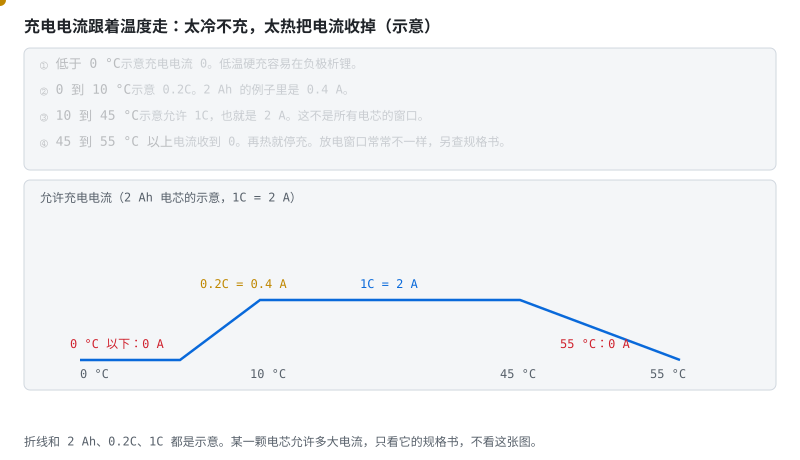

> **图说**　示意一条 2 Ah 电芯的允许充电电流。

> **口诀**　太冷不充。舒服了再给电流。太热把电流收回来。

**看动画时盯住哪里**

0 °C 以下是 0 A，因为低温硬充容易析锂。0 到 10 °C 示意 0.2C，也就是 0.4 A。10 到 45 °C 示意 1C = 2 A。45 °C 之后收到 0，55 °C 停充。放电窗口常常不是这一条，要另查规格书。

- 0 °C 左边贴着横轴：电流是 0。
- 中间平台：示意 2 A。
- 55 °C 再贴回横轴。黄点沿折线走，看它在哪一段。

**短自测**

1. 示意曲线里，−5 °C 允许多大充电电流？为什么？
2. 2 Ah、1C，常温示意允许多少安？
3. 可以把这张折线写进任何电芯的充电规格吗？

<b>参考答案（先自己想完再展开）</b>

1. 0 A。低温充电有析锂风险。具体能不能小电流充，只看那颗电芯的规格书。
2. 2 A。0.2C 则是 0.4 A。都是这张图自己的示意。
3. 不能。它只帮你记住冷、温和热三段。阈值以规格书为准。

**练完你会怎样**：别人说「冬天没劲」，你能指到温度这根轴，而不是先怪电量计。

电压这道墙单独就能把放电电流拦住。端电压不许低于下限时，允许电流是 (OCV − Vmin) / R：

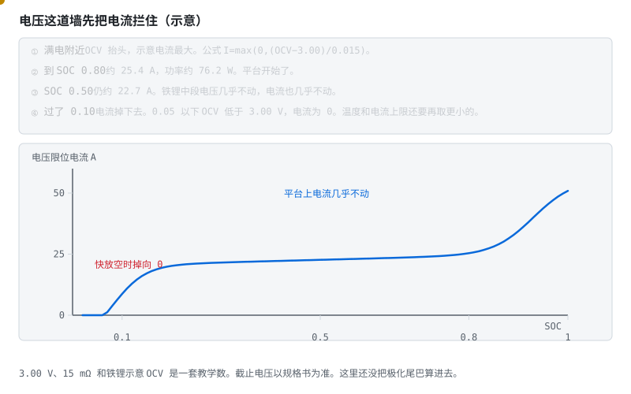

> **图说**　示意 Vmin = 3.00 V，R = 15 mΩ，OCV 用前面那条铁锂形状。

> **口诀**　电压墙先算一截。平台上电流几乎不动，快放空就掉到零。

**看动画时盯住哪里**

SOC 0.80 大约 25.4 A，功率约 76 W。SOC 0.50 仍约 22.7 A，因为平台上电压几乎不动。满电附近 OCV 抬头，电流更大。SOC 0.05 以下 OCV 低于 3.00 V，这条公式给出的电流是 0。温度上限和电流上限还要再取更小的那个。极化尾巴也还没算进去。

- 黄点从右上往左走：满电、平台、然后掉下去。
- 中段几乎是平的，和铁锂开路电压一样。
- 左边贴着横轴：再放就是 0，不是还能挤出一点。

**短自测**

1. SOC 0.80、15 mΩ、下限 3.00 V，示意电流大约多少？
2. 为什么 0.50 和 0.80 差不多，0.05 却是 0？
3. 76 W 能写成这颗电芯的峰值功率吗？

<b>参考答案（先自己想完再展开）</b>

1. 大约 25.4 A。功率按贴着 3.00 V 算，约 76 W。都是这张图的示意。
2. 平台上 OCV 几乎不变，分子就几乎不变。快放空时 OCV 掉到下限以下，电流被公式夹成 0。
3. 不能。3.00 V 和 15 mΩ 是教学数。产品的截止电压和内阻以规格书和实测为准。

**练完你会怎样**：你报峰值电流时，会先用电压墙算一截，再去和温度、电流上限取更小的那个。

整车/逆变器按 SOP 限功率运行——仪表盘上的"动力受限"提示，源头在这里。

> **图说**　盯住永远卡在最矮那根柱子上的红线：能出多大力，看最短的那条约束。

> **口诀**　能出多大力，看最短的那块板，再按秒数降。

动画里那条红线永远卡在最矮的约束柱上——这就是取 min 的几何含义。注意两个工程细节：时间窗越短允许的功率越高（热还没积累起来）；输出必须平滑，约束切换时 SOP 跳变会让整车扭矩跟着抖。

> **原理**　SOP 是未来几秒到几十秒内允许的最大充放电功率，取电压、电流和温度各条约束里最紧的那一个。
> **证据**　允许多大功率取多条约束里最紧的一条。课程入口：[Coursera《电池包均衡与功率估计》](https://www.coursera.org/learn/battery-pack-balancing-power-estimation)（英文，可选）。
> **延伸阅读**　电压约束的简化起点在 [ECE5720 Notes01 中文导读](../ece5720-notes01-中文导读.md)；HPPC 与二分搜索见 [ECE5720 Notes06 中文导读](../ece5720-notes06-中文导读.md)。滤波器仍看 [ECE5720 Notes03 中文导读](../ece5720-notes03-中文导读.md)（可选，原文英文）

**练完你会怎样**：你能用上面那句口诀，把这张图讲给别人听。

## 4.7b 充电地图：把析锂、温度、SOP 合成一条允许电流 [应用]

§4.2 到 §4.7 各给了一个零件：温度降额、析锂边界、电压限幅、SOP。产品里它们合成**一张表**——充电地图（charging map）。BMS 每个控制周期查它，把「此刻最多能充多少」报给充电机或车载充电机；[GB/T 27930 的 BCL 报文](stage-5-通信与集成.md#541-gbt-27930充电机与-bms-怎么握手-分析)（需求电流、需求电压），源头就是这张表。

> **口诀**　太冷怕析锂，太热怕老化，太满怕过充，大电流问 SOP。四个数取最小，才是这一拍能给多少。

**允许充电电流 = 四个约束取最小**：

| 约束 | 回答的问题 | 大概形状 |
|---|---|---|
| 析锂边界 | 负极还收得下锂吗？ | 低温 + 高 SOC 时收紧到 0。析锂当量按圈累积，见 [§4.6](stage-4-SOC-SOH算法.md#46-soh-与联合估计让算法把电池看透-分析) 的 SEI 与析锂图 |
| 温度窗口 | 这个温度允许多大？ | 折线：冰点以下 0，常温放开，高温收回（§4.7 的降额图） |
| 电压限幅 | 单体要顶到上限了吗？ | 接近满充时按 I=(OCV−V_max)/R 掉向零（§4.7 的电压限位图） |
| SOP 与老化 | 此刻出得去这么多力吗？ | 内阻抬高后，同一个电压限幅算出的电流自动变小 |

示意一张 2 Ah 电芯的充电地图（数字全是教学值，实际以规格书为准）：

| | SOC 0–70% | SOC 70–90% | SOC 90–100% |
|---|---|---|---|
| T < 0 °C | 0 | 0 | 0 |
| 0–10 °C | 0.2C | 0.2C | 0.1C |
| 10–45 °C | 1C | 0.5C | 0.2C |
| 45–55 °C | 0.5C | 0.2C | 0 |

读法：每一拍取「行 × 列」交点，再和 SOP、电压限幅取最小。**SOH 进来改的是格子里的数，不是表的结构**——老化让内阻变大、析锂边界左移，同一格的允许电流随 SOH 下调；这正是 [§4.6 联合估计](stage-4-SOC-SOH算法.md#46-soh-与联合估计让算法把电池看透-分析)存在的理由。

三件工程上容易漏的事：

- **地图是查询表，不是控制律**。表外的点（温度骤降、SOC 跳变）要写清取哪一格：取更保守的邻格，不做插值。
- **地图和充电机要能对上**。GB/T 27930 每 250 ms 报一次需求；地图更新比它慢没关系，报出去的数必须是这一拍真的允许的。
- **快充档是承诺，不是自由参数**。GB 38031-2025 把「快充循环后安全测试」写进了法规（见阶段 6 [§6.5b](stage-6-精通与毕业项目.md#65b-法规门槛gb-38031-2025-的热扩散-分析)），地图的 1C 档和耐久验证绑在一起。

**练完你会怎样**：给你一颗电芯的规格书，你能把温度、SOC、老化三个维度收成一张允许电流表，并说出每个格子是被四个约束里哪一个卡住的。

> **原理**　析锂边界和电压限幅是电化学与电学的「物理墙」，温度窗口和 SOP 是把它们翻译成可查表的工程包装。充电地图没有统一的行业格式，各家整车厂的标定规范自定义；表随 SOH 在线修正，是量产 BMS 与教学 demo 最常见的差距。

## 4.8 工程落地要点 [评价]

- **OCV 表分温度**：至少 -10/0/25/45°C 四张表，查表插值；
- **满充校准判据**：CV 段电流 < 0.05C 且持续 t 秒，不是电压碰上限（阶段 0 的结论）；
- **精度目标**：恒流工况 <5% 是入门线；车用全工况 <3% 需要温度补偿 + 联合估计；
- **先仿真后上板**：[MiniBMS（Simulink）](https://github.com/ks-santosh/MiniBMS) 提供完整被控对象，在仿真里把算法调对，再上真板——在真电池上调发散的滤波器，调试成本是仿真的十倍。

> **原理**　OCV 表至少按几档温度分开查。电流零点要标定，滤波器先在仿真里收敛，再上真电池。
> **证据**　本节可点击来源：[MiniBMS（Simulink）](https://github.com/ks-santosh/MiniBMS)。阈值与宣传口径仍以 datasheet / 标准原文为准。
> **延伸阅读**　[术语表](../glossary.md) · [总纲](../bms-resources.md)

**练完你会怎样**：你能说出安时会漂、平台上少信电压、滤波器是两个不完美的消息一起听。这阶段一台电脑就够。RC 和 EKF 的就地题还在 §4.4、§4.5。算法代码这次不动。

## 4.9 自测题 [分析]

1. 安时积分的误差为什么不收敛？两个校准点分别利用了什么物理事实？
2. OCV 滞回会给单表法带来什么误差？LFP 平台区为什么更要命？
3. Thevenin 模型里 $R_0$ 和 $R_1C_1$ 各对应电池什么物理过程？
4. EKF 中 Q、R 调大各自什么效果？残差持续偏大说明什么？
5. 双卡尔曼为什么能估容量？可观测性条件是什么？
6. SOP 为什么取多约束最小值？低温对 SOP 的影响路径？
7. 满充校准为什么用"CV 截止电流"而不是"电压到 4.2V"？

<b>参考答案（先自己想完再展开）</b>

1. 积分是**开环累加**：电流传感器的零漂每一拍都被加进去，误差随时间单调累积，没有任何机制把它拉回来（1mA 零漂 → 一天 24mAh → 10Ah 电池一个月漂约 7%）。两个校准点各自利用的物理事实：**满充校准**利用"CV 段电流衰减到截止值时电池必然是满的"这个电化学事实，把 SOC 直接复位到 100%；**静置 OCV 校准**利用"长时间静置后极化电压消散、端电压等于 OCV，而 OCV 与 SOC 单调对应"，查表复位。本质都是引入一个**与积分历史无关的绝对参照物**来打断误差累积。
2. 滞回 = 充电方向的 OCV-SOC 曲线与放电方向不重合，中间差几十 mV。单张表必然落在两条曲线之间，于是**充电时系统性偏一个方向、放电时偏另一个方向**——这是无法用滤波消除的**系统误差**（要消除得在状态里加滞回电压项建模，见 Plett Vol. II）。LFP 更要命是因为它的平台区本来就平：SOC 变 40% 电压只动 30mV，摊到每 1% SOC 约 0.75mV。几十 mV 的滞回误差换算成 SOC 误差就是几十个百分点——误差被平坦的斜率**放大**了。
3. $R_0$（欧姆内阻）对应**瞬时**电压变化：电解液离子导电、集流体与极耳的电子导电、接触电阻——电流一加/一撤，电压立刻跳变的那一段。$R_1C_1$（极化环节）对应**有时间常数的慢过程**：电极/电解液界面的电荷转移阻抗与双电层电容，以及（二阶模型里更慢那一路）锂离子在电极内部的扩散。表现就是电流撤掉后端电压不是立刻到位，而是慢慢回弹几秒到几分钟。
4. **Q 调大** = 声明"我不信任模型" → 增益 K 变大 → 更多跟着测量走：响应快、收敛快，但估计值跟着电压噪声抖。**R 调大** = 声明"我不信任测量" → K 变小 → 更依赖积分预测：平滑，但滞后、对真实变化反应慢。残差 $U_{\text{实测}} - g(\hat{x}^-)$ **持续**偏大（不是偶发尖峰）说明**模型错了**而不是滤波器参数错了——典型原因是 $R_0/R_1/C_1$ 随老化漂移、OCV 表没做温度补偿、容量 $Q$ 偏离真值。此时拧 Q/R 只是把症状压下去，应该去修模型、重标参数。
5. 思路是把慢变参数（容量 $Q$ 或内阻 $R_0$）也当成状态量，用一个独立的**慢滤波器**以天级节奏估它；快滤波器以秒级节奏估 SOC，估计时把慢参数当已知常数，两者交替更新。能估出来的原因：容量误差会在"积分预测的 SOC"与"电压观测反推的 SOC"之间制造**与电流吞吐成比例的系统性偏差**，这个偏差模式可以反解出容量。**可观测性条件**：必须有足够的**电流激励**——参数只有在电流流动、SOC 大范围变化时才"看得见"。长期静置或电流纹丝不动时慢滤波器的协方差会持续长大、估计值随机漂移。工程对策是激励不足时**冻结参数更新**。
6. 因为每条约束都是"不得越过"的硬边界：电压约束（端电压不许跌破下限）、电流约束（电芯与系统的最大允许电流）、SOC 约束（低 SOC 限放、高 SOC 限充）、温度约束（降额）。任何一条被突破都会造成损伤或触发保护，所以允许功率必须取所有约束各自算出的上限中**最小的那个**——木桶原理的又一次出现。低温的影响有两条路径叠加：①低温下 $R_0$ 显著增大 → 同样电流的 $IR_0$ 压降更大 → 电压约束更早触顶，解出的允许电流更小；②低温有析锂风险，策略上还要主动降额/禁充。合起来就是冬天电动车"没劲儿"——那是 BMS 在保护电池。
7. 因为 CC 段末端的端电压 = $U_{oc} + IR_0 +$ 极化电压，充电电流越大、内阻越高（低温/老化），虚高的成分越多。"电压碰到 4.2V"这一刻电池内部远没充满，撤流后电压会回落——用它校准会把 SOC **系统性标高**。而 **CV 段电流衰减到截止值（0.05–0.1C）**意味着极化基本松弛、内外电位接近平衡，此时的"满"是电化学意义上的满，与电流、温度、老化的耦合小得多，是**可重复**的参照点。

> **原理**　这些题考的是上面几节的机制。先盖住折叠答案，用自己的话讲完再展开。
> **证据**　这些题考库仑计漂移、OCV 和校正。对照 [Plett ECE5720](http://mocha-java.uccs.edu/ECE5720/index.html)（英文，可选）与 [Notes03 中文导读](../ece5720-notes03-中文导读.md)。
> **延伸阅读**　[Plett BMS2 课程站](http://mocha-java.uccs.edu/BMS2)（英文，可选）

## 4.10 动手任务 [应用]

1. 用 [Battery Archive](https://www.batteryarchive.org/) 一组公开循环数据，在 MATLAB/Python 依次实现：安时积分 → OCV 校正 → Thevenin + EKF，画出三条 SOC 曲线与真值对比；
   - 仓库已提供**同构对比**的合成工况版（初始 SOC 误差 + 零漂 + 容量误差 + 三种估算器）：[code/soc/](../../code/soc/)（`python3 compare.py --plot`）。先跑通再换真实数据集。**逐行走读**：[code/README.md §代码走读](../../code/README.md#代码走读带行号-应用)。
2. 做一组 HPPC 脉冲实验（或用数据集里的脉冲段），辨识 $R_0, R_1, C_1$（真实数据辨识须自做；合成演示见 [code/soc/hppc_demo.py](../../code/soc/hppc_demo.py)，含"40s 窗为什么拟合不动 τ"的实测教训）；
3. 把"安时积分 + 满充校准 + 静置 OCV 校准"移植到阶段 3 的板子上，恒流放电验证误差（无仓库代码，须上板）。

> **原理**　动手是把机制变成一次可核对的记录：条件、读数、和规格差在哪。没有记录的操作不算做完。
> **证据**　本节可点击来源：[Battery Archive](https://www.batteryarchive.org/)。阈值与宣传口径仍以 datasheet / 标准原文为准。
> **延伸阅读**　[术语表](../glossary.md) · [总纲](../bms-resources.md)

## 4.11 验收清单 [评价]

- [ ] 能手推 EKF 五步方程并说明每个矩阵的含义
- [ ] 恒流放电工况自实现 SOC 误差 <5%（与放电容量反推真值对比）
- [ ] 能解释 LFP 平台区的处理策略
- [ ] 能画出 SOP 的多约束决策过程

> **本阶段一句话**：积分为主干、电压做校正——所有 SOC 算法都是这句话的不同实现。

全部通过 → 进入 [阶段 5：通信与集成](stage-5-通信与集成.md)（总纲入口：[阶段 5](../bms-resources.md#阶段-5系统通信与集成24-周)）。

---

**上一篇**　[阶段 3 AFE+MCU 智能 BMS](stage-3-AFE-MCU智能BMS.md) ｜ **目录**　[阶段教程](../../README.md#阶段教程) ｜ **下一篇**　[阶段 5 通信与集成](stage-5-通信与集成.md) ｜ [学习路线总纲](../bms-resources.md) ｜ [术语表](../glossary.md)

> **原理**　验收问的是能不能用机制做判断。勾得上才进入下一阶段，勾不上就回到对应小节，而不是把目录再看一遍。
> **证据**　验收要能说清校正通道，而不是背公式。对照 [Plett ECE5720](http://mocha-java.uccs.edu/ECE5720/index.html)（英文，可选）。
> **延伸阅读**　[《车用 BMS 功能安全设计方法论》](https://www.mdpi.com/1996-1073/14/21/6942)（英文，可选）。PC 上的五天在 [共学 · SOC](../共学/01-soc五天.md)，合成工况打榜在 [擂台](../擂台.md)。出题和批改见 [AI 陪练卡](../AI陪练卡.md)。
