# 阶段 5 教程：通信与集成

> 对应学习路线的阶段 5。建议用时 2–4 周。前置：阶段 3 验收。
> 本阶段让 BMS 接入真实系统——上位机、储能逆变器、整车 CAN。结尾的"协议逆向方法论"是本阶段最值钱的技能：给你一块没有文档的 BMS，也能把它的数据抠出来。

---

## 5.1 通信在 BMS 里的三个层级

| 层级 | 连接 | 典型接口 | 在哪学的 |
|---|---|---|---|
| 板内 | AFE ↔ MCU | I2C / SPI / isoSPI | 阶段 3 已解决 |
| 板间 | CMU 从板 ↔ BMU 主控 | isoSPI / CAN 菊花链 | 阶段 6 高压架构 |
| **对外** | BMS ↔ 上位机/逆变器/整车/手机 | UART / RS485-Modbus / CAN / SMBus / BLE | **本阶段** |

## 5.2 UART：商用 BMS 的"方言普通话"

调试口、监控口最常见的就是 UART。各家帧格式像方言——细节不同，语法结构却惊人一致：

```
[帧头 2B][地址/命令 1-2B][长度 1B][数据 NB][CRC 1-2B]
```

（注意：这是常见抽象，不是法律——有的协议没长度字段、有的 CRC 位置不同。**拿到新协议先抓包或读厂商文档确认帧结构，别套模板**。）

两个动手前的提醒：

- **先量电平再插线**：3.3V TTL 还是 RS232 电平（±12V）？插反电平可能烧口；
- **共地要过脑子**：UART 共地意味着你的电脑和电池包连成一体——笔记本用电池供电、或加隔离 USB 串口，别把市电地引进电池包。

学习样板：[esphome-jk-bms](https://github.com/syssi/esphome-jk-bms) 的源码与 README 就是 JK 协议的事实文档——帧格式、命令字、数据偏移、单位换算全在代码里。

## 5.3 RS485 与 Modbus：储能世界的老干部



- **物理层 RS485**：A/B 差分、半双工。三个必考点：总线两端各一颗 **120Ω 终端电阻**（少了就回波丢包）；偏置电阻让总线空闲时电平确定；方向脚（DE/RE）切换收发——**切换时序是新手第一坑**：方向切早了丢首字节，切晚了丢尾字节；
- **协议层 Modbus RTU**：功能码记四个就够干活——0x03 读保持、0x04 读输入、0x06 写单寄存器、0x10 写多寄存器；帧 = 地址 + 功能码 + 数据 + CRC16（反射多项式 0xA001）；BMS 厂商给"寄存器映射表"（SOC 在 0x0100、单体 1 电压在 0x0101…），照表实现；
- 帧边界靠 **3.5 字符静默间隔**判断，不只是 CRC——定时器超时重组是解析器的核心；
- 参考实现：[esphome-seplos-bms](https://github.com/syssi/esphome-seplos-bms)、[esphome-pace-bms](https://github.com/syssi/esphome-pace-bms)。

## 5.4 CAN：车上的官话

- **帧结构**：ID（标准 11 位 / 扩展 29 位）+ DLC + 最多 8 字节（CAN FD 到 64）；
- **仲裁**是它最优雅的设计——看动画两个节点怎么"和平决斗"：



  显性 0 盖过隐性 1，ID 小者通吃，输家自动退出发送——**赢家甚至不知道发生过竞争**。所以 BMS 的关键报文（故障、限功率）要分配小 ID；
- **物理层**：CAN_H/CAN_L 差分，两端 120Ω 终端；电池包上**必须隔离**（隔离收发器 + 隔离电源）；
- **DBC 文件**：CAN 世界的"寄存器映射表"——定义每条报文里每个信号的起始位、长度、因子、偏移、单位。会读 DBC，车规通信就会了一半；
- **典型交互**：BMS 周期广播单体极值/SOC/故障；充电时与充电机握手（GB/T 27930 定义了充电机-BMS 报文流程，做桩对接时研读）；
- 参考：[dexterbg/Twizy-Virtual-BMS](https://github.com/dexterbg/Twizy-Virtual-BMS)（车规 CAN 仿真）。

## 5.5 SMBus 与 BLE：笔记本的与手机的

- **SMBus**：笔记本电池的国际标准（SBS 命令集）——I2C 物理层 + 标准化命令（Voltage()、Current()、RelativeStateOfCharge()…）。逆向实战看 [BQ20Z70 逆向工程](https://github.com/omarKmekkawy/Reverse_Engineering_BQ20z70_Laptop_BMS)；
- **BLE**：手机 App 监控的主流。GATT 模型：服务 → 特征值（read/notify）；厂商私有服务里跑各自的串口透传协议；长数据要**协商 MTU + 分包重组**——只连得上却收不到完整数据，八成是 MTU 没谈拢。参考 [fl4p/batmon-ha](https://github.com/fl4p/batmon-ha)（JK/JBD/Daly/ANT 多家 BLE 协议，绝佳的多协议对比样本）。

## 5.6 协议逆向方法论：当一回协议侦探

面对一块无文档 BMS，按刑侦流程来：

1. **抓包**：逻辑分析仪（UART/RS485/I2C）或 USBCAN，抓 App ↔ BMS 完整会话；
2. **控制变量找字段**：只改一个已知量（让某节电压变、记录当前 SOC），对比多帧找出变化的字节 → 定位字段与字节序；
3. **解单位**：字节值与真实值通常线性（电压 = raw × 0.001V），两个已知点解出系数与偏移；
4. **CRC 反推**：拿多组完整帧，逐一试常见组合（CRC8/CRC16、多项式、初值、反射、异或输出）。**先用 syssi 仓库里已知协议的帧验证你的 CRC 程序本身是对的**——连已知帧都算不对，就别去碰未知协议；
5. **写解析器**：状态机逐字节接收（找帧头 → 收长度 → 收数据 → 验 CRC），超时重组，坏帧丢弃并计数——**绝不因一帧坏数据死机**。

侦探守则：每破解一个字段就写进文档——你的逆向笔记，就是下一个使用者的协议文档。

## 5.7 自测题

1. 用电脑直连 BMS 的 UART 调试口有什么风险？怎么规避？
2. RS485 方向切换为什么容易丢首/尾字节？Modbus 靠什么界定帧边界？
3. CAN 仲裁为什么"非破坏"？BMS 哪类报文该拿小 ID？
4. DBC 文件的"因子/偏移"解决什么问题？
5. 逆向协议时，为什么先用已知帧验证 CRC 程序？
6. BLE 长数据传输要处理哪两件事？

## 5.8 动手任务与验收

**动手任务**

1. 用 ESP32 + 隔离串口读一块商用 BMS（JK/JBD/小翔任一），对照 syssi 源码实现帧解析，打印电压/电流/SOC；
2. 接入 Home Assistant（直接用 batmon-ha 或自写 MQTT 上报）；
3. 进阶挑战：抓一段未知 BMS 的通信，按 5.6 流程定位 SOC 字段并验证 CRC。

**验收清单**

- [ ] 能独立实现 UART 协议解析器（状态机 + CRC + 坏帧处理）
- [ ] 能照寄存器映射表写出 Modbus RTU 读写
- [ ] 能读懂 DBC 并手工解码一条 CAN 报文
- [ ] 完成至少一次真实协议逆向（哪怕只逆向出一个字段）

全部通过 → 进入 [阶段 6：精通——工程化与前沿](../bms-resources.md#阶段-6精通工程化与前沿持续)。
