# 阶段 5 教程：通信与集成

> 对应学习路线的阶段 5。建议用时 2–4 周。前置：阶段 3 验收。
> 本阶段让 BMS 接入真实系统——上位机、储能逆变器、整车 CAN。结尾的"协议逆向方法论"是本阶段最值钱的技能：给你一块没有文档的 BMS，也能把它的数据抠出来。

---

## 5.1 通信在 BMS 里的三个层级

| 层级 | 连接 | 典型接口 | 在哪学的 |
|---|---|---|---|
| 板内 | AFE ↔ MCU | I2C / SPI / isoSPI | 阶段 3 已解决 |
| 板间 | CMU 从板 ↔ BMU 主控 | isoSPI / CAN 菊花链 | 阶段 6 高压架构 |
| **对外** | BMS ↔ 上位机/逆变器/整车/手机 | UART / RS485-Modbus / CAN / SMBus / BLE | **本阶段** |

## 5.2 UART：商用 BMS 的"方言普通话"

调试口、监控口最常见的就是 UART。各家帧格式像方言——细节不同，语法结构却惊人一致：

```
[帧头 2B][地址/命令 1-2B][长度 1B][数据 NB][CRC 1-2B]
```

（注意：这是常见抽象，不是法律——有的协议没长度字段、有的 CRC 位置不同。**拿到新协议先抓包或读厂商文档确认帧结构，别套模板**。）

一条虚构但结构典型的查询帧（仅作结构示意，非某家真实协议）：

```
AA 55 | 01 | 03 | 02 | 12 34 | B6
帧头    地址  命令  长度  数据    CRC
```

真实协议就去 syssi 仓库对着源码逐字节读——比任何教程都快。

两个动手前的提醒：

- **先量电平再插线**：3.3V TTL 还是 RS232 电平（±12V）？插反电平可能烧口；
- **共地要过脑子**：UART 共地意味着你的电脑和电池包连成一体——笔记本用电池供电、或加隔离 USB 串口，别把市电地引进电池包。

学习样板：[esphome-jk-bms](https://github.com/syssi/esphome-jk-bms) 的源码与 README 就是 JK 协议的事实文档——帧格式、命令字、数据偏移、单位换算全在代码里。

## 5.3 RS485 与 Modbus：储能世界的老干部


- **物理层 RS485**：A/B 差分、半双工。三个必考点：总线两端各一颗 **120Ω 终端电阻**（少了就回波丢包）；偏置电阻让总线空闲时电平确定；方向脚（DE/RE）切换收发——**切换时序是新手第一坑**：方向切早了丢首字节，切晚了丢尾字节；
- **协议层 Modbus RTU**：功能码记四个就够干活——0x03 读保持、0x04 读输入、0x06 写单寄存器、0x10 写多寄存器；帧 = 地址 + 功能码 + 数据 + CRC16（反射多项式 0xA001）；BMS 厂商给"寄存器映射表"（SOC 在 0x0100、单体 1 电压在 0x0101…），照表实现；
- 帧边界靠 **3.5 字符静默间隔**判断，不只是 CRC——定时器超时重组是解析器的核心；
- 参考实现：[esphome-seplos-bms](https://github.com/syssi/esphome-seplos-bms)、[esphome-pace-bms](https://github.com/syssi/esphome-pace-bms)。

## 5.4 CAN：车上的官话

- **帧结构**：ID（标准 11 位 / 扩展 29 位）+ DLC + 最多 8 字节（CAN FD 到 64）；
- **仲裁**是它最优雅的设计——看动画两个节点怎么"和平决斗"：


  显性 0 盖过隐性 1，ID 小者通吃，输家自动退出发送——**赢家甚至不知道发生过竞争**。所以 BMS 的关键报文（故障、限功率）要分配小 ID；
- **物理层**：CAN_H/CAN_L 差分，两端 120Ω 终端；电池包上**必须隔离**（隔离收发器 + 隔离电源）；
- **DBC 文件**：CAN 世界的"寄存器映射表"——定义每条报文里每个信号的起始位、长度、因子、偏移、单位。会读 DBC，车规通信就会了一半；
- **典型交互**：BMS 周期广播单体极值/SOC/故障；充电时与充电机握手（见下节）；
- 参考：[dexterbg/Twizy-Virtual-BMS](https://github.com/dexterbg/Twizy-Virtual-BMS)（车规 CAN 仿真）。

### 5.4.1 GB/T 27930：充电机与 BMS 怎么握手

国标直流充电机（桩）↔ 车载 BMS 走 **CAN**，不是随便发几帧电压就开充。把流程想成"先对暗号、再谈条件、最后才给电"：

```
物理连接 / 低压辅助上电
        ↓
   辨识与握手（双方互报身份、协议版本、可否充电）
        ↓
   参数配置（BMS 报电池类型、总压、允许电流/电压上限；桩确认能力）
        ↓
   充电循环（BMS 周期下发需求电流/电压；桩按需求输出并回传实测）
        ↓
   正常结束 / 故障中止（任一方超时、CRC 错、需求越界 → 停充断高压）
```



五个阶段串成一部时序剧：对暗号（辨识）→ 谈条件（参数）→ 给电（充电循环）→ 收摊（统计）。盯紧第四幕——需求报文永远是 BMS 发的，桩只是跟随；这就是 SOP/温度降额必须实时反映到充电需求里的原因。

工程要点（细则以现行国标文本为准，版本会演进）：

1. **BMS 是需求方**：桩按 BMS 当前允许的电流/电压去输出，不是桩想冲多快就多快——所以 SOP/温度降额必须实时反映到"充电需求"报文里；
2. **周期与超时**：握手与充电循环都有报文周期；对方超时未应答 → 视为通信失败，必须停充（不能"假装还连着"继续灌电）；
3. **与整车高压时序咬合**：通信 OK ≠ 可以合接触器。仍要走预充 → 主正/主负合闸 → 再允许大电流（阶段 6）；
4. **学习用法**：先画上面这张状态图，再对照国标报文列表把每一步对应到具体帧 ID——别一上来背上百个信号名。

储能侧与 PCS 的对接协议各家不同，但**"辨识 → 参数 → 周期设定点 → 超时停机"**四段骨架高度同构，27930 是练手这块肌肉的最佳标本。

## 5.5 SMBus 与 BLE：笔记本的与手机的

- **SMBus**：笔记本电池的国际标准（SBS 命令集）——I2C 物理层 + 标准化命令（Voltage()、Current()、RelativeStateOfCharge()…）。逆向实战看 [BQ20Z70 逆向工程](https://github.com/omarKmekkawy/Reverse_Engineering_BQ20z70_Laptop_BMS)；
- **BLE**：手机 App 监控的主流。GATT 模型：服务 → 特征值（read/notify）；厂商私有服务里跑各自的串口透传协议；长数据要**协商 MTU + 分包重组**——只连得上却收不到完整数据，八成是 MTU 没谈拢。参考 [fl4p/batmon-ha](https://github.com/fl4p/batmon-ha)（JK/JBD/Daly/ANT 多家 BLE 协议，绝佳的多协议对比样本）。

## 5.6 协议逆向方法论：当一回协议侦探

面对一块无文档 BMS，按刑侦流程来：

1. **抓包**：逻辑分析仪（UART/RS485/I2C）或 USBCAN，抓 App ↔ BMS 完整会话；
2. **控制变量找字段**：只改一个已知量（让某节电压变、记录当前 SOC），对比多帧找出变化的字节 → 定位字段与字节序；
3. **解单位**：字节值与真实值通常线性（电压 = raw × 0.001V），两个已知点解出系数与偏移；
4. **CRC 反推**：拿多组完整帧，逐一试常见组合（CRC8/CRC16、多项式、初值、反射、异或输出）。**先用 syssi 仓库里已知协议的帧验证你的 CRC 程序本身是对的**——连已知帧都算不对，就别去碰未知协议；
5. **写解析器**：状态机逐字节接收（找帧头 → 收长度 → 收数据 → 验 CRC），超时重组，坏帧丢弃并计数——**绝不因一帧坏数据死机**。

> 💻 **参考实现（PC 可跑）**：[code/protocol/](../../code/protocol/) — CRC 基准向量 + 教学帧状态机（坏帧计数、垃圾前缀重同步）。帧格式是抽象示意，不是某家真实协议；硬件联调见下方动手任务。

侦探守则：每破解一个字段就写进文档——你的逆向笔记，就是下一个使用者的协议文档。

## 5.7 自测题

1. 用电脑直连 BMS 的 UART 调试口有什么风险？怎么规避？
2. RS485 方向切换为什么容易丢首/尾字节？Modbus 靠什么界定帧边界？
3. CAN 仲裁为什么"非破坏"？BMS 哪类报文该拿小 ID？
4. DBC 文件的"因子/偏移"解决什么问题？
5. 逆向协议时，为什么先用已知帧验证 CRC 程序？
6. BLE 长数据传输要处理哪两件事？
7. GB/T 27930 握手大致分哪几段？为什么说"BMS 是需求方"？通信超时该怎么处理？

<details>
<summary><b>参考答案（先自己想完再展开）</b></summary>

1. 风险三条：①**共地**——UART 的 GND 把电脑的地和电池包的地连成一体，而笔记本接着市电适配器时它的地连到保护地，等于把电池包某一点接地，可能形成意外的对地回路，烧串口、烧板，高压系统上更危险；②**电平不匹配**——3.3V TTL 口插到 RS232（±12V）直接烧；③共模瞬态从通信口打进来。规避：用**隔离 USB 串口**（数字隔离器 + 隔离电源），或笔记本脱开适配器用电池供电；插线前用万用表量清电平与各端子对 B- 的电位。
2. RS485 是半双工、收发共用一对差分线，靠 DE/RE 方向脚切换。切换**早了**（数据还在发送移位寄存器里就把 DE 拉低转收）→ 丢**尾**字节；切换**晚了**（该收的时候还占着总线，错过对方的起始位）→ 丢**首**字节。正确做法是等"发送完成（TC）"中断而不是"发送缓冲区空（TXE）"中断，再留一点余量后切换。Modbus RTU 的帧边界靠 **3.5 个字符时间的总线静默间隔**判定（不只是 CRC）；帧内字符间静默超过 1.5 字符时间则认为帧损坏。所以解析器的核心是一个字符间隔定时器 + 超时重组。
3. 因为物理层是"线与"：**显性 0 盖过隐性 1**。多节点同时开始发送时，每个节点一边发一边回读总线电平；发现自己发的是隐性 1 而总线上是显性 0，就知道有更高优先级（ID 更小）的报文在发，于是**立刻退出转为接收**。整个过程中赢家的报文一个比特都没被破坏，连它都不知道刚才发生过竞争——所以叫非破坏性仲裁。BMS 里该拿小 ID 的是**安全与实时相关的报文**：故障/告警、限功率（SOP）指令、继电器与接触器状态、紧急下电请求；单体电压明细、温度明细、统计信息这类大块慢速数据用大 ID。
4. 解决**整数原始值与物理量之间的映射**，让有限位宽同时表达合适的量程与分辨率：物理值 = raw × factor + offset。例如电压用 16 位、factor=0.001、offset=0，就能以 1mV 分辨率表达 0–65.535V；温度用 8 位、factor=1、offset=−40，就能用 0–255 表达 −40–215°C（省掉负数的补码约定）。它同时固化了单位与分辨率的约定，让收发双方不必在各自代码里硬编码换算系数——改量程只改 DBC，不改代码。
5. 因为 CRC 的自由度太多：多项式、位宽（CRC8/CRC16）、初始值、输入是否反射、输出是否反射、输出异或值——任何一项猜错结果就完全不对，而你**无法从一个错误结果反推是哪一项错了**。直接拿未知协议开干，等于同时在猜"CRC 参数"和"校验覆盖哪几个字节"两件事，两个未知量纠缠在一起根本收敛不了。先用 syssi 仓库里已知协议的真实帧（参数与覆盖范围都已知）验证你的 CRC 实现本身正确，就把问题从"两个未知"降成"一个未知"。连已知帧都算不对，就别去碰未知协议。
6. ①**MTU 协商**：默认 ATT MTU 只有 23 字节（有效载荷 20 字节），而 BMS 一帧往往上百字节，必须主动请求更大的 MTU（常见 128/247）——"连得上却收不到完整数据"八成就是 MTU 没谈拢。②**分包与重组**：即便 MTU 提上去，超长帧仍会被切成多个 notification 分片到达，接收端必须按协议的帧头/长度字段做状态机重组，并处理乱序、丢片与超时丢弃。附带第三件：GATT 模型下要先找对"服务 → 特征值"，厂商私有服务里跑的往往就是串口透传协议。
7. 大致四段：**辨识握手 → 参数配置 → 充电循环（周期需求/实测）→ 正常结束或故障中止**。BMS 是需求方：桩按 BMS 当前允许的电流/电压输出，温度降额与 SOP 必须写进需求报文，否则桩可能按"名义能力"过充过流。通信超时（对方周期报文失踪）必须**停充并按安全时序断开高压**——不能假定链路还好、继续灌电。细则与帧 ID 以现行 GB/T 27930 文本为准。

</details>

## 5.8 动手任务与验收

**动手任务**

1. 用 ESP32 + 隔离串口读一块商用 BMS（JK/JBD/小翔任一），对照 syssi 源码实现帧解析，打印电压/电流/SOC；
2. 接入 Home Assistant（直接用 batmon-ha 或自写 MQTT 上报）；
3. 进阶挑战：抓一段未知 BMS 的通信，按 5.6 流程定位 SOC 字段并验证 CRC。

**验收清单**

- [ ] 能独立实现 UART 协议解析器（状态机 + CRC + 坏帧处理）
- [ ] 能照寄存器映射表写出 Modbus RTU 读写
- [ ] 能读懂 DBC 并手工解码一条 CAN 报文
- [ ] 能默写 GB/T 27930 握手四段骨架，并说明超时必须停充
- [ ] 完成至少一次真实协议逆向（哪怕只逆向出一个字段）

> **本阶段一句话**：协议 = 帧头、地址、数据、CRC 的填空题；逆向先拿已知帧验证 CRC 程序，再碰未知协议。

全部通过 → 进入 [阶段 6：精通——工程化与前沿](../bms-resources.md#阶段-6精通工程化与前沿持续)。

---

**上一阶段**：[阶段 4 SOC/SOH 算法](stage-4-SOC-SOH算法.md) ｜ **下一阶段**：[阶段 6 精通与毕业项目](stage-6-精通与毕业项目.md) ｜ [学习路线总纲](../bms-resources.md) ｜ [术语表](../glossary.md)
