# 阶段 6 教程：精通——工程化与毕业项目

> **本篇你会学到**　怎么把一块能用的 BMS 做成产品：高压、功能安全、可生产、可维护。毕业标准在文末。
> **预计用时**　持续。前五阶段走完再进。
> **前置**　阶段 1–5 全部验收。

> 对应学习路线的阶段 6。前置：阶段 1–5 全部验收。
> 🔍 配套深入解析（含动画）：[电路详解 ① 功率回路](../circuits/01-功率回路-MOS保护与预充.md) ｜ [② 采样链与 AFE](../circuits/02-采样链与AFE芯片.md) ｜ [④ 系统安全与量产](../circuits/04-系统安全与量产.md)
>
> 前五阶段你学会了"把一块 BMS 做出来"。本阶段回答的是更难的问题：**怎么把它做成产品**——高压、安全、可生产、可维护。毕业标准见文末。

---

## 本页目录

按层走先看 [能力地图](bloom-map.md)。标题末尾的 `[记忆]` … `[创造]` 是布鲁姆层级。

- [6.1 硬件精通 [分析]](stage-6-精通与毕业项目.md#61-硬件精通-分析)
  - [6.1.1 高压电池系统架构 [分析]](stage-6-精通与毕业项目.md#611-高压电池系统架构-分析)
  - [6.1.2 预充回路：合闸的艺术 [应用]](stage-6-精通与毕业项目.md#612-预充回路合闸的艺术-应用)
  - [6.1.3 绝缘检测（IMD） [分析]](stage-6-精通与毕业项目.md#613-绝缘检测imd-分析)
  - [6.1.4 EMC 与热失控防护 [分析]](stage-6-精通与毕业项目.md#614-emc-与热失控防护-分析)
  - [6.1.5 并簇与环流：两包并联时 BMS 多管什么 [分析]](stage-6-精通与毕业项目.md#615-并簇与环流两包并联时-bms-多管什么-分析)
  - [6.1.6 BMS 与热管理（TMS）的边界 [评价]](stage-6-精通与毕业项目.md#616-bms-与热管理tms的边界-评价)
- [6.2 固件精通 [应用]](stage-6-精通与毕业项目.md#62-固件精通-应用)
  - [6.2.1 量产状态机 [应用]](stage-6-精通与毕业项目.md#621-量产状态机-应用)
  - [6.2.2 故障管理（DTC 体系） [应用]](stage-6-精通与毕业项目.md#622-故障管理dtc-体系-应用)
  - [6.2.3 参数与标定系统 [应用]](stage-6-精通与毕业项目.md#623-参数与标定系统-应用)
  - [6.2.4 Bootloader 与 OTA [应用]](stage-6-精通与毕业项目.md#624-bootloader-与-ota-应用)
  - [6.2.5 故障注入与快照回放 [应用]](stage-6-精通与毕业项目.md#625-故障注入与快照回放-应用)
  - [6.2.6 云端诊断停在包外 [评价]](stage-6-精通与毕业项目.md#626-云端诊断停在包外-评价)
- [6.3 算法精通（阶段 4 的深化清单） [分析]](stage-6-精通与毕业项目.md#63-算法精通阶段-4-的深化清单-分析)
- [6.4 功能安全落地：以过充为例走一遍 [评价]](stage-6-精通与毕业项目.md#64-功能安全落地以过充为例走一遍-评价)
  - [6.4.1 过充案例：开线被当成过充 [评价]](stage-6-精通与毕业项目.md#641-过充案例开线被当成过充-评价)
- [6.5 量产与测试 [评价]](stage-6-精通与毕业项目.md#65-量产与测试-评价)
  - [6.5.1 产线追溯：错芯和贴错标 [评价]](stage-6-精通与毕业项目.md#651-产线追溯错芯和贴错标-评价)
- [6.6 毕业项目指南 [创造]](stage-6-精通与毕业项目.md#66-毕业项目指南-创造)
- [6.6b 毕业项目评审量规 [评价]](stage-6-精通与毕业项目.md#66b-毕业项目评审量规-评价)
- [6.7 自测题 [评价]](stage-6-精通与毕业项目.md#67-自测题-评价)
- [6.8 毕业验收 [评价]](stage-6-精通与毕业项目.md#68-毕业验收-评价)

## 6.1 硬件精通 [分析]

> **先读/后读**：§6.1.2 预充计算是 [应用]；§6.1.6 和热管理的边界是 [评价]；其余小节是 [分析]。

> **原理**　高压包不再是一块板：从板采样、主控决策、接触器和绝缘监测分成几级。任何一级失联，都要落到断开高压。
> **证据**　高压架构、预充、绝缘和并簇是这一层的四件事。参考 [ENNOID-BMS](https://github.com/EnnoidMe/ENNOID-BMS)（英文，可选）与 [《车用 BMS 功能安全设计方法论》](https://www.mdpi.com/1996-1073/14/21/6942)（英文，可选）。
> **延伸阅读**　[GB/T 38661 公开文本](https://openstd.samr.gov.cn/bzgk/std/newGbInfo?hcno=DB3ACC49AC4A146FAA311BB468ACA290)

### 6.1.1 高压电池系统架构 [分析]

几十到几百串的系统不再是一块板，而是三级结构：

```
        ┌─────────────┐
        │  BMU 主控    │ ← 对外 CAN / 绝缘检测 / 继电器驱动 / SOC 汇总
        └──────┬──────┘
               │ isoSPI / CAN（隔离）
   ┌───────────┼───────────┐
┌──┴──┐     ┌──┴──┐     ┌──┴──┐
│CMU 1│     │CMU 2│ ... │CMU n│  ← 每块从板管 12–18 串
└─────┘     └─────┘     └─────┘
BDU 配电盒：主正/主负继电器、预充回路、熔断器、电流传感器
```

板间通信的难点是共模：相邻从板的"地"隔着十几节电池的电位。isoSPI 的解法是变压器耦合——**信号穿墙，电位差留下**：


> **图说**　盯住变压器：数据包过去，高压电位差留在墙那边，不要把它当成一根普通排线。

> **口诀**　数据穿过变压器，高压电位差留在墙那边。

参考实现：[EnnoidMe/ENNOID-BMS](https://github.com/EnnoidMe/ENNOID-BMS)（330★，LTC68xx 菊花链 + 400V 电池包 + 接触器控制）。

高压系统还有一根"看不见的保险丝"——HVIL：

**练完你会怎样**：你能用上面那句口诀，把这张图讲给别人听。



> **图说**　盯住先断开的那根低压环：接触器随后打开，母线泄放排在人碰到端子之前。对数轴原点是 ≤1 ms，环断发生在 0 ms。

> **口诀**　环先断，闸再开。人碰到端子之前，高压先离开。
> **动态**　初始态：低压环闭合，接触器吸合，母线带电。扰动：插头或维修开关把环拉开。中间态：BMS 先看到环断开，再打开接触器。保护态：触点分开之后，母线才开始泄放。

一根低压细线串遍所有高压接插件和维修开关，任何人拔枪或开 MSD，信号都比高压触点先断（针脚长短差保证这个时序），BMS 赶在人碰到端子前完成断接触器和母线泄放。

**练完你会怎样**：你能用上面那句口诀，把这张图讲给别人听。



> **图说**　三步按顺序亮：环断开，接触器打开，母线电压掉下来。

> **口诀**　信号没有了，就不要再合闸。泄放排在触点分开之后。
> **动态**　初始态：环通，闸合，母线有电压。扰动：短的信号针先离开，环断开。中间态：接触器打开，长的高压针还连着。保护态：母线电压掉下来。图右侧的错序是高压还在、人已经摸到端子。
> **错了会怎样**　去抖拉到按键那种几百毫秒，人已经碰到端子，母线还在包压。

**看动画时盯住哪里**

错序是高压还在、人已经碰到端子。信号针短、先断；高压针长、后断。这是接插件的机械顺序，不是软件延时。示意图。

**练完你会怎样**：你能用上面那句口诀，把这张图讲给别人听。



> **图说**　0、15 ms、30 ms、500 ms 都是示例，不是示波器截图，也不是某只插头的图纸。

**看动画时盯住哪里**

环在 0 断开，大约 15 ms 下令开闸，大约 30 ms 母线开始掉。去抖若拉到 500 ms，人可以先碰到端子。

> **算一笔**　去抖必须远短于拔插头的时间。几十毫秒是第二道，针脚长短差才是第一道。

索引见 [电路动态分析](../circuits/README.md#电路动态分析)。

> **原理**　几十到几百串拆成从板采集、主控汇总、接触器执行。高压接插件用互锁回路，插头松脱要比人碰到端子更早切断。
> **证据**　400 V 包上从板、主控和接触器怎么分工，参考实现是 [ENNOID-BMS](https://github.com/EnnoidMe/ENNOID-BMS)（英文，可选）。接触器外形见 [详解④ 的实拍](../circuits/04-系统安全与量产.md#13-主动放电碰撞后的-5-秒钟-理解)，不要带电拍母线。
> **延伸阅读**　[术语表](../glossary.md) · [总纲](../bms-resources.md)

### 6.1.2 预充回路：合闸的艺术 [应用]

母线电容（逆变器侧，几百 μF 到几 mF）完全放电时相当于短路——400V 直接合闸，瞬间电流数千安，继电器触点当场烧蚀粘连。解法是"先小水流灌满管道，再开主闸"：


> **图说**　盯住爬升的母线电压：先走预充电阻，接近包压才合主闸；超时上不来就停住。

> **口诀**　先小电流灌满母线电容，再合主闸。
> **动态**　初始态：母线电容放空，主闸打开。扰动：合上预充继电器。中间态：电压爬升，冲击电流被电阻挡住。保护态：接近包压再合主闸；爬不上来就停在故障，不合主闸。同一过程在 [详解① §3.2](../circuits/01-功率回路-MOS保护与预充.md#32-解法与计算-应用)。
> **错了会怎样**　空着的母线电容上直接合主闸，触点打火粘连。400 V、1 mF、170 Ω 的一笔账在 [详解① §3.2](../circuits/01-功率回路-MOS保护与预充.md#32-解法与计算-应用)。

时序三步：合预充继电器 K2（串电阻）→ 母线电压爬到电池电压 90–95%（约 $t \approx 3RC$）→ 合主继电器 K1、断 K2。

- 电阻选型：阻值按 $R \approx t/(3C)$；功率按单次冲击能量 $E = \frac{1}{2}CU^2$ 的**脉冲额定**（线绕/水泥电阻），不是连续功率；
- **预充失败判据**：超时母线电压上不来 → 外部短路或后端故障，**禁止合 K1**——量产 BMS 必备诊断，省的是整柜的保险。

> **原理**　母线电容放空时相当于短路。先用预充电阻把电容充到和电池压差足够小，再合主接触器，否则触点会烧蚀粘连。电阻按单次脉冲能量选型，不按连续功率。
> **证据**　时序动画在本节。整包参考 [ENNOID-BMS](https://github.com/EnnoidMe/ENNOID-BMS)（英文，可选）。线绕电阻、密封接触器，以及和主接触器同框的预充电阻，在 [详解④ §1.3](../circuits/04-系统安全与量产.md#13-主动放电碰撞后的-5-秒钟-理解)。400 V 与数千安是数量级示例。
> **延伸阅读**　有的接触器把旁路做进器件里。那是另一条路，见详解④里的 E-T-A 片子，并记住：片子讲的不是电阻预充的替代教材。

**视频**　YouTube · 英文，可选 · [E-T-A《高压接触器与旁路预充》](https://www.youtube.com/watch?v=Xy6EdcROX_M)

放在电阻预充算完之后看。片子里的半导体旁路是这家产品的做法，教材主线仍是 K2 串电阻。不要带电拆高压包。

[](https://www.youtube.com/watch?v=Xy6EdcROX_M)

**短自测**

1. 母线电容还是空的，能直接合主闸吗？
2. 预充电阻按连续功率买，还是按一次冲击的脉冲能量买？

<details>
<summary><b>参考答案（先自己想完再展开）</b></summary>

1. 不能。放空的电容像短路，触点会打火粘连。先用预充电阻灌到接近包压，爬不上来就停在故障。
2. 按脉冲能量。½CU² 在很短时间里变成热。400 V、1 mF 那笔账在详解① §3.2，是示例不是你的包。

</details>

**练完你会怎样**：合闸前你会先看母线电压爬没爬上来。


### 6.1.3 绝缘检测（IMD） [分析]

高压包与机壳之间的绝缘电阻必须实时监测。主流**电桥法**：在 B+/B- 与机壳间交替投切已知电阻桥，测两组电压联立解出 $R_{iso+}$、$R_{iso-}$。

- 判据示例（以 GB/T 38661、ISO 6469 或产品标准为准）：常见 <500Ω/V 报警、<100Ω/V 故障；
- 误差源：母线电压波动、Y 电容充放电——Y 电容典型 nF–µF 级，与 MΩ 级桥臂形成毫秒–秒级时间常数，采样必须安排在投切后 3–5 个 τ 的稳态窗口内做，急不得。



> **图说**　盯住两次投切：每次得到一个方程，联立才解得出正负对地的绝缘电阻。

> **口诀**　投切两次，得到两个方程，解出正负对地的绝缘电阻。

电桥是一条路。另一条是低频方波注入：经已知电阻送进一个小方波，用稳态电流反推绝缘。边缘上的尖峰是 Y 电容在充电，不能拿来除。

**练完你会怎样**：你能用上面那句口诀，把这张图讲给别人听。

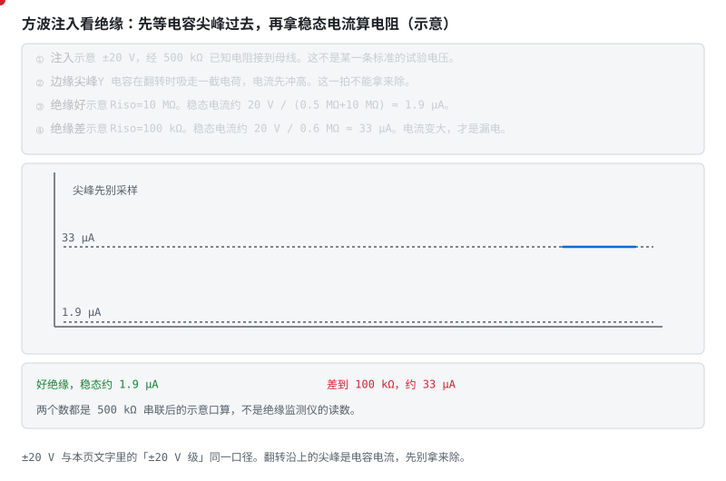

> **图说**　示意注入 ±20 V，串联 500 kΩ。

> **口诀**　方波一翻，先别采样。等尖峰过去，电流变大才是绝缘变差。

**看动画时盯住哪里**

翻转瞬间电流先冲高。绝缘示意 10 MΩ 时，稳态大约 20 V / 10.5 MΩ ≈ 1.9 µA。绝缘掉到 100 kΩ 时，大约 20 V / 0.6 MΩ ≈ 33 µA。电流变大才是漏电变大。±20 V 与本节「±20 V 级」同一口径，不是某一条标准的试验电压。

- 波形边上的红点：电容尖峰，这一拍跳过。
- 平台段：才用来除。
- 1.9 µA 和 33 µA：同一个注入，两种绝缘。

**短自测**

1. 为什么方波刚翻转时不能算绝缘电阻？
2. 示意里 10 MΩ 和 100 kΩ，稳态电流大约各是多少？
3. 1.9 µA 能写成绝缘监测仪的实测吗？

<details>
<summary><b>参考答案（先自己想完再展开）</b></summary>

1. Y 电容在那一拍吸走电荷，电流里混着充电，不是漏电。
2. 大约 1.9 µA 和 33 µA。分母分别是 0.5 MΩ+10 MΩ 和 0.5 MΩ+0.1 MΩ。
3. 不能。它是 500 kΩ 串联之后的口算，用来看「绝缘变差则电流变大」。

</details>

**练完你会怎样**：你能指出采样点应该落在平台上，而不是落在方波的棱上。


电阻变小只说明「漏了」。漏在哪一截，要看机壳相对负极的电压：

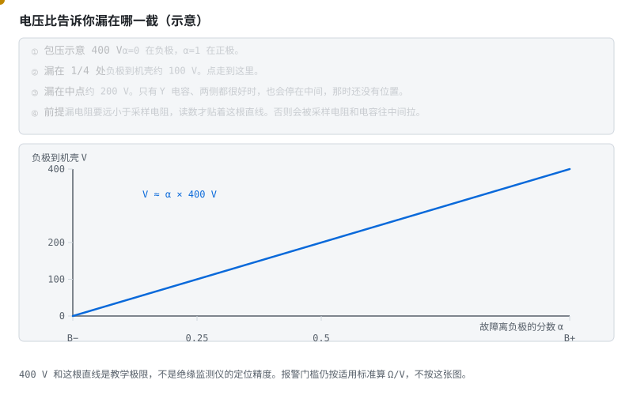

> **图说**　包压示意 400 V。

> **口诀**　电压比告诉你漏在哪一截。中间那个数，也可能只是还没漏。

**看动画时盯住哪里**

漏电阻远小于采样电阻时，负极到机壳的电压约等于 α×400 V，α 是故障离负极的分数。漏在四分之一处，大约是 100 V。漏在中点，大约是 200 V。只有 Y 电容、两侧都很好时，读数也会停在中间，那时还没有「位置」。前提不成立，采样电阻和电容会把读数往中间拉。

- 黄点沿着直线走。α = 0 在负极，α = 1 在正极。
- 0.25 对 100 V，0.5 对 200 V。
- 这根线是极限。不是监测仪的定位精度。

**短自测**

1. 负极到机壳约 100 V，包压 400 V，故障大约在哪？
2. 为什么读到 200 V 不能马上说漏在中间？
3. 这根直线的前提是什么？

<details>
<summary><b>参考答案（先自己想完再展开）</b></summary>

1. 大约在从负极数起的四分之一处。100/400 = 0.25。示意。
2. 两侧绝缘都很好、只有 Y 电容时，机壳也会停在中间。先看绝缘电阻是不是已经变小。
3. 漏电阻要远小于采样电阻。否则读数被采样网络往中间拉，位置会偏。

</details>

**练完你会怎样**：绝缘报警之后，你会用电压比估一估漏靠近哪一端，而不是只报一个「绝缘低」。


动画把"两次投切"演了一遍：B+ 侧投一次、B− 侧投一次，两组电压读数联立才能分别解出 R_iso+ 和 R_iso−——单侧绝缘下降时整包对地电位会偏移，只测一侧是要漏判的。

- **联立求解的数学**（电桥法怎么从两个电压算出两个电阻）：思路像称体重——一边一次称不出两个人的分量，就让你俩轮流单独上秤。设已知桥臂电阻 $R_p$、$R_n$（MΩ 级、1% 精度、耐压按母线）：B+ 侧投入时 B− 对地测得 $U_1$，B− 侧投入时测得 $U_2$，两次各得一个含 $R_{iso+}$、$R_{iso-}$ 的分压方程，联立即得闭式解。代码层面只是两个除法，**工程难度全在细节上**：采样必须落在投切后 Y 电容充放电结束的稳态窗（上一条的误差源）、桥臂电阻的耐压与漏电流自身要合格、母线电压在两次测量间不能明显波动；
- **低频方波注入法**（第二条主流路线）：经大电阻向母线注入 ±20V 级的低频方波，测回路耦合电流反推绝缘电阻。对 Y 电容鲁棒（方波基频远低于 Y 电容阻抗拐点），代价是注入电路本身成为新的安规器件。车规方案多走这条；
- **外接 IMD 仪器**（第三条路）：储能柜常见——Bender 等独立绝缘监测仪专职测量，BMS 经 CAN 或干接点读它的报警位。职责边界干净，BOM 多一个器件；
- 现场误报的主要来源：多点绝缘同时下降（方程假设单点失效）、潮湿凝露（阻值边缘抖动）——量产做法是多帧滤波 + 温湿度联合判断，不在本节展开。

> **原理**　高压包与机壳之间的绝缘电阻必须实时监测。主流**电桥法**：在 B+/B- 与机壳间交替投切已知电阻桥，测两组电压联立解出 $R_{iso+}$、$R_{iso-}$。
> **证据**　电桥两次测量解绝缘电阻。车规落地见 [功能安全方法论](https://www.mdpi.com/1996-1073/14/21/6942)（英文，可选）与 [GB/T 38661 公开文本](https://openstd.samr.gov.cn/bzgk/std/newGbInfo?hcno=DB3ACC49AC4A146FAA311BB468ACA290)。
> **延伸阅读**　[batterydesign.net《BMS 功能安全》](https://www.batterydesign.net/battery-management-system/functional-safety/)（英文，可选）

**短自测**

1. 电桥法为什么要投切两次？
2. Y 电容还在充的时候能采样吗？

<details>
<summary><b>参考答案（先自己想完再展开）</b></summary>

1. 一次只有一个方程，解不出正负对地两个绝缘电阻。像两个人一起称，要轮流上秤。
2. 不能。要等几个时间常数，读稳态。阶段 6 里 <500 Ω/V 报警、<100 Ω/V 故障是教学示例，产品用哪一条标准以适用文本为准。

</details>

**练完你会怎样**：你能说出：投切两次，得到两个方程。

### 6.1.4 EMC 与热失控防护 [分析]

- 采样链是模拟小信号，功率回路是 du/dt、di/dt 的噪声源：**分区布局、采样线双绞、通信隔离**；
- 继电器线圈：吸合后降 PWM 占空比保持（经济又降温），续流二极管不能省；
- 热失控链的 BMS 对策（回看 [热失控动画](../circuits/assets/thermal-runaway.svg)）：**dT/dt 温升速率**比绝对温度更早报警；熔断器是最后手段——它是不可复位的一次性保护，选型按 $I^2t$ 与 MOS/线束的耐受曲线配合。

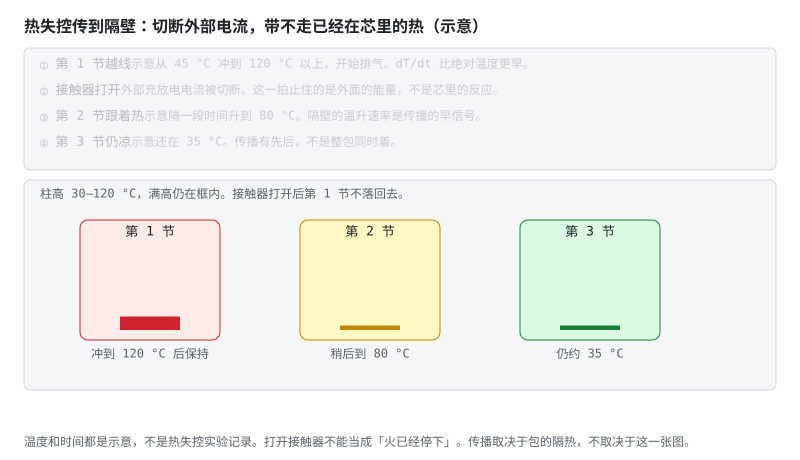

> **图说**　示意第 1 节从大约 45 °C 冲过 120 °C 并排气。

> **口诀**　先看谁在猛涨。切断外面的电流。别以为芯里的热会跟着接触器一起消失。

**看动画时盯住哪里**

接触器打开，外部电流被切断，芯里已经开始的反应不会因此停。第 2 节随后被烤到示意 80 °C，第 3 节还可以停在 35 °C 附近。传播有先后。打开接触器不等于火已经停下。温度不是实验记录。

- 左边那节先涨满：它已经在失控。
- 中间那节后涨：邻居。
- 右边那节还矮：传播还没走到。

**短自测**

1. 接触器已经打开，第 1 节里的反应会停下吗？
2. 为什么要看第 2 节的温升速率，而不是只看第 1 节的绝对温度？
3. 120 °C 和 80 °C 能引用成实验数据吗？

<details>
<summary><b>参考答案（先自己想完再展开）</b></summary>

1. 不会。切断的是外部电流。已经在芯里的热和反应还在。包的隔热决定会不会传到隔壁。
2. 第 1 节很热时往往已经晚了。隔壁开始变热，是传播的早信号。
3. 不能。它们是为了分清「已经失控、正在被烤、还凉着」三节的示意。

</details>

**练完你会怎样**：你能说明：接触器打开之后，还要继续看隔壁的温度往哪里走。


> **原理**　采样是小信号，功率回路是噪声源，所以要分区、双绞和隔离。热失控要看温升速率，不能只等绝对温度越线。
> **证据**　过充触发的热失控（析锂、刺膜、正极释氧）见 [Batteries 2025 综述](https://www.mdpi.com/2313-0105/11/7/242)（英文，可选）。
> **延伸阅读**　[瑞萨《BMS 教程》中文导读](../renesas-bms-tutorial-中文导读.md)


绝对温度还不高的时候，斜率可以已经不对了。早警打在斜率上。

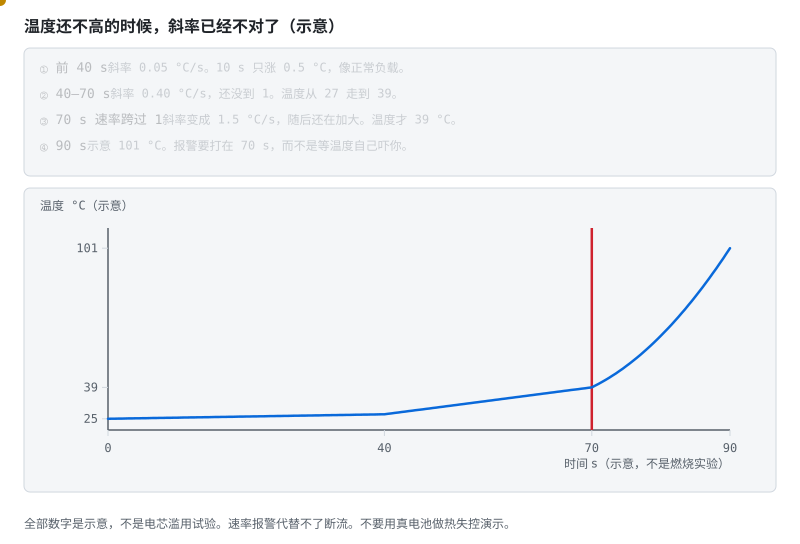

> **图说**　盯住先缓、再陡、70 s 后上翘的黄点：红竖线是速率跨过 1 °C/s，不是起火的照片。

> **口诀**　先看每秒涨多少，再看此刻多少度。

**看动画时盯住哪里**

黄点先缓、再陡、70 s 之后明显上翘。红竖线是速率跨过 1 °C/s 的地方，不是起火的照片。

示意曲线，不是燃烧实验，也不要拿真电池去复现：

- $t\lt 40$ s：$T=25+0.05t$，到 40 s 是 27 °C，斜率 0.05 °C/s
- $40\le t\lt 70$：$T=27+0.40(t-40)$，到 70 s 是 39 °C，斜率 0.40 °C/s，还没到 1
- $t\ge 70$：$T=39+1.5(t-70)+0.08(t-70)^2$，斜率从 1.5 °C/s 起还在加大。90 s 时温度示意 101 °C

三段在 40 s 和 70 s 上是连上的。报警若设在「超过 1 °C/s」，它发生在 70 s，当时只有 39 °C。等到 100 °C 再喊，已经晚了一截。

速率报警代替不了断开电流。芯里已经起来的热，不会因为报文发出去就消失。

**短自测**

1. 70 s 时温度和刚跨过的斜率各是多少？
2. 为什么不能等温度本身很高再报警？

<details>
<summary><b>参考答案（先自己想完再展开）</b></summary>

1. 39 °C，斜率变成 1.5 °C/s。
2. 这张示意里，速率在 39 °C 就已经越过 1 °C/s。等 101 °C 是 90 s 的事。全是示意，不是滥用试验。

</details>

**练完你会怎样**：你写热失控早警时，会同时看绝对温度和温升速率，并且知道断流仍然必须在包上完成。


### 6.1.5 并簇与环流：两包并联时 BMS 多管什么 [分析]

储能常把多簇（或多包）并联扩容。电压不完全相等时，合闸瞬间会出现**环流**——电流在包与包之间窜，不经过负载，却能把接触器、线束和弱包打坏。

BMS / 系统侧最低要求：

1. **合闸前电压对齐**：簇间压差大于阈值（常见几十伏量级，按系统定）时禁止并簇；必要时先经预充/限流支路缓慢均压；
2. **每簇独立断路**：各簇有自己的接触器/熔断器，一簇故障可隔离，不拖死整柜；
3. **主从或协调层**：有一个能量管理/主控汇总各簇 SOC、SOP、故障，统一对 PCS 报"整柜允许功率"——单簇 SOP 简单相加在压差大时是错的；
4. **环流监测**：并簇母线上的异常电流（负载电流对不上各簇电流之和）要进故障策略。

并簇把"单包 BMS"升级成"多代理协调"——算法与通信都从板级问题变成系统问题。



> **图说**　盯住两簇之间那条不经过负载的电流：压差落在很小的电阻上，对冲电流可以很大。

> **口诀**　两簇压差落在很小的电阻上，对冲电流可以很大。

环流的账用示例值算一遍：1.5V 压差落在毫欧级的回路阻抗上，合闸瞬间就是几百安——不经过负载，全烧在接触器和线束上。所以第 1 条"先比压、再合闸"不是流程洁癖，是保命。

> **原理**　储能常把多簇（或多包）并联扩容。电压不完全相等时，合闸瞬间会出现**环流**——电流在包与包之间窜，不经过负载，却能把接触器、线束和弱包打坏。
> **证据**　可核验演示：本节 SVG（浏览器打开即播），正文有不看动画也能读的说明。两包压差落在毫欧级连接上，环流可以到很大。架构参考 [ENNOID-BMS](https://github.com/EnnoidMe/ENNOID-BMS)（英文，可选）。本节数字是示例。
> **延伸阅读**　[《车用 BMS 功能安全设计方法论》](https://www.mdpi.com/1996-1073/14/21/6942)（英文，可选）

**短自测**

1. 两簇差 1.5 V，合闸瞬间电流为什么可以很大？
2. 各簇 SOP 能直接相加交给 PCS 吗？

<details>
<summary><b>参考答案（先自己想完再展开）</b></summary>

1. 压差落在毫欧级的连接上。电流不经过负载，烧在接触器和线束上。示例是数量级，阈值按系统定。
2. 压差大的时候不能。要有一层汇总，先对齐电压再并。

</details>

**练完你会怎样**：并簇之前你会先比电压，不先合闸。


### 6.1.6 BMS 与热管理（TMS）的边界 [评价]

BMS **不是**热管理系统，但热管理离开 BMS 的温度/功率信息几乎没法干活。边界划清，两边都不会越权：

| 谁 | 管什么 | 不管什么 |
|---|---|---|
| **BMS** | 测温（多点 NTC）、按温度降额 SOP、低温禁充/高温禁充放、dT/dt 热失控预警、请求"需要加热/需要制冷" | 不直接驱动水泵/压缩机占空比（除非产品把 TMS 并进同一控制器） |
| **TMS** | 加热膜/液冷回路/风机的执行与闭环控温 | 不擅自改充电电流上限——必须以 BMS 的允许功率为准 |

冬天"没劲儿 / 充得慢"：往往是 BMS 因低温收紧 SOP，并置位加热请求；TMS 把电芯打到允许窗口后，BMS 再放开功率。两边抢权（TMS 猛加热而 BMS 仍按冷电池限流，或反过来）是系统集成常见坑。

散热三条路线的工程对比：

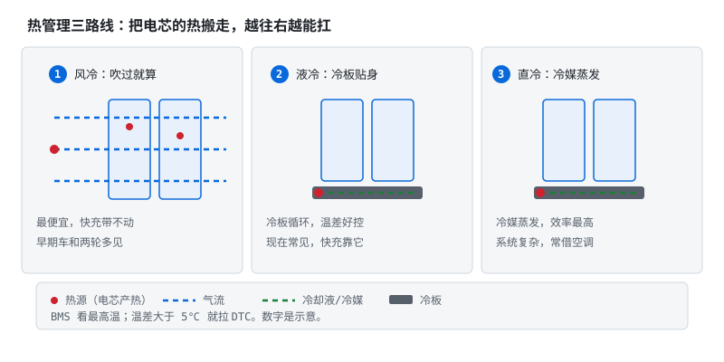

> **图说**　风冷（气流掠过电芯，最简最省但能力有限）→ 液冷（冷板贴身、冷却液循环，当前主流，2C 快充靠它）→ 直冷（空调冷媒在板内直接蒸发吸热，效率最高但系统最复杂）。

> **口诀**　风冷、液冷、直冷可以换。测温和按温度收功率不换。

**看动画时盯住哪里**

BMS 的职责在三路线下不变：T_max 告警、温差 >5℃ 拉 DTC、按温度收紧 SOP。

液冷不是整包一个温度。冷却液沿流向被捂热，下游的电芯更高：

**练完你会怎样**：你能用上面那句口诀，把这张图讲给别人听。

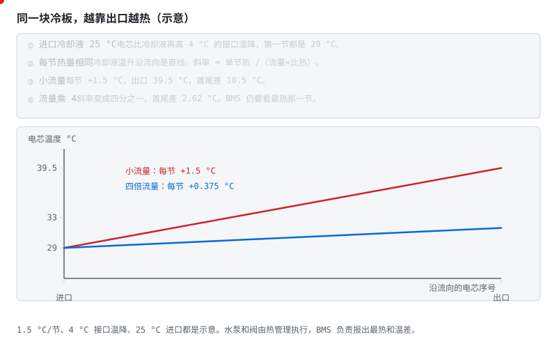

> **图说**　进口冷却液示意 25 °C，电芯再高 4 °C 的接口温降，所以靠进口的那一节是 29 °C。

> **口诀**　越靠出口越热。流量加大，这根斜线变平。

**看动画时盯住哪里**

每节热量相同，冷却液温升是直线，斜率等于单节热除以流量和比热。小流量每节 +1.5 °C，出口 39.5 °C，首尾差 10.5 °C。流量乘 4，斜率变成四分之一，首尾差约 2.6 °C。BMS 仍要看最热的那一节，不看平均。

- 红点和红线从进口走到出口，一路升高。
- 蓝线更平：流量是四倍，斜率是四分之一。
- 两条线在第一节重合。接口温降还在，变的是沿程那一截。

**短自测**

1. 为什么第一节的温度不随流量变？
2. 小流量时首尾差是多少？流量乘 4 呢？
3. 10.5 °C 能写成冷板的验收指标吗？

<details>
<summary><b>参考答案（先自己想完再展开）</b></summary>

1. 这张示意里，第一节只比进口冷却液高固定的 4 °C 接口温降。沿程温升从它后面才累加上去。
2. 10.5 °C 和约 2.6 °C。温差和流量成反比，因为每节热量没变。
3. 不能。1.5 °C/节和 4 °C 都是示意。水泵归热管理，BMS 负责报出最热和温差。

</details>

**练完你会怎样**：你布 NTC 时会在出口那一节留一个点，而不是只测冷板进口。


> **原理**　BMS 提供温度和允许功率，热管理系统负责把热量搬走或补上。两边同时改电流限值，电池会在加热和限流之间打架。
> **证据**　可核验演示：本节 SVG（浏览器打开即播），正文有不看动画也能读的说明。BMS 负责测温和降额，不负责把冷却回路设计完。寿命侧先对照 [BU-808](https://batteryuniversity.com/article/bu-808-how-to-prolong-lithium-based-batteries/)（英文，可选）。
> **延伸阅读**　[《车用 BMS 功能安全设计方法论》](https://www.mdpi.com/1996-1073/14/21/6942)（英文，可选）。固态电芯并没有取消测温和限功率，结构电池的热和力学边界在 [阶段 0 §0.1.8](stage-0-前置知识.md#018-固态电池固体电解质换掉了什么-理解)、[§0.1.9](stage-0-前置知识.md#019-碳纤维结构电池电极在承力外壳是另一件事-理解)。

## 6.2 固件精通 [应用]

> **原理**　量产固件把状态机、故障表、参数区和升级补全。任何状态都能进故障，升级中途断电必须还能回到旧固件。
> **证据**　保护每拍先评估完，状态按一张表迁移。可对照 [LibreSolar/bms-firmware](https://github.com/LibreSolar/bms-firmware)（英文，可选）和本仓库 `code/firmware` 测试。
> **延伸阅读**　[foxBMS 2](https://github.com/foxBMS/foxbms-2)（英文，可选）

### 6.2.1 量产状态机 [应用]

在阶段 3 的最小集合上扩展成完整版图（巡游动画见 [状态机](../circuits/assets/state-machine.svg)）：

```
初始化 → 自检 → 待机 → 预充 → 就绪 ⇄ 充电 ⇄ 充电末端均衡
                         ⇅      ⇄ 放电
                        故障（分级：提示/限功率/断开）
                         ⇅
                        休眠 ⇄ 运输模式（深度低功耗）
```

三条铁律再背一遍：迁移集中一处；每个状态"进入/周期/退出"三动作明确；**任意状态可直接进故障态**。

> **原理**　每个状态写清进入、周期和退出。迁移集中在一处，任意状态都可以直接进入故障，不能靠调用顺序碰运气。
> **证据**　每个状态写清进入、周期、退出，任意状态都能进故障。巡游动画在本节；代码落点是 `code/firmware` 的 `test_bms`。
> **延伸阅读**　[《车用 BMS 功能安全设计方法论》](https://www.mdpi.com/1996-1073/14/21/6942)（英文，可选）

### 6.2.2 故障管理（DTC 体系） [应用]

每个故障五要素：触发条件 + 去抖 + 等级 + 恢复条件 + 是否锁存。

**快照是灵魂**：触发瞬间冻结电压、电流、温度、SOC、时间戳。客户那边"昨天充不进电了"，没有快照你只能摊手；有了快照，你能在办公室看见事故现场的每一帧。故障码对外按 UDS 风格（车规）或自定义表（储能/消费）。

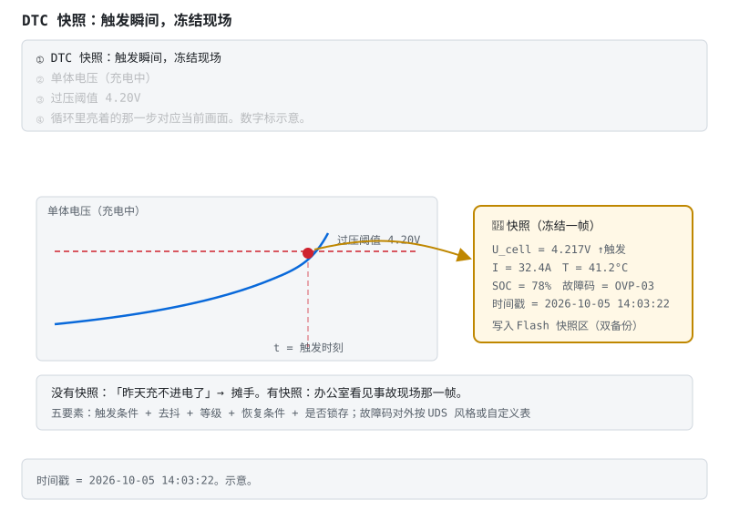

> **图说**　充电曲线爬过 4.20V 阈值的那一瞬，BMS 把这一帧冻结下来——触发的单体电压、当时的电流温度 SOC、故障码、时间戳，写进 Flash 快照区（双备份）。

> **口诀**　冻的是越线那一拍，不是用户事后的描述。

**看动画时盯住哪里**

售后拿到的不是"用户描述"，而是事故现场的物证。

> **原理**　每个故障五要素：触发条件 + 去抖 + 等级 + 恢复条件 + 是否锁存。
> **证据**　可核验演示：本节 SVG（浏览器打开即播），正文有不看动画也能读的说明。故障要留下当时的电压、电流、温度和时间。结构可对照 [foxBMS 2](https://github.com/foxBMS/foxbms-2)（英文，可选），安全过程见 [《车用 BMS 功能安全设计方法论》](https://www.mdpi.com/1996-1073/14/21/6942)（英文，可选）。
> **延伸阅读**　[ENNOID-BMS](https://github.com/EnnoidMe/ENNOID-BMS)（英文，可选）

**短自测**

1. 快照要冻住的是哪一拍？
2. 后面又来一个更严重的故障，能改掉已经冻住的第一现场吗？

<details>
<summary><b>参考答案（先自己想完再展开）</b></summary>

1. 越线那一拍：电压、电流、温度、SOC、时间戳。不是用户第二天的描述。
2. 不能。显示可以升级。冻结帧不改。否则办公室里只剩短路，看不出它发生在过充之后。

</details>

**练完你会怎样**：客户说「昨天充不进电」，你先要快照，不先要故事。


### 6.2.3 参数与标定系统 [应用]

- 参数区：Flash 独立扇区，结构体 + 版本号 + CRC + **双备份**；
- 标定项：电流零漂（出厂必做，不做的话 SOC 出厂就偏几个点）、电压增益、NTC 偏移；
- 防写穿：写次数计数 + 磨损均衡；参数更新**先写备份区再切换**——更新中途掉电，旧参数还在。

> **原理**　参数放在独立扇区，带版本号、CRC 和双备份。先写备份再切换，写到一半掉电时旧参数还在。
> **证据**　标定参数和代码分开，否则现场改一个阈值就要重刷程序。结构参考 [foxBMS 2](https://github.com/foxBMS/foxbms-2)（英文，可选）。
> **延伸阅读**　[《车用 BMS 功能安全设计方法论》](https://www.mdpi.com/1996-1073/14/21/6942)（英文，可选）

### 6.2.4 Bootloader 与 OTA [应用]

- 双区（A/B）方案最稳：新固件写备用区 → 校验 → 标记切换 → 重启验证 → 失败自动回滚；
- 两条铁律：**bootloader 自身永不被 OTA 覆盖**；升级中断电必须能恢复原固件——做不到这两条，OTA 就是批量变砖机。

> **原理**　新固件写到备用区，校验通过才切换。Bootloader 自己不被升级覆盖，切换后起不来要能自动回到旧固件。
> **证据**　升级失败必须还能回到能启动的旧镜像。工程结构参考 [foxBMS 2](https://github.com/foxBMS/foxbms-2)（英文，可选）。不要在没有校验时把 OTA 写进量产。
> **延伸阅读**　[LibreSolar 固件](https://github.com/LibreSolar/bms-firmware)（英文，可选）。云端建议的标定不能绕过这里，见 [§6.2.6](stage-6-精通与毕业项目.md#626-云端诊断停在包外-评价)。

### 6.2.5 故障注入与快照回放 [应用]

§6.2.2 的快照是「触发那一拍冻住」。回放是事后把这一拍再读出来，并确认后面的故障没有把它盖掉。真实验台用可调电压代替电芯，本仓库这一步在 PC 上调用现有的 `bms_tick`，不改 `bms.c` 里的保护。

怎么跑：

```bash
cd code/firmware
gcc -std=c99 -Wall -Wextra -Werror -o hil_replay bms.c hil_replay.c && ./hil_replay
```

脚本用的阈值和 `test_bms` 相同：过充 4250 mV、去抖 3 拍，短路 30 A。这些是锂电教学示例，不是产品规格，也不是钠离子窗口。

程序打两段。案例 A：充电中把第 3 串写成 4300 mV。前两拍可以已经进入均衡（压差够了），但还不到去抖，不应进故障。第三拍冻结过充、4300 mV、+2000 mA，并断开充电。下一拍改注入 −40 A，显示主故障升级成短路，两路都断；快照里的故障码、电压和电流仍是过充那一帧。案例 B：把一串写成 0 mV。去抖之后快照是欠压。这个骨架没有开线标志，0 mV 只能落到欠压。真实验台要另注入断线，并核对开线 DTC，不能把案例 B 的欠压当成开线已经测过。

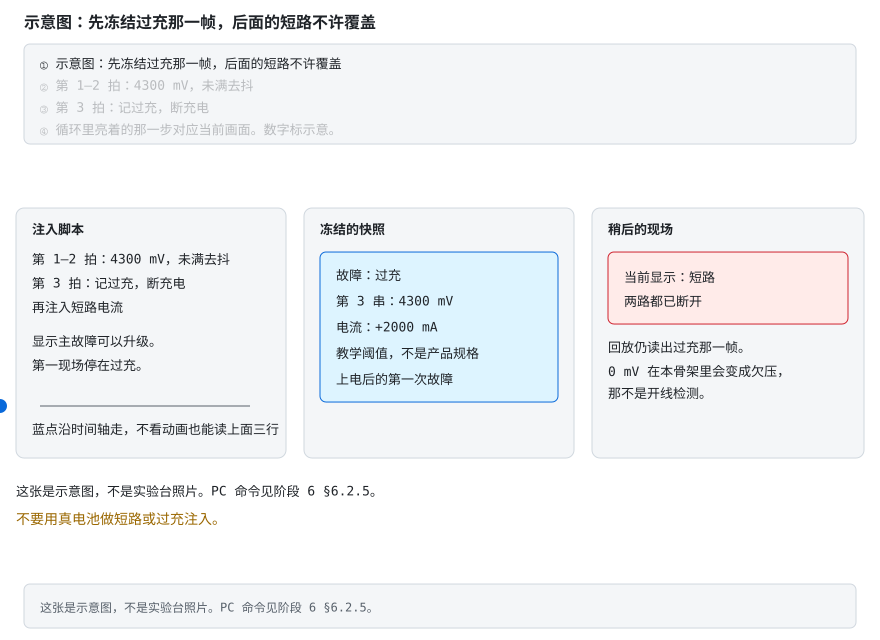

> **图说**　左格是脚本的三步，中格是冻住的过充帧，右格是后来的短路。

> **口诀**　后来的故障可以改显示。已经冻住的第一现场不改。

**看动画时盯住哪里**

蓝点只沿时间轴走。第一现场停在过充。这张是示意图。不要用真电池做短路或过充注入。

2026-10-05 在共享资源检索过硬件在环、电芯模拟器和 HIL 台。对得上名字的一张是 [File:Analogrechner HW-in-Loop Ausschnitt.jpg](https://commons.wikimedia.org/wiki/File:Analogrechner_HW-in-Loop_Ausschnitt.jpg)（CC BY-SA 4.0），画面是大约 1985 年的 EAI 模拟计算机局部。

那不是电池电芯模拟器机架，所以不放进仓库。同一天再看：硬件在环的检索里还有学位论文 PDF，以及注册号带 HIL 的客机，都不是电池台。厂商电芯模拟器商品页没有写明可以转载，不收。记录在 [照片来源](../circuits/assets/photos/PHOTOS.md)。

可编程电源、故障注入、被测 BMS 和上位机在同一张里的实拍仍然没有。可以放进仓库的是仿真器表征台，两篇都是 CC BY 4.0。Verani 等 Electronics 2023 的 Figure 4 是模块化电池仿真器的表征布置：TTi QPX1200SP、仿真器机架、Keithley 2460 和笔记本。Di Rienzo 等 Electronics 2022 的 Figure 3，图注写的是电芯仿真器表征用的实验布置。两张画面里都没有被测 BMS。

**练完你会怎样**：你能用上面那句口诀，把这张图讲给别人听。

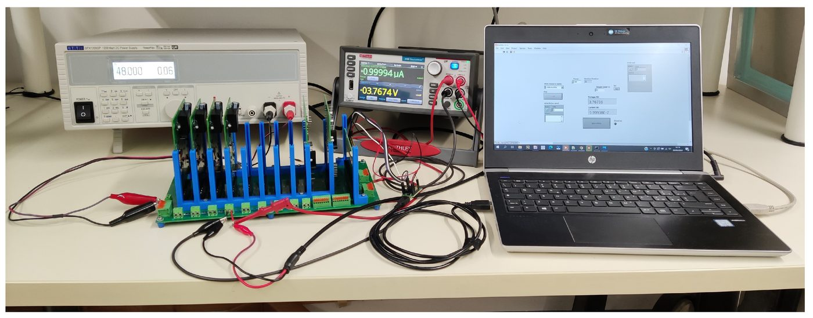

Verani、Di Rienzo、Baronti、Roncella、Saletti，[Electronics 2023, 12, 1232](https://doi.org/10.3390/electronics12051232)，Figure 4。开源电池仿真器表征台。没有被测 BMS。

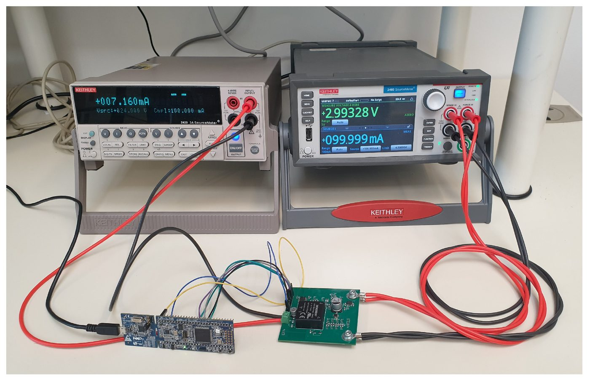

Di Rienzo、Verani、Baronti、Roncella、Saletti，[Electronics 2022, 11, 1215](https://doi.org/10.3390/electronics11081215)，Figure 3。仿真器表征台。来源见 [照片来源](../circuits/assets/photos/PHOTOS.md)。

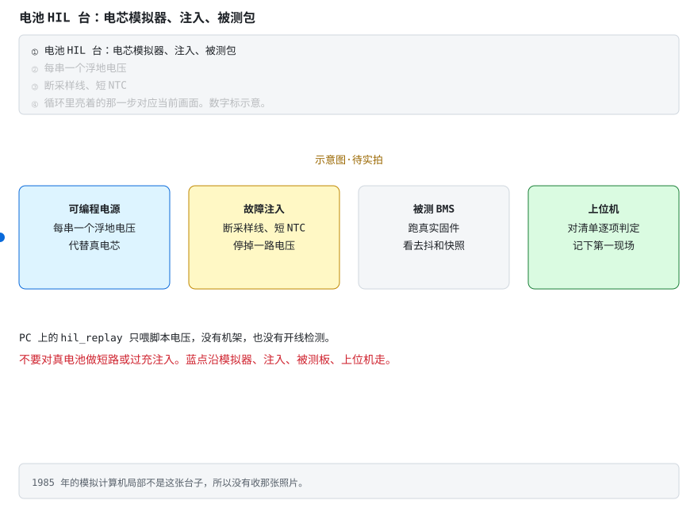

> **图说**　同一框里是可编程电源、故障注入、被测 BMS、上位机。

> **口诀**　可编程电源代替电芯。脚本电压不是这张机架。

**看动画时盯住哪里**

电源用浮地电压代替真电芯；注入可以断采样线、短 NTC 或停掉一路电压；被测板跑真实固件；上位机对清单判定并记下第一现场。蓝点沿这四件走。示意图·待实拍。1985 年的模拟计算机局部不是这张台子。上面的 `hil_replay` 只喂脚本电压，没有机架，也没有开线检测。

**故障分析**

- 快照每次故障都重写。售后看到的是最后一条短路，过充那一拍的电压和电流没了。本骨架刻意只留上电后的第一次；量产要的是「每条故障事件的第一拍」，读走或恢复后再允许下一条，见 `bms.h` 里 `FaultSnapshot` 的注释。回放程序没有把骨架改成后者。
- 去抖未满时状态已经是均衡，就被当成保护没在计时。保护和状态迁移是两条线，案例 A 的前两拍就是这样。
- 把 0 mV 直接记成电芯过放。开线和真欠压在这个骨架里长得一样。先有开线检测，再信这串电压，见 [详解④ §3.4](../circuits/04-系统安全与量产.md#34-采样链的可信度断线检测-分析)。

**案例解析**（教学案例；数字来自上面的 PC 脚本，不是某次事故）

发生了什么：充电中第 3 串被脚本抬到 4300 mV。第三拍 BMS 进故障，快照记下过充和当时的 +2000 mA。随后电流被改成短路量级。

信号：屏幕上的主故障变成短路，充放电都断了。把快照再读一遍，故障码仍是过充，第 3 串仍是 4300 mV，电流仍是 +2000 mA。

根因：显示用的主故障会升级，第一现场不跟着改。若实现成「后来的故障覆盖快照」，办公室里就只剩短路，看不出它是在过充之后发生的。

BMS 上的教训：回放读的是冻结帧，不是当前 ADC。注入清单至少包括「去抖边界」「第一现场不被覆盖」和「开线与真欠压分开」。PC 脚本覆盖前两件；开线仍要在带检测电流的台子上做。分压链和可编程电源可以代替电芯，不要对真电池做这些注入。

> **原理**　故障注入是按脚本改采样，看去抖、断口和快照是否和安全要求一致。回放是把触发那一拍再读出来。后来的故障可以改当前显示，不应改已经冻结的第一现场。
> **证据**　可核验命令见本节。`hil_replay` 只链接现有 `bms.c`。开线与真过放的差别见 [详解④ §3.4](../circuits/04-系统安全与量产.md#34-采样链的可信度断线检测-分析)。台架思路见 [EEVblog 电芯模拟器讨论](https://www.eevblog.com/forum/projects/lithium-battery-cell-simulatoremulator-for-bms-testing/)。
> **延伸阅读**　快照五要素在 [§6.2.2](stage-6-精通与毕业项目.md#622-故障管理dtc-体系-应用)。功能安全的失效注入在 [§6.4.1](stage-6-精通与毕业项目.md#641-过充案例开线被当成过充-评价)。只有电脑时，把这一节走完的五天在 [共学 · 固件](../共学/03-固件五天.md)。

**练完你会怎样**：你能用上面那句口诀，把这张图讲给别人听。

### 6.2.6 云端诊断停在包外 [评价]

车队平台看的是报上来的帧：电压、温度、报警、SOC。它适合看一批车的漂移、哪一批电芯先老化、标定要不要改。它不在切断回路里。

时间尺度分开。GB/T 32960.2—2016 对车载终端的写法是：实时数据采集频次不应低于 1 次/s；正常时内部存储间隔最大不超过 30 s；出现该标准所指的 3 级报警时，存储间隔最大不超过 1 s。上传还要符合 GB/T 32960.3。通信中断时先存本地，恢复后再补发。这是监控记录。包上的比较器、接触器和熔断器按自己的去抖和硬件速度切断，不等这 30 s。

必须留在包上的：过充、过放、过流、短路、过温的切断；开线检测；绝缘和接触器粘连的安全状态。这些不依赖蜂窝信号。

可以放在云上的：车队统计、SOH 模型的离线更新、一份「建议标定」。建议值写进包之前，要走 [§6.2.3](stage-6-精通与毕业项目.md#623-参数与标定系统-应用) 的版本、CRC 和双备份，并且不得放宽硬件比较器。OTA 只换应用区，bootloader 不被覆盖，见 [§6.2.4](stage-6-精通与毕业项目.md#624-bootloader-与-ota-应用)。

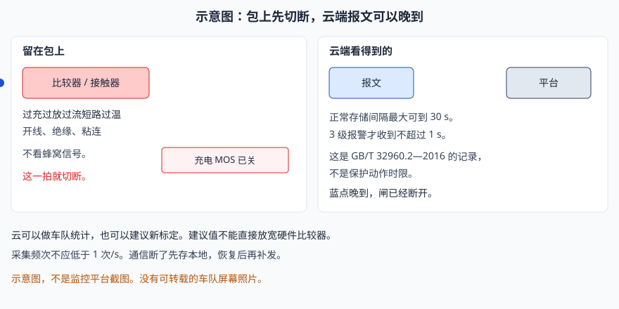

> **图说**　三条阶梯在对数时间上先后落下。短路示例 10 μs，过充窗口 80–200 ms，都早于正常存储最多 30 s。

> **口诀**　包上这一拍就断。云上的报文可以晚半分钟。

**看动画时盯住哪里**

金点沿 80 ms 那条走。包上的比较器不等云上那 30 s。这张不是平台截图。

2026-10-05 检索过车队监控和 telematics。公共汽车 GPS 控制室、车队定位平台的界面图、车展上的车载通信展台，画面里没有电池单体电压和包内 DTC，没有收。可转载的仪表盘是 OVMS 的网页：单车 SOC、续航、电池电压、电流、温度和 SOH。项目许可 MIT。它是开源车载监控，不是商业车队云的后台，也不在切断回路里。

**练完你会怎样**：你能用上面那句口诀，把这张图讲给别人听。

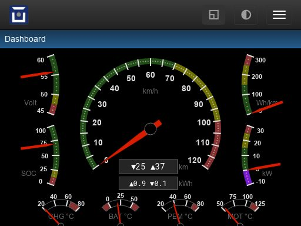

Open Vehicles / OVMS，[Dashboard](https://docs.openvehicles.com/en/stable/components/ovms_webserver/docs/dashboard.html)。来源见 [照片来源](../circuits/assets/photos/PHOTOS.md)。

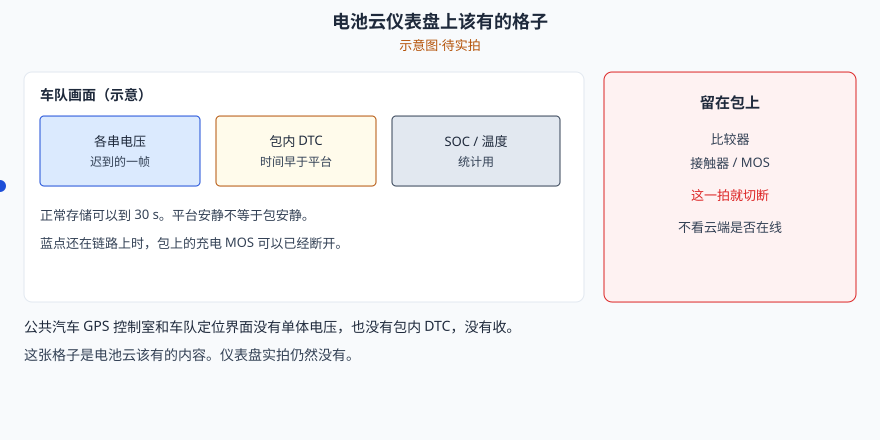

> **图说**　蓝线是存储年龄对 30 s 取余。绿线钉在 1 s，那是 3 级报警的存储上限。

> **口诀**　云上看见的是已经发生的帧。切断不看它在不在线。

**看动画时盯住哪里**

金点沿锯齿走，锯齿顶端是 30 s。绿线是 1 s，3 级报警的存储不超过这一档。切断仍留在包上，不看这条记录到没到。上面的 OVMS 是单车网页，不是这张锯齿。正常存储可以到 30 s。

**故障分析**

- 平台半分钟没有报警，就认为没有过充。正常存储可以到 30 s，断网时报文还在终端里。平台安静不等于包安静。
- 用云端标定把软件过充点改高，用来消掉「误报」，并把硬件比较器一并放宽或旁路。软件这条通道就不再有独立的第二道。
- 把热失控切断做成「等云端下令」。链路、平台和人的延迟都不在包上的故障响应时间里。

**案例解析**（教学案例，不是某次事故调查）

发生了什么：充电中一串越过包内阈值。软件去抖后断开充电 MOS，硬件比较器仍按本地分压处于能切断的状态。车载终端按正常周期把数据放进存储。平台侧要等这条记录上传；若当时没有被标成 3 级报警，存储间隔仍按不超过 30 s 那一档。

信号：包内 DTC 和快照的时间早于平台上的同一条电压。平台曲线在切断之后才出现尖峰，或因补发而晚到。只看平台的人会说「云端没有及时保护」。

根因：把监控上报当成保护动作。

BMS 上的教训：硬切断留在包上。云端可以建议新阈值，包上的参数更新仍要校验，并且不能改硬件比较器的分压。晚到的报文用来复盘，不用来决定这一秒断不断。

> **原理**　云端看的是已经发生、再被记下来的帧。过充过放和短路的切断必须在包上完成，因为上报间隔和断网补发都以秒计，保护动作不是这条链路。
> **证据**　记录间隔见 GB/T 32960.2—2016：采集不低于 1 次/s，正常存储最大不超过 30 s，该标准所指的 3 级报警存储最大不超过 1 s。上传周期另见 GB/T 32960.3。这是监控，不是 FTTI。
> **延伸阅读**　参数区在 [§6.2.3](stage-6-精通与毕业项目.md#623-参数与标定系统-应用)，升级边界在 [§6.2.4](stage-6-精通与毕业项目.md#624-bootloader-与-ota-应用)。开线与过充的差别在 [§6.4.1](stage-6-精通与毕业项目.md#641-过充案例开线被当成过充-评价)。

**短自测**

1. 平台上 30 秒没有报警，能说明包没有过充吗？
2. 热失控切断可以等云端下令吗？

<details>
<summary><b>参考答案（先自己想完再展开）</b></summary>

1. 不能。GB/T 32960 那一档正常存储可以到 30 s。那是监控记录，不是切断时限。断网时报文还在终端里。
2. 不可以。比较器和接触器在包上这一拍就断。云端可以建议标定，不能放宽硬件比较器。

</details>

**练完你会怎样**：你能把「云上看见」和「包上切断」分成两件事。OVMS 那张图是单车网页，不是切断回路。


云上的曲线断了，不等于包里还留着完整的一段。缓冲满了就盖旧数据。

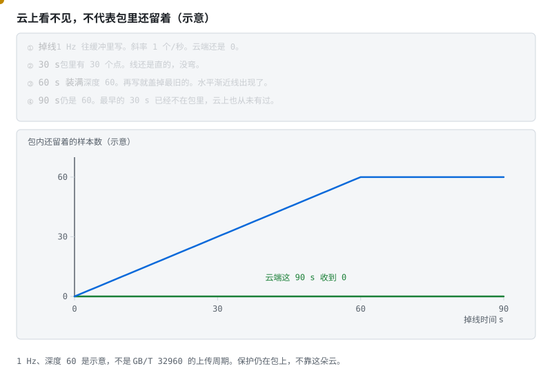

> **图说**　盯住爬到深度就改走水平的黄点，以及贴着 0 的绿线：云端在掉线期间仍然一个点都收不到。

> **口诀**　先按每秒一个点往上堆。堆到深度就改走平线。云在恢复前是 0。

**看动画时盯住哪里**

黄点先沿斜线爬，到 60 之后改走水平线。绿线贴着 0。

示意：采样 1 Hz，缓冲深度 60。掉线后 $n=\min(60,t)$，$t$ 用秒。30 s 时包里 30 个点。60 s 装满。90 s 仍然是 60，最早的 30 s 已经被新点盖掉。绿线是云端收到的个数，整段掉线里都是 0。水平那段就是渐近线：深度有限，样本数不会跟着掉线时间一直涨。

这不是 GB/T 32960 的上传周期。保护在包上，不靠这朵云。把云仪表盘的空白理解成「那一阵没有故障」，是把记录和安全弄反了。

**短自测**

1. 掉线 90 s、深度 60、1 Hz，包里还剩多少点？丢掉的是哪一段？
2. 为什么云上的 0 不能证明包是健康的？

<details>
<summary><b>参考答案（先自己想完再展开）</b></summary>

1. 还剩 60 个点。最早约 30 s 被覆盖，云上一个也没收到。
2. 掉线时上传就是 0。故障可以留在包内的 DTC 里。1 Hz 和深度 60 是示意。

</details>

**练完你会怎样**：你看云曲线断档时，会问缓冲有多深、盖掉的是旧是新，而不是只刷新页面。


## 6.3 算法精通（阶段 4 的深化清单） [分析]

- **OCV 滞回建模**：状态里加滞回电压项（Plett Vol. II 的方法），解决"充放电曲线不重合"的系统误差；
- **双卡尔曼工程化**：快/慢滤波器的交替节奏、激励不足时冻结慢滤波器参数更新（可观测性保护）；
- **SOP 完整版**：多约束取最小 + 时长分级（2s/10s/30s）+ 温度查表降额（公式与符号约定见阶段 4）；
- **均衡策略工程化**：入口条件（充电末端、压差 > 阈值、温度允许）、目标选择（电压对齐 vs 容量对齐）、热约束下分时调度；大容量场景评估主动均衡（[电路详解 ③](../circuits/03-充电均衡与计量.md) 的拓扑对比）。

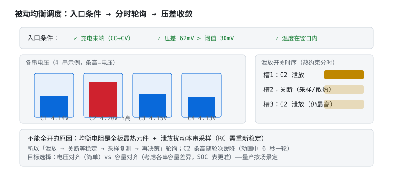

> **图说**　入口条件（充电末端、压差 62mV 超阈值、温度在窗口）满足后，最高的 C2 开始泄放——但不是一直开：泄放一个槽位就关断，等 RC 稳定再采样复测，然后下一轮决策。

> **口诀**　轮流放一节，放完等电压稳住再量。不要一起烤。

**看动画时盯住哪里**

条高随轮次缓降。热与采样精度两个约束决定了"轮询"而不是"全开"。

> **原理**　深化的第一步是把充放电 OCV 不重合写成滞回，否则平台区会留下系统性的 SOC 误差。
> **证据**　可核验演示：本节 SVG（浏览器打开即播），正文有不看动画也能读的说明。阶段 4 的模型在这里碰到热、均衡和功率限制。讲义 [Plett BMS2 课程站](http://mocha-java.uccs.edu/BMS2)（英文，可选）与 [Plett ECE5720](http://mocha-java.uccs.edu/ECE5720/index.html)（英文，可选）。
> **延伸阅读**　[ECE5720 Notes03 中文导读](../ece5720-notes03-中文导读.md)。热、均衡、功率和老化控制的讲义导读在 [UCCS 路径](../uccs-中文导读路径.md)。

**练完你会怎样**：你能用上面那句口诀，把这张图讲给别人听。

## 6.4 功能安全落地：以过充为例走一遍 [评价]

ISO 26262 / GB/T 34590 的流程听起来抽象，走一遍就具体了：

1. **危害识别**：单体过充 → 热失控起火（回看 [热失控链](../circuits/assets/thermal-runaway.svg)）；
2. **场景分析**：充电中电压采样失效 / MOS 粘连 / 充电机失控；
3. **ASIL 定级**：由 HARA 结果决定——很多车用项目把防过充定为 ASIL C 或 D（仅为示例，须按场景、暴露率与车型风险评估定级）；
4. **安全目标**：任何单点失效不得导致单体电压超过安全限值；
5. **功能安全要求**：双通道独立保护——MCU 软件保护 + AFE/独立保护 IC 硬件保护；
6. **技术安全要求**：ADC 自检与开线检测周期按 FTTI（故障容忍时间间隔）推导，本例取 <100ms；MOS 驱动回路诊断；通信 CRC + 超时；独立看门狗；
7. **验证**：失效注入测试——拔采样线、短 MOS、停喂狗，逐项确认**硬件通道独立生效**。

一个单点失效 → 还有一道独立防线 → 电池仍然安全。这就是功能安全的全部朴素思想。深入研读：[《车用 BMS 功能安全设计方法论》（MDPI Energies 2021）](https://www.mdpi.com/1996-1073/14/21/6942)、[batterydesign.net《BMS 功能安全》](https://www.batterydesign.net/battery-management-system/functional-safety/)、[英飞凌知识库《ASIL 分解》](https://community.infineon.com/t5/Knowledge-Base-Articles/ASIL-decomposition-ISO-26262/ta-p/852405)。

> **原理**　功能安全要把「非预期输出高压」从危害一路落到独立的硬件关断，并用失效注入证明软件死了这条通路仍然有效。
> **证据**　本节可点击来源：[《车用 BMS 功能安全设计方法论》（MDPI Energies 2021）](https://www.mdpi.com/1996-1073/14/21/6942)。阈值与宣传口径仍以 datasheet / 标准原文为准。
> **延伸阅读**　[瑞萨《BMS 教程》中文导读](../renesas-bms-tutorial-中文导读.md)（可选扫盲）。把七步走成一条会误诊的过充，见 [§6.4.1](stage-6-精通与毕业项目.md#641-过充案例开线被当成过充-评价)。

### 6.4.1 过充案例：开线被当成过充 [评价]

上面七步是一条能走完的路径。下面用教学案例把它走完。这不是某次事故的调查报告，也没有编 ISO 26262 的条款号。

发生了什么：充电中，第 3 串的 ADC 连续三拍高于软件过充阈值，其余串仍在充电平台里。软件切断充电 MOS，DTC 记成过充。

信号：只有这一串冲高；切断前电流仍是充电方向；开线检测位没有被读。采样线断开时，检测电流可以把悬空脚推向异常电平，读数可以像过充，也可以像过放。这和电芯的真实电压不是同一件事，见 [详解④ §3.4](../circuits/04-系统安全与量产.md#34-采样链的可信度断线检测-分析)。

两条根因要能在记录里分开：

1. 真过充。这一串的电压确实越过安全限。不经过这颗 MCU 的硬件比较器也应切断。软件停了，这条通路还在。
2. 开线。电芯并没有过充。根因是线束。把它记成过充，维修会去换电芯，或者把阈值放宽。

误诊就出在三条路上：只信 ADC，不开线检测就定过充；为了还能充电，用标定或云端把软件阈值放宽；硬件比较器被短接或没装。§6.4 里的 ASIL C 或 D 是示例，由 HARA 按场景来定，不是所有车的固定等级。文中「ADC 自检与开线检测 <100 ms」也是这条教学路径里的取值，不是从标准条款抄来的唯一数字。

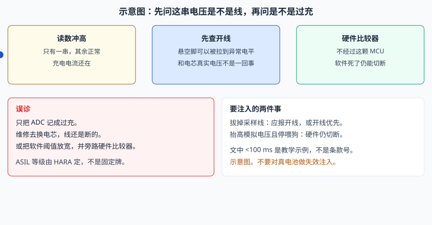

> **图说**　读数冲高之后先查开线，硬件比较器不经过 MCU。

> **口诀**　读数冲高，先问是不是线，再问是不是过充。

**看动画时盯住哪里**

红格是误诊：只记过充，或放宽软件并旁路硬件。绿格是要注入的两件事。蓝点沿这条路径走。示意图。不要对真电池做失效注入。

共享资源里的 [File:ISO 26262 ASIL berechnen.svg](https://commons.wikimedia.org/wiki/File:ISO_26262_ASIL_berechnen.svg)（CC BY-SA 4.0）是严重度、暴露率和可控性怎么算出 ASIL 的图，不是认证现场的照片，没有收。

2026-10-05 再看的 [HIMA 演讲照片](https://commons.wikimedia.org/wiki/File:Functional_safety_in_a_connected_world_-_HIMA_(40604023743).jpg) 是会议演讲者，不是失效注入、硬件比较器和见证记录同框，也不收。

功能安全见证现场的实拍仍然没有。本节继续用这条过充路径，不编条款号。

近邻是电池试验室。爱达荷国家实验室的一张写的是电动车与储能电池的过热测试能力。橡树岭的一张是锂离子电芯制备实验环境。能源部另有一张同一类 INL 测试照片，公有领域。三张都是试验或制备环境。

**练完你会怎样**：你能用上面那句口诀，把这张图讲给别人听。

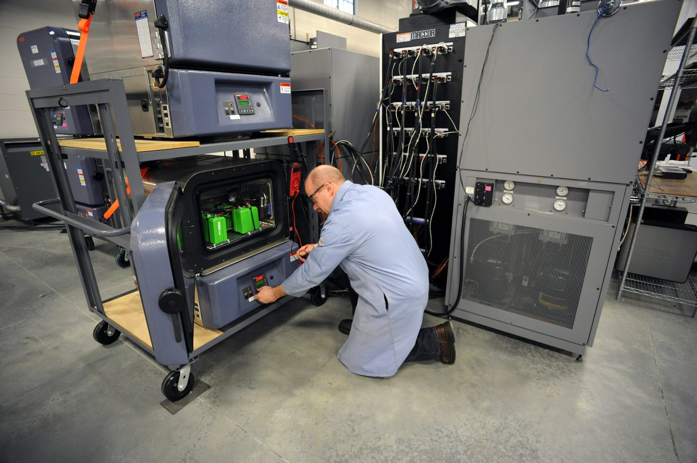


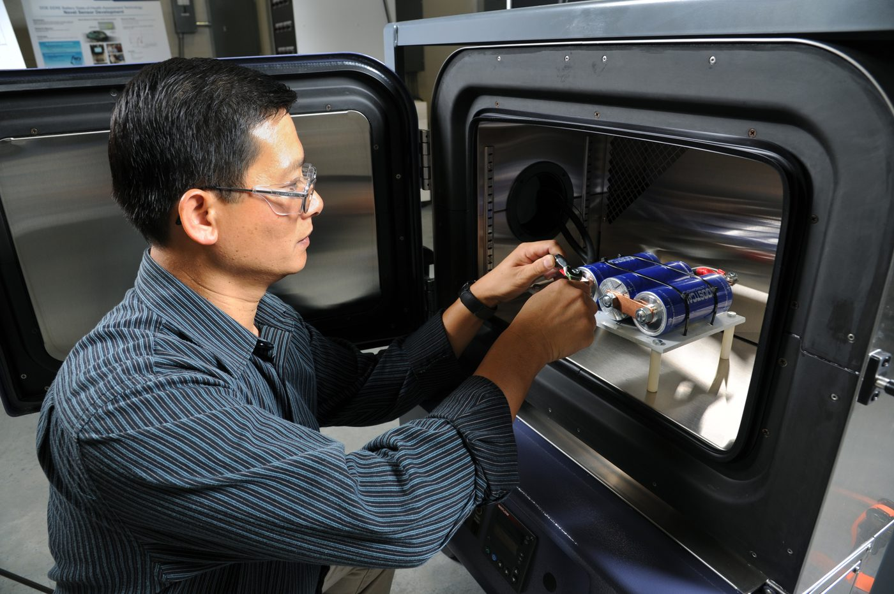

来源见 [照片来源](../circuits/assets/photos/PHOTOS.md)。

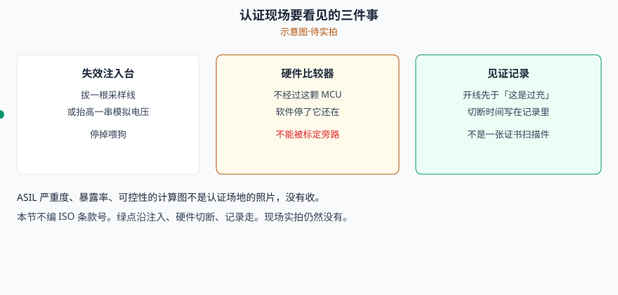

> **图说**　绿线在教学反应时间 10 ms 跳到已切断。红线是停掉的软件，一直是 0。100 ms 是同一笔示意 FTTI，不是认证结论。

> **口诀**　注入一次，独立切断一次，把时间写下来。

**看动画时盯住哪里**

金点沿绿线走。软件停了，红线仍是 0：比较器不经过这颗 MCU，也不能被标定旁路。记录里要能看出切断时间。这不是认证结论，功能安全见证的实拍仍然没有。上面三张试验室照片不是这张时序。不要对真电池做失效注入。

验证就两下，对应上面第 7 步：拔掉这一根采样线，确认报的是开线，或开线优先于「这是过充」；用模拟电压抬高这一串，并停掉喂狗，确认硬件通道仍切断。PC 上的 `hil_replay` 只能演示「0 mV 会被现有骨架记成欠压」，替代不了这两下。

> **原理**　过充的安全目标是单点失效不得让单体电压越过安全限。读数冲高时，先判断采样线是否还在，再判断电芯是否真的过充。硬件切断不依赖 MCU 和云端。
> **证据**　方法论文仍是 [《车用 BMS 功能安全设计方法论》（MDPI Energies 2021）](https://www.mdpi.com/1996-1073/14/21/6942)。开线机理在 [详解④ §3.4](../circuits/04-系统安全与量产.md#34-采样链的可信度断线检测-分析)。本页不引用未核对的条款号。
> **延伸阅读**　云端把阈值放宽的边界在 [§6.2.6](stage-6-精通与毕业项目.md#626-云端诊断停在包外-评价)。PC 回放在 [§6.2.5](stage-6-精通与毕业项目.md#625-故障注入与快照回放-应用)。

**短自测**

1. 只有一串读数冲高，第一反应是换电芯吗？
2. 软件停了，硬件比较器还要在吗？

<details>
<summary><b>参考答案（先自己想完再展开）</b></summary>

1. 先问是不是采样线。开线可以把悬空脚推向像过充的电平。记成过充，维修会去换电芯，或者把阈值放宽。
2. 要。它不经过这颗 MCU，也不能被标定旁路。功能安全见证现场的实拍仍然没有，不要把试验室照片当成认证现场。

</details>

**练完你会怎样**：读数冲高，你先问线，再问过充。


从故障发生到必须做完安全动作，只有一个口袋。检测、去抖、反应都要装进去。

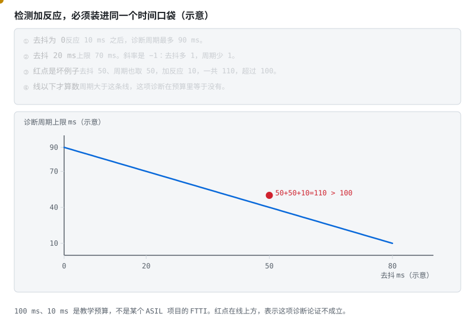

> **图说**　盯住下降直线上的黄点和线外的红点：去抖多 1 ms，允许的诊断周期就少 1 ms。

> **口诀**　诊断周期的上限 = 口袋 − 反应 − 去抖。线以上等于没做这项诊断。

**看动画时盯住哪里**

黄点沿下降的直线走，那是还允许的周期。红点停在线外，不要跟着它走。

示意口袋 100 ms，反应 10 ms。诊断周期上限 $T=90-t_\mathrm{debounce}$。去抖为 0，周期最多 90 ms。去抖 20 ms，最多 70 ms。斜率是 −1：去抖多 1 ms，周期就必须少 1 ms。红点是坏例子：去抖 50 ms、周期也取 50 ms，再加反应 10 ms，一共 110 ms，超过 100 ms。那个点在线的上面。

这不是某个 ASIL 项目的 FTTI，只说明不等式怎么约束周期。

**短自测**

1. 去抖 20 ms、反应 10 ms、口袋 100 ms，诊断周期最多多少？
2. 红点为什么不行？

<details>
<summary><b>参考答案（先自己想完再展开）</b></summary>

1. 70 ms。
2. 50+50+10=110，大于 100。最坏检测时间大约是一个周期再加去抖。数字是示意预算。

</details>

**练完你会怎样**：你定诊断周期时，会先写下口袋、反应和去抖，再看周期还剩多少。


覆盖率不是「故障消失了」。残余大致按 $1-\mathrm{DC}$ 留下。

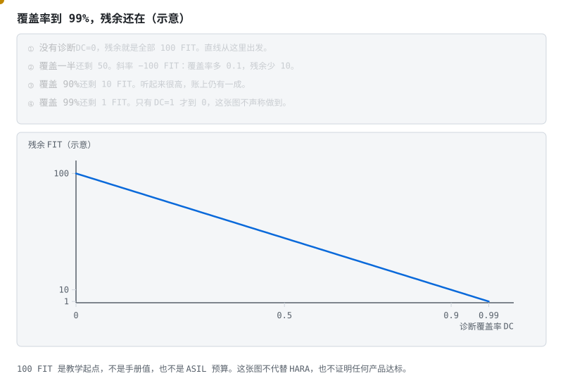

> **图说**　盯住沿直线下降、在右端仍高于 0 的黄点：覆盖到 99%，残余还在。

> **口诀**　覆盖到 99%，残余还在。只有 100% 才到零，而这张图不声称做到。

**看动画时盯住哪里**

黄点沿直线下降，越靠近右端越低，但在 0.99 处仍高于 0。

教学用：起点 100 FIT，$\lambda_\mathrm{res}=100\times(1-\mathrm{DC})$。覆盖 50% 还剩 50。覆盖 90% 还剩 10。覆盖 99% 还剩 1。直线，斜率 −100 FIT。这不是零件手册里的 FIT，也不是认证计算，更不能用来声明产品达到某个 ASIL。

常见的坑：把「我们做了诊断」说成残余可以忽略。90% 的覆盖仍留下一成。

**短自测**

1. 覆盖率 0.9 和 0.99，残余各是多少 FIT？
2. 为什么这张图不能当认证结论？

<details>
<summary><b>参考答案（先自己想完再展开）</b></summary>

1. 10 和 1。
2. 100 FIT 是教学起点。图上没有危害分析，也没有某个产品的诊断覆盖试验。

</details>

**练完你会怎样**：你听到「覆盖率很高」，会顺手算一下还剩的那一截，而不是把故障划掉。


## 6.5 量产与测试 [评价]

> **先读/后读**：标定步骤和 HIL 清单是 [应用]；用标准决定能不能放行是 [评价]。

**出厂标定与 EOL 清单**：电流零点（零电流读数写入参数区）、电压增益（标准源比对）；全串采样精度、通信收发、保护阈值抽测、绝缘电阻、静态功耗、固件版本与序列号烧录。

静态功耗不是一个数。睡着的平台可以只有几十微安，周期唤醒会打出毫安尖峰，平均由占空比决定：

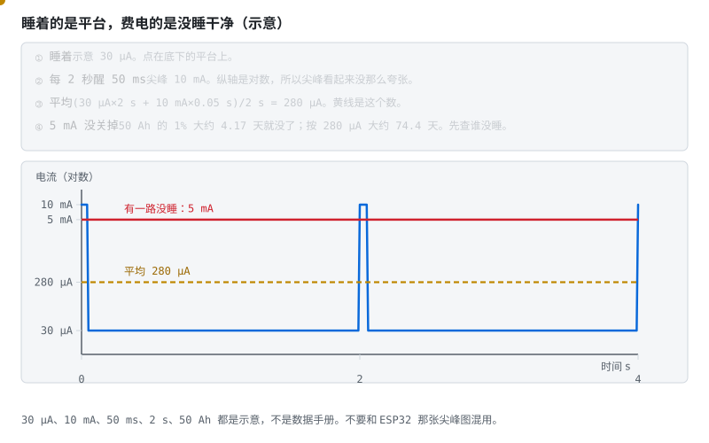

> **图说**　示意睡着 30 µA。

> **口诀**　睡着看平台。费电的是没睡干净的那一路。

**看动画时盯住哪里**

每 2 秒醒 50 ms，尖峰 10 mA。平均 (30 µA×2 s + 10 mA×0.05 s) / 2 s = 280 µA。纵轴是对数，所以尖峰看起来没那么高。若有一路停在 5 mA 没睡，50 Ah 的 1% 大约 4.2 天就没了；按 280 µA 大约 74 天。先查谁没睡。这不是 ESP32 无线尖峰那张图。

- 黄点大部分时间贴着 30 µA，每隔 2 秒跳上 10 mA。
- 黄横线是平均 280 µA。
- 红横线是 5 mA。它没有尖峰，但把日子吃短了。

**短自测**

1. 280 µA 是怎么口算出来的？
2. 为什么 5 mA 比 10 mA 的尖峰更费电？
3. 74 天能写成产品的静置寿命吗？

<details>
<summary><b>参考答案（先自己想完再展开）</b></summary>

1. 两秒里，30 µA 贡献 60 µA·s，10 mA 的 50 ms 贡献 500 µA·s，加起来除以 2 s 是 280 µA。
2. 尖峰只有 50 ms。5 mA 如果一直在，平均就是 5 mA，比 280 µA 大十几倍。
3. 不能。30 µA、10 mA、50 Ah 都是示意，用来比「睡干净」和「有一路没关」。

</details>

**练完你会怎样**：静态功耗测高了，你会先找没关掉的那一路，而不是把休眠电流的规格改大。


**HIL 测试**：电芯模拟器（入门可用电阻分压链，见 [EEVblog 实操帖](https://www.eevblog.com/forum/projects/lithium-battery-cell-simulatoremulator-for-bms-testing/)）+ **故障注入清单**：断任意采样线、短相邻采样线、NTC 开路/短路、通信中断、继电器粘连、电流超限——逐项验证 BMS 行为符合安全要求；边界工况：-20°C 启动、满充保持、深度过放恢复、长期静置唤醒。

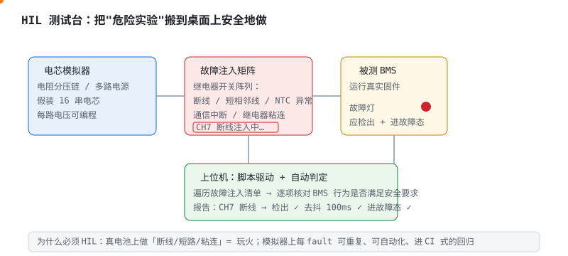

> **图说**　电芯模拟器（可编程电压的"假电池"）经故障注入矩阵（继电器阵列制造断线/短接/NTC 异常）接到跑真实固件的被测 BMS；上位机脚本遍历故障清单，自动核对每项的安全行为（检出、去抖、进故障态）。

> **口诀**　可编程电源代替电芯。脚本电压不是这张机架。

**看动画时盯住哪里**

危险实验在桌面上变得可重复、可自动化。PC 上能跑的那一层快照回放在 [§6.2.5](stage-6-精通与毕业项目.md#625-故障注入与快照回放-应用)，它不代替这张台子。四件设备画在同一框里的接线见这一节的 [电池 HIL 实验台场景](../circuits/assets/hil-bench-scene.svg)，示意图·待实拍，实验台照片仍然没有。

盯住底栏那四步台阶。这是示意累计，不是节拍标准：绝缘 2 s，电压点 1 s，过压注入 0.5 s，通信对名 1 s，一共 4.5 s。黄点沿台阶走到 4.5。过压那 0.5 s 短，是因为比较器不该等软件慢慢想。真实节拍以工装为准。


**标准速查**（按产品选）：ISO 26262/GB/T 34590（功能安全母标准）、[GB/T 38661-2020](https://openstd.samr.gov.cn/bzgk/std/newGbInfo?hcno=DB3ACC49AC4A146FAA311BB468ACA290)（车用 BMS 技术条件）、GB/T 39086-2020（车用 BMS 功能安全要求）、UL 1973/IEC 62619（储能）、UN 38.3（运输）、GB/T 32960（远程监控）。

> **原理**　出厂要记下电流零点和电压增益，并抽测采样、通信、保护阈值、绝缘和静态功耗。没有这些记录，就不知道这台机器出厂时是否在规格里。
> **证据**　本节可点击来源：[EEVblog 实操帖](https://www.eevblog.com/forum/projects/lithium-battery-cell-simulatoremulator-for-bms-testing/)。阈值与宣传口径仍以 datasheet / 标准原文为准。
> **延伸阅读**　[《车用 BMS 功能安全设计方法论》](https://www.mdpi.com/1996-1073/14/21/6942)（英文，可选）。电芯档和包序列号对不上时见 [§6.5.1](stage-6-精通与毕业项目.md#651-产线追溯错芯和贴错标-评价)。

**练完你会怎样**：你能用上面那句口诀，把这张图讲给别人听。

### 6.5.1 产线追溯：错芯和贴错标 [评价]

EOL 要回答的是：这台包里的电芯，是不是当时分进这一档的那些。链是电芯二维码，到化成后的容量、内阻和 K 值，到模组，到包序列号，再到 BMS 里售后能读出的标识。K 值的定义，以及一条中试线 Figure 4 上的 0.0239 mV/h，已经写在 [详解④ §4.3](../circuits/04-系统安全与量产.md#43-电芯筛选与追溯-应用)。那是那条线的界，不是电芯手册上的通用红线。

分选的意思是同一包里的电芯落在这份工艺约定的同一档。档的边界写在工艺里。总电压及格，替不了逐串对标准源，也替不了对电芯身份。

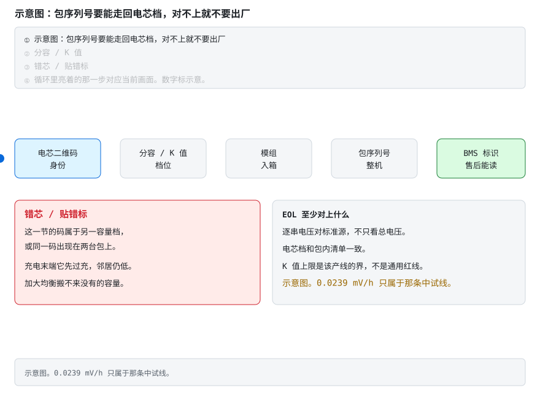

> **图说**　二维码、分容与 K 值、模组、包序列号、BMS 标识连成一条。

> **口诀**　错的那一节先过充。加大均衡抹不平贴错的标。

**看动画时盯住哪里**

蓝点沿这条链走。红格是错芯或贴错标：这一节先过充，邻居仍低，加大均衡没有用。示意图。0.0239 mV/h 只属于那条中试线。

K 值本身是静置时开路电压掉多快。陡的那根要单独挑出来，但门槛不能从这张图里抄：

**练完你会怎样**：你能用上面那句口诀，把这张图讲给别人听。

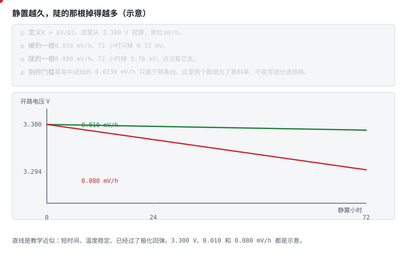

> **图说**　从 3.300 V 起算。

> **口诀**　静置越久，陡的那根掉得越多。门槛仍是那条产线的，不是这张图的。

**看动画时盯住哪里**

缓的一根示意 0.010 mV/h，72 小时只掉 0.72 mV。陡的一根 0.080 mV/h，72 小时掉 5.76 mV。两条都是直线，因为这里假设极化已经退完、温度不变。某条中试线的 0.0239 mV/h 只属于那条线，不是这两根斜线中间的红线。

- 红点和红线往下走得更快。
- 绿线几乎贴着 3.300 V。纵轴只拉开了十几毫伏，所以陡一点就很显眼。
- 不要把 0.080 或 0.010 写进分选规格。

**短自测**

1. 0.080 mV/h 静置 72 小时，电压掉多少？
2. 为什么这张图画成直线？
3. 0.0239 mV/h 能当作通用报废线吗？

<details>
<summary><b>参考答案（先自己想完再展开）</b></summary>

1. 5.76 mV。0.080×72。示意。缓的那根同样时间只掉 0.72 mV。
2. 教学近似：短时间、温度稳定、极化已经退完。刚卸流的那一截回弹不在这张图里。
3. 不能。它是张赫坤等那条中试线 Figure 4 上的传统上限，正文别处已经写明只属于那条线。

</details>

**练完你会怎样**：你看见静置电压往下掉，会先算出 K，再问这个 K 是不是这条产线自己的界，而不是随手画一条。


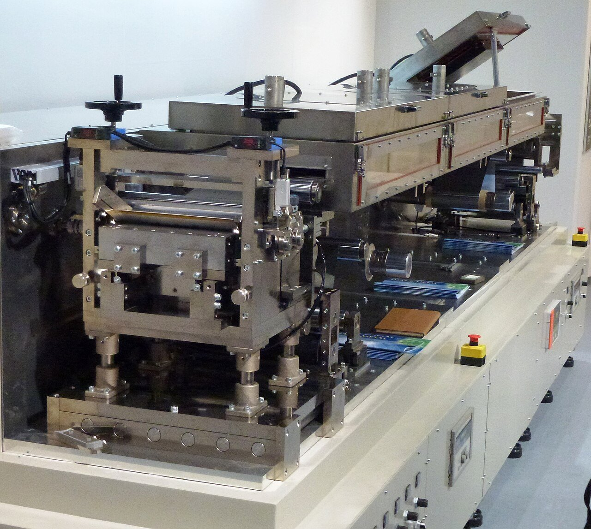

这是锂离子电极的卷对卷涂布设备。上传者说明写的是 Coating Equipment for Electrodes for Lithium-Ion Batteries。看的是涂布这一步的设备外形。它不是化成柜，不是 K 值分选工位，也不是结构电池的产线，更不是上面那条追溯链的数据库。来源见 [照片来源](../circuits/assets/photos/PHOTOS.md)。车间里工人与模组混在一起、看不清是电芯还是别的模块的照片没有收。工厂外立面也没有收。

**故障分析**

- 一节先过充、其余还低，先怪均衡电流太小。均衡搬的是已经存在的电量差，搬不来另一档的容量，也搬不齐电压窗口不同的电芯。定量上「哪条路径更省」见 [详解③ §3.1](../circuits/03-充电均衡与计量.md#31-同一模型下的拓扑对比-评价)，那仍然解决不了错芯。
- 标签重打之后只改包装，不改 BMS 里的电芯身份。售后按身份查到的是另一批的容量和 K 值。
- 出厂只看总电压和通信。错的那一节可以被邻居的电压掩盖。

**案例解析**（教学案例，不是某条产线的事故报告）

发生了什么：模组里一节的二维码属于另一容量档，或者贴标时张冠李戴。出厂看了总电压，通信也能通。

信号：充电末端这一节先碰到软件过充点，邻居仍明显更低。按二维码回查，这条身份的分容不在本包的档内，或者同一身份出现在另一台包上。压差的具体毫伏以该包的电芯曲线和均衡阈值为准，这里不写通用规格。

根因：追溯在贴标或入箱时断了，EOL 没有把逐串和电芯档对上。

BMS 上的教训：保护把这一节切断是对的，切断解释不了为什么只有它高。售后要能从包序列号读到电芯身份，再对上当时的分容和 K 值。对不上就停用这一台，不要靠加大均衡电流把档差抹平。没有电芯厂公开的分档表时，正文不写「差多少毫伏必须报废」。

> **原理**　追溯是把包序列号走回电芯的分容、内阻和 K 值。错芯或贴错标会让一节先越限。均衡和总电压 EOL 都看不出身份错了。
> **证据**　K 值定义和 0.0239 mV/h 的适用范围在 [详解④ §4.3](../circuits/04-系统安全与量产.md#43-电芯筛选与追溯-应用)，论文是 [Batteries 2023, 9, 346](https://doi.org/10.3390/batteries9070346)。EOL 项目表在同一篇的 [§4.2](../circuits/04-系统安全与量产.md#42-产线-eol-测试出厂前的最后一道筛-评价)。
> **延伸阅读**　主动均衡搬不齐容量档，见 [详解③ §3.1](../circuits/03-充电均衡与计量.md#31-同一模型下的拓扑对比-评价)。

**短自测**

1. 一节先过充、邻居仍低，加大均衡能抹平吗？
2. 0.0239 mV/h 是通用报废线吗？

<details>
<summary><b>参考答案（先自己想完再展开）</b></summary>

1. 抹不平贴错的标，也抹不平另一档的容量。保护切断是对的，解释不了为什么只有它高。
2. 不是。那是张赫坤等 Batteries 2023 一条中试线 Figure 4 上的传统上限。别的线不要抄。

</details>

**练完你会怎样**：你能从包序列号走回电芯身份。对不上就停用，不靠均衡把档差抹平。

## 6.6 毕业项目指南 [创造]

> **先读/后读**：需求、里程碑和发布是 [创造]。做完怎么打分在下一节评审量规（评价），不要把打分表当成需求本身。

**需求模板**（先写死再动手）：

```
串数/化学体系：16S LFP
持续/峰值电流：100A / 200A(10s)
保护清单：OVP/UVP/OCP×2/SCD/OTP/UTP/低温禁充/绝缘
均衡：被动 150mA，充电末端
算法：安时积分 + OCV 校准（+ EKF 加分项）
通信：UART（调试）+ CAN（系统）
结构：BMU 一体板 或 BMU + CMU×2
```

**里程碑**（每个都要可验证）：

1. 原理图评审（发 EEVblog / EEWORLD 求评）→ 2. PCB 投板焊接 → 3. 采样与驱动调通 → 4. 保护项全部实测通过 → 5. SOC 恒流误差 <5% → 6. 通信接入上位机 → 7. 完整文档（原理图说明、寄存器/协议文档、测试报告）

**发布清单**：开源仓库含 KiCad 工程、固件源码、BOM、测试报告、README（带实拍与接线图）→ 发社区接受评审。

> **原理**　毕业项目先把串数、化学体系和安全边界写成需求，再做电路和固件。做完要能按量规说明每个安全要求怎么被验证。
> **证据**　毕业作品要能指出危险是怎么被拦住的。过程对照 [《车用 BMS 功能安全设计方法论》](https://www.mdpi.com/1996-1073/14/21/6942)（英文，可选）与 [GB/T 38661 公开文本](https://openstd.samr.gov.cn/bzgk/std/newGbInfo?hcno=DB3ACC49AC4A146FAA311BB468ACA290)。
> **延伸阅读**　[foxBMS 2](https://github.com/foxBMS/foxbms-2)（英文，可选）

## 6.6b 毕业项目评审量规 [评价]

自评或请社区按此打分；「优秀」列就是产品级门槛。

> **先读/后读**：上一节是 [创造]（把项目做出来）。这张表是 [评价]：用来判断做到了哪一档，不是另一份需求。

| 维度 | 达标（能用） | 良好（可交付） | 优秀（产品级） |
|---|---|---|---|
| 安全保护 | 保护清单全部实测通过 | + 故障注入覆盖关键诊断（开线/短接/停喂狗） | + 双通道独立性验证 + 快照复盘报告 |
| 采样与算法 | SOC 恒流误差 <5% | 变流工况也 <5%，OCV 校准实测生效 | EKF 或 SOH 上线 + 全温区补偿 |
| 固件 | 状态机 + 保护去抖 | + 参数双备份、OTA 可回滚 | 诊断周期按 FTTI 推导 + 快照可读出 |
| 通信 | UART 调通 | CAN 接入上位机 + 协议文档 | 超时/CRC/重同步压力测试报告 |
| 硬件 | 功能正常 | + 开线检测、预充时序实测 | + 绝缘检测实测 + EMC 预一致性摸底 |
| 文档 | README + BOM | + 原理图说明 + 寄存器/协议文档 | + 测试报告与复盘，他人可复现 |

> **原理**　自评或请社区按此打分；「优秀」列就是产品级门槛。
> **证据**　量规问的是证据、安全论证和可复现，不是页数。过程对照 [《车用 BMS 功能安全设计方法论》](https://www.mdpi.com/1996-1073/14/21/6942)（英文，可选）。
> **延伸阅读**　[GB/T 38661 公开文本](https://openstd.samr.gov.cn/bzgk/std/newGbInfo?hcno=DB3ACC49AC4A146FAA311BB468ACA290)

**练完你会怎样**：你能把这阶段收成五句——先灌满母线再合主闸；绝缘要投切两次；快照冻的是第一现场；云端可以晚半分钟，切断不看它；读数冲高先问线。HIL 机架、认证现场和包级手册该缺的还缺，PC 上的 `hil_replay` 代替不了那张台子。

## 6.7 自测题 [评价]

1. BMU / CMU / BDU 三者各管什么？为什么板间通信必须隔离？
2. 预充电阻为什么按"脉冲额定"而不是连续功率选型？预充超时上不来电压，为什么**禁止**合主继电器？
3. 电桥法绝缘检测为什么要"交替投切"两组电阻？采样为什么必须安排在投切后的稳态窗口？
4. 故障五要素是哪五个？为什么说"快照是灵魂"？
5. 参数区为什么要双备份 + 先写备份再切换？
6. OTA 的两条铁律是什么？违反各自的后果？
7. 走一遍防过充的功能安全链：从危害识别到验证，双通道冗余体现在哪两个器件上？
8. FTTI 怎么约束 ADC 自检与开线检测的周期？
9. 故障注入测试清单里，"短相邻采样线"想验证什么？
10. 熔断器和 MOS 保护的分工是什么？为什么说熔断器是"最后手段"？
11. 两簇并联时为什么会有环流？合闸前 BMS/系统至少要检查什么？
12. BMS 与 TMS 各管什么？冬天动力受限时两者怎么配合？
13. 电桥法测绝缘的"两组方程"隐含了什么失效假设？多点绝缘同时下降时会发生什么？
14. Y 电容为什么会影响绝缘测量？采样窗口按什么量化依据确定？
15. PC 上的快照回放里，后面的短路为什么不能盖住第一次过充？0 mV 为什么不能当成开线已经测过？
16. 平台上几十秒没有报警，为什么不能说明包没有过充？
17. 一节先过充、邻居仍低，为什么不能先加大均衡电流？

<details>
<summary><b>参考答案（先自己想完再展开）</b></summary>

1. **BMU**（主控）：对外 CAN、绝缘检测、继电器驱动、整包 SOC/SOP 汇总、故障决策。**CMU**（从板）：每块管 12–18 串的电压与温度采样、执行被动均衡，把数据上报 BMU。**BDU**（配电盒）：主正/主负继电器、预充回路、熔断器、电流传感器——功率通断的执行机构。必须隔离的原因：相邻 CMU 的"地"参考在电池串的不同高度，隔着十几节电池、相差几十到几百伏；BMU 侧又常与整车低压地关联。不隔离就等于把这些电位差直接加到通信芯片的 I/O 上。
2. 因为母线电容储能 $E = \frac{1}{2}CU^2$ 这一份能量几乎全部在几百毫秒内变成预充电阻上的热。按连续功率选型会得出一个又大又贵的电阻，而实际需要的是**单次短时冲击耐受**能力——所以选线绕/水泥电阻，查它的单次脉冲能量额定（焦耳数）与重复动作间隔。禁止合 K1 的原因：电压上不来说明电流没在给电容充电，而是流去了别处——后端短路、绝缘失效、接触器粘连或母线故障。此时合主继电器 = 把电池直接接到一个故障回路上，数千安电流烧蚀触点甚至引发火灾。预充失败必须报故障并保持断开。
3. 因为要解的是**两个**未知量 $R_{iso+}$ 和 $R_{iso-}$（正母线对壳、负母线对壳的绝缘电阻），而一次测量只给一个方程。交替在 B+ 对壳、B− 对壳投入已知电阻，得到两组不同的电压测量值，联立两个方程才能把两个未知量分别解出来——只测一组无法区分到底是正侧还是负侧绝缘下降。必须等稳态是因为回路里有 **Y 电容**（母线对壳的滤波电容）：投切瞬间电容在充放电，电压处于指数过渡过程，此时采样得到的是暂态值，解出的绝缘电阻会严重偏离真值。必须等若干个时间常数后在稳态窗口采样。
4. 五要素：**触发条件、去抖、等级（提示/限功率/断开）、恢复条件、是否锁存**。快照是灵魂的原因：故障是**瞬时事件**，等用户反馈到你这里已经过了几小时甚至几天，现场工况早已消失。没有快照，"昨天充不进电了"这句话你无法复现、无法归因，只能摊手。有了触发瞬间冻结的电压/电流/温度/SOC/时间戳，你能在办公室看见事故现场那一帧——是某串过压、还是温度越线、还是电流尖峰，一目了然。量产 BMS 的售后能力基本等于它的快照质量。
5. 因为 Flash 写入是"擦除整扇区 → 重新写入"的**非原子**过程，中途掉电会留下一个既不是旧参数也不是新参数的半成品。若参数区只有一份，这块板子下次上电就读不出有效参数（阈值、标定系数全丢）——轻则不工作，重则按垃圾参数运行。双备份 + 先写备份区再切换有效标记，保证任何时刻**至少有一份完整且 CRC 正确的参数**：掉电发生在写备份区时主区完好，发生在切换标记时靠版本号/CRC 判定采信哪一份。配套还要写次数计数与磨损均衡，防止参数区被写穿。
6. ①**bootloader 自身永不被 OTA 覆盖**——违反的后果是升级包一旦出问题（或传输中断落在 bootloader 区），板子失去唯一的恢复入口，彻底变砖，只能拆机用调试器重烧；已发货的产品等于全部召回。②**升级中断电必须能恢复原固件**——违反的后果是用户升级途中拔电或电池耗尽，应用区留下半截固件又没有回滚机制，同样变砖。双区（A/B）方案同时满足两条：新固件写备用区 → 校验 → 标记切换 → 重启后验证通过才确认，失败自动回滚。
7. 链条：**危害识别**（单体过充 → 热失控起火）→ **场景分析**（充电中电压采样失效 / MOS 粘连 / 充电机失控）→ **ASIL 定级**（由 HARA 决定，很多车用项目取 ASIL C/D）→ **安全目标**（任何单点失效不得导致单体电压超过安全限值）→ **功能安全要求**（双通道独立保护）→ **技术安全要求**（ADC 自检与开线检测周期按 FTTI 推导、MOS 驱动回路诊断、通信 CRC + 超时、独立看门狗）→ **验证**（失效注入：拔采样线、短 MOS、停喂狗，逐项确认硬件通道独立生效）。

双通道落在两个器件上：**MCU**（软件保护，第一级，快速可配置）+ **AFE 或独立的二级保护 IC**（硬件保护，第二级，不依赖 MCU 存活）。关键是两者的失效必须**不相关**——不共用采样链、不共用电源、不共用时钟，否则"冗余"是假的。
8. FTTI（故障容忍时间间隔）是"从故障发生到必须完成安全动作"的总预算。约束关系是：**故障检测时间 + 故障反应时间 ≤ FTTI**。而检测时间的最坏情况约等于"诊断周期 + 去抖确认时间"（故障刚好发生在一次诊断刚结束之后）。所以诊断周期要用 FTTI 减去反应时间与去抖时间后再留余量——文中示例取 <100ms。反过来说，如果诊断周期大于 FTTI，这项诊断在安全论证上等于**不存在**。
9. 验证两件事。①**读数合理性检查**：两根相邻采样线短接后，被短路的那节读数会掉到 0V 左右，而它的邻居变成两节之和（约 7–8V）。BMS 必须识别出"某串 0V"和"某串明显高于单体上限"这类**物理上不可能**的组合，而不是把 0V 当成严重过放、把 8V 当成真实值去执行错误动作。②**诊断的覆盖面**：开线检测能查断线，但查不出短接——需要独立的范围校验与一致性校验（单串上下限、各串之和与总压比对）。这项注入专门检验那条校验是否真的实现了。
10. **MOS/继电器**是**可复位**的主动保护：由 BMS 判断后断开、能恢复，承担日常的过流/短路/过充过放保护，阈值与延时可配置。**熔断器**是**不可复位**的被动保护：靠自身 $I^2t$ 特性在极端电流下熔断，不需要任何电子电路参与。它是最后手段的原因：①一旦熔断必须更换硬件，对产品是一次维修事件，所以额定值必须选在"MOS 保护和继电器都已失效（粘连/击穿）"的工况才动作；②选型必须与 MOS、线束的 $I^2t$ 耐受曲线**配合**——熔断特性要快于线束着火、慢于 MOS 的正常保护动作，否则要么烧线束，要么日常工况就误熔。
11. 两簇开路电压不完全相等时，合闸等于把两个电压源经很小的回路电阻并联，压差 ÷ 回路电阻 = **环流**（不经负载）。合闸前至少检查：簇间压差低于阈值、各簇无严重故障、必要时经限流/预充支路均压；并保证每簇可独立断开、有协调层汇总 SOP，且能监测"各簇电流之和与母线电流不一致"这类环流迹象。
12. **BMS** 负责测温、按温度降额 SOP、低温禁充/高温禁充放、热失控预警，并向 TMS **请求**加热或制冷；**TMS** 负责加热/液冷/风道等执行与控温，但不得擅自突破 BMS 的允许功率。冬天配合：BMS 收紧 SOP 并请求加热 → TMS 把电芯温度打进窗口 → BMS 再放开充电/放电功率。
13. 联立求解把被测系统建模成"正母线对壳一个电阻、负母线对壳一个电阻"——即假设绝缘失效可以用这两个集中参数描述（单点失效假设）。多点同时下降（多串采样口进液、线束多处磨损）时，真实网络不再是这个结构，两个方程解出的 R_iso± 只是失真的等效值——可能两侧读数都还在限值边缘、实际绝缘已经越限。所以量产不只看单次数值：多帧滤波、阻值变化率监视、结合温湿度与历史记录综合判断（§6.1.3）。
14. Y 电容（母线对壳滤波电容，nF–µF 级）与 MΩ 级桥臂电阻构成 RC 回路：投切瞬间电容充放电，母线对壳电压处于指数过渡过程，此时采样等于把暂态当稳态，解出的绝缘电阻严重偏离真值。时间常数 τ = R_桥 × C_Y 落在毫秒–秒级，故采样窗口定在投切后 3–5 个 τ——过渡过程衰减到 <1–5% 再读数；这就是一次绝缘测量需要几十毫秒到秒级"等得起"的时间的原因（§6.1.3）。
15. 显示用的主故障可以升级成短路，冻结帧仍是过充那一拍的电压和电流。命令是 `cd code/firmware && gcc -std=c99 -Wall -Wextra -Werror -o hil_replay bms.c hil_replay.c && ./hil_replay`。0 mV 在这个骨架里会记成欠压，因为没有开线标志；开线要在带检测电流的台子上另测（§6.2.5、§6.4.1）。
16. GB/T 32960.2—2016 允许正常存储间隔最大到 30 s，断网时先存本地再补发。这是监控记录。过充切断在包上的比较器和 MOS，不等平台（§6.2.6）。
17. 均衡只能搬已经存在的电量差。身份属于另一容量档，或标签贴错时，加大电流抹不平。要按包序列号走回电芯的分容和 K 值；对不上就停用，不靠均衡收场（§6.5.1）。

</details>

> **原理**　这些题考的是上面几节的机制。先盖住折叠答案，用自己的话讲完再展开。
> **证据**　这些题考高压、故障记录和功能安全的过程。对照 [《车用 BMS 功能安全设计方法论》](https://www.mdpi.com/1996-1073/14/21/6942)（英文，可选）与 [ENNOID-BMS](https://github.com/EnnoidMe/ENNOID-BMS)（英文，可选）。
> **延伸阅读**　[GB/T 38661 公开文本](https://openstd.samr.gov.cn/bzgk/std/newGbInfo?hcno=DB3ACC49AC4A146FAA311BB468ACA290)

## 6.8 毕业验收 [评价]

回到 [主文档的精通自检清单](../bms-resources.md#精通自检清单)：硬件 9 项、固件 4 项、算法 5 项、系统与安全 6 项——**全部打勾 + 毕业项目发布** = 路线终点：你已具备独立完成产品级 BMS 的能力。

往后没有"阶段 7"。深耕方向任选：车规（功能安全/AUTOSAR）、储能（系统架构/电网交互）、算法（电化学模型 PyBaMM/AI）、芯片（AFE 原厂 FAE）。前沿资料在 [主文档 6.5](../bms-resources.md#65-前沿方向) 持续更新。

> **本阶段一句话**：产品级 = 双通道保护 + 故障快照 + 可回滚的升级 + 一套故障注入测试——全部做到，才算毕业。

---

**上一篇**　[阶段 5 通信与集成](stage-5-通信与集成.md) ｜ **目录**　[阶段教程](../../README.md#阶段教程) ｜ **下一篇**　无（这里是终点） ｜ [学习路线总纲](../bms-resources.md) ｜ [术语表](../glossary.md)

> **原理**　验收问的是能不能用机制做判断。勾得上才进入下一阶段，勾不上就回到对应小节，而不是把目录再看一遍。
> **证据**　验收看安全论证和可复现实验，不看篇幅。对照 [《车用 BMS 功能安全设计方法论》](https://www.mdpi.com/1996-1073/14/21/6942)（英文，可选）。
> **延伸阅读**　[《车用 BMS 功能安全设计方法论》](https://www.mdpi.com/1996-1073/14/21/6942)（英文，可选）
