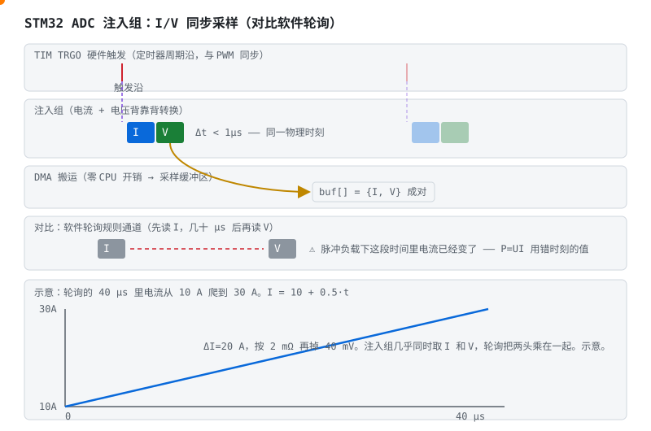

# STM32 实战专题：BMS 主控的选型、外设与坑

> 配套教程：[阶段 3（AFE + MCU 智能 BMS）](stages/stage-3-AFE-MCU智能BMS.md)。
> 打开十块商用智能 BMS，主控里八九颗是 STM32（入门精读工程 [vamoirid/LTC6811+STM32](https://github.com/vamoirid/Battery-Management-System-LTC6811-STM32) 就是 F4）。这颗芯片不贵，却能让你把"为什么这样选、这样配"讲上三天——本文把三天压缩成四件事：**选型、外设映射、HAL/LL/寄存器取舍、咬过人的坑**。

## 1. 角色定位：MCU 干什么、不干什么

先把阶段 3 的纪律钉在墙上：**安全兜底在硬件**——保护 IC 和 AFE 的硬件比较器从不睡觉。MCU 是乐团的指挥，不是保险丝：状态机、SOC/SOH 算法、均衡调度、通信与记录，这四件事是它的全部曲目。想通这一点，选型就不会掉进"越强越好"的坑——你要的是趁手，不是跑分。

## 2. 选型地图（2026 视角）

| 系列 | 内核/主频 | BMS 适配度 | 一句话 |
|---|---|---|---|
| F1（C8T6 蓝 pill） | M3 / 72MHz | ⚠️ 存量大、新项目别选 | ADC 慢（1Msps）、无 FDCAN、生态老；读老代码可以，新产品是开局就背技术债 |
| G0 | M0+ / 64MHz | ✅ 保护板级够用 | 成本优先；外设精简但 SPI/I2C/ADC 一样不缺 |
| **F3 / G4** | M4 / 72–170MHz | ✅✅ **BMS 甜点区** | 模拟外设全家最强（运放/PGA/比较器/高分辨率定时器）；G4 带 FDCAN、5Msps ADC |
| L4 / L4+ | M4 / 80–120MHz | ✅ 低功耗场景 | STOP2 ~1µA 级，储能/车队"睡几个月还能醒"的那种 |
| H7 | M7 / 480MHz | ⏹ 过量 | 除非边端跑重 SOH 算法，否则是烧钱买功耗 |

**选型口诀**：保护板/小储能看 G0/F3；要 CAN 整车通信或更强模拟上 G4；电池供电的远程节点看 L4；F1 只用来考古。

## 3. 外设 → BMS 任务映射

同一个 STM32，在 BMS 工程师眼里是这样的分工表：

| 外设 | BMS 任务 | 配置要点（与坑） |
|---|---|---|
| **ADC 注入组 + 定时器触发 + DMA** | 电流/电压**同步**采样（功率、阻抗、SOC 的输入） | 见 §4 与动画；硬件沿触发，软件抖动归零 |
| SPI1/2 | 接 AFE（LTC6811/BQ76940） | 模式（CPOL/CPHA）照抄 AFE datasheet；CS 的建立/保持时间别省 |
| **bxCAN / FDCAN** | 整车 CAN（阶段 5 §5.4） | G4/FDCAN 支持 CAN FD；过滤器别开全收——总线风暴时 CPU 会被中断淹死 |
| TIM PWM | 主动均衡驱动、风扇、蜂鸣器 | G4 的 HRTIM 是给主动均衡拓扑准备的礼物 |
| **IWDG 独立看门狗** | 固件跑飞后的最后保险（阶段 6 功能安全） | 自带 LSI 时钟，主时钟死了它还在数；调试时记得 DBGMCU 冻结位 |
| FLASH 自编程 | 参数页、DTC 快照（阶段 6 §6.2.2） | 擦写寿命 ~10k 次——参数页轮换是必修课，不是优化项 |
| RTC + 备份域 | 休眠计时、故障时间戳 | 掉电靠 VBAT 续命 |

## 4. 为什么 I/V 必须"同一时刻"采

**不看动画版**：软件轮询先读电流、几十微秒后再读电压——听着很快，但脉冲负载下电流早就变了。你算出的 P=UI，是"此刻的 U"乘以"刚才的 I"：照片里两个人没站在同一帧里。注入组的解法漂亮在**不动用软件**：定时器 TRGO 打出一个硬件沿，电流、电压两个注入通道背靠背转换、DMA 直接搬走，时间差压到亚微秒级——双人跳伞，同一声铃开伞。

> **口诀**　电流和电压要同一时刻采。错开几十微秒，功率就乘错了。

这件事还是阶段 4 的隐含地基：§4.4 参数辨识、§4.5 EKF，全都假设电压电流时间戳对齐。对不齐，模型再漂亮也是在拟合噪声。

## 5. HAL vs LL vs 寄存器

| 层 | 长相 | 适合 | 代价 |
|---|---|---|---|
| HAL | `HAL_ADC_Start_DMA(&hadc, …)` | 快速搭起来、建立外设概念 | 抽象厚、时序不透明、中断链路像迷宫 |
| LL | `LL_ADC_REG_StartConversion(ADC1)` | 掌控时序的工程主力 | 要啃参考手册，但每个调用 ≈ 一行寄存器操作 |
| 寄存器 | `ADC1->CR2 \|= ADC_CR2_ADON` | 调试疑难、抠极限 | 写得最慢，懂得最快 |

**建议路径**：HAL 起步画外设地图 → 量产和时序敏感的驱动落到 LL → 卡壳时直接读寄存器。本仓库 [firmware/bms.c](../code/firmware/bms.c) 的纯 C 风格就是 LL 思维——状态机只认 `BmsInputs`，移植到 STM32 时这些输入由 ADC+DMA 填充，算法代码一行不动。

## 6. 咬过人的坑清单

每一条都见过血：

1. **ADC 上电先跑校准**（F3/G4/L4 有 `CAL` 位）：不校准，零偏差几十 LSB——在 BMS 的 mV 世界里，这叫事故，不叫误差。
2. **VDDA 去耦与走线**：ADC 的参考就是 VDDA，数字电源的噪声会原封不动搬进采样值。LC/RC 滤波 + 模拟地单点，省掉它们的工程师后来都把示波器焊在了板子上。
3. **SPI 模式抄错**：LTC6811 要 Mode 3 一类、BQ 系各异——读回全 0xFF 时，先查模式，再查 CS 保持时间，最后才轮到怀疑芯片。
4. **CAN 采样点**：整车常见 87.5%；位时序（BS1/BS2/SJW）按波特率算，用默认值蒙的人会在路试时被 500kbps 和 250kbps 混合总线教育。
5. **IWDG 调试坑**：断点一停，看门狗照跑，复位来得莫名其妙——`DBGMCU->APB1FZ` 冻结位，调试期的保命符。
6. **FLASH 参数页**：单页反复擦写，一两年就到寿命——参数/DTC 用双页轮换 + 序号戳。
7. **BOOT0 跳线**：板子不跑程序先量 BOOT0——它被上拉的那一刻，你的固件就永远缺席，bootloader 替你开会。

## 7. 与阶段 3 的衔接

- 精读工程 [vamoirid/LTC6811+STM32](https://github.com/vamoirid/Battery-Management-System-LTC6811-STM32)：看它的 LTC6811 驱动分层（HAL SPI → 芯片命令 → 寄存器页）与断线检测实现，对照本文 §3/§6。
- 本仓库固件骨架（[code/firmware/](../code/firmware/)）的状态机与保护逻辑平台无关；把它落到 STM32 的工作 = 写 `BmsInputs` 的采样填充（AFE SPI + ADC 注入组）+ 消费 MOS/均衡输出——正是阶段 3 任务的主干。

## 8. 参考工程（GitHub，按学习价值排序）

1. [EnnoidMe/ENNOID-BMS](https://github.com/EnnoidMe/ENNOID-BMS)（330★，最后更新 2021-07）— LTC68xx + STM32 的模块化高压 BMS（可到 400V 级电动车）。代码年代较早、库版本旧，但高压系统的从板/主板架构、预充与绝缘监测的落法仍是好读物——看架构，别抄依赖。
2. [Secret-G/STM32-BMS-48Pro](https://github.com/Secret-G/STM32-BMS-48Pro)（15★）— STM32F103 + BQ76940 + FreeRTOS + CAN，与本仓库任务划分几乎同构：看它怎么把保护、均衡、通信切成 FreeRTOS 任务。
3. [spmp/Low-Cost-BMS-STM32](https://github.com/spmp/Low-Cost-BMS-STM32)（69★，最后更新 2015-09）— 低成本方案重写版。年代久远（HAL 已多代更迭），看的是成本约束下的取舍思路：哪些功能用软件补、哪些干脆砍掉——这个判断不过时。
4. [vamoirid/LTC6811+STM32](https://github.com/vamoirid/Battery-Management-System-LTC6811-STM32)（55★）— 阶段 3 指定的入门精读，驱动分层最清晰。

---

返回 [学习路线总纲](bms-resources.md) ｜ [阶段 3](stages/stage-3-AFE-MCU智能BMS.md) ｜ [ESP32 专题](esp32-bms专题.md)
