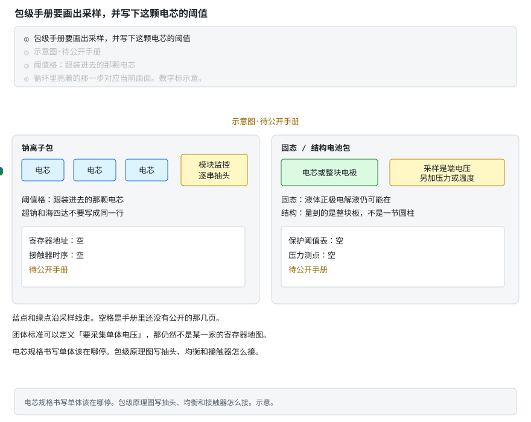

# 包级 BMS 手册还缺哪几页

> 电芯规格已经写在 [阶段 0 §0.1.11](stages/stage-0-前置知识.md#0111-公开规格书里的钠离子保护要求-理解)。这一页写一份**包级**手册必须交出的栏目，以及 2026-10-05 还能公开点开的最近文件。示意图标「待公开手册」。标准全文和厂商 PDF 不放进仓库。

包级手册和电芯规格书分工不同。电芯规格书回答「这一颗该在哪停」。包级手册回答「抽头接到哪、寄存器在哪、接触器按什么顺序动、温度和压力测在哪」。

## 手册里必须有的三页 [理解]

1. **采样接口。** 每一串的抽头进模块监控的哪一只脚；电流采样是检流电阻还是霍尔；温度探头贴在电芯上还是贴在母排上；开线时这一脚报什么。结构电池若没有一节一节的圆柱，要写明量到的是整块板的端电压。
2. **寄存器地图。** 单体电压、包电压、电流、温度、均衡使能、故障标志各在哪个地址。状态类只读，配置类可写。没有地址，就无法把电芯规格书里的电压写进比较器。
3. **保护阈值和执行器。** 过充、过放、过流、温度的申请停止和强制停止，跟**装进去的那颗电芯**走。接触器（或 MOS）的时序：先确认哪一只断开，再合主动放电。固态电芯若手册给出操作压力，包上要有对应的压力测点。这些格子空着，这一页就不算手册。

**不看动画版**：左边是钠离子包，电芯抽头进模块监控；阈值格要跟装进去的那颗电芯，寄存器地址和接触器时序画成空。右边是固态或结构电池包，采样是端电压，另加压力或温度；保护阈值表和压力测点也是空。蓝点和绿点沿采样线走。示意图·待公开手册。

> **口诀**　电芯规格回答停在哪一伏。寄存器地址要另有一页。

## 钠离子：公开能点开的 [分析]

两份电芯规格仍是 [§0.1.11](stages/stage-0-前置知识.md#0111-公开规格书里的钠离子保护要求-理解)：超钠 50 Ah 的 §4.5（3.9 V 申请停充、3.95 V 强制停充、4.0 V 锁定；1.5 V 申请停放、1.4 V 强制停放），海四达 NaCP50160118-70H3 的规格表（充电 3.95 V、放电截止 1.8 V）和循环程序（3.9 V / 2.0 V）。两份都没有采样芯片地址，也没有接触器时序。

再往包上看，公开检索到的最近一份是团体标准 T/QGCML 305—2022《有机系钠离子电池》（全国城市工业品贸易中心联合会，2022-07-27 发布，2022-08-10 实施）。国家标准馆目录记其废止日期为 2024-08-19：[目录页](https://ndls.cnis.ac.cn/standard/detail/7101be92c62c98462007f97c8254ff37)。起草单位里有溧阳中科海钠。它定义了包，也定义了 BMS，但不是超钠或海四达的寄存器手册。

§3.5 把电池管理系统写成：采集电池系统总电压、单体电压、电量、充放电电流、温度；对充放电做监控，并具有保护和告警；由采集和监控、保护、均衡电路、电气和通信接口组成。同一条要求 BMS 分三级：电池模块监控单元、电池柜管理系统、多台电池柜的并机管理系统。

表 1 把方形单体、圆柱单体、储能电池包、二轮车电池包的标准充电都写成 0.2C 充到 3.95 V，再恒压到 0.05C。单体标称电压 ≥2.95 V；储能包 12–48 V；二轮车包 24–72 V。工作温度大约 −20–55°C（二轮车包那一行是 −22–50°C）。持续最大充电 ≥1C，持续最大放电 ≥2C。标准使用了「放电终止电压」这个术语，表 1 没有给出放电截止的数字。3.95 V 是这份已废止团体标准里的充电终点，不是超钠 §4.5 的 4.0 V 锁定，也不是海四达规格表的 3.95 V 最高极限。

[Faradion 应用页](https://faradion.co.uk/applications/) 能打开，页面上没有包级 BMS 手册。博物馆里的 Faradion 展品只看外形，见 [§0.1.10](stages/stage-0-前置知识.md#0110-钠离子硬碳和另一套电压窗口-理解)。

文件名写钠离子、封面写 LTO 的 ENJIE EMU1102，默认电压不收进钠离子，理由仍在 §0.1.11。

## 固态与结构电池 [分析]

[QuantumScape 技术问答](https://www.quantumscape.com/battery-technology/)（英文）写明：陶瓷隔膜和有机液体正极电解液一起用；电芯按无负极制成，金属锂在第一次充电时形成。同一页写明多层商用电芯还没开发完，所以还没有对商用目标电芯和电池包做过安全测试。

2024-10-23 的股东信给出 QSE-5 B 样、有限数量样品上的电芯测量：标称电压 3.8 V，操作压力 < 3.4 atm（[股东信 PDF](https://www.quantumscape.com/wp-content/uploads/2024/10/QS-Shareholder-Letter-Q3-2024.pdf)，英文）。同一封信写明，测量做在有限数量的样品上，最终产品特性取决于电池包的最终设计，很可能和低产量样品不同。[第一眼看 B 样](https://www.quantumscape.com/a-first-look-at-the-qse-5-b-sample/)（英文）把操作压力写成这颗电芯按低于 3.4 atm 的外加压力来设计。这两条说明：包级手册要单列电压窗口，并且要有压力测点。3.8 V 是标称电压，不是过充阈值。体积能量密度和快充口号不写进正文当规格。

Solid Power 的量产包 BMS 手册（单体电压窗口、保护阈值、均衡方式、温度测点）在本轮公开检索里没有找到。招聘启事里的包电压不是电芯阈值，不引用。

结构电池仍停在 [§0.1.9](stages/stage-0-前置知识.md#019-碳纤维结构电池电极在承力外壳是另一件事-理解) 的试样。采样若是整块板的端电压，现成多串 AFE 的引脚图对不上。Xu 等 EcoMat 2022 给出三串试样的 TL431 被动均衡（R1 = 20 kΩ、R2 = 47 kΩ，单节上限 3.55 V），电路图已嵌进 §0.1.9。那是实验室电路，不是「结构电池包的采样接口与保护阈值手册」。没有这份手册，就不写过充点和采样脚位。

公开检索里，超钠、海四达、QuantumScape、Solid Power 的包级寄存器地图仍然没有。Heltec 的两份协议能点开，它们是商用锂电 BMS 的通信说明，不是上面任何一家的包级手册，PDF 不放进仓库：[RS485 Modbus](https://www.heltec-energy.com/uploads/BMS-RS485modbus-Protocol.pdf)、[3431 Protocol v4](https://heltec-bms.com/wp-content/uploads/2022/02/3431-Protocol-v4-.pdf)。

2026-10-05 又点开过一轮，三份手册仍然没有。下面这些对不上文件名，数字不写进钠离子或固态的阈值：

- [World Electr. Veh. J. 2026, 17(1), 5](https://doi.org/10.3390/wevj17010005) 用的是 HiNa 32140 圆柱，写的是 12 V / 48 V 样车。有电池系统，没有超钠或海四达的寄存器地图。
- QuantumScape 的 [资源页](https://www.quantumscape.com/resources/) 仍是技术问答和视频，没有量产包的电压窗口、保护阈值、均衡方式和温度测点。
- 检索 Solid Power 的量产包 BMS 手册，这一轮没有公开文本。招聘启事里的包电压继续不引用。
- 极空 [BMS-CAN 协议 V2.1](http://www.jk-bms.com/Upload/2023-11-28/1721585163.pdf) 是商用锂电通信。ENJIE EMU1103D 正文写的是锂离子包。两份都不是超钠或海四达。
- 结构电池包的采样接口与保护阈值手册仍没有。EcoMat 2022 的 TL431 试样电路还在 §0.1.9，身份不变。

**故障分析**

- 把超钠的 4.0 V 锁定和 1.4 V 过放，写进海四达那颗电芯的比较器。规格表是 3.95 V / 1.8 V，循环程序是 3.9 V / 2.0 V。
- 把已废止的 T/QGCML 305—2022 表 1 里的 3.95 V，当成超钠和海四达共用的寄存器默认值。那是团体标准里的充电终点，而且表 1 没有放电截止数字。
- 把 QSE-5 B 样的标称 3.8 V 设成过充点，或把它写成已经量产的包级阈值。信里写的是有限样品上的标称电压，最终规格跟电池包设计走。
- 按 PDF 文件名收化学体系。EMU1102 文件名写钠离子，正文写 LTO。

**案例解析**（教学案例，对照的是上面这些公开文本，不是某台包的测试）

发生了什么：一块「钠离子兼容」的包，比较器按超钠 §4.5 设成 4.0 V 锁定，去充海四达 NaCP50160118-70H3。另一块板把 QSE-5 的 3.8 V 标称电压抄成固态包的过充点，压力测点空着。

信号：海四达规格表把 3.95 V/电芯写成充电电压最高极限，循环程序收到 3.9 V。板子要到 4.0 V 才锁定时，这颗电芯已经越过它自己的规格表。固态那块板没有压力读数，B 样信里的 < 3.4 atm 无法核对。

根因：电芯规格、已废止的团体标准参数表、以及有限样品上的标称电压，被收成同一张寄存器表。

BMS 上的教训：先写明装进去的是哪一颗、哪一版。采样脚位、寄存器地址、接触器时序和压力测点都还空着的时候，阈值表不能从另一颗电芯或一份废止标准里借。

> **原理**　包级手册要同时交出采样接口、寄存器地图和保护阈值。电芯规格书只回答单体该在哪停。团体标准可以定义「要采集单体电压」，那仍然不是某一家的地址表。
> **证据**　钠离子电芯动作见 [§0.1.11](stages/stage-0-前置知识.md#0111-公开规格书里的钠离子保护要求-理解)。包级定义见 T/QGCML 305—2022《有机系钠离子电池》，目录 [ndls.cnis.ac.cn](https://ndls.cnis.ac.cn/standard/detail/7101be92c62c98462007f97c8254ff37)：§3.5 的采集量和三级 BMS，表 1 的 0.2C 至 3.95 V；废止日期 2024-08-19。固态电芯测量见 QuantumScape [2024-10-23 股东信](https://www.quantumscape.com/wp-content/uploads/2024/10/QS-Shareholder-Letter-Q3-2024.pdf)（标称 3.8 V，操作压力 < 3.4 atm，有限样品；最终规格取决于电池包设计）和 [技术问答](https://www.quantumscape.com/battery-technology/)（液体正极电解液仍在，商用目标电池包的安全测试尚未做）。
> **延伸阅读**　固态入门在 [§0.1.8](stages/stage-0-前置知识.md#018-固态电池固体电解质换掉了什么-理解)，结构电池在 [§0.1.9](stages/stage-0-前置知识.md#019-碳纤维结构电池电极在承力外壳是另一件事-理解)。认领仍见 [共建任务板 T13](共建任务板.md)。

## 还缺的文件

名字就这三份，交到任意一份再改对应小节：

- 超钠或海四达的包级 BMS 原理图或寄存器手册
- QuantumScape 或 Solid Power 的量产包 BMS 手册（单体电压窗口、保护阈值、均衡方式、温度测点）
- 结构电池包的采样接口与保护阈值手册

返回 [阶段 0 §0.1.11](stages/stage-0-前置知识.md#0111-公开规格书里的钠离子保护要求-理解) ｜ [共建任务板](共建任务板.md) ｜ [学习路线总纲](bms-resources.md)
